# 浪胃仙遭前老板控诉：一直当作亲弟弟，挖走员工，带走摄影器材，硬盘格式化

> 原文：[`mp.weixin.qq.com/s?__biz=MzIyMDYwMTk0Mw==&mid=2247531201&idx=1&sn=5c32602116a87622ef35d723621b1088&chksm=97cbb1f9a0bc38ef683bd43034162fa097b13f84f46a3cea5a0e2f4c5f34f775201be63208a5&scene=27#wechat_redirect`](http://mp.weixin.qq.com/s?__biz=MzIyMDYwMTk0Mw==&mid=2247531201&idx=1&sn=5c32602116a87622ef35d723621b1088&chksm=97cbb1f9a0bc38ef683bd43034162fa097b13f84f46a3cea5a0e2f4c5f34f775201be63208a5&scene=27#wechat_redirect)

作为吃播界的顶流网红，浪胃仙曾在几个月前突然放弃 3000 万粉丝的大号，引发外界的一阵猜疑。

当时就有不少人认为浪胃仙与原团队闹掰了，现在这种猜测得到了验证。 

今日，在停更近两个月后，那个 3500 万粉丝的账号“浪胃仙”突然连发 3 条视频。

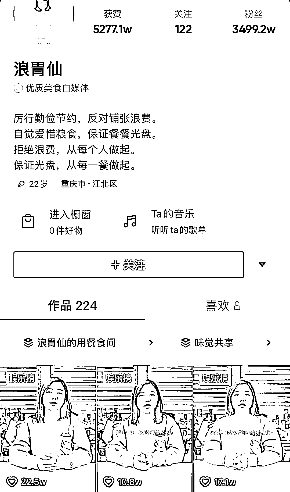

浪胃仙前公司创始人游絮曝出惊天猛料，**称浪胃仙带着团队内的员工自立门户了，走之前还把公司拍摄器材带走，甚至把所有的视频素材都删除了。**

**据了解，游絮 2013 年进入传媒领域工作，曾担任多年的****艺人经纪。****后来看到了短视频浪潮，曾担任重庆天权星传媒 CEO，****并孵化了**浪胃仙 IP**。**

在三个视频中，游絮讲述了如何发掘浪胃仙，又是如何把公司做大，浪胃仙又是怎样自立门户的。

**值得注意的一个点，那就是浪胃仙真的就是男人。** 

而在视频发布后，浪胃仙也迅速登上了微博文娱热搜榜第一。 

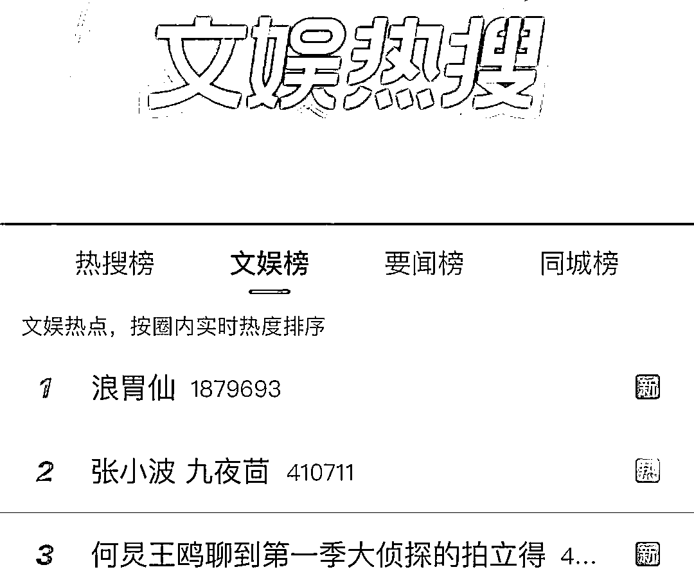

截至目前，浪胃仙本人没有回应，不过在他新账号的视频下，已经被负面评论占据。

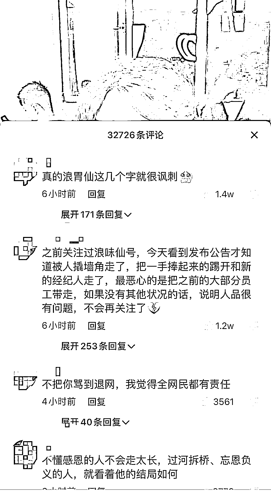

这件事，也让我们再次关注到网红与机构的微妙关系，自以为傲的相互扶持、成全为何终到分道扬镳？ 

****游絮**2018 年发现浪胃仙**

**将其视为亲弟弟，利润分成 70%**

在第一个视频中，游絮首先回应了外界的质疑。她表示并没有卖号，之所以一直没发声，是因为在处理一些善后的工作。

但是话锋一转，游絮并没有直接解答外界的种种质疑，而是讲述了其与浪胃仙相识、创业的过程。 

游絮称 2018 年 7 月她在重庆发现了浪胃仙，并很快签约成了公司的艺人。

那时的团队一共只有四个人，游絮透露虽然团队很小，但相处却十分融洽。

由于刚刚进入短视频行业，游絮并不知道浪胃仙这个 IP 是否能做起来。但他却对浪胃仙非常有信心。 

没有经验、资源、渠道怎么办？游絮说为了捧浪胃仙，自己四处奔走找人帮忙，只求他们能带一下浪胃仙。

**游絮还说，自己比他浪胃仙大几岁，一直把他当作自己的亲弟弟。**

她知道吃播很辛苦，为了不让浪胃仙辛苦操心，游絮一度承担了整个公司的商务，运营，日常管理。

目的就是能让浪胃仙把所有经历投入到创作中。加上浪胃仙本身确实也在吃播上有自己的特点，所以 IP 很快做了起来。

游絮称在利益分配上也尽可能照顾这个“弟弟”，**她并没有按照按照行业标准分配利益，浪胃仙本人（原名李杭泽）利润分红比例为 70%。**

在网红市场，70%的利润分红确实十分惊人。 

游絮接着讲到，后来在打击吃播浪费之时，整个团队陷入困境，浪胃仙情绪低落。

游絮表示当时努力安慰浪胃仙，还将整个团队带到新的城市，开启了直播事业。

**而自己也与浪胃仙从老板员工关系变为合作经营关系。**

一段时间后，公司挺过了难关，并再次登上新的台阶。

不过在一切都在变好、员工越来越多，游絮称自己当时坚信这将会是其一辈子为之奋斗的事业。

**但是，看似美好的背后危机却悄然降临，一个人的出现彻底结束了这一切。这个人被称为“兰女士”。**

**兰女士带走团队、摄影器材，还将视频资料格式化** 

**在职期间就已成立新公司** 

游絮也算是讲故事的高手，一段创业史已经足够吊起了大众的好奇心。 

比如，浪胃仙真是男的，浪胃仙真的很赚钱等等。 

在第一个视频中，游絮抛下了一个引子，那就是一个被称为“兰女士”的人。 

第二个视频的故事便围绕“兰女士”展开。 

游絮称 2021 年 7 月公司步入正轨，但是当时直播负责人因故离去，所以急需找人顶上。

**这时候兰女士正式登场，她是由浪胃仙推荐的，而且游絮也认识兰女士。** 

虽然彼此都认识，但游絮称自己一开始是有顾虑的，但想到浪胃仙很喜欢她，所以一切都没有太在意。

后来，游絮将直播业务、直播团队的管理都交给兰女士负责。

**此外，游絮给兰女士的待遇也十分优渥，有远高于行业标准的底线和提成。**

视频中披露的一张工资表显示**，兰女士 8 个月的收入为 59.5 万，平均每个月收入 7 万多。**

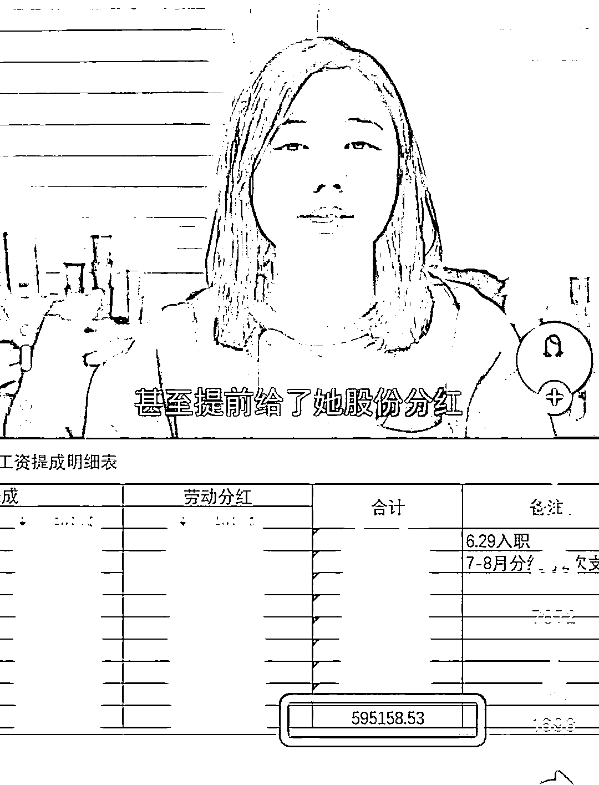

不仅如此，公司甚至提前给了兰女士股份分红。

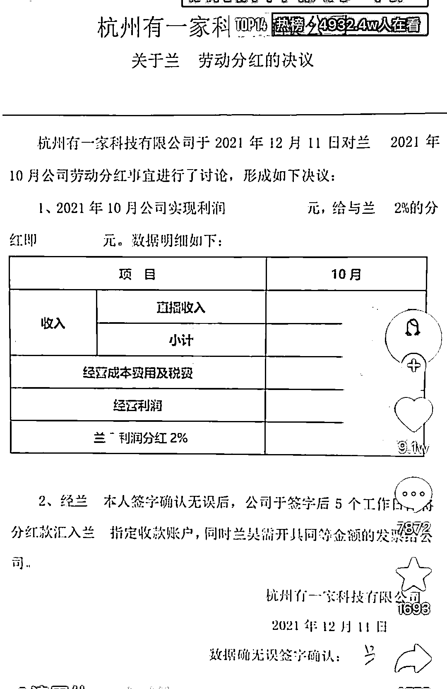

小兰掌握了直播业务，游絮则忙于开拓其他新业务，经常出差在外。

不过，有一天游絮突然收到一个消息：小兰居然带着浪胃仙和部分公司员工突然离开公司自立门户去了。

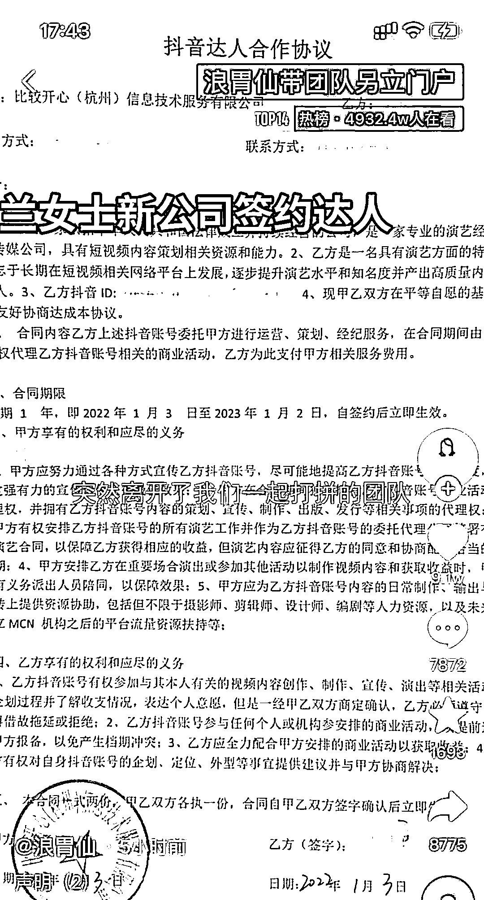

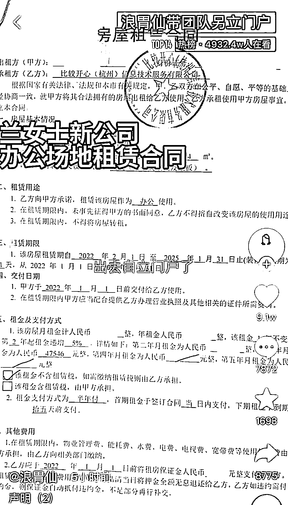

浪胃仙坚决离开，游絮最终只能接受现实。**因为公司就浪胃仙一个 IP，工作一下陷入停滞。**

为此，游絮问兰女士剩下的员工应该如何处理，**对方表示不会聘用他们，不需要可以自行遣散。**

最后游絮无奈和部分员工签署了解约协议和竞业条款，并赔偿了 N+1。

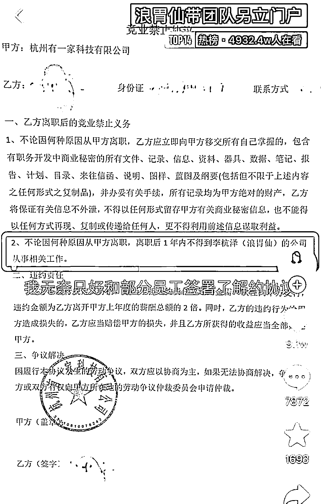

**竞业条款上清清楚楚地写着，离职一年内不得到浪胃仙（李杭泽）的新公司上班。**

但是没过多久，**游絮就发现签了竞业协议得到赔偿的员工又出现在了浪胃仙的新视频内。**

**游絮才发现原来兰女士在职期间就已经做好了出走的准备。**

从视频中，我们能够看到浪胃仙出去单干的公司全称“**比较开心（杭州）信息技术服务有限公司”（以下简称“比较开心”）。** 

从天眼查可以发现，比较开心公司由一个叫**兰昊**的人 100%持有。

值得注意的是，比较开心旗下还有一个公司，名为炒鸡开心。而炒鸡开心的另一个股东杭州布嘛繁文化传媒有限公司，**正是由浪胃仙（原名李杭泽）控制。** 

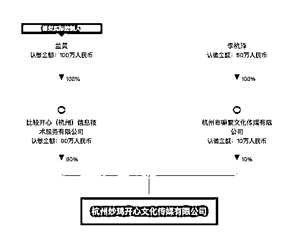

从工商信息能够看出，比较开心成立于 2021 年 12 月 8 日，当时浪胃仙还没离开原公司。

目前，在游絮视频中多次出现的“杭州有一家科技有限公司”，其工商信息中并没有出现游絮、兰昊、李杭泽的身影。

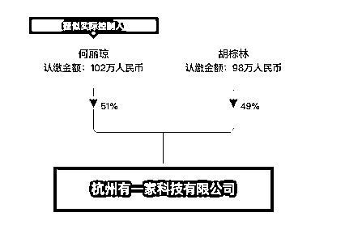

在游絮曾担任 CEO 的重庆天权星文化传媒有限公司，也没有兰昊、李杭泽的信息。 

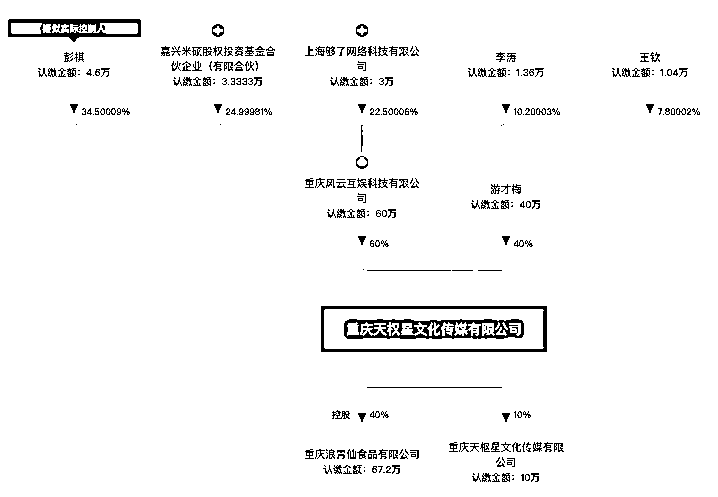

在视频中，游絮也表示经朋友提醒才发现兰女士在职期间就成立了新公司。 

而且开始把原来公司的业务转移到比较开心这家新公司了。游絮称，兰女士在职期间开展了一系列同类型的新业务。

**不过让游絮感到气愤的还不止这些，兰女士还带走了公司的拍摄器材和视频素材，还将公司电脑里所有的视频备份全部格式化。**

在多次要求归还后，游絮只得到被格式化的空硬盘，拍摄器材至今未还，这也是账号迟迟无法更新的原因之一。

**游絮称绝不放弃**

**但没有浪胃仙 IP 还值得做下去吗？**

最后一个视频中，游絮称绝不会卖号，投入了太多心血，会坚持做下去。

一边是兰女士忙着为新公司筹备直播，一边的游絮却不得不合作方一家一家解约，还要解决一些售后问题。

但经此一事，浪胃仙这个 IP 难免受到了严重的负面影响。 

对于游絮来说，没有了浪胃仙，未来将走向何处，相比需要更多的思考。 

**而对于浪胃仙本人，出去自立门户后，却被前东家点名“背叛”，曾经的人设是否还能立住？**

事实上，游絮在讲述整个故事的过程中，对浪胃仙都保持了足够的克制。她用“天下没有不散的宴席”来说服自己，她还说“对浪老师我依然尊重和祝福，希望他过上自己喜欢的想要的生活方式”。

但在笔者看来，游絮这样的态度更多可能出于对浪胃仙这个 IP 的保护，毕竟撕到鱼死网破，最后受伤的还是 IP 的价值。 

而游絮选择不放弃，就必须要在一些事情上，有所取舍。

不对浪胃仙开刀，游絮选择从他处下手。她表示对于小兰会保留追究法律责任的权利。 

但明眼人都知道，现在兰女士和浪胃仙才是捆绑在一起的。对兰女士下手，其实就是对李杭泽（浪胃仙）下手。 

**或许在游絮的心里，浪胃仙早已和李杭泽分割开来，她要保护浪胃仙这个 IP，但是李杭泽和那位兰女士则必须要为“背叛”付出代价。**

而在游絮眼中众星捧月的浪胃仙为何还会选择离开？相信不是无缘无故的。 

现在我们只听到了游絮的故事版本，这个版本里浪胃仙是游絮用心呵护成长起来的，但最后却被一个外人带偏了，最终选择了“背叛”。

**但在浪胃仙本人的故事版本里，游絮又会是怎样一个角色？** 

**网红和机构之间的关系是微妙的，他们有成长的陪伴期，有爆红后的蜜月期，也有分手时对峙期。** 

正如游絮所说，没有不散的宴席，但以何种方式分开却可能是截然不同的结果。 

对于浪胃仙一事，你怎么看，欢迎留言评论。

来源：三言财经

← 向右滑动与灰产圈互动交流 →

