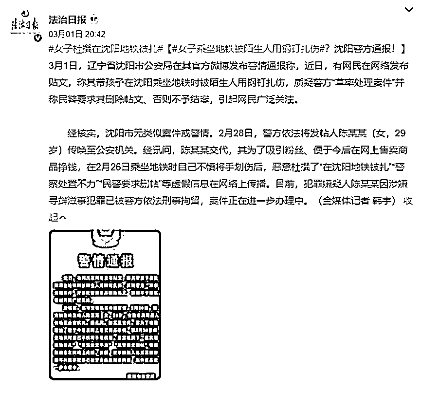
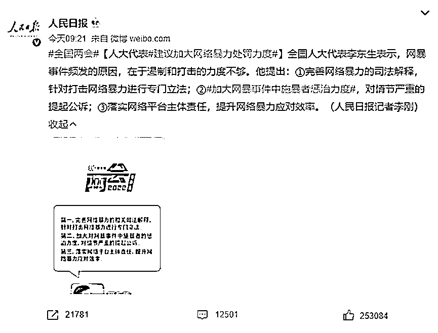

# 万千网友替你发声求真相，你却在造谣警察？

> 原文：[`mp.weixin.qq.com/s?__biz=MzIyMDYwMTk0Mw==&mid=2247531201&idx=2&sn=5db312194c37411063f5207948931c3d&chksm=97cbb1f9a0bc38efb7801ce6124126fd048146a0bf99da2c927eaf8afe67388a4034b34fb29a&scene=27#wechat_redirect`](http://mp.weixin.qq.com/s?__biz=MzIyMDYwMTk0Mw==&mid=2247531201&idx=2&sn=5db312194c37411063f5207948931c3d&chksm=97cbb1f9a0bc38efb7801ce6124126fd048146a0bf99da2c927eaf8afe67388a4034b34fb29a&scene=27#wechat_redirect)

**01**

**为肮脏之人振臂高呼**

**又被人言可畏的寒冬围攻**

嗨，友友们有关注前两天的这个新闻吗？

大意就是这个网友发帖表示自己坐地铁时，

被一个陌生男人用带有体液的铁钉扎了手。

从时间、地点、人物、做案原因、经过等各个方面，她都说得清清楚楚。

不仅如此，在后续中她还继续更新：**警方对她的不公遭遇处置不力，强制让她删除帖子消除舆论**等。

啊这……？大清王朝都灭了多久了，怎么还有这种事啊！

此情此景，任何一个人代入自己，恐怕都会觉得惶恐、愤怒又无助。

今天我就要为正义出拳！

火速帮忙转发求个公道，并在网上激烈讨论要说法。

于是这个贴子火速登上热搜，警方介入，一众网友心满意足。

“**还得是有群众关注才有结果，我真是个英雄**。”

然后说法就来了。

搞什么啊，泪目了。

我的真情和信任都在这一刻崩塌了。

**为了吸粉变网红，甚至连警察都可以污蔑？**狠狠地调查她教训她！

可这出好戏并没有因为真相暴露而落幕，

反而迎来另一波“闹剧”。

为了变身网红博位出众四散谣言，

那么当初帮忙转发的每一个网友都是“帮凶”。

“喜欢打拳？这回打你脸了吧？”

“不知道真相就爱冲？真以为自己是正义使者了？”

“什么年代了，还敢冲在热搜第一线？”

字字入耳，句句针扎。

说的就是我本人了。

说来惭愧，我就属于“冲在第一线的人”。

时间再往前拉，“血奴”事件触目惊心，

我当时正好在写一篇招聘季小心高薪务工的文章。

[…](http://mp.weixin.qq.com/s?__biz=MzU4MDYyMTg4NA==&mid=2247500104&idx=1&sn=c085c6a31dbb47403db7284fa2d49bf0&chksm=fd56821bca210b0d9acd747e23bcfa67ee032b233ef013e32ec49b8e293f21af7f252c72d7d1&scene=21#wechat_redirect)  

好家伙，这不是大好的素材往我脸上送？

我当场引入，奋笔疾书。

这件事引起的关注越来越广泛，于是我又激昂勇进地续写了第二篇文，

以血奴事件为引，我恶狠狠地批斗了一顿 58 同城的审核不作为，顺便对其他网络公共平台也来了一顿拳打脚踢的大动作。

👉[“假而不倒”，血奴事后 58 同城还能走多远……](http://mp.weixin.qq.com/s?__biz=MzU4MDYyMTg4NA==&mid=2247500412&idx=1&sn=0158c25533183821e981a64cf24a822e&chksm=fd56812fca210839db9d39f66ce299b141d1f14b123aa276148da3c5f7a0787ad8d34ed0d10f&scene=21#wechat_redirect)

发文的那一刻，我甚至觉得自己好帅啊。

“真是字字珠玑，针砭时弊，新时代的周先生非我莫属了。”

直到那夜凌晨的消息，来得猝不及防。

这个“血奴”事件，也是谣言。

先后 3 人，出于不同目的，协助小李编造宣传了“血奴”事件。

你以为你看到了这社会里耸人听闻的阴暗真相，

同情、悲悯、震怒。

**可惜每一张照片、每一句“证词”，**

**从头到尾都是精心打磨的剧本。**

哈，谣言，谣言，又是谣言！

在这个充满谣言的互联网时代，

造谣的、传谣的、信谣的，你总得当一个。

**02**

**以网暴为利刃**

**谣言的恶疮就无法重伤我**

在谣言面前，有时候看似在追求正义，实际上是创造了一种新的邪恶。

你恨一个人，就为他编造一点谣言，用网暴的力量狠狠击垮他。

不过没关系，就算你不认识这个人，萍水相逢也能这么做。

20 年有一段视频在网络流传，意指年轻女子出轨快递小哥。

这个女人是个独自在家带小孩的“富婆”，按捺不住寂寞，成了勾引快递小哥偷情的“风骚少妇”。

视频里还附有两人大胆露骨的聊天记录。

铁证在这里，谁能不信呢？

哇，好刺激啊，又好没有道德啊！

我要狠狠地批判这个女人。

于是这个女人被网暴了，**哪怕后来调查这是两个人“闹着玩”的谣言**。

谣言的可怕之处，在于它捕捉到了人性里最禁不起诱惑的好奇和恶意。

**人们总愿意一厢情愿地去相信，那些刺激的、肮脏的、狗血的事是真的**。

于是铺天盖地的荡妇羞辱、道德指责像一把把刀、一把把剑，催赶着这个女人去死，赶紧消失。

她在网上被骚扰被侮辱、身边的朋友同事对此议论纷纷，公司也将她劝退。她试着找新工作，却一直被拒绝，

精神上备受打击，甚至不敢出门，最终被医院确认为“抑郁状态”。

这就是网暴的力量，**它给受害人带来的伤害，犹如一场海啸或雪崩，急速毁灭了她的人生，让“活着”都成了一件需要努力的事。**

这类荡妇谣言甚至不是单一的、偶发的。

我发现很多这样“有意思”的博主。

他们开局一张图，图里的女人容貌艳丽，身材姣好，身处背景也能看出一二资产。

然后再附上一段“精妙绝伦”的人生经历。

这些女人，被高龄富豪娶回家，坐享荣华富贵……

不得不说暗示意味满满。

好一段女人看了会沉默，男人看了会痛斥这个物欲横流的社会没有爱情的精彩故事啊！

好兄弟，图里的美女知道你为她们撰写的人生吗？

不仅如此，搜索“造谣”二字，我们能发现太多太多这样的谣言。

当被造谣的人无缘无故遭受到来自网友们的“冲击”，

**还有人要她们自己反省愧疚不该发照片被人有机可乘！**

何其荒唐可笑。

荒谬的难道不是这些造谣者吗？

造谣，然后反转……

当我们看过了一次又一次的事情反转，

面对“异军突起”，我们开始怀疑了，

这是谣言吗？这个人是别有居心吗？

不管了，说不定都有问题！

还是熟悉的网暴套路，拿起键盘，无差别攻击，反正受伤的又不是我。

“活该了吧？又是为了红想的新招？”

“长这么好看举报高层，该不是被包养又被甩了想报复吧？”

在我看来，**谣言本身就是一种网暴**，

它用刺眼扎心的语言刺激社会柔软同情的神经，

消耗大量公共资源，消费每一个路过人的善心善意，

**网暴，就是在替弱者造谣。**

我们把生平所学的善、勇都发挥在网络平台，

也把自己都从未想过的恶在网络上挥刀肆虐，

只需要敲敲键盘，便觉得自己好像所向披靡大笔如椽。

我们既振臂为肮脏之人高呼，又口诛笔伐讥笑寻求不公真相的受害者为“鳄鱼的眼泪”，

其实已经满手鲜血，但自以为是正义的化身，铺满荣光。

黑暗中万千蝼蚁大军中的一只罢了。

讥笑一句仗义每多屠狗辈也不为过。

**03**

**拒绝谣言，也拒绝网暴**

都说造谣一时爽，辟谣火葬场。

信息更迭太快了，真相在大多数时候大多数情况下都是跑不过谣言和阴谋论的，

毕竟真相要一五一十地写，总是缺乏想象力，

而谣言可以天马行空，天生有传播基因。

甚至有人认为“**我们在用谣言倒逼真相**”。

当一次一次一次一次的反转事件，当恶俗的流言蜚语漫天扩散，所有人都围了上来。

而事情水落石出以后，大家又都漠不关心了。

但并不是所有人都会选择忍痛等风平浪静，

快递小哥偷情事件中的女主向当地法院以诽谤罪提起了刑事自诉。

她的态度很坚决：**我不要道歉，赔偿也一分不要，**

**但“他们的刑事责任我会一追到底，绝不妥协”**。

杭州的检察机关在研究后认为此案已经达到“严重危害社会秩序”的程度，

于是按照刑法规定，检察机关提起了公诉。

最终，**此案中的造谣者郎某和何某，分别以诽谤罪判处有期徒刑一年。**

这无疑是个好消息。

被谣言迫害而不低头选择迎难而上，需要很大的勇气。

司法的支持更能为这些被造谣者提供精神动力。

今年人大代表也作出了加大网络暴力处罚力度的建议。

一切似乎都在往好的方向发展下去，

但你我都明白，这个娱乐至死的年代，

谣言的火种绝不可能就此熄灭。

到底什么是真的什么是假的？

我们普通人凭什么来判断这是不是谣言？

理性的围观和发声，是对社会不公的矫正。

真正需要警惕的，是那些不关心事实真相如何，罔顾道德与法律的边界，

急于把个人观点、道德审判、情绪宣泄当作正义之声的噪音。

至于网络空间会不会因为这些言论变成“黑暗森林”，

当事者会不会成为受害者，其他人会不会被“株连”，几乎完全被忽略了。

**冷漠自私是错，激情上头是错，**

**互联网时代下信息流乱窜的我们到底怎么做才能能为理中客呢？**

那么，我的朋友，在网络谣言面前，你怎么看？

来源：黑白呸

← 向右滑动与灰产圈互动交流 →

