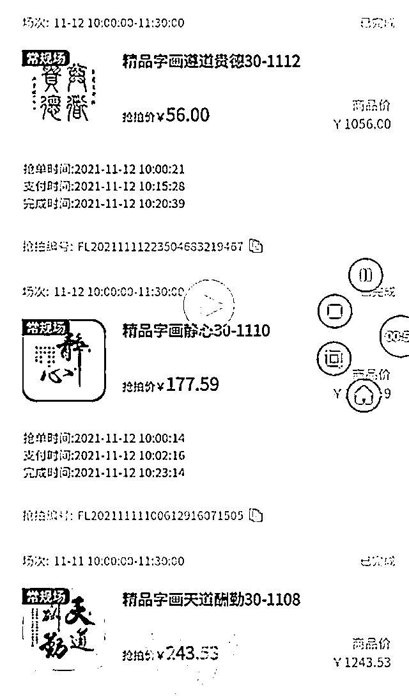
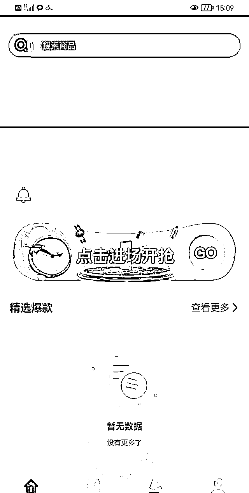

# 这家网拍平台崩盘，全国各地二百余人中招，有人一次损失 20 多万元

> 原文：[`mp.weixin.qq.com/s?__biz=MzIyMDYwMTk0Mw==&mid=2247531201&idx=3&sn=40b958bb10505f854dc3175edba2dc38&chksm=97cbb1f9a0bc38ef151d329a8bc56038ad93eda71cd815596244981db111bb96c0cab0fa9d57&scene=27#wechat_redirect`](http://mp.weixin.qq.com/s?__biz=MzIyMDYwMTk0Mw==&mid=2247531201&idx=3&sn=40b958bb10505f854dc3175edba2dc38&chksm=97cbb1f9a0bc38ef151d329a8bc56038ad93eda71cd815596244981db111bb96c0cab0fa9d57&scene=27#wechat_redirect)

2021 年 12 月，四川某实体店老板王宏想从自己投资的网拍平台账户上提现时，却发现无论怎么操作，都没有了任何响应。

王宏慌了。自己在该网拍平台上二十多万的余额变成了冰冷的数字，不仅如此，身边很多亲朋好友都在自己的推荐下参与了该平台，总金额高达一百余万元，随着该平台的崩盘，也意味着全部打了水漂。与此同时，当初介绍王宏加入的该平台负责人张某波、张某芹二人也失联没了踪影。

当王宏报警后，才发现跟自己有同样遭遇的人多达二百人，涉案金额达到六百余万元。这些人都在那款名为“富丽商城”的网拍 APP 上有所投入，也都血本无归。这款可以进行线上字画拍卖的 APP，手机号注册就能参与，而用户在“抢拍—付款—上架(挂卖)—卖出(回款)”过程中，不仅能够收回本金，还能额外获得 2%的溢价收益。

王宏坦言，在刚开始参与的两个多月的时间里，的确每天都会有收益，截至平台崩盘前，共收益 5 万余元。但 2021 年 10 月份开始，张某波等人就以平台升级为由，限制了提现，直到 12 月，APP 再无响应,投入的钱也没了踪影。

**稳赚不赔，每天都有收益?**

**在“富丽商城”APP 的竞拍会员中，王宏是投入最多的，本金投入 21 万元。**

**时间倒退至 2021 年 8 月，在朋友的介绍下，王宏与自称是“富丽商城”APP 负责人的张某波相识，随即在张某波的引荐下注册成为会员。“只赚不赔，每天都会有收入。”在注册之前，张某波如此跟王宏保证。**

**据王宏介绍，“富丽商城”是一款以竞拍字画为主的 APP，注册成为会员后，每天有三个竞拍时间段，操作也很简单，只需在拍卖页面对字画进行抢拍即可。“当时跟我说抢拍只是为了引流，做私域会员，跟全国多家电商大公司都有合作，目的是做自己的落地商城。”王宏对此深信不疑。**

****

**按照王宏提供的有关“富丽商城”APP 的介绍显示，其中详细介绍了盈利模式：个人商品交易，每天收益 2%。王宏说，实际上每天增长 5.2%，扣除平台收取的 3.2%的上架费(手续费)，会员们除了可以收回本金，每天还可赚取 2%的溢价。也就是说，会员每交易 1000 元，可赚取 20 元，每交易 2000 元，可赚取 40 元，以此类推，投入越大，收益越多。**

**除此之外，“富丽商城”还给会员们列举了其他盈利模式，其中包括引荐和招收代理。如果引荐，便可直接分享佣金收益的 0.8%。代理模式则分为一级代理、二级代理和总代理，按照所招收代理的日交易金额，分别有 0.4%到 1%不等的提成。“可充值、可提现、可互转、可用于上架出售的手续费和商城购物。”**

**王宏说，“富丽商城”内的字画均为真实存在，“但我们都是想通过商城买进卖出赚点小钱，没要求提货。”**

****平台崩盘，20 万元余额变成数字****

****王宏坦言，从 2021 年 8 月份到 10 月底，两个多月的时间，自己的确赚到了钱，投入了 11 万元，得到了 5 万元左右的收益。随后，因系统升级无法提现的王宏，却又贷款了 10 万元，并将其全部投入。****

********

****▲平台正常运转时，王宏的账户信息****

****变故发生在 2021 年 10 月 30 日。王宏说，10 月 30 日，商城内的订单出现了堆积卖不出去的情况，平台对这些订单进行了回收。随后平台相关人员以更新升级版本为由，导致无法提现。****

****12 月 3 日，平台突然宣布转型，隔天平台停摆。12 月 5 日，平台负责人张某波、张某芹等人将平台强制关停让其瘫痪，APP 内商品悉数下架，数据全部清空，余额更是无法提现。****

********

****▲APP 内商品悉数下架****

****对此，平台曾对会员们承诺在 2021 年 12 月底至 2022 年 1 月 15 日前将订单进行回购，承诺会员们不会受到一分钱的损失。但直到 2022 年 1 月 15 日，平台依然没有任何行动和解决方案。****

****在意识到被骗之后的会员们迅速组成了多个维权群，并于 2021 年 12 月底派出代表三十余人去到平台公司注册地上海报案并成功立案。****

****看着 APP 一步一步崩塌，王宏彻底慌了。因为除了自己的本金 21 万元在内，自己还曾介绍过二十余人参与竞拍，总共金额有一百多万元。余额无法提现后，多人曾经去到王宏所开的店里“要说法”。甚至对其家人进行施压，不得已，年前王宏一家提前将店铺关闭，直到现在都未开张。****

********

****▲王宏在平台的数据全部清空，余额无法提现****

****跟王宏有相同遭遇的还有二百余人，涉及河北、四川、内蒙古、江苏、山东等多个地区。投入金额在百元到二十多万元不等，其中王宏投入最多。据了解，多名会员因为投资该平台而背上了贷款。****

******律师解读该平台或涉嫌诈骗******

******“富丽商城”APP 所属公司为上海富丽客电子商务有限公司，企查查显示，该公司注册时间为 2021 年 7 月 16 日，注册资本为 100 万元人民币，张某波持股 22%，为三大股东之一。其经营范围包括互联网销售、工艺美术品及收藏品零售、工艺美术品及礼仪用品销售、技术服务、技术开发、技术咨询等。******

******根据会员们提供的联系方式，新黄河记者多次拨打张某波等人电话，均未接通。******

******山东鹏飞律师事务所主任傅强律师表示，自己在近年曾多次接触过类似案件，从网拍平台的运营手法再结合玩家们的说法来看，该平台涉嫌诈骗。******

******傅强律师表示，在网络平台上以各种理由进行拍卖、投资、买卖积分等五花八门的行为，具有很大的诱惑性、虚拟性和欺骗性。以返利为由，虚拟事实，隐瞒真相，诱导用户进行投资，目的是获取受害人的钱财，这种行为即诈骗。******

******同时，傅强律师表示，近年来犯罪分子诈骗手段层出不穷，诈骗手法也是五花八门，让人防不胜防。“一定不要贪便宜，尤其是在网络上这种虚拟的非官方的投资。”******

******据多位会员透露,2021 年末，张某波因涉嫌非法传销已被刑事拘留，但因证据不足目前正在取保候审阶段。曾有会员去到张某波家里讨要说法，但是其不愿退还钱款并表示一切以法律为准“法律让我赔多少我就赔多少。”(应受访者要求，文中王宏为化名)******

******来源：新黄河客户端，利箭在行动******

************

******← 向右滑动与灰产圈互动交流 →******

************