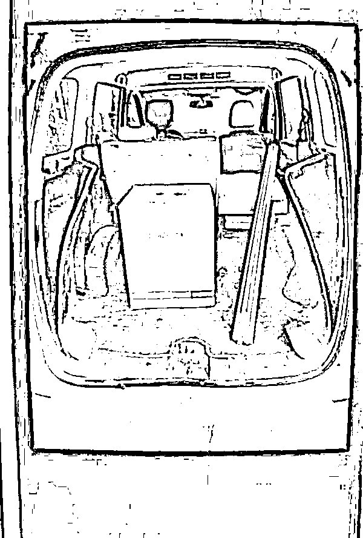
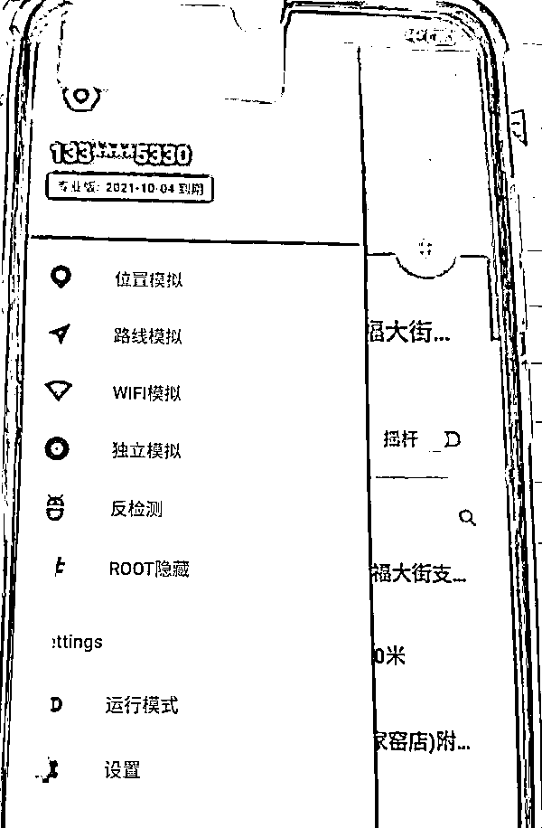
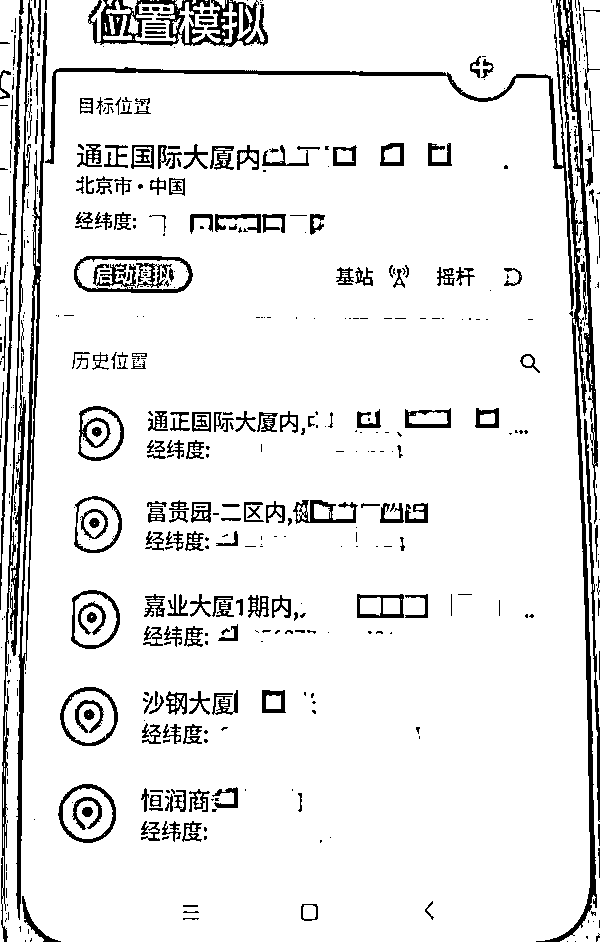
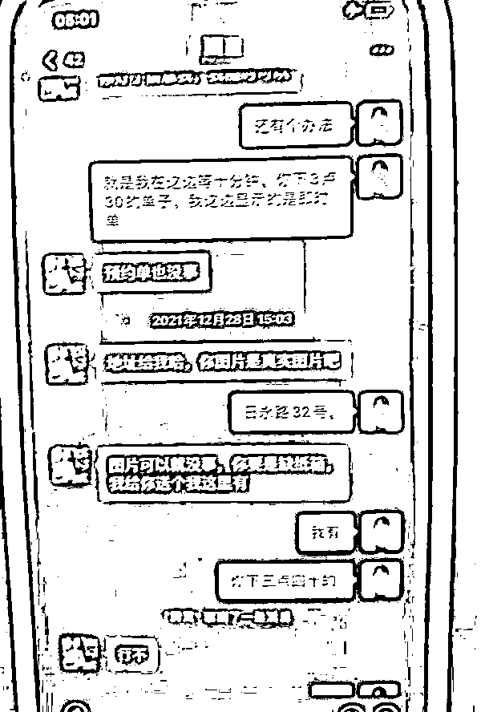
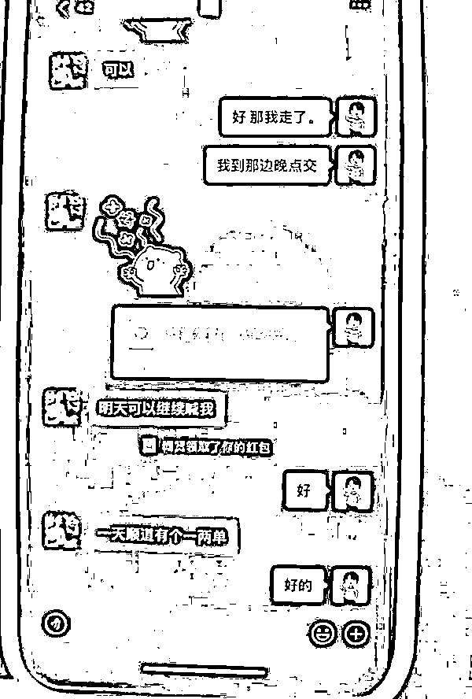
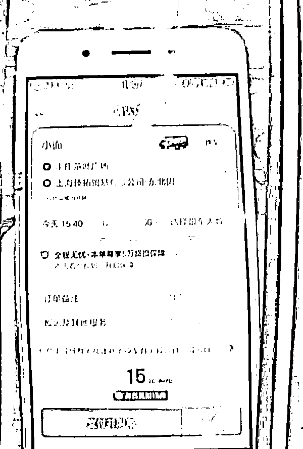
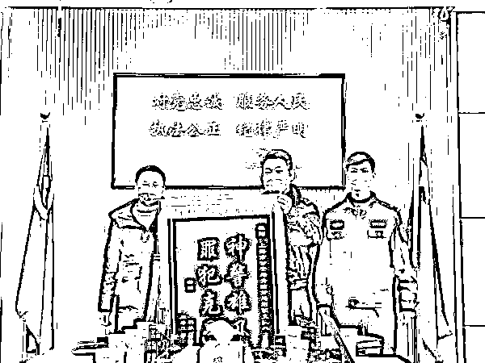

# 上海一货车司机疯狂刷单“薅羊毛”百万元，利用平台漏洞发布虚假订单、伪装行车路线……

> 原文：[`mp.weixin.qq.com/s?__biz=MzIyMDYwMTk0Mw==&mid=2247531201&idx=4&sn=94108665983530176aae53cae1065202&chksm=97cbb1f9a0bc38efb4a892d11169faa99ecceb7f7603efd5eaf39577df6d53e9bf81b9797a3e&scene=27#wechat_redirect`](http://mp.weixin.qq.com/s?__biz=MzIyMDYwMTk0Mw==&mid=2247531201&idx=4&sn=94108665983530176aae53cae1065202&chksm=97cbb1f9a0bc38efb4a892d11169faa99ecceb7f7603efd5eaf39577df6d53e9bf81b9797a3e&scene=27#wechat_redirect)

**谁在**

**疯狂刷单？**

为了赚取平台发布的“补贴”，货车司机“自导自演”下单、接单，并利用第三方软件修改定位，虚假完成订单，欺骗平台人工智能，几个月的时间跑空单达 2 万多单，疯狂“薅羊毛”100 多万元。

近日，青浦警方破获这一系列诈骗案，抓获 20 名犯罪嫌疑人。

去年 9 月，青浦警方接到一家货运平台公司报案称，有多名不法分子利用平台漏洞虚假跑单，骗取平台赠送的优惠券金额差价。

该公司相关负责人罗先生说，后台在梳理订单时，发现一些订单的时间、地点、货品照片等对不上，有的照片甚至被重复使用了几十次。

“比如说交通早高峰 30 多公里的距离，他用 20 多分钟就跑到了；有些是他早上还在上海接单，中午的时候显示，他就到北京或者河北了；有些是货物的照片重复利用，因为平台要求上传实际货物照片。”罗先生说，他们同时还发现，这些司机使用优惠券的数量太大了，“有 99%的订单都是使用的券，这就很不正常。”

经过青浦公安分局刑侦支队会同香花桥派出所开展深入调查，一个利用第三方软件虚构行车路线“刷空单”的诈骗模式逐渐浮出水面。

经查，犯罪嫌疑人先通过朋友或亲戚的手机号注册平台用户，随后发布一笔“虚假”订单，再以司机账号接单，接单后不久，就通过第三方软件修改手机定位，同时模拟行车路线，让平台人工智能误以为订单已完成，实际上没有一单是真实跑的。

由于下单时用户账号使用优惠券进行减免，而司机账号却能全额收款并享有额外的跑单补贴，犯罪嫌疑人便从中赚取差价牟利。

此外，犯罪嫌疑人会在相关货运接单的微信群内寻找同伙，一方面事先商定分成，一方面在发布订单时添加描述“暗号”，让真实跑单的司机望而却步，确保“自己人”能成功接单。

“下单的人会备注一些比较苛刻的条件，比如说是几十包水泥要帮我免费搬上 6 楼，让司机免费等两个小时以上等，方便他们识别这些是刷的单子。这些司机接完这个单子之后，再通过线路模拟来完成这一订单，从而大量刷单牟利。”青浦公安分局刑侦支队民警朱鸿飞说。

而犯罪嫌疑人之所以能钻到空子，跟平台本身对于账号的实际使用人监管不严有很大关系。

青浦公安分局刑侦支队八队队长吉永青介绍，该货运 APP 登陆需要刷脸，除补贴发放规则外，犯罪嫌疑人还掌握了另一个漏洞，就是使用老版本的 APP 进行认证登录时，就可规避刷脸。“有的司机甚至会把装有老版本 APP 的旧手机，一起卖给需要刷单的人。”

今年 1 月中旬，在市公安局刑侦总队的协助下，专案组开展了第二次集中收网行动，先后在本市浦东新区、青浦区重固镇等地，共抓获犯罪嫌疑人 20 名。

截至收网，这起案件涉及的诈骗订单数达 2 万多单，非法牟利达 100 多万元。

目前，20 名犯罪嫌疑人

因涉嫌诈骗罪

已被青浦警方依法采取刑事强制措施

来源：光明网，黑白之道

← 向右滑动与灰产圈互动交流 →

