# 起底东南亚“杀猪盘”：敢爱就敢毁掉你！

> 原文：[`mp.weixin.qq.com/s?__biz=MzIyMDYwMTk0Mw==&mid=2247531295&idx=1&sn=1d1ab0349948a7b9d1ef9cbd05f3e8ba&chksm=97cbb027a0bc393141e017c916b1a1139aafdca828132580c18f18ea6aa176ea6db02da2b20d&scene=27#wechat_redirect`](http://mp.weixin.qq.com/s?__biz=MzIyMDYwMTk0Mw==&mid=2247531295&idx=1&sn=1d1ab0349948a7b9d1ef9cbd05f3e8ba&chksm=97cbb027a0bc393141e017c916b1a1139aafdca828132580c18f18ea6aa176ea6db02da2b20d&scene=27#wechat_redirect)

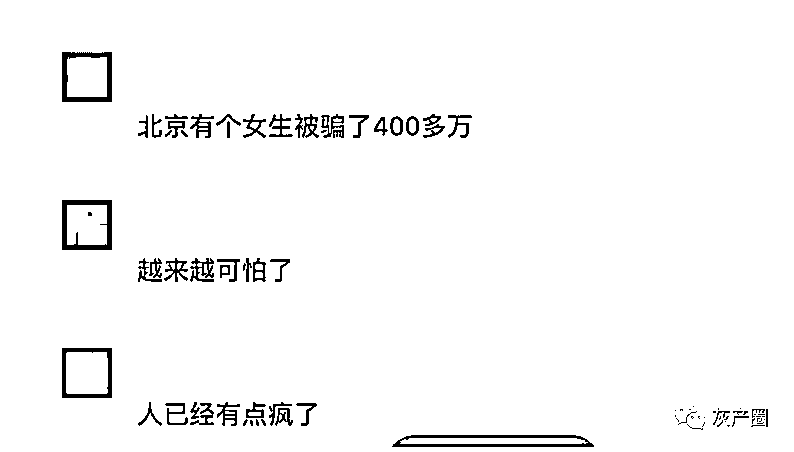

因为 soul，了解到了一个持续蔓延的感情金钱诈骗产业。

这场多人恋爱诈骗，让受害者轻则十万八万，积蓄全无；重则倾家荡产，名誉扫地。受骗人数急剧上升，因此抑郁活不下去的年轻生命时有发生。

先看一下 soul 上的骗子截图：

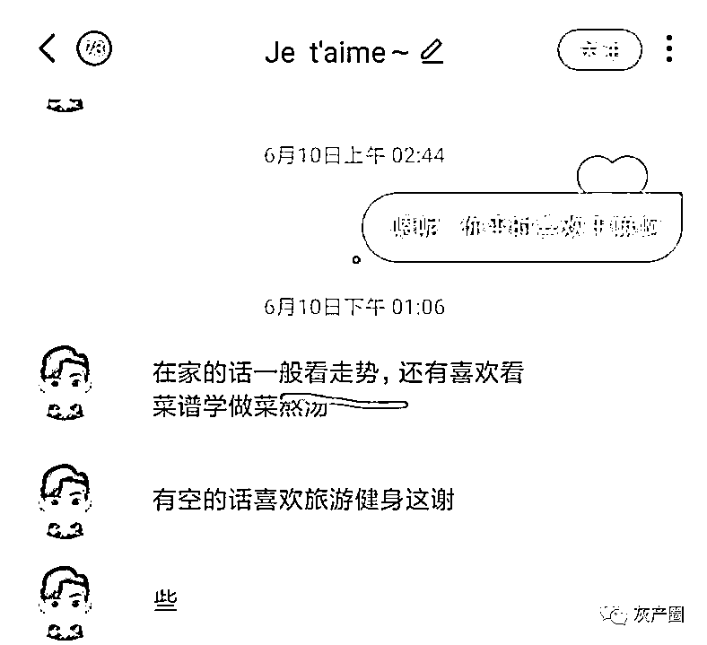

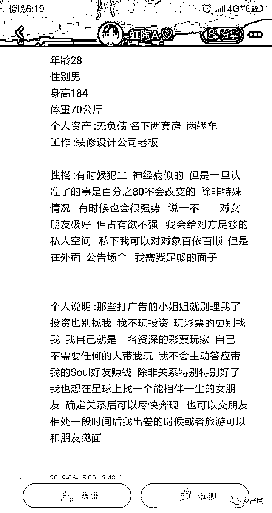

（只要对方说看走势，副业，买彩，做投资，数字游戏，请注意你应该有了赚钱的机会。这钱你是不想赚也得赚，只要你有缺口，不管你的缺口是情感还是利益甚至是自卑愧疚。总有缺口让骗子利用你。

第二张图片的介绍就有意思多了，知道 soul 上同行骗子多，就换了方式，把自己撇的多干净。而且 28 岁就已经两房两车，事业有成，还在 soul 上找对象简直是宝藏男孩了，我大天朝的年轻人啥时候这么容易成功了？骗子如果看到，答应我下次改成 48 岁好么?）

相信看到这里，很多关注此事的人就会想到“东南亚杀猪盘”。其实我一点也不愿意用“杀猪盘”来称呼此骗局，恶意太大了，但是也只有统一称呼才能找到组织。下图就是骗局解密图，没被骗过的估计也不太想懂。毕竟人都觉得自己很聪明，肯定不会被网络诈骗。不过劝你还是了解一下。

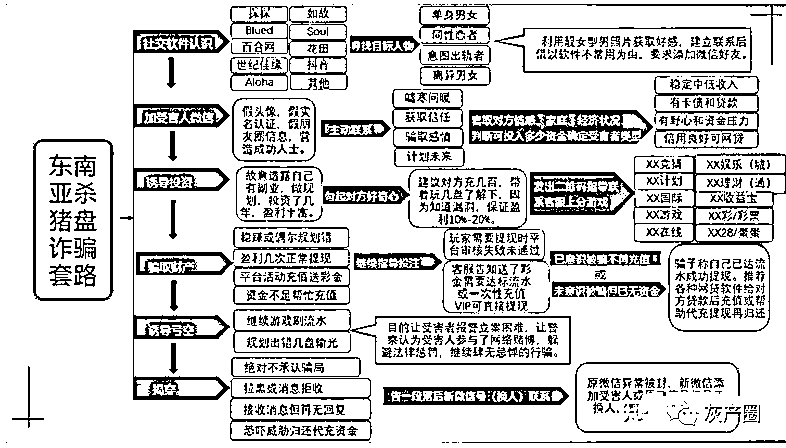

## 其实跳出来看是很简单，这种交友诈骗如下：

骗局将“爱情”和“博彩”结合起来，采用了：情感操控+欲望操控。“活该网恋”的丢人尴尬和“涉嫌赌博”的违法恐慌，让当事人不愿意告诉别人，更不敢报警。

其实你赌博了么?并没有。整个盘就是针对你设计的，让你赢你就输不了，让你输你就逃不掉，而且没有对方混淆赌博概念，诱导带投，你可能连麻将都不爱打。唯一可能参与过的线上赌博估计也就是欢乐斗地主了。这真是要不起啊。

这种交友诈骗如下：（当然骗术也在更新，诈骗犯对人物的心理操控也在升级。这里只说对女性的交友诈骗，以及诱导的理由和借口。）

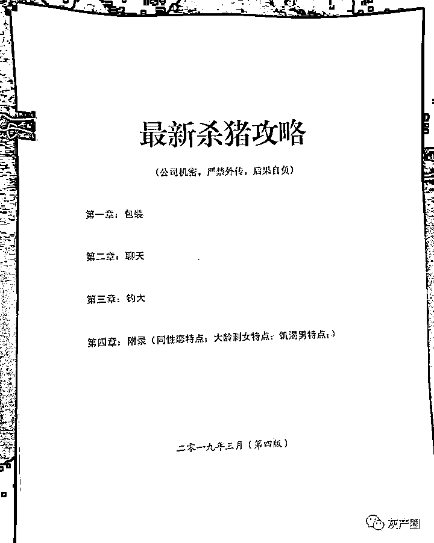

第一步：去各个社交网站找“客户对象”，然后就跟正常谈恋爱一样，当然要比普通恋爱更细心，更能理解你，更能恰到好处的夸奖你，毕竟他们是一个团队在研究你啊。同时有意无意让你知道对方很优秀，并且很喜欢你，还会给自己加点小故事。以求让你释放孤单，放下心防，觉得自己是一个很需要被保护的人，形成被爱被理解被关心的心理依赖。（谁不想被爱被理解呢?谁不想被懂的人看破逞强呢？）

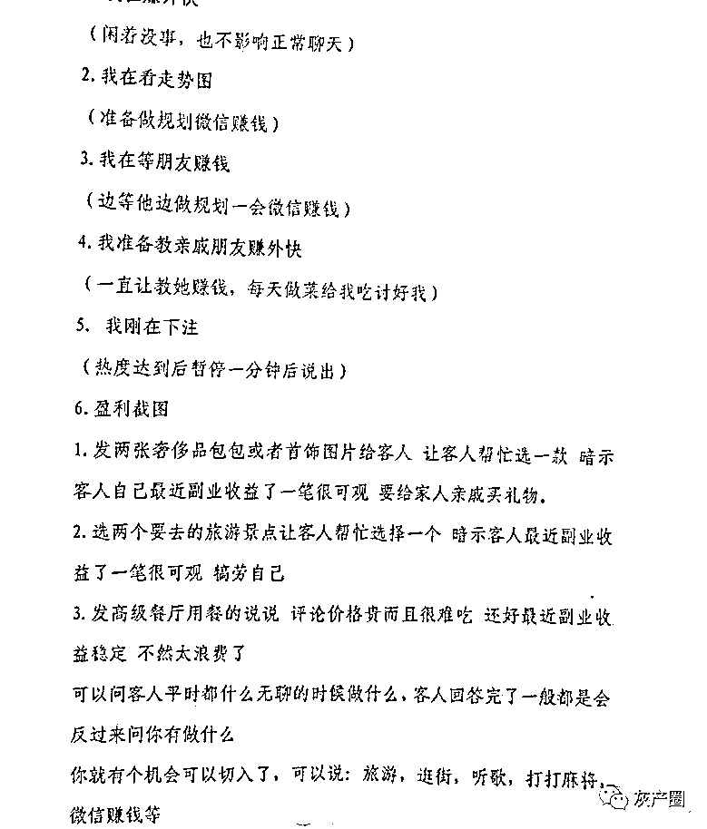

第二步：确定信任，引导你跟对方确定恋爱关系，不断引导你想象你们在一起后的情景，包括以后一起去浪漫的土耳其，顺便看看东京和巴黎。会唱情歌说情话逗你开心哄你睡觉等等。甚至规划好了哪里定居，生娃养家。就等他过一个月忙完来找你。当然期间最重要的就是诱导你关注他的赚钱“副业”，投资线上数字游戏。

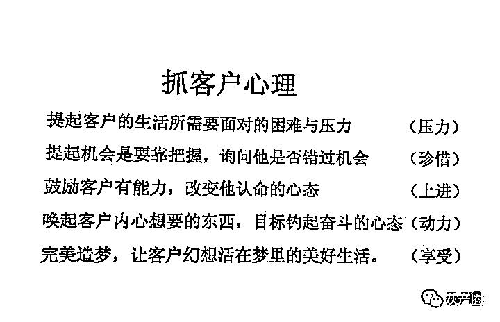

第三步：诱导你跟他一起玩副业，各种对你的爱要变成实际性的带你赚钱。打感情牌，例如爱他就陪他一起玩，只想跟爱的人分享；例如说不想看到你那么辛苦，想让你赚钱轻松一点。例如一起玩线上游戏这样就有共同爱好，以后见面话题更多。你都爱上他们团伙苦心经营的人设“他”了，不玩真说不过去了。如果你真的不想玩，对方会用情感勒索，质问你的灵魂:是不是不相信他？是不是感觉他逼着你赚钱？你能过意的去么？你竟然不相信“那么为你着想，那么关心你的人”，你不会自责自己防备心太重了么？

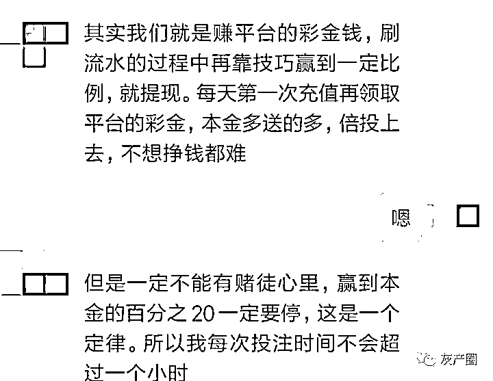

倍投稳赚理论

第四步：让你赢，不断诱导你加大投资。人都是趋利的，谁赚钱了不开心，你当然会更相信他。为了让你更相信他，打消你的顾虑，骗子还会解密为什么稳赚不赔。例如发现系统漏洞，例如还会讲给你为什么这样倍投，例如会告诉你专业的公式。骗子简直对你所有的担忧和怀疑掌握的恰到好处。具体还会激发你的赚钱欲望。例如有没有要想买的包，化妆品，车，房等等；例如要孝敬父母应该给父母更好的生活；例如回忆一下成长过程中有哪些事情是因为没钱而放弃的；例如几月几日他来找你前，带你挣够多少钱，跟他差距没那么大之类。总会激发出你的心理弱点。让你觉得自己很穷，而且还有连赚钱都不敢赚的穷人思维。你对不起这个美丽的世界，对不起爱你的人，对不起自己的梦想。毫无疑问你的确手里是有个小十来万。甚至还能问亲朋好友借点，效仿骗子总跟洗脑的资金整合。得，投个一二十万，反正凑钱也不是很难。被宰难免，因为你不知道是骗局。

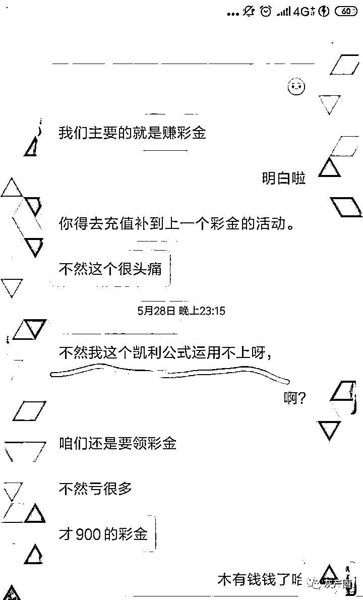

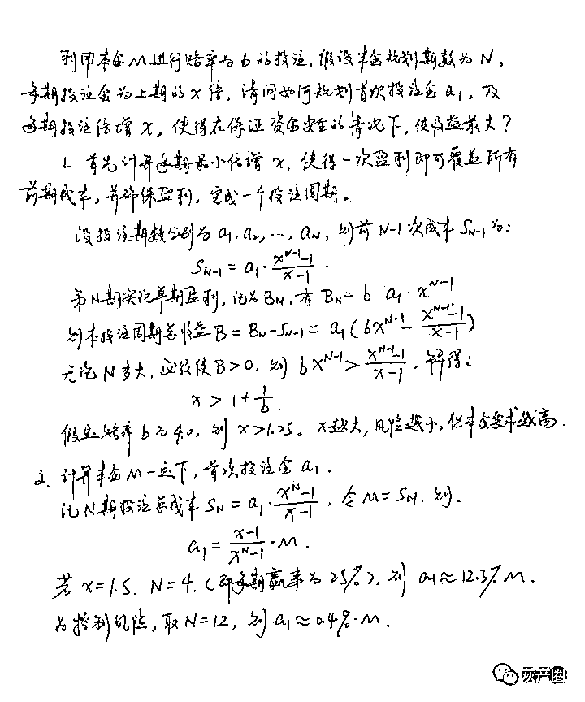

凯利公式都搬出来了

第五步：带输你。一般骗子会分析你的经济状况，前边跟你推心置腹，已经收集了你的工资水平，家庭状况，信誉状况，以及你的反应。选择接着给你谈恋爱或者直接消失。这都看对方团伙对你的判断。具体情况是自己输得比你多十倍，自己也很自责很对不起你，让你没立场指责他，相信只是偶尔出错，对方更可怜。对方接下来目的是为了榨干你的信用，能贷的款都贷一下，能借的钱都借一下，然后去捞你的损失。当然你这样做了，输得更多，还背上了被追债的风险。了解到群里有人一个月要还七八万，都快赶上普通人一年的收入了。刺不刺激？

有些人说什么也不会去碰网贷。骗子见无利可图，便不再搭理你。去服务他下一个对象去了。各种账号不回手机不接。让你经历地狱般的抽离。突然钱和爱都没有了，你甚至都不知道发生了什么。还有骗子会先发制人哭诉自己输的更惨。

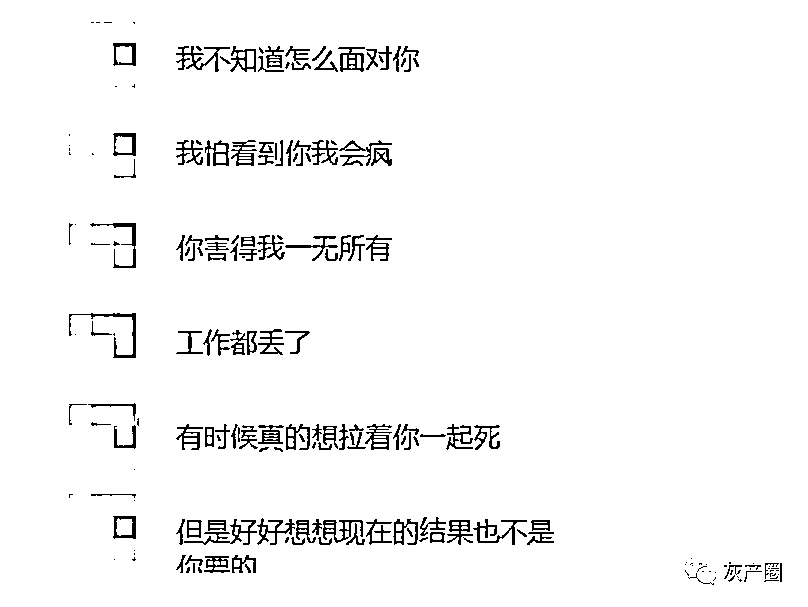

其实骗局流程不重要了，很多人都是愿意相信自己在恋爱，才会被骗。

这种感情诈骗的高明之处在于，意识到受骗后由于觉得丢人尴尬并不愿意告诉其他人。更甚者，根本不愿意相信这是骗局，对方给她带来的感情好像真的无法让人相信这是骗局。利用感情，多恶心。

经历过的人，和未经历过的人看到这些骗局，可能都会觉得傻逼才会被骗。正在经历中的人则根本跳不出来，因为他们是当局者。所以请大家对受害者的恶意少一点，没人愿意当受害者。

这场诈骗中金额已经过亿，人均都是二三十万，残害着刚刚有点小积蓄的空城里的青年男女。受害者大部分现状，总是一个人躲在深夜里哭泣，抑郁，轻生，活不下去，情绪已经带给他们不可逆的身体伤害。随着人数的激增，这样的骗局开始向病毒一样侵蚀着即将成为社会中坚力量的 90 后中孤独的灵魂。

而 soul 上的 90％主动搭讪的人都是骗子。

而 soul 上的骗子还在开心的骗着国人的辛苦钱。

丝毫不在意，年轻的人们消失在了白桦林。

## 【说一下写此篇文章的目的：】

㈠、阻止恶继续蔓延。

①让更多无辜的人知道这个骗局，当你偶尔感到孤单缺爱，偶尔需要找人倾诉的时候，留个心眼，别碰上类似的情感操控的骗局。你一旦内心有了缺口，就难以逃脱这场骗局，最终钱情两失，被骗子在内心注射了恶毒发酵液。

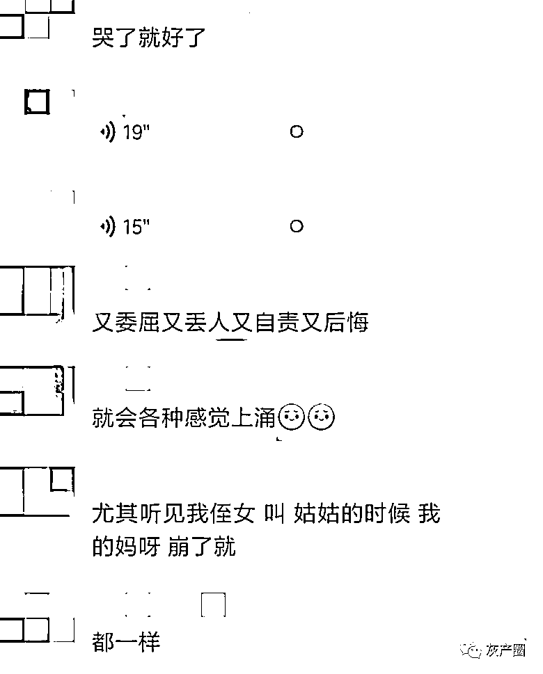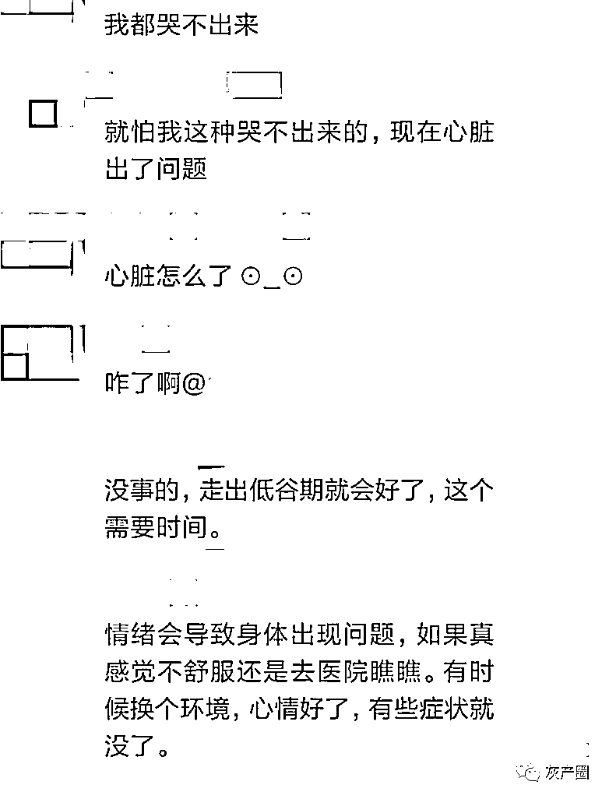

②让更多吃瓜群众看到受害者精神和经济的双重压力，别在旁边说风凉话，增加受害者的情绪负担，不知不觉做了伤害别人的恶。如果有朋友求救，希望能耐心倾听，不要嘲笑冷语，你的理解可能能救他们。事情都发生了，指责奚落并没有意义，他们自己已经很自责了，难道不知道自己当时傻么？

③让更多受害者看到后知道这是骗局，别逃避，勇敢去选择报警；别沉默，不能让坏人逍遥法外。别害怕，及时寻求帮助。也不要因为独立惯了就硬抗。

④让更多难友放下受害者的标签，原谅自己，这不是你的错，别折磨自己，也别对世态炎凉产生恶意，努力走出来，相信这个世界还是善念主导的。摆脱一朝被骗，三观尽毁，从此看谁都是骗子的心理状态。你很好，你值得拥有幸福。如果实在不能释怀，看一下最后的受害情绪重建。

## 【为什么会被骗：】

问题一、你要不是看上人家有车有房事业有成，长相身材这些，也不至于被骗，你会相信对方是你自己爱慕虚荣，被骗活该。

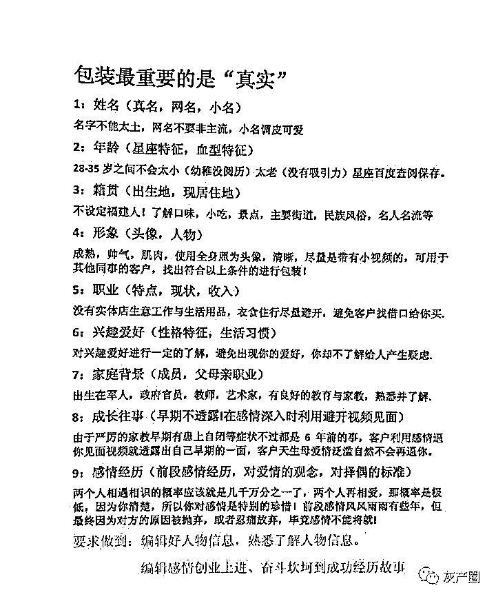

对方的确挺帅，人设打造很完美。

难道她们不知道“霸道总裁爱上我”这样的玛丽苏剧情是不现实的么?难道她们心理没有疑问又帅又好同时物质条件还不错的人凭什么会爱上自己么?难道能拿出几十万去输的姑娘，自身实力是差到不应该看上更好的人?

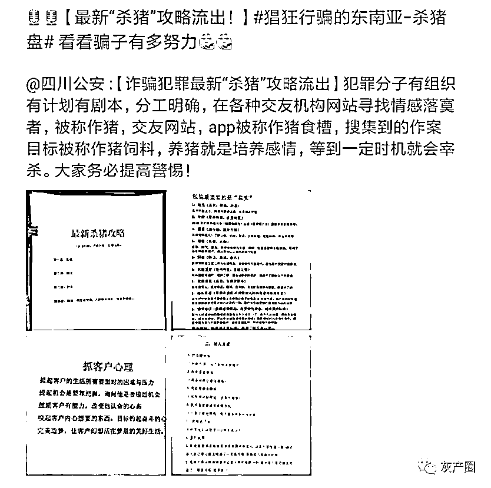

第一：骗子的账号是一套的，他的所有社交号娱乐号竟然在认识你之前就开始经营人设了。你搜图搜不到对方信息。还是不相信对方，要看对方其他号，对方还真有跟微信一样的抖音等账号，而且上面发的内容和告诉你的工作信息以及生活视频完全吻合，反口就情感勒索说你不信任他，借机跟你吵架然后你慌了，对方大方原谅你。

善良的你怎么会知道骗子为了骗你竟然这么努力，所有账号都做人设了，你除了觉得自己太多疑外，根本不会往坏的方向去想对方了。你甚至开始怕伤害到他。毕竟还有第二。

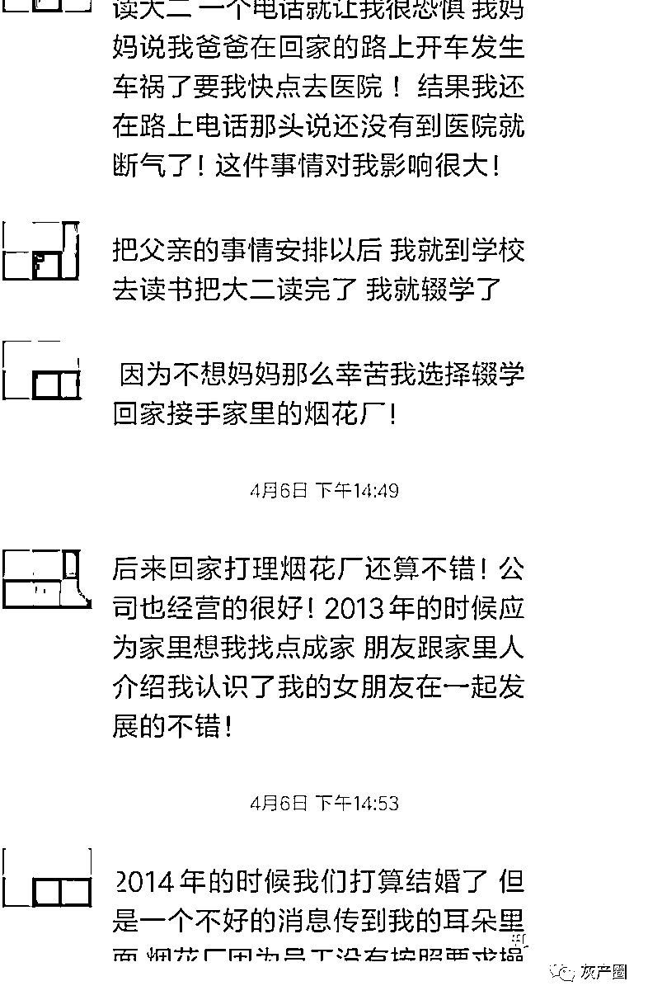

第二：完美人设中会有不完美，让你相信对方并不是高不可攀，例如会有家里是农村的，吃了很多苦才有的今天的成绩。例如自己文化水平不高，辍学女友在他最艰难的时候离开这种。让你觉得他真的挺可怜缺爱也需要你。你完全可以被他喜欢，他也完全喜欢你。

彻底打消你怀疑他怀疑自己的理智想法，进入这场虚拟恋爱的迷局。等待温水煮青蛙式的宰割。

即使你还是不相信，但也会想试试看，毕竟对方一月后就说要来看你了。说见过面后，你就会完全相信他了。你不会动心试一下网恋?大不了见面后不合适就算了，谁知道骗子已经进化到半个月就完成了宰割?

问题二、都这么大人了，还会被骗。被骗几十万，还是人傻钱多。

大多数被情感诈骗的女生是没有恋爱经验的，生活里绝对是个能手，但她们在情感里的确是个小白，愿意付出，也愿意相信，就是不知道现实里如何主动，如何和男孩子相处。就算有恋爱经验的人，陷入爱情智商也得突降吧，何况小白?谁能时刻提防着被感情欺骗?谁知道还有这么恶心的骗局?光是欺骗感情，就够她们自我毁灭了。何况还有金钱带来的现实压力。

这个世界缺爱缺理解，所以给了骗子团伙有机可乘。这跟年龄有什么关系?再大的人也会被骗，只要你有弱点，只要你还与人接触，只要你放松喘了口气。

这个年龄的女生，又独立又能干，有点小积蓄也很正常，他们的孤单和年龄还有小积蓄正是骗子好入手的对象啊。要不然骗子 8：00 吃完饭研究什么呢?一场针对适婚独立女性的骗局研究，骗子投入了大量科研时间。

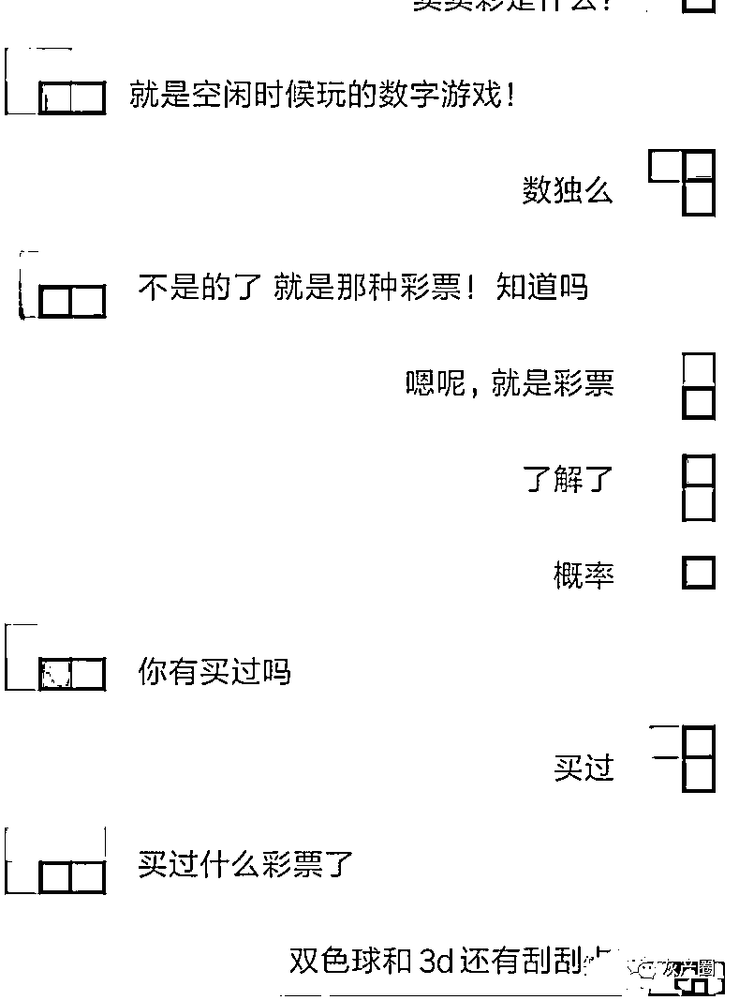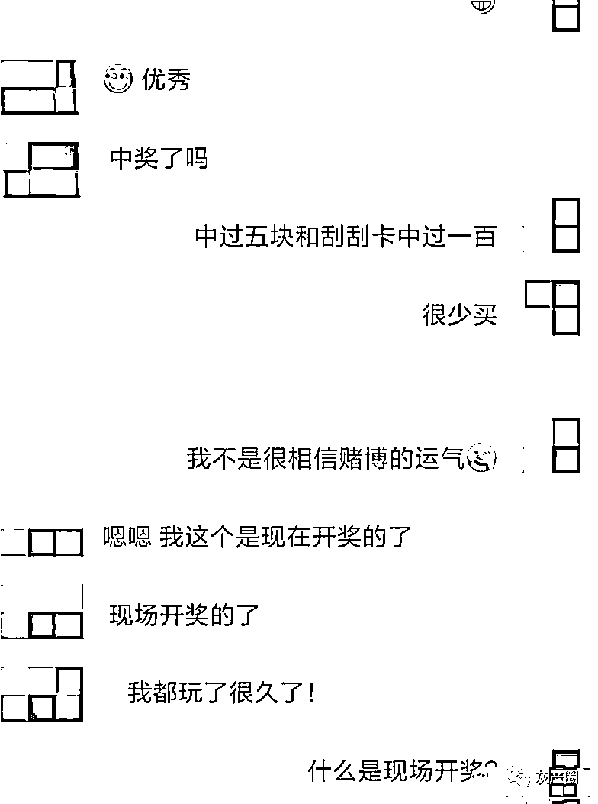

彩票也是概率问题，当然也属于赌博，但是福利彩票是合法的，上去让你回忆买彩票经历，就已经把博彩和福彩混淆概念，让你认为就是彩票，就是靠运气的中奖。

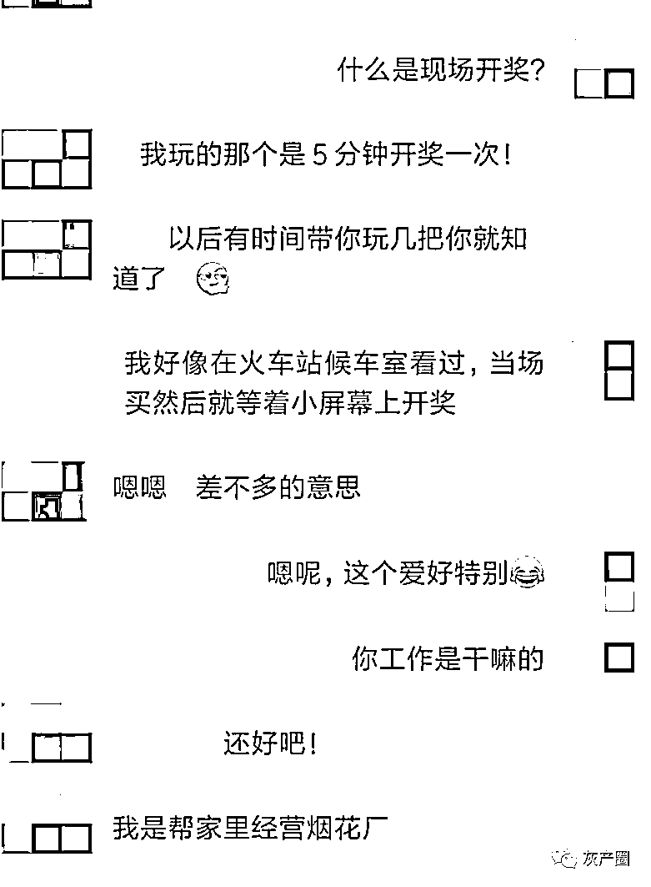

第一，受害者就是因为不赌博，才更不会知道这种彩票形式属于线上赌博。没人告诉过他们，他们如果不是因为这个诈骗，终其一生能参与的“线上赌博”可能就是欢乐斗地主了。骗子们说这是线上开奖，跟彩票概念混淆在一起，彩票是赌博，毕竟都是概率，谁还没听过福利彩票体育彩票?骗子这个 xx28 数字游戏结果跟 3D 彩票一模一样啊！恰巧有过一两次买双色球的经验，彩票属于违法么?

第二、每个盘都是可操控的，让你赢你就赢，让你输你就输。这是一群人设置了虚拟盘陪你玩呢，有客服送你彩金，有客服给你充值账号，有“对象”带你投资，多人恋爱服务中的必要付出环节。让你开心相信让你欲哭无泪。

如果是赌徒可能知道各种赌局的方式，可能受骗几率更小。为什么那么多乖孩子突然沉迷赌博?还不是因为对赌博无知。

老铁们，想知道什么是线上赌博么，准备几十万，东南亚的那群同胞会让你永远记住。

【受害者情绪重建，如何走出负面情绪：】  

第一，放空自己，当自己是一个无行事能力者。给自己定一个时间周期：2-5 天，时间不宜过久。

这几天可以允许自己不工作，不去做一个符合社会要求的人，允许自己搞砸一些事情。不去批评指责自己。哪怕暴饮暴食，哪怕昼夜颠倒。颓一下，别逼自己。比如强迫自己不要哭，强迫自己睡觉，强迫自己走出来，强迫自己乐观。这些都不要。你就要放空自己，不用大脑思考，随便跟着身体流浪放逐自己。

哭泣就哭个够，睡不着就劳动擦地洗衣服做一些体力活等。

第二，在日期最后一天，开始恢复理智。拿出一张白纸开始理智分析问题。如何自救。分析受骗的原因，制定相应计划，例如找人倾诉，例如运动健身，例如认真吃饭，例如如何赚钱等等方面。然后重生。

接受被骗的事实，也接受追回的希望渺茫。重新开导自己去爱上这个世界。

虽然很困难，但是时间能淡化一切。

题外话：之前有个人受骗后，女友也离开了他的小伙子找我咨询，我回的一些话，也许这些回复对经历杀猪盘的人有用：

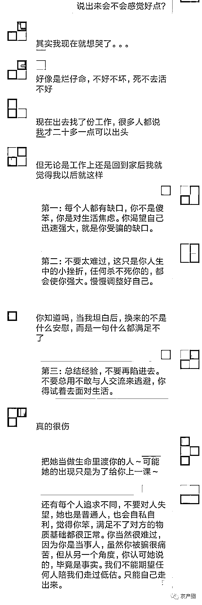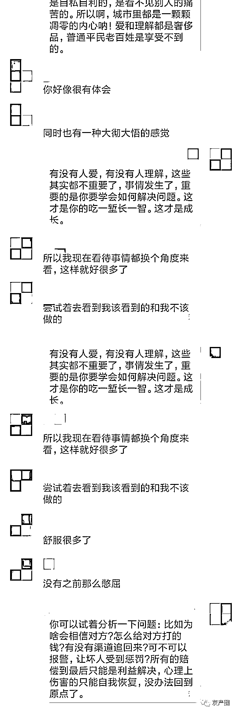

虽然没有碰到可以治愈爱的爱，但也不能轻易被恶侵蚀。我们终究不愿变成恶龙。因为我们是美好本身。加油！

来源：知乎独孤派，阻击诈骗

← 向右滑动与灰产圈互动交流 →

