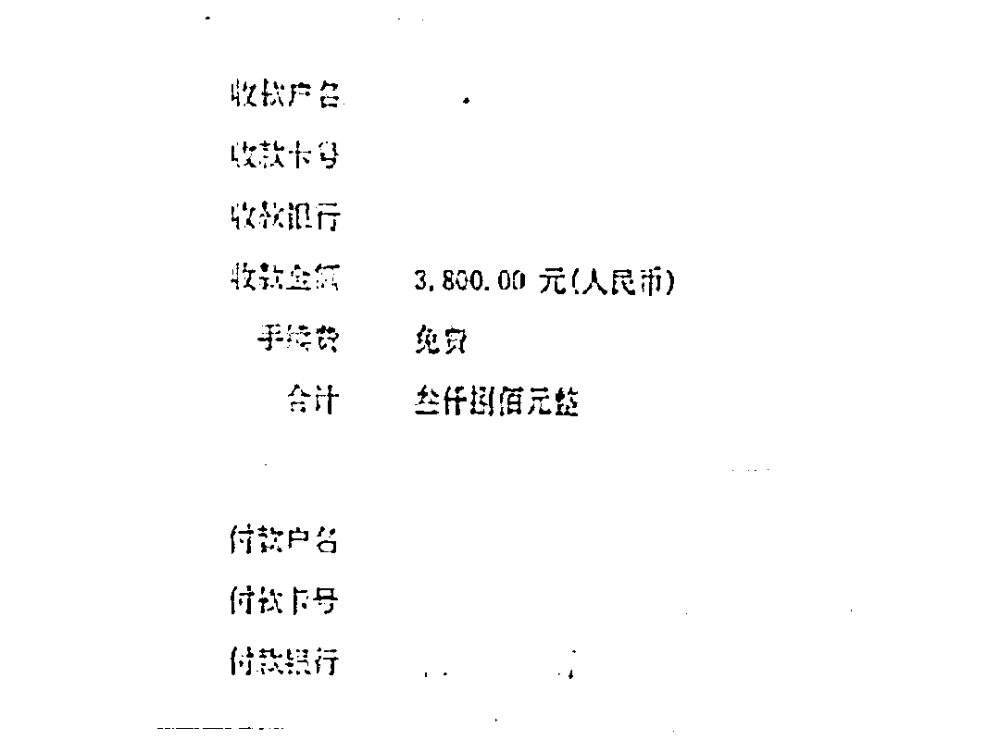

# 谈恋爱，要是到了视监的地步，基本歇菜吧，不信，就看看他们的遭遇

> 原文：[`mp.weixin.qq.com/s?__biz=MzIyMDYwMTk0Mw==&mid=2247531295&idx=2&sn=3db853cf60bf1cc31683f802764fb6fe&chksm=97cbb027a0bc393132ca1e6a9bc79852bb4ae537b597b4983dfa76f6683470f24b74084a6de9&scene=27#wechat_redirect`](http://mp.weixin.qq.com/s?__biz=MzIyMDYwMTk0Mw==&mid=2247531295&idx=2&sn=3db853cf60bf1cc31683f802764fb6fe&chksm=97cbb027a0bc393132ca1e6a9bc79852bb4ae537b597b4983dfa76f6683470f24b74084a6de9&scene=27#wechat_redirect)

全民反诈后台收到读者反映，自己遇到了一个可以手机定位的平台，问是不是诈骗？ 

当然。所谓好奇害死猫，要想知道一段感情里，对方在干嘛不是靠查的。

这要查了，多半不会好了。

**查男友被骗** 

3 月 6 日下午 16 点，一女子匆匆忙忙赶到西湖区蒋村派出所报案，称其被骗了。

她被骗了。事情是这样的，她算是大龄未婚，找了个男朋友，5 日在家给男朋友发信息，男朋友没回，第二天也没联系上。

她有点怀疑男朋友，想知道下男朋友有没有啥问题。就开始在手机百度搜索类似“微信聊天记录查看”的条目，搜索之后浏览了几个网址，并从其中一个网址里加了联系人的微信。

微信通过后，对方发来一个视频。

里面展示了如何进行操作并同步查看别人微信的聊天记录，看完视频后，她问对方要多少钱。对方说要 430 元，她按照对方提供的银行卡账户和姓名，分两笔转账。

之后对方就发来一个网址，让她下载一个叫“IPVPN”的软件。她注册账号后发现里面的每一个功能都要收费，对方称平台就是这样的，先收费然后可以退还。

她就开始陆续充值，先激活软件半年使用权，再开通“实时监控微信聊天”、“定位”等功能，还有授权保证金、开通登录账号、填写系统链接等，转了 19918 元，软件还是不能使用，而且对方又称还要交 15000 元，才能开通其它的功能。

这时候，她觉得有点不对劲，跟对方说不想使用该软件并要求退还钱款，对方并未回复。她就赶到派出所来报案。

像这位女士想看男朋友微信聊天记录，有个网络名词，叫视监。说到底，是没有安全感，再往里说，就是不自信。

**查女友被骗**

在感情里，也不仅是女人不自信，男人也有。义乌小伙小田和杭州这位女士一样，都陷入了情感困局。也遇到了一模一样的骗局。

小田收到女友的信息：“我们分手吧”，他想不通了。

前一天，还是个浪漫的情侣纪念日，人家成双入对，自己却被人蹬了，小田越想越想不通，到了第二天（2 月 15 日）凌晨，还睡不着。

也许是有什么隐情吧。

小田按捺不住打开网页进行搜索：有没有可以查询好友聊天记录的黑客技术？

网上跳出了具备此功能的一个 App 界面，边上还附有客服的微信号，抱着试一试的心态，小田发送了好友申请。 

很快这个名为“A 安全恢复”的客服就通过了小田的好友申请，在知晓小田的需求后，又向小田推了一个叫“技术小林”的好友，让小田具体询问他。

“技术小林”告诉小田：“我们公司有这样的软件，只要安装到手机上面，输入对方手机号、微信号，就可以查看他的聊天记录。”同时发来的还有一段操作视频和营业执照的照片。

“普通版 480 元，加速版 880 元，普通版只能看对方聊天记录的 70%-80%，加速版是可以查看全部的。”小田决定购买加速版。

“公司规定安装前要先预付 180 元定金，下载后测试没问题了再支付尾款……中国人不骗中国人，哥。”

看对方这么诚恳，小田马上转了钱。

之后，他和上述提到的杭州那位女士一样，下载了“IPVPN”的 App，注册了账号，界面却跳出了需要购买激活码，对方告诉小田需要缴纳 300 元。

于是，和杭州那位女士一样，小田转账多次，输入激活码后界面又跳出需要购买套餐来激活设备进行授权，对方也是跟他说“这个钱都是会在五分钟后退还的。”

转账完成后对方又发来一份“IPVPN 保密协议合同”，要求小田再交 6800 元的保证金，也是说这笔钱会退回的。

到后面，对方说开通中国地区服务器还需要转钱，这下小田不乐意了，要求对方给自己退款。 

一入骗局深如海，对方说退钱要扣除 30%手续费，“你先将 30%的费用转过来，我们会全额退款。”

这个时候，小田才知道自己遇到了骗子的无底洞了，去义乌市公安局廿三里派出所报案。

**找调查公司查查，可以吗？**

有人问，如果遇到这种情况，是不是可以找调查公司调查一番？

看看这个老公的遭遇。 

妻子离家出走后杳无音信，张伟（化名）四处寻找妻子的下落，就是没有任何消息。

于是上网求助了一家“调查公司”，张伟和这家“调查公司”的“队长”，互加为了好友，对方告知张伟说定位的价格有两种：定位人的位置需要 800 元，定位之后实时更新的要 5200 元。

张伟经联系“队长”花了 800 元钱，成功“定位”到了妻子的位置，然后他便驾车出发，踏上了寻妻路。

上一次，根据“队长”提供的地方，他听到了有公鸡的叫声，赶过去没找到，但他还是对“队长”能力深信不疑，决定再定位一次。

这一次，“队长”发过来的位置是金华永康市区的一个地点，当天下午，当张伟驾车赶赴永康市区后，根据队长发的位置，还是没发现妻子，不得已他只得暂时返回东阳城区，作进一步打算。

张伟觉得自己这样也不是个办法，想用实时更新的定位，经商量，“队长”给张伟优惠了 200 元，张伟转给对方 5000 元，转了钱之后对方告知张伟定位的软件，要两个小时之后才能用。

张伟等啊等，等到了大晚上还是没有消息，“队长”已经彻底失去了联系，他才意识到自己被骗了……

**手机定位 App，可信吗？**

那么，除了上面的骗局，现在还有什么关于手机定位 App，可以查看他人的轨迹，这可信吗？

央视财经曾经报道过。

有人下载后，此时，软件提示缴纳会员费才能提供服务。然而，在张先生缴纳了 198 元之后，软件再次提示：对方尚未注册。原来，这个软件需要对方也下载并同意使用自己的位置信息，才能定位。 

张先生说自己就是因为我联系不到他，才需要找一个软件定位他。如果他给我回信息的话，我用得着花那钱吗？

[`v.qq.com/iframe/preview.html?width=500&height=375&auto=0&vid=m3205ksuvod`](https://v.qq.com/iframe/preview.html?width=500&height=375&auto=0&vid=m3205ksuvod)

现在可以知道了吧？

网上帮你定位查位置、帮你“监听”“监视”对方手机也好，都是假的，包括车辆定位也是假的。

都是在交智商税了！

**真是交智商税啊！** 

从这类骗局的受害者看，有高学历、白领、做生意的也有普通打工的。

所以被骗，和学历无关。本质上，还是和心态有关。其他骗局也一样，正是心里有个漏洞，才被骗子钻进去的。 

这类骗局往往是团伙作案，骗子做好这类网站或 App，找人来做推广，网站或 App 后台维护又是一波人，洗钱是另一波，各环节的骗子都是打“配合战”。

诈骗团伙先做好网站或 App 后，推销人员在网上发各种小广告，你动心后和对方联系，他们往往会让你下载一个 App 或软件，或者进入某个网址页面，声称输入你想要定位的人的电话号码，就可以操作了。

实际操作时却用各种理由骗你交钱，等你交费了也按照要求操作了，却依然不能成功定位。如提出来退款，就又是说要手续费。

另外，如果这么做，也是侵犯公民个人信息，手机号码、微信账号、家庭住址、位置轨迹均属于个人信息，非法查询、获取他人行踪涉嫌侵犯公民个人信息，系违法犯罪行为。

事实上，找人定位，本身是属于违法行为的。是属于涉嫌侵犯公民个人信息。2020 年，南京警方曾经取缔了一款定位的 App，其中 9 名用户因频繁使用该软件非法定位他人信息，被警方抓获。

其实吧，一段感情关系里，要靠猜、靠视监，基本上离分手、离终结也就不远了。人家稳坐钓鱼台，你却心如猫抓——这也就歇菜了！

通讯员  任心 朱一红 钟娟 来源：全民反诈

← 向右滑动与灰产圈互动交流 →

