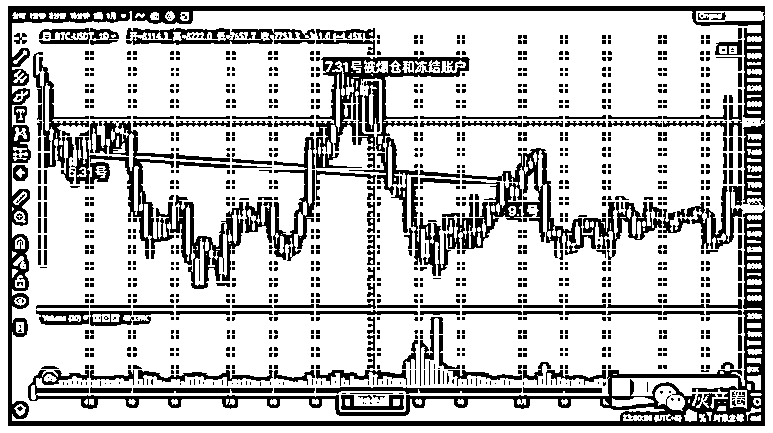
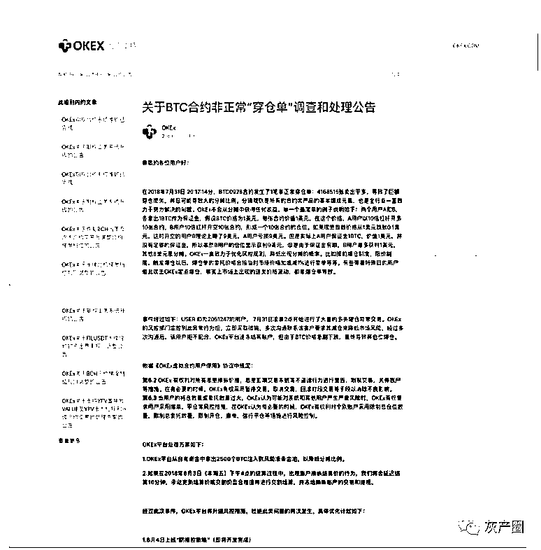

# OKex 竟然恶意冻结用户 5207 个比特币！！！

> 原文：[`mp.weixin.qq.com/s?__biz=MzIyMDYwMTk0Mw==&mid=2247531295&idx=3&sn=6cc0502239a4c74c555b9acd34a4f7a3&chksm=97cbb027a0bc39311d583befb43a4f33f804ec444ca8253d429ba992d6c3de25c816c75ce25b&scene=27#wechat_redirect`](http://mp.weixin.qq.com/s?__biz=MzIyMDYwMTk0Mw==&mid=2247531295&idx=3&sn=6cc0502239a4c74c555b9acd34a4f7a3&chksm=97cbb027a0bc39311d583befb43a4f33f804ec444ca8253d429ba992d6c3de25c816c75ce25b&scene=27#wechat_redirect)

今天，有位粉丝投稿，称在 OKex 交易所交（欧易）做合约交易，因盈利过多，被 ok 部门风控，声称恶意操作市场。你说一个个人账户也能操纵市场？是不是找不到好的理由还是耍无赖呢？爆了自认倒霉，盈利了属于恶意操作市场。大家直接看 OKex 账户被冻事件概述。 

本人杨秀春，身份证号 12*************，在 Okex 平台上进行合约交易，账户资金来自 8 户受害人家庭，由一个操盘手统一操盘。Okex 平台隶属于北京乐酷达网络科技有限公司，从事比特币等虚拟数字货币交易，法人徐明星。

**事件经过**

本人是 OKcoin 的老客户，从 2013 年开始接触比特币后一直非常看好比特币的发展，认为比特币目前最具有货币属性的特征，坚信比特币最终一定能成为数字黄金。同期在 OKcoin 平台上开户并进行比特币交易。

并于 2017 年在 OKcoin 转为 OKex 境外平台后转入 OKex 交易。因为看涨比特币，2018 年 6 月开始陆续在 OKex 平台存入 796 个比特币（见存币链接及附图）并从 6000 多美元开始以 20 倍杠杆买入比特币当季合约。

当时 OKex 并没有对仓位有任何限制。随后比特币一路上涨到 8000 多美元（见附图当时日 K 线图），本人用盈利部分继续开仓，最高时达到 5 万多个比特币的仓位时，OKex 风控部门打电话给本人，告知本人仓位太大让本人减仓，本人虽然非常不理解让本人减仓的理由，但本人还是按 OKex 的意思减到了两万多个比特币，随后本人发现第二名的仓位一直在增加到两万多个，而且比特币价格也在跌于是本人又开始继续买入，于 7 月 31 号又增加到 5 万多个比特币。

OKex 风控部门又打电话给本人，告知让本人减仓，本人同意并开始减仓，而后 OKex 不知何原因即毫无理由的冻结本人的账号（见附图账户被冻结证明）并自主快速地平仓本人的多头头寸造成比特币价格快速下跌，达到本人的爆仓价格从而爆仓。

**爆仓时本人的币币钱包尚有 308.86 个比特币，法币钱包尚有 209 个比特币（见附图钱包资产证明-录音截图及录音文字版）。因账号冻结无法登录故联系 OKex 客服，客服确认了钱包里的比特币数量并告知会予以返还。后再次联系，即告知不予返还钱包剩余的比特币。同时，账号被平台冻结前，本人合约交易的权益账户里尚有比特币 4690.8973 个比特币（见附图合约权益账户持仓证明），**因为后续账号无法始终无法登陆，随该部分的资产也被平台一并无故侵占，至今仍未返还。

1.存币链接及附图

https://btc.com/38iBycrVKwYja3iUu23Jcv2x8DRudJvgTd

2.K 线图

3.账户被冻结证明：

4.钱包资产证明。和 OKex 官方客服多次电话沟通，客服确认本人钱包账户里面有 517.86 个比特币。以下为沟通电话记录截图及录音文字版（可提供原录音文件）

OKex 官方客服电话录音文字版 4001600900  2018-8-3 16:40 呼出

您好，欢迎致电 OK 全球客户服务中心，OKex 温馨提示，数字资产具有较高的投资风险，请理性判断投资能力，审慎作出投资决策。法币交易请按 1，币币交易请按 2，合约交易请按 3，充值提现请按 4，账户安全设置请按 5，投诉建议请按 6，人工请按 0。

为了保证服务质量，您的通话可能会被录音，敬请谅解，正在接通中，请稍侯

OKex 客服：您好，请问有什么可以帮您？

我：你好，你们说好给我回电话的，没有回

OKex 客服：女士您好，请问您这边是什么样的问题呢？

我：我刚刚给你们打电话了，你们说好给我回电话的，说你们值班经理会半小时给我回电话，但到现在也没回过来。

OKex 客服：好的女士，因为我们这边接听您电话的客服可能是不一样的，就是说我这边需要了解一下，您是什么样的问题，然后让相关的人员给您回电的。

我：每一次都是这样，我给你们打电话，你都是每一次都要重新了解，然后说有人给我回电话，回电话又不回，我就重复循环的不断给你们打电话，永远都是得不到想要的结果。那我把身份证再报给你，你再查一下吧，120

OKex 客服：好的女士

我：120222197712281428，杨秀春。

OKex 客服：好的女士

我：杨秀春

OKex 客服：女士您好和您核实一遍，是 12022219771228 是吗

我：12281428。先是 1228，然后 1428。

OKex 客服：好的女士。

我：找到记录了吗？

OKex 客服：女士您的这个问题之前有提交过问题反馈吗？

我：你这边查不到吗？我有没有提交过你们不知道吗？

OKex 客服：好的女士，立马帮您查询。女士您好，很抱歉让您久等了，您这边是一个合约的问题对吗

我：嗯。

OKex 客服：好的女士，我这边立即帮您反馈给我们的值班经理，让他这边给您回电您看可以吗？

我：不用来这种套路了，你说前面那个人我给他打了半个多小时，他跟我说半个小时之内那个值班经理会给我回电话，结果呢？到现在还没给我回过来！

OKex 客服：女士确实非常抱歉，那我这边的话会帮您去反馈给我们的值班经理，那您的这个问题我们这边也是有记录的女士，请您放心，请您稍后保持电话畅通。

我：你们是在玩我吗？我前面就保持手机畅通了，我给你们那个客服打了半个多小时的电话，跟我说半个小时之内值班经理会给我回过来，那我现在我又打过来，你又是和我说值班经理会给我回电话过来，是不是又说半个小时打？有你们这么玩客户的吗？我现在四百多个比特币被你们冻着呢！

OKex 客服：女士确实非常抱歉了，那您的这个问题的话，我看到我们这边确实也有帮您去反馈，那因为我们这边因为可能问题确实是比较多的，那我们值班经理的话也需要分批次去处理的女士。

我：我只想问你一个问题，你是不是一定得要我们一大帮投资人赶过来才行？这个钱不是我一个人的，我跟你讲，前几天就已经所有的人就聚在一块了，本来前几天就想过来，你冻我账户。我现在已经等到今天下午四点钟结算之后我看一下结果怎么样，我再来处理，但你现在结果也不告诉我，现在什么结果呢？我账户里面还有多少币？你报给我。

OKex 客服：好的女士，那请问您这边您账户里面是什么币种呢？

我：比特币。

OKex 客服：好的女士。女士您好很抱歉让您久等了，那我这边查看到在您的钱包账户和在您的法币账户里面都是有您比特币的数量的女士，币是在的您可以放心。

我：多少

OKex 客服：女士您还记得您账户里面有多少币吗？和您核对一下。

我：至少 420 以上吧，因为我后来被你们冻了账户之后我就不清楚最新的那个数据了。

OKex 客服：女士我这边也帮您查看到了，**在您的钱包账户里面有 308.86 个比特币，在您的法币账户有 209 个比特币。**

我：等一下我记一下，钱包是吧？等会儿啊

OKex 客服：好的女士

我：等会儿我记录一下。钱包里面 308 点几？

OKex 客服：308.86。

我：308.86 比特币，然后呢？

OKex 客服：然后在您的法币账户里面有 209 个比特币。

我：法币账户里面 209 个对吧。那什么时候给我冻结呢？哦不是，什么时候给我解冻？

OKex 客服：好的女士，那这个确实是我们工程师这边冻结的，那我这边的话也需要去反馈给我们工程师，让他这边看一下帮你这边去优先处理一下，您看可以吗？

5.合约权益账户持仓证明

OKex 就此次事件发过单方面公告（链接和公告截图）本人对此有几点不同意见。

1\. 公告没有提到不予归还我币币钱包和法币钱包内的 517.86 个比特币，无理由扣下如此数额的比特币理应告知公众，让公众可以知情和判断，不告知是否是心虚的表现。

而且以公告所示的 6.2 6.3 条例也没有相关可以克扣任何客户资产的文字。

2\. 本人任何操作都是在规则范围之内，主观上也无任何操控市场的意图。如果有此意图，怎么可能用一个账号操作而不是多账号操作而做的更隐蔽。况且本人只是用 OKex 平台 APP 手工操作并没有用 PC 客户端或 api 接口。本人只是看多比特币一路加仓购买而已，就是这么简单的一个思路。难道看涨比特币也是操控市场？如果我能操纵市场的话，是不是可以这样理解，我用 20 个账号做的话，每个账号开仓只要 2500 个比特币，那样我就能盈利并全身而退了，比特币市场是这么容易被操控的？

3\. 如果说客观上造成了一定的市场风险，那也不是我的责任，而是平台的仓位管理有问题，否则平台也没必要在事后调整了仓位限度。平台方的过错为什么要由一个本无任何恶意的客户来承担。我只是简单的看涨比特币而一路买入而已，何错之有。

4\. OKex 风控存在严重误判和失职，OKex 风控部门打电话给我让我减仓，我同意并开始减仓，为何还要冻结我账号并自主给我快速平仓，如此大仓位快速平仓必然会造成价格快速下跌并造成爆仓。对此我有警告过，可 OKex 风控感觉根本无法理解。如果当时让我自己减仓，也许根本不会造成最终的爆仓。（公告描述：但由于 BTC 价格急剧下跌，最终导致其仓位爆仓。真实情况是 OKex 快速平仓我的多头头寸造成价格下跌而爆仓）

5\. 当时仓位第二名也有 2 万 2 千多个比特币，估计是空头仓位，OKex 为何没对他做出任何限制，而只是对我的账号冻结并快速平仓。是否可以猜测此仓位是平台或关联方所有。此仓位在我爆仓后获利平仓。

6\. OKex 完全没有不讲理，完全不提供任何沟通渠道，任何决定只是电话通知，不接受任何反驳，行为极其霸道。

7\. 不要说赚取手续费的撮合交易平台，就是境外目前的外汇对赌平台都是客户盈利完全给付，在规则范围内也绝不会干预客户交易，OKex 作为一个赚取手续费的撮合平台（仅在 2018 年 7 月在本人的交易记录中，OKex 平台便已经赚取了本人 800 多个比特币的手续费！），居然肆意强平客户仓位，抹去客户账号，黑掉客户钱包资产，天理何在。

公告链接

https://www.okexcn.com/support/hc/zh-cn/articles/360011932992-%E5%85%B3%E4%BA%8EBTC%E5%90%88%E7%BA%A6%E9%9D%9E%E6%AD%A3%E5%B8%B8-%E7%A9%BF%E4%BB%93%E5%8D%95-%E8%B0%83%E6%9F%A5%E5%92%8C%E5%A4%84%E7%90%86%E5%85%AC%E5%91%8A

这种盈利封禁账户行为一般都是小交易所手段，难道 ok 也输不起了。还是说另有内情，熊大也希望 OK 能出来把这个事情解释清楚。 

来源：资金盘排行

← 向右滑动与灰产圈互动交流 →

