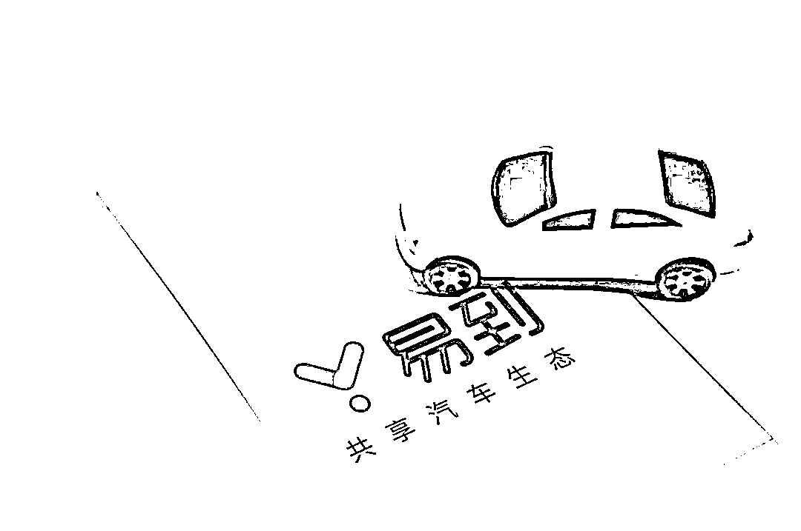
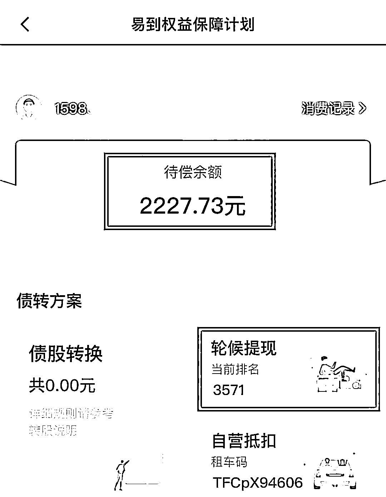
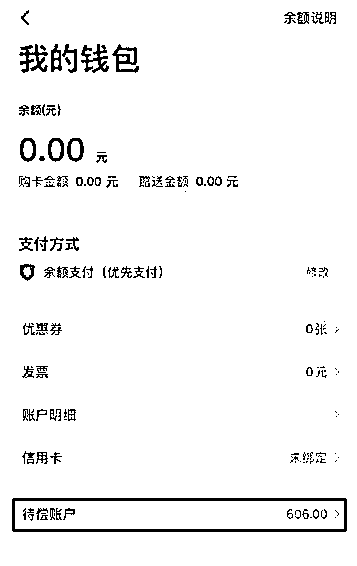
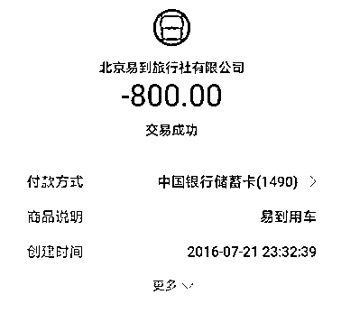
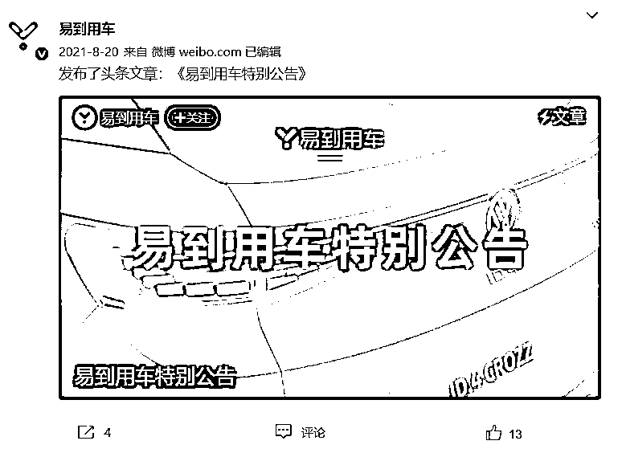
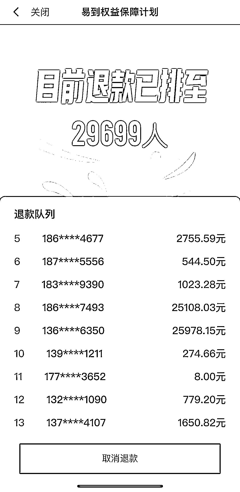

# 突然无法登录！近 3 万人排队退钱，男子懵了：充值 2000 多，这个 APP 在搞啥

> 原文：[`mp.weixin.qq.com/s?__biz=MzIyMDYwMTk0Mw==&mid=2247531295&idx=4&sn=0c62abc9885181bfc740ffad5899e3c8&chksm=97cbb027a0bc3931bf8ae2822656ba1b15524ddb0bccae2421fa5444e9df32ff3670b2ebe3ff&scene=27#wechat_redirect`](http://mp.weixin.qq.com/s?__biz=MzIyMDYwMTk0Mw==&mid=2247531295&idx=4&sn=0c62abc9885181bfc740ffad5899e3c8&chksm=97cbb027a0bc3931bf8ae2822656ba1b15524ddb0bccae2421fa5444e9df32ff3670b2ebe3ff&scene=27#wechat_redirect)

**✦ 网上叫车，软件强制收取预付款？
✦ 充值 2000 块后，账户却被清零，客服还联系不上?** 

****✦ 近 3 万人申请轮候提现，软件无法登录？****

****这个打车软件在搞啥？****

****想干嘛？****

********

****近日，记者发现，在黑猫投诉平台，对一款名为“易到用车”的投诉名列前茅。相关投诉高达已有 1600 余条，而其官方回复率仅为 17%。****

********

******充值 2000 元******

********退款半年 毫无音信********

******据浙江台州的冯先生介绍，他最早是用第三方打车软件叫到易到 APP 的网约车，用了几次后干脆直接下载易到用车的软件。****** 

******登录易到用车 APP 可以发现，为了吸引用户，推出许多优惠政策，例如充值 100 元送 100 元之类的，于是，冯先生在这款 APP 上先后总共充值 2000 多元。******

********“充钱以后，金额其实并不便宜，感觉平台变向提高了打车价格。”********

******冯先生表示，大概在两年前得知易到平台不行了，且用该软件都叫不到车子，就一直非常担心自己充的钱还能不能要回来。******

******半年前，平台推出易到权益保障计划，可以申请退回账户费用，冯先生随即提出申请。******

************

******从上面这个截图来看，冯先生排在第 3571 位；现在半年时间过去了，这个数字没有任何变化，钱也一直没有退回来。据了解，**目前排队人数已经上涨到近 3 万人**。******

******客服无法联系******

********账户还被清零********

******与冯先生一样，北京的贾先生也有相同遭遇，他说自己账户都已经被清零了。******

********“在易到用车 APP 上充值了几次，因经常会叫不车，所以在余额还剩 606 元时申请退款，不仅钱没退回来，还擅自转为待偿金额，一直无法联系上该公司。”********

************

******贾先生申请易到权益保障计划后，半年过去了，同样也是毫无音讯。******

******上海用户徐女士表示，前几年充值 800 元进易到软件，只用过几次，后来发现通过软件难以叫到车，后就申请退款；目前的状态是无法退款，只能通过维权平台投诉。******

************

******徐女士表示，由于易到打车难的问题一直得不到解决，再加上前段时间突然无法登录易到软件，打开就是空白，所以想退款……却联系不上客户。******

********“我账户里的钱还剩 500 元不到，问题是现在如何才能退回我的钱？去哪里找易到这家公司？这家公司是不是已经不存在了？”********

********有近 3 万用户****申请轮候提现********

******据了解，早在 3 年前******

******易到用车也出现延期提现******

******甚至无法提现的问题******

******从 2018 年 8 月开始，司机们通过易到平台开网约车所赚取的佣金陆续无法提出，这些佣金（单人）或高达十几万。******

******易到用车最初以返现形式“引导”用户进行充值，由于近年来打车费的不断提高，该平台有时根本打不到车。****** 

******易到用车官方微博显示，去年 8 月 20 日，易到用车发布《关于用户余额及待偿账务解决方案的公告》。******

************

******公告提到，易到针对历史遗留的账户余额问题进行全面规划及制定解决方案，并于 2021 年 9 月 9 日设立专门的“待偿账户”，对余额及待偿账务问题进行专项解决。******

******这个“易到权益保障计划”主要通过商城消费、自营抵扣、债股转换和轮候提现的方式逐步兑现用户的所有权益。******

******根据退款客户反映来看，所谓的商城消费和自营抵扣都是一些高价的兑换商品，故而用户选择最多的就是轮候提现的方式。目前，平台上提现排队的用户达到了近 3 万人。******

************

******记者尝试拨打易到用车出行及代偿账户客服热线：010-64258988 以及 010-57165132，直接显示您呼叫的电话忙，处于无法接通的状态。******

******所以，目前易到用车推出的权益保障计划，到底能否满足用户的合法权益尚不得而知，我们将持续关注！******

******来源 ：钱江晚报、城市汽车通、潇湘晨报******

************

******← 向右滑动与灰产圈互动交流 →******

************