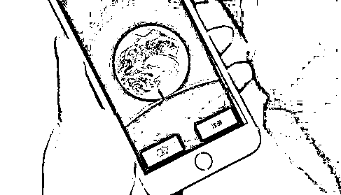
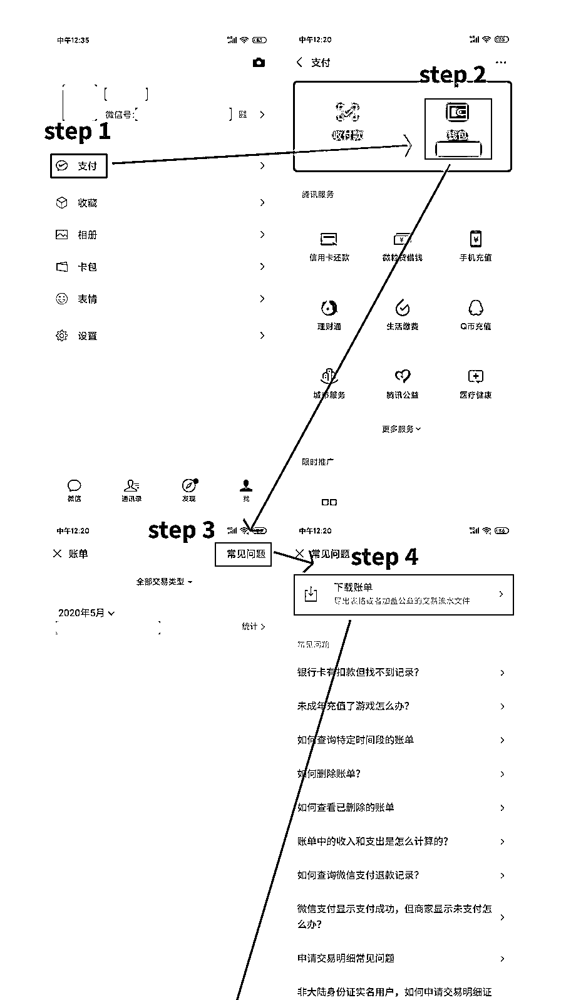
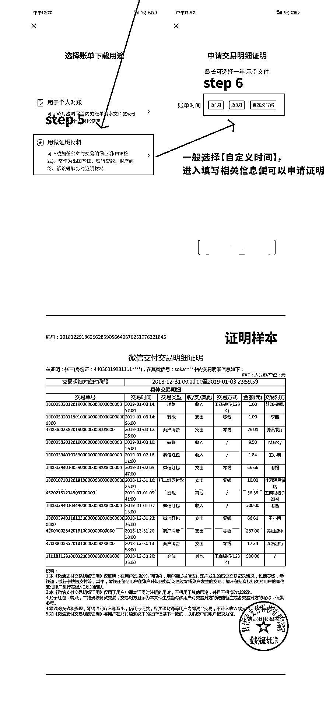

# 用聊天记录当证据，对方改了微信号怎么证明他是他？来看看这 4 条建议

> 原文：[`mp.weixin.qq.com/s?__biz=MzIyMDYwMTk0Mw==&mid=2247531295&idx=5&sn=20c3b5cd6dfca2557772262c2a44a7c9&chksm=97cbb027a0bc3931e58d7c128a59506b9befdc32b23c7357986502d5e768b53a0bef2c22affb&scene=27#wechat_redirect`](http://mp.weixin.qq.com/s?__biz=MzIyMDYwMTk0Mw==&mid=2247531295&idx=5&sn=20c3b5cd6dfca2557772262c2a44a7c9&chksm=97cbb027a0bc3931e58d7c128a59506b9befdc32b23c7357986502d5e768b53a0bef2c22affb&scene=27#wechat_redirect)

**如果别人是在微信上问自己借的钱**

**只有聊天记录，没有借条凭证**

**打官司时要怎么办？**

**微信上借钱给别人**

**但转账记录找不到了**

**要怎么提交电子证据？** 

****

**遇到以上这些情况不要慌**

**有方法**

**但首先要提醒的是**

**千万别做以下两件事**

****👇****

****#**案例一**#****

******“他欠我钱是事实，我自己写张借条去起诉！”**********去年 7 月，候某通过微信向杨某借了 1.5 万元，两人在微信中约定了利息和借款期限，并通过微信转账方式交付了借款。因借款到期后，候某并未归还，杨某于是起诉到长兴法院，要求候某还钱。********害怕只有微信聊天记录及转账记录，不足以证明借款事实，杨某于是自己冒用候某的名义书写了一份借条，作为证据提交法院。最终杨某因伪造证据，妨碍诉讼受到惩戒。****

****# **案例二**#****

******“转账记录找不到了，就对法院说是现金交付吧！”**********今年 4 月，冯某拿着一张 10 万元的借条向长兴法院提起诉讼，称自己借给朋友王某 10 万元用于经营所需，但多次催讨都没要回，请求法院判决王某归还借款本金及支付利息。********立案时，冯某在《民间借贷案件事实申报与承诺书》上载明“以现金形式交付 10 万元”“王某未归还过借款本金”等。案件立案受理后，法官询问了冯某现金的来源。冯某却当即表示不是现金交易，是通过微信转账形式，但微信转账记录已经丢失，怕官司出现问题，所以干脆就说是现金交付的。********在法官释明虚假陈述、虚增债务的法律后果后，冯某坦白自己实际通过微信转账形式只向王某转了 6.6 万元，且王某已归还 1.15 万元。最终冯某因虚增债务、虚假陈述，破坏诚信诉讼原则受到惩戒。****

*******法官说法*******

****随着互联网时代的发展，电子证据早已从原先审判实践中的“边角料”变成现在的“主角”。微信聊天记录、支付软件的转账记录也已成为名正言顺的电子证据。****

****以上两个案例中的原告，本可以合理使用电子证据进行诉讼，却因害怕证据不充分而自作聪明，擅自伪造证据、虚假陈述。尽管，他们认为自己只是“换个说法”“换种形式”，并没有捏造借贷的事实，但诉讼非儿戏，法庭之上容不得虚妄，司法权威也不容挑战。****

****************

******用聊天记录当证据******

******对方改了微信号怎么证明他是他？******

****值得注意的是，微信作为证据使用的前提是需要证明微信号是对方使用的。以前微信号无法更改，可以有效锁定对方的身份信息。****

****但现在，微信号可以更改了，如果债务人为了逃避债务，可能会在庭审之前修改自己的微信号，并对借款事实进行否认，这样就很可能导致当事人起诉时向法庭提交的证据与实际的微信号无法对应。****

******为避免以上法律风险发生，建议：******

****1、在民间借贷往来中，尽量通过签字、盖章达成书面协议，如果只有微信聊天记录等电子证据，要借机向对方索要身份证、营业执照、银行卡、手机号码等可以证明对方真实身份的信息。****

****2、对于已经绑定过手机号码的微信号，可以通过验证绑定的手机号码确认该微信是否为其本人使用。手机号码采用实名制，在微信的添加用户框内输入该手机号，搜索结果会出现该微信用户，即使用户更改过微信号，也会出现相同的搜索结果。可对全过程进行录屏。****

****3、翻阅聊天记录，查看双方之前的聊天记录能否固定案件事实。如果不能固定案件事实，可以通过微信聊天或者电话录音等方式再次确认借款事实的存在。****

****4、若微信号已经修改，并且对方也不承认，且聊天记录内容又无法锁定对方身份，此时可以申请法院致函第三方机构即腾讯公司，或者由律师持调查令前往腾讯公司调查微信用户的实名认证信息。****

****************

******如何让微信聊天记录******

******成为有效的诉讼证据呢？******

******1******

******如何保存和固定微信聊天证据？******

******1.妥善保管原始载体。**养成备份聊天记录的好习惯，如果手机换新或者存储空间不够了，可以提前在计算机上备份一份聊天记录。****

******2.视情况使用“腾讯电子签”功能。**近期，微信官方推出了名为“腾讯电子签”的小程序，主要用于管理各种收据、签订租房合同等。通过该小程序签订电子合同，签约过程和结果都会通过区块链技术全程固定保存，最大程度消除了被篡改的可能性，也避免了证据丢失问题，确保了证据的安全。（🔗[点击查看详细内容](http://mp.weixin.qq.com/s?__biz=MzA3MjQxNzQ2Mw==&mid=2649556068&idx=1&sn=13c509b917b887f4b512d52a5101cacb&chksm=87070dbcb07084aae2d968d3b7b2db9ac10e83359d13b145ff019a4fe92113ca300738b1581a&scene=21#wechat_redirect)）****

******2******

******开庭前如何提交微信聊天记录的副本？******

******1.提交双方个人信息界面。**个人信息界面包括微信头像、昵称、微信号、地区等信息，可以帮助判断当事人身份的真实性。****

******2.微信聊天记录提供完整。**提交微信聊天记录时必须完整不间断，不能只截取对自己有利的部分，语音要转化成文字，视频要用光盘等存储设备保存。****

******3******

******开庭时如何向法官和对方当事人展示证据原件？******

****根据法官要求，使用保存微信聊天记录的设备登录微信，展示双方个人信息界面验证身份，展示聊天内容证明证据真实性，对语音、视频、图片、转账信息等内容打开展示。此举是为了确保演示身份和内容的真实性。****

****************

# ******这样导出的微信账单明细******

# ******可以作为“打官司”的证据！******

****具体的操作流程可参照下图：****

********

********

****最后，建议在提交转账明细作为证据时，将双方涉案往来的转账明细用荧光笔标注，方便法官审查。****

****此外，在诉讼过程中，除了提交以上的微信转账明细证据外，还需提供双方完整的微信聊天记录截图或者通话录音等证据，证明双方存在借贷的事实，以形成完整的证据链。****

****来源：豫法阳光、长兴县人民法院、浙江天平、法律一讲堂、利箭在行动****

********

****← 向右滑动与灰产圈互动交流 →****

********