# 在推特上，大把的“药娘”在卖援交视频谋生

> 原文：[`mp.weixin.qq.com/s?__biz=MzIyMDYwMTk0Mw==&mid=2247531332&idx=1&sn=74fcfd7ec174660f5429e218f5e9b05f&chksm=97cbb07ca0bc396a2568ca5879774ce17e1a01ef5d13be3b2b7656a46c703594557b421e7322&scene=27#wechat_redirect`](http://mp.weixin.qq.com/s?__biz=MzIyMDYwMTk0Mw==&mid=2247531332&idx=1&sn=74fcfd7ec174660f5429e218f5e9b05f&chksm=97cbb07ca0bc396a2568ca5879774ce17e1a01ef5d13be3b2b7656a46c703594557b421e7322&scene=27#wechat_redirect)

我们总说世界上只有男人和女人两种，可事实上远不如此。

从呱呱坠地的婴儿，到耄耋之年的老者，每个人都离不开药。

对药娘来说，药是扭转自己性别的前期工具。

**胸部隆起，生殖器失去功能并停止发育，从外观上向女性靠拢。**

药娘，指的是通过抗雄激素和雌激素与孕激素药物将男性性征女性化的群体，且未成年人居多。

中国的药娘，多数藏在不为人知的社会夹缝里，离每个人的生活很远又很近。

和药娘的接触始于 2020 年 6 月，在某不知名网站上，小悦留下了自己的《药娘日记》。 

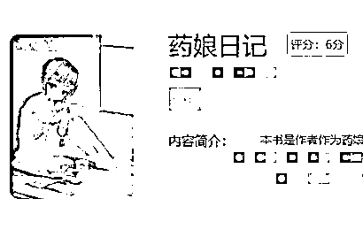

由此，我开始小心翼翼地认识他们。

**糖的故事** 

一千个人心中有一千个哈姆雷特，一千个药娘心中有一千个成为药娘的理由。

或许是因为家庭环境，或许是因为校园暴力，或许像我加入的药娘群成员一样，他们只是简单地认为，自己本就该是女生。

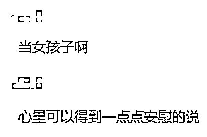

每一个艰难的故事开局，往往都隐藏着伤疤。当你想要详细询问她们具体缘由的时候，她们就会转移话题或者闭口不谈。

**有成为药娘的决心只是第一步，想要成为药娘，药是必不可少的一环。**

买什么药？去哪买药？剂量是多少？在信息时代这些问题都好解决。

千禧年之初，药娘乘着贴吧的风潮兴建了“药娘吧”。

在“药娘吧”里，你经常可以看见性别难辨的吧友留下的帖子。所有关于药的疑问，在这里都能得到解答。

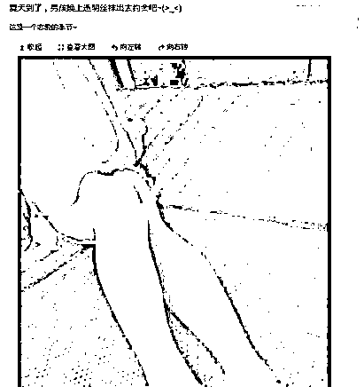

在药娘圈里，她们更喜欢称药为“糖”，似乎这样就能缓解药物和人生的苦味。而在青春期吃糖，则能获得最大的药效。

糖一共分三大类：

**雌激素、抗雄激素、孕激素。**

三类药物有肌肉注射、体表贴剂、吞服等多种类型，其中吞服类药物效果最好。

雌激素用于促进雌性第二性征发育，代表药物有色谱龙、螺内酯。

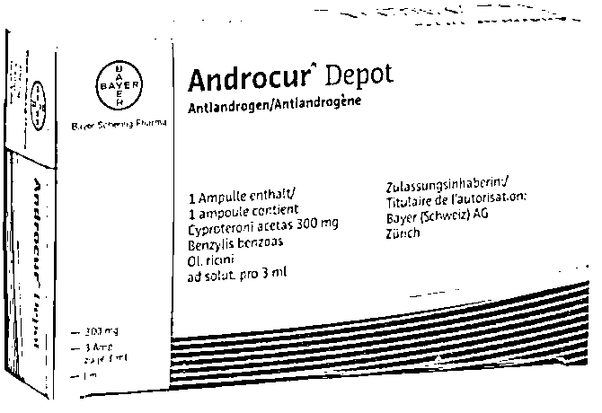

色谱龙，因为它的【不良反应】是男性胸部女性化，所以受到药娘们追捧

抗雄激素负责降低雄激素水平，让身体尽量避免发育男性特征，同时使雌激素更好地发挥作用，代表药物有补佳乐、诺坤复。

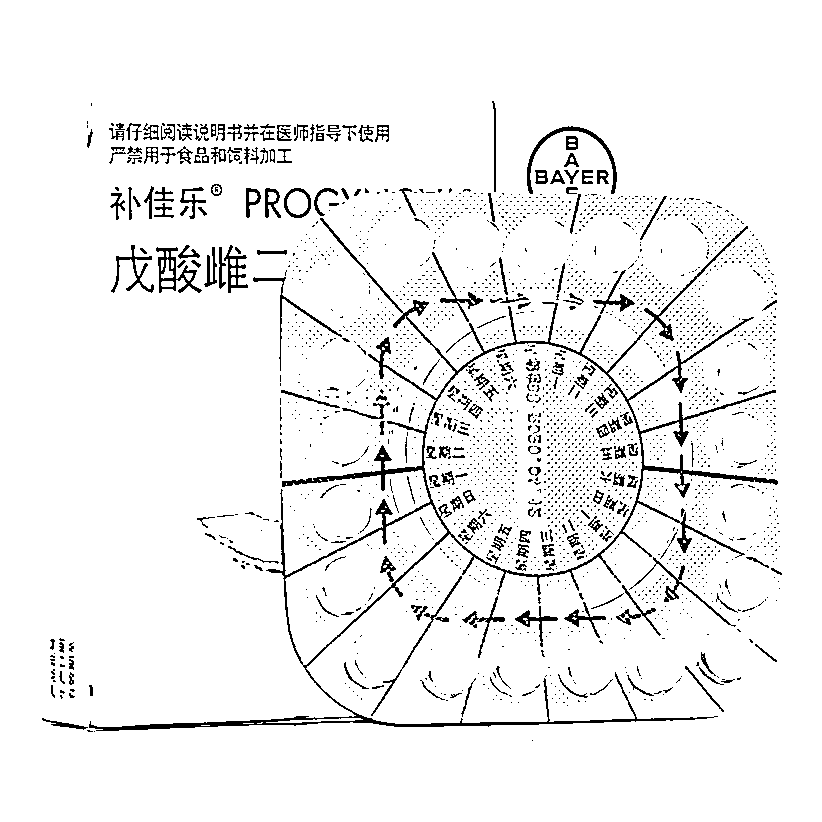

补佳乐：用于治疗雌激素缺乏

孕激素则具有软化胸部和促使胸部神经敏感的效果，对药娘日后变性及性生活有所帮助，代表药物有黄体酮和妈富隆。

琪宁黄体酮：原用于推动女性第二性征发育

而这些药物，无一例外，全部是 Rx（处方药，必须在医生指导下服用） 。

隐瞒身份的药娘，想要买到“糖”有以下几种方式：

1、线下自购

2、熟人

3、电商黑市

如果选择线下自购，那就得各凭本事。不是每个人都能找到监管宽松的药房。

要是选择去医院开一份程序复杂的跨性别诊断证明书然后去药房取药，往往会让药娘暴露身份，这与药娘隐瞒身份的初衷背道而驰。

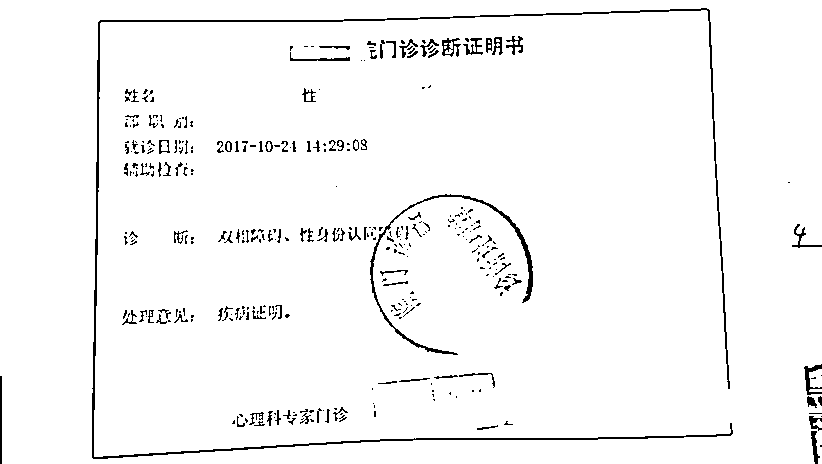

性身份认同障碍诊断证明书

而第二种购药方式——“熟人”途径，则比较好理解，就是跟圈子里的朋友、QQ 群的群主或者贴吧的网友等人购买。

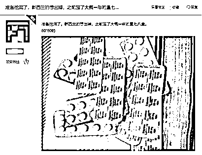

有时可以遇到变性前的药娘卖药**，挖洞即指变性手术**。

不过通过熟人购买依然需要承担巨大的风险，假药商随处可见。

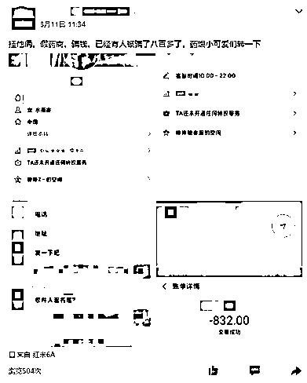

于是电商黑市应运而生。

秋名源本是其中做得较好的一家，药娘圈子开玩笑称其为“药娘领袖”。

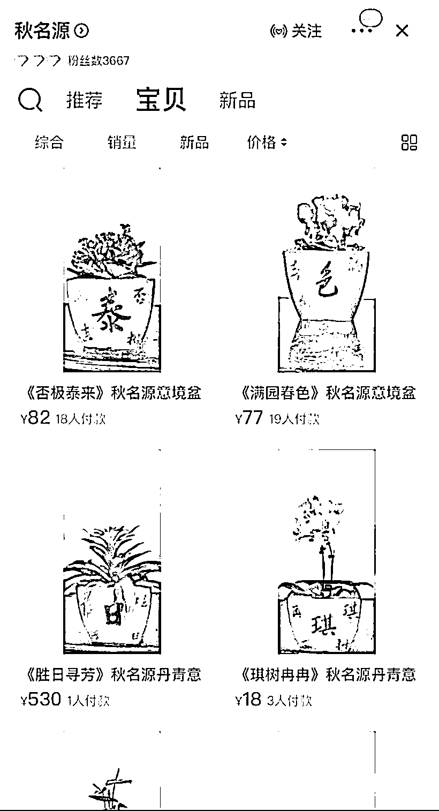

看价格，我说是普通花盆你信吗？

外表上看，这是一家盆栽店，但劣质的花盆和简陋的植物，配不上至近 2000 元的售价。

药娘们也不会在意盆栽外表，她们关注的是花盆上的字，那是圈内约定俗成的暗号，按照同字、谐音，分别代表不同的糖果：

**否极泰来=泰国补佳乐**

**国色天香=国产色谱龙**

**琪树冉冉=琪宁黄体酮**

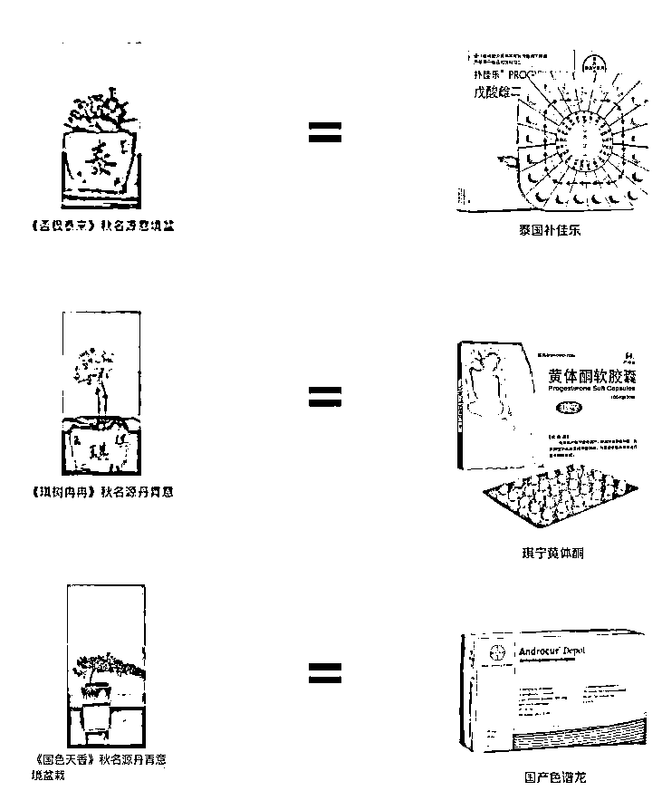

物极必反，秋名源因为出货量大，它的药品质量不仅受到了怀疑，这家店也被推到了舆论的风口浪尖，没多久就被封禁了。

但有需求就有市场，秋名源的商品具有极大的诱惑力，甚至已经不被价格所束缚——电商平台压根就没有药店卖色谱龙等药物。

所以没过多久，秋名源二号店开张，并且“拓展业务”，反而开始售卖书法作品——同样是看字买药。

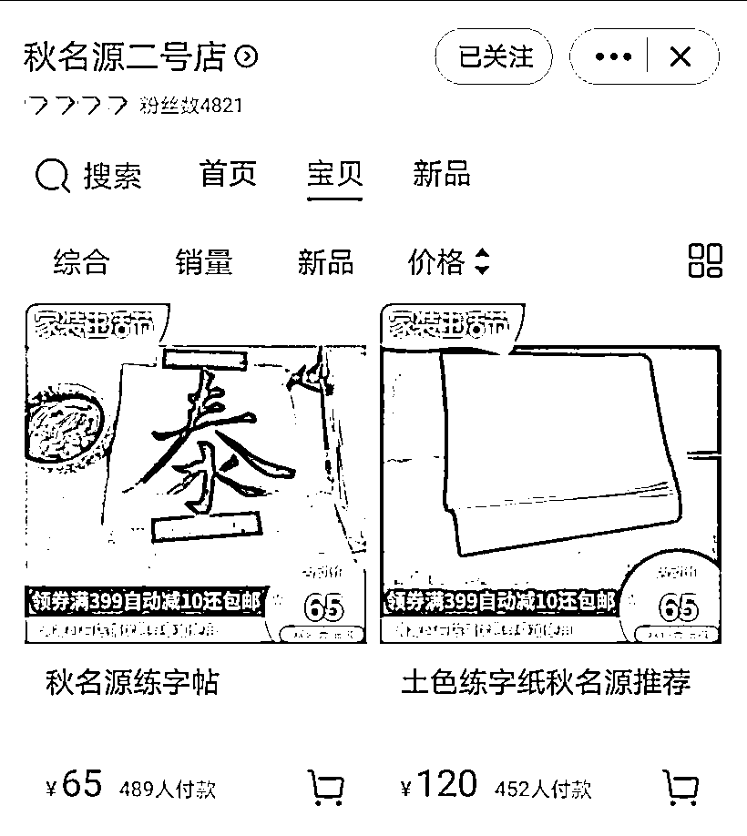

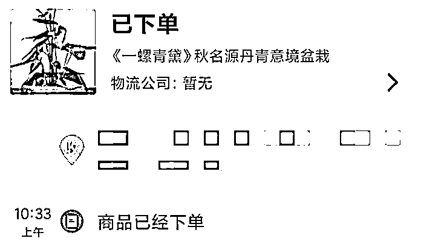

吃糖，又或者说吃药，药娘们因为没有医嘱和处方，就胡乱喝下了药物，导致产生了众多副作用，如**血糖偏高、头痛恶心、胸部疼痛甚至泌乳**等。

正确的吃糖方式，是先吃抗雄药物降低雄激素水平，之后服用雌激素促进女性性征发育，孕激素在此时用于辅助，优化女性特征。

站在镜子前，最明显的变化就是胸部的隆起。同时，性器官略微萎缩并很难勃起，不过相对的，皮肤白皙、肌肉脂肪变化明显。

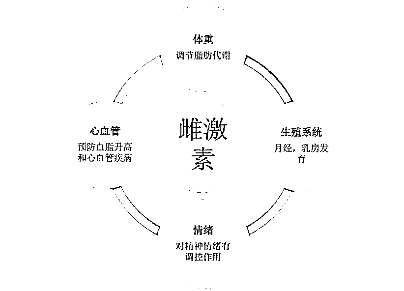

但王家卫说：这世上有一种鸟，它生来就没有脚，一生都只能在天上飞，它累了，就睡在风里，这种鸟一辈子就只能落地一次，那就是它死的时候。

药娘正是那只无法回头和落地的鸟。故事案件，敬请关注。药娘断药后需承受极大代价，他们会有很大几率丧失性功能，且因无医嘱长期服用激素药物以及并发的抑郁症，让寿命缩短。

今朝有酒今朝醉，这或许是一种美好的生活态度，但当下社会并不会对她们网开一面。

2014 年左右，百度贴吧掀起扫黄大潮**，诱导未成年人吃糖的药娘吧，被冠上色情敏感的名头率先沦陷。**

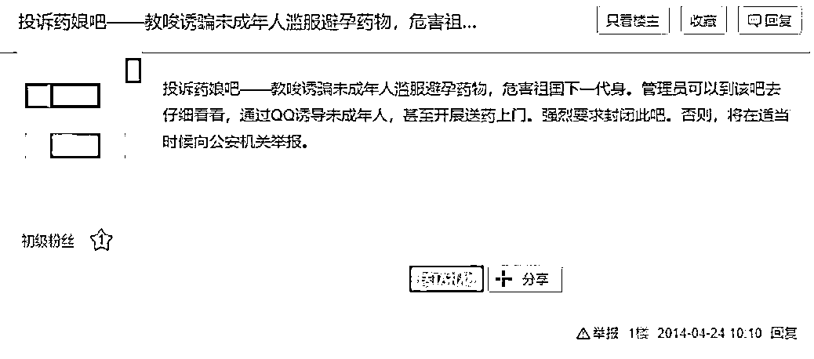

当知乎成为贴吧后的新世代社区时，知乎上曾出现众多相关话题，但到了 2018 年 3 月左右，药娘一词也成了敏感词，在知乎几近绝迹。

现在的她们从一个大群体变成了一个又一个 QQ 群，在互联网的偏僻角落扎根。

网络上的困境远不及她们的现实生活。胆敢暴露在现实中的药娘，会被八方舆论碾成尘埃。

**药娘们迷茫的未来**

当性征发生变化的时候，药娘一方面使用裹胸等方法对身型进行掩饰，另一方面对隐私空间的需求更加迫切。

一旦被发现，他们就会迎来外界一边倒的抨击和抵制，家人也不例外。

联合国开发计划署 2016 年发表的《中国性少数群体生存状况》中指出，中国性少数群体在家庭被歧视的发生率最高。

而作为 LGBT 中的 T（Transgender，跨性别者）在发达国家的生存状况较好，但在国内属于极度弱势的群体。

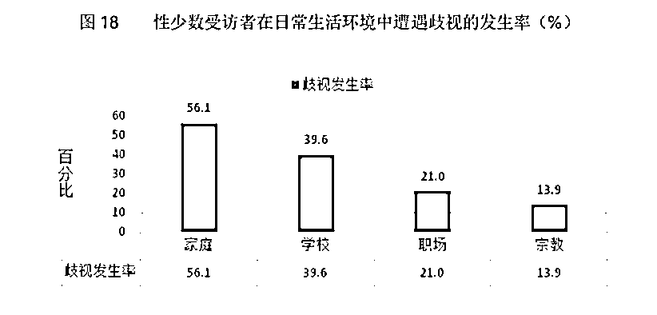

澎湃新闻曾报道一事件。还是男生的时候，罗月（化名）在家里最常听到的话就是“你是男生，所以你要......”，望子成龙的巨大压力让罗月身心俱疲。

再加上本身对男性身份的不认同，于是在 18 岁的时候，罗月吃下了第一粒“糖”。

来源于澎湃新闻

家人试图阻止罗月吃糖，失败了，于是家人扭送罗月进行了心理治疗。心理治疗失败后，家长的怒气就发泄在了罗月身上。

看不到希望的罗月，最后选择了反抗。

2018 年，罗月 20 岁，自己跑到了小诊所里做了变性手术，手术时出现意外，手术部位的缝合线断开，重新缝合后，刚过一个星期，创口因为缝合线的原因开裂，疼痛锥心刺骨。

罗月现状我们无法得知，但许多药娘的命运则更加悲惨。

**有些药娘的变性手术，更像是人体器官损毁仪式。**

光明网曾报道过一个事件，2011 年 8 月，性别认知为女的张浩在某个群里认识了网友姜某，姜某表示他可以满足张浩切除睾丸变性的想法，迅速谈定了价格 1000 元。

手术在浦东某旅馆进行，做到一半时，姜某去买必需的纸尿裤，回来发现张浩自己动手切开了睾丸两侧血管，导致大出血，便立即送医。

之后张浩丧失生育能力，姜某被定性为非法行医罪。该事件被各大媒体争相报道。

在这两年，这类作坊手术并没有消失，反而变本加厉。

齐鲁晚报报道，2018 年 4 月，小斌在某个药娘群里认识了网友小俊，以 6000 元的价格让小俊主刀为她进行睾丸切除手术。

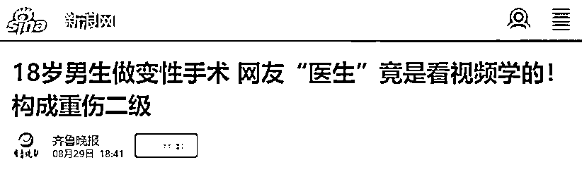

经过了一个小时的手术，小斌的睾丸被摘除。但是，这件事很快被小斌的父母发现，绝望的父母报了警。

药娘、家庭、未来，当三个词组在一起，便是生命不可承受之轻。

成年药娘的艰难生活可见一斑，未成年药娘的生活更加狼狈不堪。

你有没有想过，隐瞒身份的未成年药娘，买药钱从哪里挣来的？

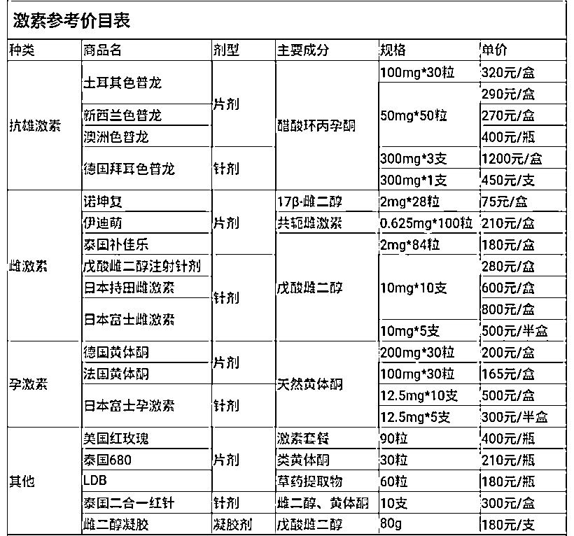

推特糖果市场 9 月 22 日行情，外网手续费高

**人间失乐园**

**“认识的群友里，一个是家人给的零花钱很多，还有听说就是****做援助交际****。”**小 E 是药娘圈子里的独行侠，没有深入到圈子内部，但也清楚基本状况。

在生活逼迫下，她们想尽一切办法赚钱：

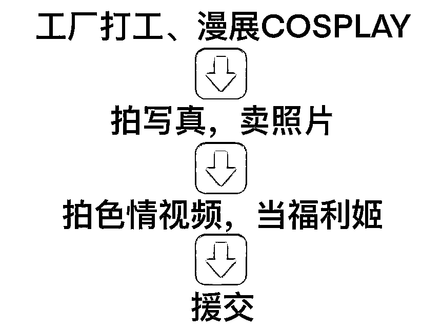

在《药娘日记》里，逃离家乡的小悦就先后做过电话客服 、工厂员工，然后被一个人“收留”，接着便发生了如上的事件，幸运的是逃离了魔爪。

对外人来说，药娘未成年的身份让资本很难榨干她们的价值，只有铤而走险的黑中介才敢浑水摸鱼。

他们认为药娘最值钱的，就是身份。

有人在药娘群卖药娘援交视频

在国内，你也很难看到药娘和援交相关的新闻。

但在推特上，大把大把的药娘在谋生。

小乳鸽似的胸脯，和男性性器官形成强烈对比。

在国内，有很多人愿意为药娘的一夜买单。而黑中介也能赚得盆满钵满。

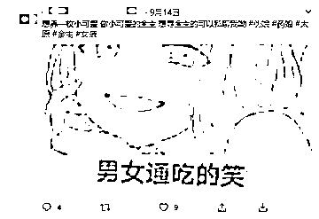

药娘圈子和二次元圈子在 COSPLAY 领域相交，有的药娘会兜售自己的 COSPLAY 照，胆子大一点的，会放一些更大尺度的照片。

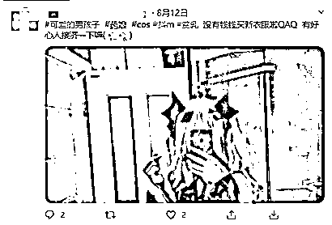

但卖照片总归是来钱慢，一次线下的钱色交易，少说可以换来六七百元，足够买好 5 盒土耳其色谱龙，按每天 50mg 来算，可以吃 300 天。

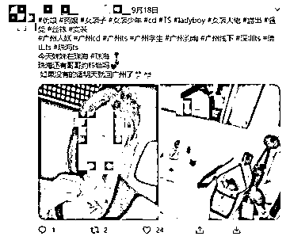

援交的药娘中，很多人中学辍学，普遍学历不高，只能通过性交易换取赖以生存的金钱。而换来的钱都还给了“糖果”和变性手术。

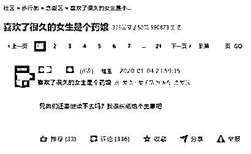

或许到最后，也有一些药娘，最后如愿以偿地过上了平凡的生活，偶尔也会出现在你的生活里。

抑或是一些像小 E 一样独立自强的药娘，尝试顶着压力向上生长。有人鼓励、接纳她们，自然也有人厌恶、歧视她们。

各式各样的眼光，像雨水渗透土地一样，渗透到她们每一寸的生活里。

她们的未来是怎么样的呢？只有时间才能给出答案。

来源：我不是一条鱼，不惑先生

← 向右滑动与灰产圈互动交流 →

