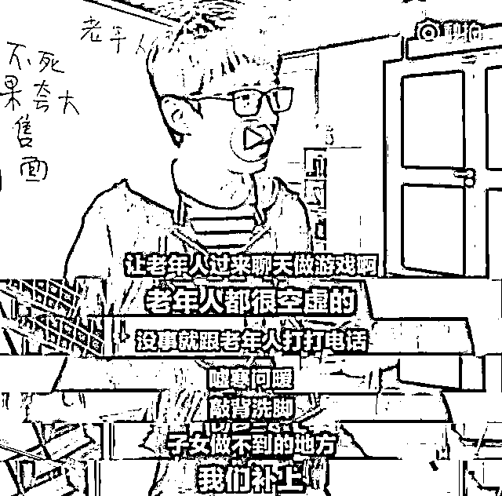

# 真人口述：我是怎么骗老人买保健品的？

> 原文：[`mp.weixin.qq.com/s?__biz=MzIyMDYwMTk0Mw==&mid=2247531332&idx=3&sn=66d4405a118c3427a84a5a11e656dc25&chksm=97cbb07ca0bc396a3898ca711a64f3b91d454a58bb1f541c65102b7c364fd73f96fdb802c4b1&scene=27#wechat_redirect`](http://mp.weixin.qq.com/s?__biz=MzIyMDYwMTk0Mw==&mid=2247531332&idx=3&sn=66d4405a118c3427a84a5a11e656dc25&chksm=97cbb07ca0bc396a3898ca711a64f3b91d454a58bb1f541c65102b7c364fd73f96fdb802c4b1&scene=27#wechat_redirect)

老年人购买保健品似乎是一个逃脱不了的魔咒，随手在网上一搜，每个月都有无辜的老人受骗……

**真人口述：**

**我是怎么骗老人买保健品的？**

一个男人大力推开门，将保健品狠狠地甩在桌上。

“你要再敢来我家一次，我拆了你！”说这句话时，男人正指着我鼻子。

我认识他，是旁边小区一位退休大爷的儿子，那套保健品价值 8000 多元。

“养生馆”同事见多了这种场景，并没有和男人过多肢体冲突，频频道歉送他出了门。

这件事也不会对“养生馆”有影响，这天还有“养生专家”来讲座，有一批老人来领鸡蛋，还有很多事情等着我准备。

**洗脑**

2015 年 1 月，一家来自浙江温州的“生物科技”公司在我就读的中医药大学校招，招聘面试官并没有告诉的是，这是保健品销售。

与公司签约后，我和同伴们被温州总部安排在雁荡山参加了为期一周的封闭式培训。这段培训“类似洗脑”，每天早上 5 点起床晨跑、喊口号、户外拓展、分组竞争。

培训过程中，负责人不断强化一个概念——公司卖的保健品只是个媒介，我们要给老人“带来健康和陪伴”。

不断有公司“老人”讲述自己的经历，描述团队氛围好、上升空间大等一系列的前景。他们不过二十七八岁，工作不过四五年。

一位女员工说她不到 5 年便实现了全款买房的小目标，“我一个女孩子都能做到！你们男生凭什么不能？”

这句话如激将法一般激起了我们的斗志，也让我对未来充满了期待。

培训过后，我又被送到义乌一家已经开了 6 年以上的“养生馆”去学习。在那里，有购买保健品长达 5 年以上的老人，有每年会购买数万元金额的老人。老人们甚至会非常仔细地给其他正在犹豫的老人分析，保健品到底有哪些好处。

那些长期购买保健品的老人内心很可能并不认可保健品，但他们需要自我认同和自我辩解，当别人问起他保健品好不好的时候，为了维护面子，老人一定会说好。没有老人愿意承认自己傻，“如果说不好，这不是打自己的脸么？”

我被公司洗了一遍脑，再被这些老人洗了一遍脑，对保健品的神奇疗效几乎深信不疑。

发传单、拉人进店、团购、送礼品、老“顾客”教育新“顾客”、重点发展的顾客类型……小 K 的会议记录上都有流程。

**保健品销售员要掌握的“话术”**

**拓荒**

2015 年春节后，我和几位同事被派到浙江嘉兴“拓荒”，要建立起一家新的“养生馆”。

“养生馆”挑在了一个老小区，这里老年人多，全是目标客户。我们每天早上吆喝着拉老人来店中测血压，用很和善的语气和老人谈，老人是不会抗拒的。公司有专人培训保健品销售员的“话术”，有一套理论和知识体系，这些是必须背会的。

我们一般不叫他们爷爷奶奶，是叫叔叔阿姨。因为这样显得他们更年轻；

保健品不能说保健品，会说“保健食品”，加上这个“食”字后，老人容易会对此放下戒备心……

聊天还是为了“筛选客户”。一盒保健品数千元甚至高达数万元，老人有没有钱，有多少钱，是不是自己管钱，都直接关系到他们能不能买得起保健品，买得起哪个价位段的保健品。

为了研究顾客，我们每天晚上 6 点闭馆就会召开长达 5 个小时的会议，四五个人琢磨一个老人，专门针对他们的性格、家庭以及收入状况进行分析，并且制定第二天的计划。计划内容包括确定和老人下一步的聊天话题，有时候会细致到，见面第一句话和老人说什么，老人作出不同情况的回应后，又该如何应答。

“养生馆”时常组织“养生会议”，用鸡蛋、大米以及“生态养生杯”、“印度养生袜”这些生活用品吸引老人参加。“生态养生杯”是总部找厂商定制的，他们在给老人宣传时，只需要让老人觉得“这个杯子非常好，来了就免费给你”。

“养生专家”善于调动现场气氛，制造病痛的恐慌，老人很有代入感。“养生专家”推销一款名为“纳豆”的保健品时说，这是中科院院士的研究结果，通过复杂的工艺流程提取了黄豆核心的粘稠物质，能够高效治疗心脑血管疾病，最后，以退为进地说，“如果有条件，可以尝试着吃一点。”不直接劝老人买。

这个“复杂工艺”其实就是普通的压榨法，不可能治愈心脑血管疾病，也不是什么中科院院士的研究结果。

“养生专家”结束授课，我们会配合主持人在场下鼓掌、喝彩，让整个会场“热血沸腾”。很多老人不信，但是因为拿了鸡蛋、大米、肥皂，往往不会公开质疑我们。

为了卖出产品，我们会制造“饥饿营销”以及“优惠大促”的假象，守在关系好的老人身边，不管想不想要，都会“抢来”所谓的优惠单，放在老人面前，劝签字。软磨硬泡下，老人很多时候会选择签字。

签字不代表购买，为避免反悔，销售员还会在一小时内把“纳豆”送入老人家中，直接拿刀把包装拆开，要老人数货、验货，并且劝老人当场吃下，“把生米煮成熟饭”。甚至陪同老人去银行取款，当场完成交易。老人碍于情面，最后也不会拒绝。

小 K 提供的“养生会议”包装和“专家”包装注意事项：气氛、纪律、养生内容……

潜在客户会被特殊对待，要求看血管、灌输危机意识。

**骗局**

我骗过金额最大的老人是倪阿姨，82 岁，老伴已经去世，儿女都在外地工作，每月退休金有 2000 多块，是我们眼中的“优质客户”。倪阿姨一直说自己条件不好，我也一直没强迫她购买，我们之间反而产生了这样一段对话：

倪阿姨：小 K 啊，我家庭条件真的不好，每个月退休金才 2000 多，你这保健品动不动就四五千上万块，我这根本买不起啊！

小 K：倪阿姨没事的，公司规定了我们要好好给到店的顾客讲产品，你来了我们店里，买不买是您的事，但讲不讲是我的事。不然公司给我们开工资，我拿着不安心。

倪阿姨：小 K 你每月公司是多少啊？

小 K：我们每个月底薪是 1800，还会有些提成。

倪阿姨：那是不是我买了你的产品你就会有提成？

小 K：是有的，一大盒保健品一般提成是 200 块。

倪阿姨：小伙子出来工作真不容易，你讲讲你们的产品吧，我好好听一听……

其实我的底薪是 2500 元，提成也不只 200，而是 8%，只是为了让老人觉得我辛苦，产生同情心。倪阿姨也确实相信了，很认真地听我讲。

后来在一次“养生讲座”后，我安排倪阿姨和“养生专家”展开问诊，当时房间里只有我们三个人，“养生专家”非常准确地“诊断”了倪阿姨的病情。

我不断问“养生专家”，“纳豆”对倪阿姨身体是否会有好处。“养生专家”在肯定好处后，我还不断向他“争取”优惠。“养生专家”很犹豫，一直都不愿意给。但在我的“软磨硬泡”下最终松了口，答应把价值 8000 多元的一大盒“纳豆”以及一系列赠品卖给倪阿姨。“养生专家”还非常神秘地悄声对倪阿姨说：“大姐，这个优惠真的不多，全市没几个人能拿到，你出去后千万不能告诉别人。”

在问诊的前一天，我早就给“养生专家”介绍了倪阿姨的病情，这场问诊更像是事先导演好的“双簧”，所谓的“优惠”也只是我们演戏的产物。

倪阿姨后来还买了价值 12000 多元的保健品，在一个半月的时间里，花了 2 万多，我拿到了 1600 多元提成。

“养生专家”进行“经络养生”的授课后，“收款”这一项被小 K 列为工作重点。

**离开**

当一个老人成为顾客的时候，我每天有 8 个小时陪在老人身边，陪老人买菜、帮老人做饭。老人在家很孤独的，天天去看他，每天给他送些水果，陪他聊天。老人都把销售员当成了亲孙子。老人家里断水断电，第一时间想到的不是自己的孩子，而是销售员。晚上老人病了，陪老人去医院看病的，也不是他的孩子，而是销售员。

我们组织过 120 元杭州三日游，“养生馆”包下食宿费、交通费以及景点门票，实际成本远高于 120 元。在这样的旅游项目中，白天陪老人划船、唱歌；爬山时帮老人背包；晚上还给老人端洗脚水、点蚊香。三日游之后，80%以上的老人会买保健品。

有老人说：“买产品不是真的觉得好，而是你对我好。我不能让你对我这么好，还赚不到任何钱。”

但像这样的陪伴并不是所有老人都遇得到，越投入、越有钱、越肯掏钱的老人享受的服务越好。

也不是所有保健品公司都是这样做。保健品是个暴利行业，有些人不择手段，完完全全把它当成是牟利的工具，导致了如今的混乱。有些“游击队”几乎是全国各地流窜，胡吹海夸，打一枪换一地，卖完东西就跑，一个一个城市的老人轮流被坑。而且保健品行业因为标准松散，有些产品本身就存在质量问题，有毒有害。山东那位跳海老人就是被这种公司所坑害的。

2015 年，我连续三个月拿到了“养生馆”的销售冠军，每个月我都可以向 5-10 个老人卖出保健品，每月收入高达上万元。这对于一个在三线城市工作的年轻人来说，非常高。我很开心，陷入了狂热。当时每个月我工作 29 天，每天早上 7 点开始上班，晚上 12 点才下班，丝毫不知疲惫。

不过，好景不长。2015 年 10 月，我和“养生馆”另一位同事发生利益冲突，让我突然变得清醒。我的顾客虽多，但是真正自愿购买的人可能不足两成，大部分老人都是在半推半就下被迫购买的。我用了太多手段，吃相太难看，这样没有意义，不是一条正道。

讽刺的是，回到老家后，我发现，奶奶也时常参加“养生讲座”，在销售员的推荐下购买保健品。我第一反应就是劝她不要买，可奶奶不听，我最终没有坚持，显然，那个销售员对她足够好。

可老年人还是沉迷保健品无法自拔？那么子女们，或许可以把这份套路大全送给爸爸妈妈了~

上海小哥@IAN 许豪杰 就总结了保健品推销的满满套路。

首先重要的是什么？要懂得规避法律风险，在保证吃不死人的情况下，随便吹~

哪怕是里面只放了 1 克海参，也可以把所有海参的功效都加上，能夸大就夸大。

接下来，就是怎么让老年人掏钱购买的问题了，关键是什么？找脸皮厚的销售！

看到老年人走过来，叫叔叔阿姨都显得生分，直接叫爸，妈~只要钱给的足，跪下来都可以啊~

为了让保健品显得正规，门面是必须的，名字还要起成 XXX 中心。

子女看望老人的时间不多，钻空子的机会就来了，销售员们没事就打电话让老人过来聊天做游戏，嘘寒问暖~

还美名其曰：为社会做贡献~接着送点小礼物，进一步老人们的突破心理防线，大笔的提成就来了~

如果光送点小礼物还不够，这时候就该“医生”上场了——免费体检。

心、肝、脾、肺、肾，总有一个能查出问题。

给你体检的小工，穿上淘宝买来的白大褂。这时候，给你推荐的就不是销售员了，而变成了“医生”！

此外，还能送免费旅游，带你参观所谓工厂，就会为了让老年人更加相信。

还请专家过来开大会，告诉你，要对自己好一点，也不推销。吃住都是别人出的钱，这时候不买也不好意思了。

目的就在于，让这些老年人远离儿女，可以更彻底的洗脑。

再在里面插一两个老年人“内鬼”，简直完美~

什么保健被、红外线枕头、按摩床、电离子饮水机……怎么忽悠怎么来，只要老年人相信就可以~

最重要的是，还要和老年人说，不要让孩子知道。

要是家里人报警，打 315，对这些保健品公司都是没用的，最后都变成了孩子不让买，老人哭着喊着要买。

小哥称，做这个视频是因为自己外婆沉迷保健品甚至已经远远超越了小学生沉迷游戏的程度，想要用自己的方式，引起大家的重视。

此揭露视频传播之后，小哥还收到了一些人的谩骂。但小哥表示，作为一个自媒体人，只是“以人民的名义”做了自己想做的事。

**希望看到文章的老人们 可以了解保健品骗局，子女们也能****更放心~**

来源：宜昌地方金融，巴蜀反诈

← 向右滑动与灰产圈互动交流 →

