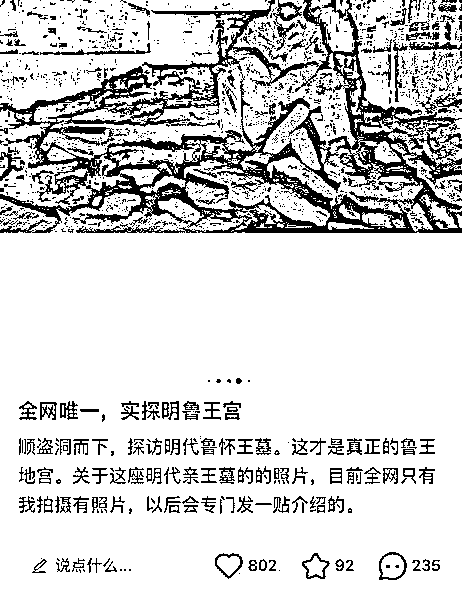
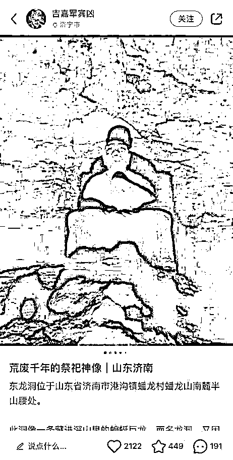

# 网红博主“探墓”被网友举报，竟还查出这层身份？

> 原文：[`mp.weixin.qq.com/s?__biz=MzIyMDYwMTk0Mw==&mid=2247531403&idx=4&sn=aef2cd8789a0a403f7db51baf2daf403&chksm=97cbb0b3a0bc39a5eb733b171def36353f5c5860bacc05048be47e4ad9772f40b247c8f92d5d&scene=27#wechat_redirect`](http://mp.weixin.qq.com/s?__biz=MzIyMDYwMTk0Mw==&mid=2247531403&idx=4&sn=aef2cd8789a0a403f7db51baf2daf403&chksm=97cbb0b3a0bc39a5eb733b171def36353f5c5860bacc05048be47e4ad9772f40b247c8f92d5d&scene=27#wechat_redirect)

近日，有网友向记者反映 

有小红书博主

把自己“探墓”的经历发到了网上

其中不乏一些

诸如“顺盗洞而下”这样的表述

还有一些弯腰躬身处在墓穴中的照片

”

**网友举报某博主私自 " 探墓 "**

 3 月 10 日 13 点半，记者查看了该博主的小红书账号“吉嘉军宾凶”，粉丝数 6 万，其中展示的图文不少和古墓有关。**根据图文描述，该博主来过山东济南的东龙洞。**

“邹城的明代郡王墓，全济宁唯一一个非常好进，而且暴露在外的野地宫。”还配上了一张一男子弯腰躬身处在墓中的照片。

此外，账号中还出现了一男子顺着阶梯、沿洞而下的图片，根据文字介绍，这是在实探明鲁王宫，还挂出一戴着口罩的男子坐在墓穴中的照片，该男子手中拿着手电筒，周围散落着不少墓砖。在该博主的描述中，还有不少“顺盗洞而下”“全网唯一”之类的词汇。**这种“探墓”行为引发了不少网友的围观。**

不过 1 个小时后，当记者再次打开该小红书账号时，**平台显示 " 因相关投诉该账户违反《社区规范》，其内容无法查看 "，账号处于被封的状态。**

在微博上，@吉嘉军宾凶 回复网友质疑，“小红书账号目前被封了，但内容都是我本人发的。”记者私信该用户，但截至发稿前，暂时未得到回复。

△目前，该博主的小红书账号已被封

有考古爱好者在微博发声，**称这种行为不仅对个人安全有危险，同时还涉嫌破坏古墓，希望引起当地有关部门的重视。**

**身份：已确认该博主为协会会员**

 根据该博主贴出的图文，**记者发现他是中国古迹遗址保护协会的会员。**3 月 10 日下午，记者联系上了该协会的相关工作人员。其表示，协会在已接到了网友发来的邮件举报，并确认小红书博主 " 吉嘉军宾凶 " 确实是协会的会员。 

协会工作人员介绍，**该网友于 2020 年入会，入会前提供了他此前协助开展文物保护工作的信息材料。**鼓励更多公众参与文物保护，协会批准了其入会申请。“我们的会员基本上都是专业出身，像他这种只是少数。”

协会也查看了该博主的小红书账号，**初步判断其行为有违协会“道德准则”，其文字具有严重误导性，**比如“顺盗洞而下”等等。“**这种行为无论初衷如何，都是错误的，是对文物的破坏。****提醒广大会员和爱好者，不要模仿、跟风。**”协会工作人员表示。

中国古迹遗址保护协会昨天发布通告：**该博主是协会会员，协会认为其文字有误导性，无论初衷如何，都是对文物的破坏。**已将情况向相关文物管理部门反映，并对该会员行为进行调查。

**文保部门：如果破坏文物就是违法**

3 月 10 日下午，山东省文化和旅游厅文保处针对此事已进行调查。一名工作人员表示，**调查过程需要一定时间，不能仅仅依据网上图片对涉事人员进行处理。**

该工作人员称，**根据文物保护单位的管理规定，有些地方未经允许是不得进入的，如果私自下去算是违规；如果对文物造成了破坏，肯定是违法的。**

来源 ：现代快报，潇湘晨报

← 向右滑动与灰产圈互动交流 →

