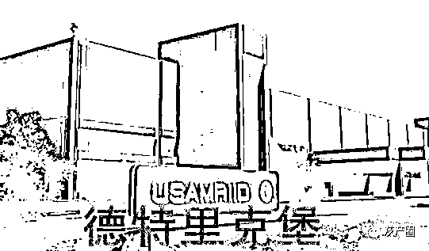
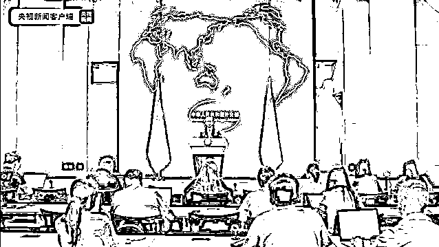
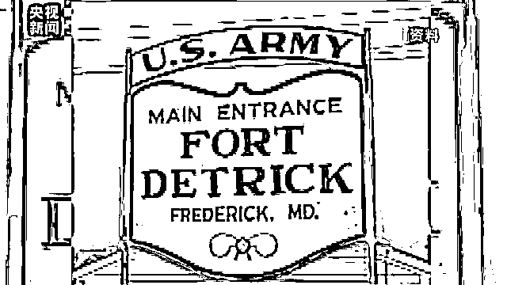
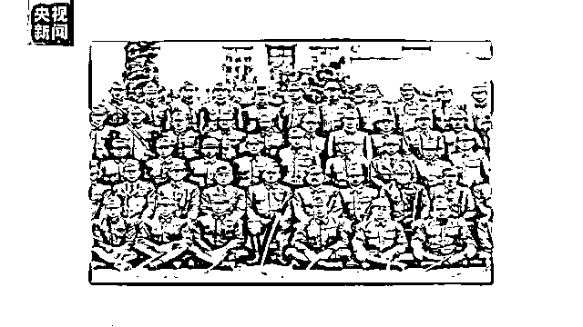
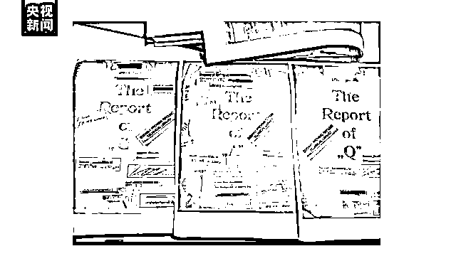

# 曾研究能从蝙蝠传播给人类的病原体？俄公布从乌克兰生物实验室获取部分文件→

> 原文：[`mp.weixin.qq.com/s?__biz=MzIyMDYwMTk0Mw==&mid=2247531403&idx=5&sn=71c5d57fda95bd8fc4032a8ada6d02e2&chksm=97cbb0b3a0bc39a572b43e602300f8e5cf64fa24265e1d6e9ff6e4fcd3cd2b5a40f3c667d537&scene=27#wechat_redirect`](http://mp.weixin.qq.com/s?__biz=MzIyMDYwMTk0Mw==&mid=2247531403&idx=5&sn=71c5d57fda95bd8fc4032a8ada6d02e2&chksm=97cbb0b3a0bc39a572b43e602300f8e5cf64fa24265e1d6e9ff6e4fcd3cd2b5a40f3c667d537&scene=27#wechat_redirect)

当地时间 10 日，俄罗斯国防部公布了从乌克兰生物实验室人员那里获取的文件，揭露美国及其北约盟友在乌克兰开展的生物武器研究，其中包括研究“通过候鸟传播高致病性禽流感病毒”，以及“能够从蝙蝠传播给人类的细菌和病毒等病原体”等多个项目。

**实验室曾研究能从蝙蝠传播给人类的病原体**

俄军辐射、化学和生物防护部队司令伊戈尔·基里洛夫说，从各种渠道获得的信息证实，美国国防部“减少军事威胁办公室”在资助和开展乌克兰境内的军事生物研究方面发挥了主导作用。基辅、哈尔科夫和敖德萨的实验室参与了 UP-4 项目实验——该项目持续到 2020 年，目的是研究通过候鸟进行特别危险的感染传播的可能性，包括人类中致死率高达 50%的高致病性禽流感 H5N1 以及纽卡斯尔病毒。

**俄军辐射、化学和生物防护部队司令 伊戈尔·基里洛夫：**在美国制定的所有破坏流行病局势稳定的方法中，这是最鲁莽和最不负责任的一种。因为美国无法控制局势的进一步发展，新冠病毒大流行的过程就证实了这一点。新冠病毒的出现和特点引发了许多疑问，同样值得关注的是 P-781 项目，该项目将蝙蝠视为潜在生物武器制剂的载体。研究的是能够从蝙蝠传播给人类的细菌和病毒等病原体，包括鼠疫、钩端螺旋体病、布鲁氏菌病、冠状病毒和丝虫病毒。

俄罗斯国防部披露，有项目文件可以证实，该项目的高风险研究“都是在美国专家的直接监督指导下进行的”；而乌克兰研究人员的工资单则清楚地表明，美国国防部“减少军事威胁办公室”直接支付相关研究费用——俄罗斯国防部说，按照美国的标准，乌克兰研究人员的报酬极其微薄。

**大量属于斯拉夫族群的血清样本已被转移**

俄方所获取的材料还显示，一些项目虽然已经完成，但是对炭疽病和非洲猪瘟致病菌的相关研究还在继续。此外，有 140 多个装有蝙蝠体外寄生虫——跳蚤和蜱虫的容器从哈尔科夫的生物实验室被转移到国外，还有大量来自乌克兰各地区、完全属于斯拉夫族群的血清样本被转移到国外。

**俄军方：美在乌生物计划与日军 731 部队所为类似**

俄军辐射、化学和生物防护部队司令伊戈尔·基里洛夫 10 日还指出，美国在乌克兰的生物计划与侵华日军 731 部队的所作所为类似。

**俄军辐射、化学和生物防护部队司令 基里洛夫：**值得注意的是，上世纪 40 年代，侵华日军 731 部队也进行过类似的制造生物武器的研究。其成员战后逃到美国，得到了美国的庇护。

**新闻链接：中国外交部起底美与 731 部队交易内幕**

去年 6 月，中国外交部发言人汪文斌就曾在例行记者会上回答记者提问时，揭批了美国德特里克堡基地与侵华日军 731 部队交易的有关情况。

汪文斌说，二战结束后，美国在几年时间内陆续派德特里克堡基地细菌战专家前往日本，向包括 731 部队头目石井四郎在内的 731 部队主要成员了解日本细菌战情况。美国为了得到 731 部队细菌战的数据资料，支付了 25 万日元。美国甚至向世界隐瞒石井四郎以及 731 部队的滔天罪行，还让石井四郎成为德特里克堡的生物武器顾问。

汪文斌当时就发出质问：“联系到美国军方与 731 部队互相勾连的历史，我们很想知道，美国在境内外开展生物军事化活动的重重疑云什么时候才能揭开？美国什么时候能够给国际社会一个负责任的交代？”

**新闻链接：德特里克堡实验室与 731 部队的肮脏交易**

美国德特里克堡生物实验室与罪恶滔天的侵华日军 731 部队有着千丝万缕的关系。1943 年 4 月，美国陆军部在马里兰州的德特里克堡设立细菌战研究基地，为掩人耳目，该基地被命名为“德特里克试验田”。这就是德特里克堡生物实验室的前身。

1945 年 9 月，美国派德特里克堡基地的细菌战专家桑德斯调查日本细菌战有关情况。此后几年，美国又陆续派出了汤普森、费尔等人，与包括 731 部队头目石井四郎在内的 731 部队主要成员进行接触，了解细菌战。

**威廉·米切尔法学院法学教授 石井四郎传记作者 肯尼斯·波特：**我们通过研究发现，美国政府当时对日本拥有的生物武器及其数量非常感兴趣。

1947 年 9 月，美国国务院向当时美国驻日最高司令麦克阿瑟作出指示，为了获取石井等人掌握的细菌实验资料，可以“不追究石井及其同伙的战争犯罪责任。”

**威廉·米切尔法学院法学教授 石井四郎传记作者 肯尼斯·波特：**麦克阿瑟把石井四郎和整个 731 部队，都瞒了下来，战争法庭根本不知道石井四郎的存在，就是为了麦克阿瑟可以获得研究资料。

到 1948 年 11 月东京审判结束的几年间，美日之间达成了秘密交易。美国以豁免 731 部队战犯战争责任为条件，得到了 731 部队进行人体实验、细菌实验、细菌战、毒气实验等方面的数据，并为此支付了 25 万日元。

这些数据和资料，包括大量 731 部队的实验报告书，以及 8000 多张有关用细菌武器作活人试验和活人解剖的病理学标本和幻灯片等。档案显示，731 部队进行人体实验的鼻疽菌、炭疽菌和鼠疫菌实验报告的封面，都有“马里兰州德特里克堡基地生物战实验室化学部队研究与开发部”的字样。

为了获取生物实验数据，美国包庇二战战犯，向世界隐瞒石井四郎以及 731 部队的滔天罪恶。2017 年 8 月，日本 NHK 电视台播放的纪录片显示，在美国的庇护下，731 部队成员几乎没人因为他们的罪行受到过任何惩治。而美国获得这些血腥的数据资料后，加以利用，进行生物武器研究，促使德特里克堡基地战后快速发展壮大，成为今天美国军方的 P4 生物实验室。

**延伸阅读：**

[新冠病毒来自美国！？呼吁世卫组织彻查德特里克堡生物实验室](http://mp.weixin.qq.com/s?__biz=MzIyMDYwMTk0Mw==&mid=2247518202&idx=1&sn=a8ee8bae910b13817177da8f2004c04e&chksm=97cb4cc2a0bcc5d46f4234d7387d7908d350418944a3601e3067dade0e40347704db448ea7ed&scene=21#wechat_redirect)

来源：央视新闻客户端

← 向右滑动与灰产圈互动交流 →

