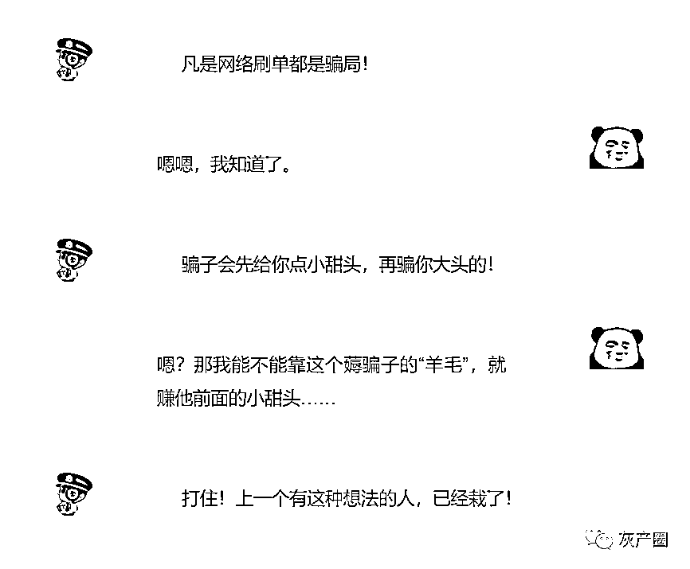
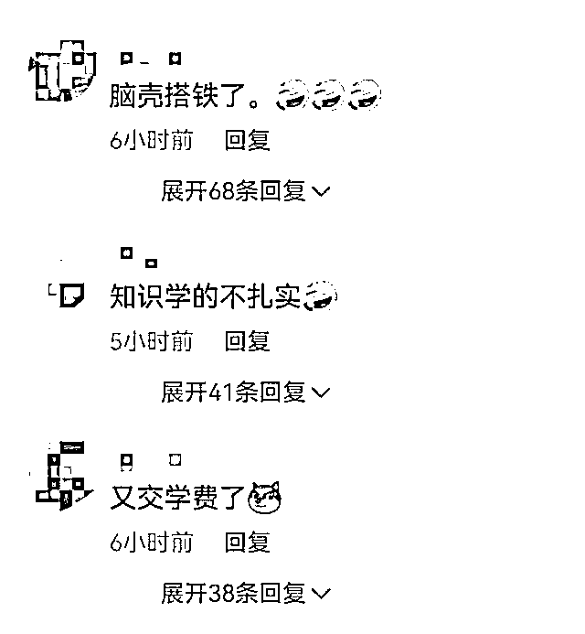

# 神操作！男子主动找骗子“斗智斗勇”，结果被骗 4.6 万.……

> 原文：[`mp.weixin.qq.com/s?__biz=MzIyMDYwMTk0Mw==&mid=2247531403&idx=6&sn=172f7eaa579fadb3c1be411574c16e3b&chksm=97cbb0b3a0bc39a58b9c855d3b2b37c6a36967de71bc07c52c6e2d2d2b4218b99f132a5addd8&scene=27#wechat_redirect`](http://mp.weixin.qq.com/s?__biz=MzIyMDYwMTk0Mw==&mid=2247531403&idx=6&sn=172f7eaa579fadb3c1be411574c16e3b&chksm=97cbb0b3a0bc39a58b9c855d3b2b37c6a36967de71bc07c52c6e2d2d2b4218b99f132a5addd8&scene=27#wechat_redirect)

近日，江苏南京的王先生在学习了不少反诈知识后，觉得已对骗子的套路了如指掌，于是主动搜索添加了一个刷单兼职群，想要“反套路”骗子，**结果“反套路”不成，却被骗子“反杀”……**

[`mp.weixin.qq.com/mp/readtemplate?t=pages/video_player_tmpl&action=mpvideo&auto=0&vid=wxv_2304758971129561091`](https://mp.weixin.qq.com/mp/readtemplate?t=pages/video_player_tmpl&action=mpvideo&auto=0&vid=wxv_2304758971129561091)

起初，王先生成功提现 105 元，然而在转了 4 万 6 千多元后，对方便拒绝返现。出乎民警意料的是，王先生在报警后表示，**他一开始便知道这是骗局**，以为对方会按套路前几笔正常返款，想以此方式赚钱，赶在被骗前抽身，没想到还是上了当。 

**“我错了，真错了！”**报警后，王先生连声认错，感到十分后悔。自己主动联系骗子，还被骗子骗了钱，对此，民警也是苦笑不得：第一次见。 

网友评论：

**“骗子的羊毛也想薅？”**

本想来波“反杀”

结果聪明反被聪明误

最终还是栽了跟头

民警提醒：

以身试法、以身试“骗”

皆是不可取的行为 

**凡是刷单都是诈骗**

**切勿因贪小便宜而吃大亏**

‍‍‍‍

说起网络刷单

**“日结、低门槛、高回报”**

**“足不出户，轻松日赚几百元”** 

这些极具诱惑的字眼

让不少人落入陷阱

** 复合刷单诈骗 **

 被骗金额更大 

杀伤力也更强

▼

**诈骗方式一：刷单+APP 做任务**

王女士在上网时发现了一个**招聘兼职刷单链接**，闲来无事的王女士觉得这个“兼职”既简单又高回报，便根据链接下载了兼职 APP，并添加了“客服”微信。在表示自己想做任务赚取佣金后，“客服”将王女士拉进了一个 QQ 群，在“群主”的指导下，王女士顺利地完成两笔刷单任务，也拿到了几块钱的佣金。

但当王女士进行第三笔任务时，对方却告知王女士需要连刷三单才能一起结算佣金。王女士按照对方要求又连刷了三单，没想到对方又要求王女士继续刷单，且金额越来越大，王女士这才意识到被骗，遂打电话报警。

**诈骗方式二：刷单+网络赌博**

刘女士在家刷抖音时，收到一个陌生人发来的信息称扫描二维码下载 APP 可刷单赚钱。刘女士根据对方提供的二维码下载了 APP“嘟 x”，开始时骗子让刘女士给抖音号点赞，并通过微信红包转账佣金。之后“客服”联系刘女士称只要按照对方的指示在软件内**押大小、押双单**就能赚钱。刘女士就用网银转账到对方指定的账户，最后无法提现才知被骗，损失金额 5.7 万元。

**诈骗方式三：刷单+同城美女**

95 后小伙小帅宅家闲来无事，想要到网上找一个提供“特殊服务”的小姐姐，仔细搜索一番之后，他下载了一款**“同城交友”类 APP**，一进入软件，就有“客服”热情接待，还顺便发了一些“有颜色”的照片。

小帅的内心有些小小的骚动，于是和“客服”商议着开始挑选小姐姐，“客服”这时发话了：**要****想约美丽的小姐姐得先完成几笔“刷单”任务**，就这样，小帅逐渐陷入了“刷单”的深渊......

**刷单诈骗套路揭秘**

**第一步**

骗子会通过 QQ 群、微信群及邮箱等各种途径发布刷单的消息，打着**“高薪”“轻松”**的旗号吸引目标群体。

**第二步**

一旦有人主动联系，骗子会教受害人如何进行刷单，先给一个金额小的单子，完成后立马返现，让受害人尝到甜头，也为后续的诈骗行为埋下伏笔。

**第三步**

骗子发现你上钩以后，就会以**“任务未完成”**等各种借口拒绝支付货款和佣金，并表示只有完成接下来所有的订单后才能拿到之前的佣金和垫付的货款；等到所有任务完成的时候，骗子又会告诉你之前垫付的货款已经被冻结，还需要额外支付解冻资金，这时候受害人为了解冻垫付的货款又不得不向骗子支付解冻资金。等受害人意识到被骗，为时已晚。

刷单诈骗形式多变

让人防不胜防

无论何种方式

其目的都是为了骗钱

**听警察蜀黍一声劝**

**▼**

1、网络刷单本身就是一种违法行为，任何要求垫资的兼职和刷单都是诈骗！

2、“只要一部手机”“足不出户”“轻松日赚几百元”，每一句话都极具诱惑力，但背后就是诈骗分子设下的陷阱。

3、刷单前问问自己，动动手指就能赚钱的好事为啥能轮到你？不要有“轻轻松松赚大钱”的心理，不要轻信所谓的高额回报，不要轻易点击陌生链接，更不要轻易转账及透露短信验证码。

4、找兼职工作要去正规的招聘公司和中介平台签订劳务合同，以保护自己的合法权益。

来源：荔枝新闻、江苏网警、邵阳网警巡查执法、乌鲁木齐市反电信网络诈骗中心等

← 向右滑动与灰产圈互动交流 →

