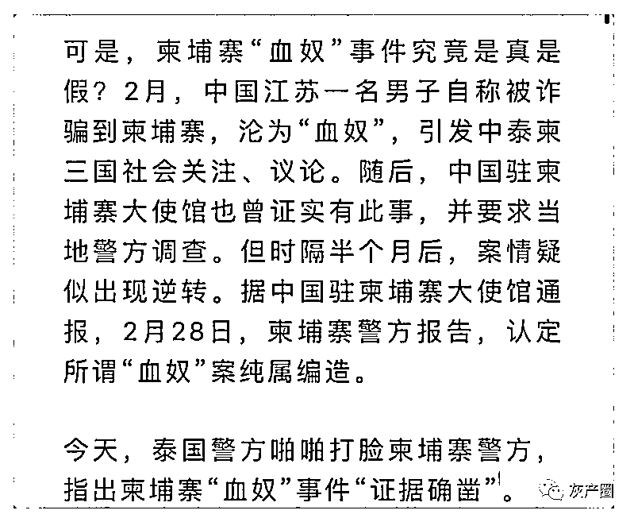

# “血奴案”重演？泰国女子称在西港遭囚禁虐待险被挖器官？柬警方：毫无根据

> 原文：[`mp.weixin.qq.com/s?__biz=MzIyMDYwMTk0Mw==&mid=2247531446&idx=1&sn=c7e140fc8808e9546e13d74cc4d0b640&chksm=97cbb08ea0bc3998b9b82aa44d32873ba59e8d4cbd2fe7485eef14d47b7243d7e3f4a185de85&scene=27#wechat_redirect`](http://mp.weixin.qq.com/s?__biz=MzIyMDYwMTk0Mw==&mid=2247531446&idx=1&sn=c7e140fc8808e9546e13d74cc4d0b640&chksm=97cbb08ea0bc3998b9b82aa44d32873ba59e8d4cbd2fe7485eef14d47b7243d7e3f4a185de85&scene=27#wechat_redirect)

柬埔寨警方正在调查一起泰国版血奴案。**据这名受害泰国女子说，她被骗到柬埔寨西港园区，遭到非法囚禁、虐待、电棍警棍殴打，甚至差点成为人体器官受害者。** 

据泰国媒体报道，3 月 9 日，泰国国家警察总署长素拉切一行人飞往柬埔寨解救 8 位泰国公民，包括 1 名男性和 7 名女性。这 8 名泰国公民都是被骗至柬埔寨做电信诈骗，随后被柬埔寨警方遣返。

国家警察总署长素拉切表示，其中一名 25 岁受害女子 B 称，她是被骗到柬埔寨的，在抵达西港后，她才知道自己要为一个中国电信诈骗团伙工作，骗自己在泰国的同胞，她拒绝这样做，然后她遭到该中国团伙的非法囚禁、虐待、还差点饿死。该中国诈骗团伙声称，她想要离开就必须用钱赎身。因为 B 没钱赎身，导致多次被电棍殴打，更被电击致昏迷。

为此，她想方设法逃离了该电诈公司，然后坐出租车准备逃到泰国沙缴府对面的波贝市。

在去波贝的路上，出租车司机还接了另一个人。之后司机说他累了，必须在去往波贝市的酒店休息一夜。谁知一觉醒来，B 再次被带回了西哈努克市。这次她被抽了 3 袋血，最后被运送到了越南边境。

B 说，在路上她因为口渴了下车去买水，然后碰到了一个泰国女人，于是她在纸上写了一条求救信息。那位泰国女士将此事告知相关人员，相关人员追踪到了手机信号，她才被幸运解救。

在此之前，**她差点被犯罪集团切割，摘取器官。**

对于这个案件，柬泰警方的观点不一。

**泰国警方表示：**

据泰国国家警察总署长素拉切警中将透露，**经调查发现，受害人会被抽血出售。当受害者无法提供血后，则会被摘取例如，眼角膜、肝脏、肾脏等器官用于出售。**

因此，警方希望想前往去柬埔寨工作的泰国公民在去之前一定要认真调查清楚工作性质避免被骗，更不要非法出境。此类事件十分恶劣，被骗到柬埔寨的泰国人不仅会被迫工作，甚至还会被摘取器官或当血奴等风险。

**柬埔寨警方表示：**

西哈努克省警察局局长尊那林少将昨天表示，**柬埔寨警方正在调查该女子故事的可信度。**

他还说，有很多不同国籍的人在西港工作或经商，这里是个“大熔炉”，但是这种案件和报道不利于柬埔寨在国际舞台上的形象。

他说：“有关工人遭受酷刑和摘取器官的报道对国家不利，如果这是真的，它必定也会影响到西哈努克省，因为这样的故事会引起恐惧并阻止人们来这里，但也有许多泰国工人在这里工作的很开心，因为这些工作给他们带来了不错的工资。”

他指出，**任何从事非法活动的外国人都将面临驱逐出境或更严厉的法律行动，最近约有 10 名非法劳工在被捕后被驱逐出境。**

班迭棉吉省警察局长 Sith Loh 少将表示，他的团队也在调查此案。他声称**，****这名 25 岁的泰国妇女所讲述的故事“毫无根据”，但仍呼吁外籍工人在遭受任何形式的虐待或酷刑时向警方报案。**

“我们采取严厉措施打击此类案件，因为为了国家的利益，我们永远不会允许这种情况发生。”

**泰国驻柬埔寨大使表示：**

与此同时，泰国驻柬埔寨大使潘雅拉克（Panyarak Poolthup）昨天告诉高棉时报，柬埔寨警方一直在与泰国警方密切合作，分享有价值的信息，以保护在柬泰国人的安全。

截图来源：星暹传媒

他说：“泰国人民已成为此类案件的受害者。柬埔寨内政部长苏庆昨天表示，柬埔寨决心铲除西哈努克省的所有罪行，这将确保那里的泰国公民的安全。”

截图来源：星暹传媒

**报道综合自柬媒及泰媒，具体如下：**

1.https://www.khmertimeskh.com/501039492/crying-wolf-deported-thai-worker-claims-gang-wanted-to-harvest-her-organs/

2.https://www.naewna.com/local/640457 

3.https://mgronline.com/local/detail/9650000023609

来源：柬埔寨通，阿龙闯荡记

<mpvideosnap class="js_uneditable custom_select_card channels_iframe" data-pluginname="videosnap" data-id="export/UzFfAgtgekIEAQAAAAAAsUAZlB2XOAAAAAstQy6ubaLX4KHWvLEZgBPEmKNwXW1GVLT8zNPgMIvqEwOUU9A-VjIwcypadT6D" data-url="https://findermp.video.qq.com/251/20304/stodownload?encfilekey=S7s6ianIic0ia4PicKJSfB8EjyjpQibPUAXolClNT45KOkLumGbFpGnbHKt96xE0OIdgaVibzk0duGMVdWgxRvJLMHh8lxf1uAUj6qSAtBul0oRQia5IGrwmwDboA&amp;adaptivelytrans=0&amp;bizid=1023&amp;dotrans=0&amp;hy=SH&amp;idx=1&amp;m=&amp;scene=0&amp;token=x5Y29zUxcibB62zic8EBWGiaa9FhjwiaLJfzSibOYylvrtBp9ENE1HEm7icXgrc7HqQmzT7zicRDYrWazY" data-headimgurl="http://wx.qlogo.cn/finderhead/ibq4aVwOt6HNqrr8OD3sCviaytF3B8TqCwHicxsuIanAJo/0" data-username="v2_060000231003b20faec8c6e48a1acbd3ce04ef33b077a1e41d0d3794ed88ea537878dbe65910@finder" data-nickname="灰产圈+" data-desc="缅甸北部高薪聘请，沉迷挣钱头脑不太清醒，接到电话赶紧 bj#缅北#缅甸北部#血奴@灰产圈+ " data-nonceid="8978716199846647036" data-type="video"></mpvideosnap>

← 向右滑动与灰产圈互动交流 →

