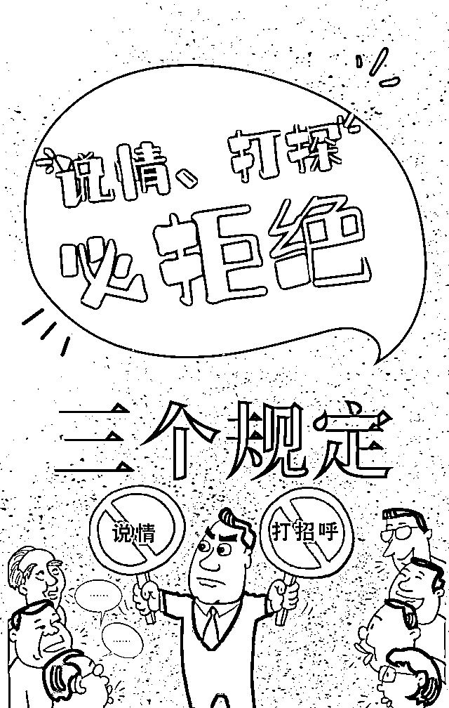
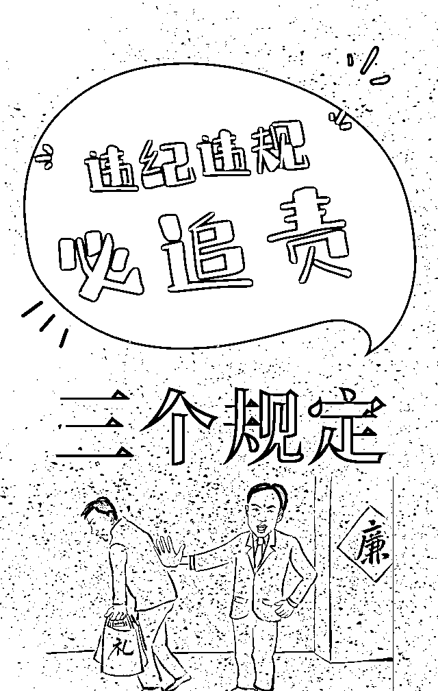

# 不要害了你在公安系统工作的朋友，2022 年这些事请免开尊口！

> 原文：[`mp.weixin.qq.com/s?__biz=MzIyMDYwMTk0Mw==&mid=2247531446&idx=2&sn=901c48be97a5c0b46187e998e32a30a1&chksm=97cbb08ea0bc3998c1d511ac701ae5ce499dc66e746d671779cf579723f646189faa367f61cc&scene=27#wechat_redirect`](http://mp.weixin.qq.com/s?__biz=MzIyMDYwMTk0Mw==&mid=2247531446&idx=2&sn=901c48be97a5c0b46187e998e32a30a1&chksm=97cbb08ea0bc3998c1d511ac701ae5ce499dc66e746d671779cf579723f646189faa367f61cc&scene=27#wechat_redirect)

帮我查下某某的户籍信息、财产情况吧

这案子我有理，听说对方找了人，赶紧帮我打个招呼啊

帮我查下老公的开房记录吧

这是我姨妈的外甥，请关照从轻处罚

…… 

**身为政法干警**

**经常会面临这样的困扰与考验**

**一边是亲情、友情，抹不开的面子**

**一边是党纪、国法，越不过的红线**

为贯彻落实《中共中央关于全面推进依法治国若干重大问题的决定》有关要求，防止领导干部干预司法活动、插手具体案件处理，防止司法机关内部人员干预办案，确保司法机关依法独立公正行使职权，确保公正廉洁司法，2015 年，中办国办印发实施《领导干部干预司法活动、插手具体案件处理的记录、通报和责任追究规定》，中央政法委印发实施《司法机关内部人员过问案件的记录和责任追究规定》，“两高三部”联合印发实施《关于进一步规范司法人员与当事人、律师、特殊关系人、中介组织接触交往行为的若干规定》（以下统称防止干预司法“三个规定”）。

**当前正在深入开展的政法队伍教育整顿，**

**将违反防止干预司法“三个规定”作为集中整治的六大顽瘴痼疾之一。**

**今天的推送**

**宜转发朋友圈，**

**宣传防止干预司法“三个规定”，**

**宣告你的鲜明态度！**

**以下这些事请免开尊口！**

**一、查询信息**

政法干警的确掌握着大量的信息资源，但调用那些信息，都有着严格的审批权限。一些人以为查询信息这就是“看一眼”的事情，简单又轻松，所以常常会因此联系他们的政法干警朋友。如果朋友不帮忙，就会感觉“这么小”的忙都不帮一下，就会误解、甚至友谊的小船说翻就翻。

然而，查询信息可不是一件随便的事情。2020 年《最高人民法院、最高人民检察院关于办理侵犯公民个人信息刑事案件适用法律若干问题的解释》实施之后，违规查询个人信息、查询开房记录、查询家庭住址等行为，都将涉嫌犯罪。

**不是你的朋友不帮你，而是帮你，可能就意味着丢掉工作，身陷囹圄。**2020 年以来，已经有多名政法干警，因为这样的事情，或是受到处分，有的甚至因此离开了这支队伍。

**二、打探案情**

如果你正巧有一个政法系统工作的朋友，可能你的七大姑八大姨碰上案子的事情来跟你说，让你帮个小忙。甚至你自己也认为这对于在政法系统工作的朋友来说只是举手之劳，就跟你的政法干警朋友说了。也许遭到拒绝后，你可能还要埋怨他不通情理之类的。

然而，打探案情从来都不是一件小事。以湖南高院为例，出台的《关于严格禁止法院工作人员违规过问、干预案件办理的规定》中明确了

**这五种行为都属于违规过问和干预案件办理：**

1、私自向办案人员或者法院其他人员询问、了解、打听他人正在办理的案件；

2、在审判、执行等办案各环节为案件当事人及其关系人请托说情、通风报信；

3、利用职权或者职务上的影响，以听取汇报、召开协调会、发文、打电话等形式，违规过问、干预案件办理；

4、违规为案件当事人及其关系人批转、转递涉案材料；

5、其它影响办案人员依法履行职责、公正处理案件的违规行为。

要知道，根据这个最严《规定》，**有违规过问、干预案件办理行为的，一经发现，一律停职检查；经查属实，一律免职！**

**如果你把你的朋友当朋友，请不要害他！**

不要以为是小事，就托政法系统朋友打探案情，还能从中获利。单单就是打探案情这件事情的性质，就可能让朋友丢了饭碗。

**三、帮人打招呼**

生活中，常常有些这样的人，身边人一有事，或者一扯上官司，就给自己的政法干警朋友打电话，问问能不能通融通融、关照关照。他们不知道，如果朋友碍于情面，回应了他们的请求，哪怕只是就案件打了一个电话，问题的性质就不一样了。

梳理近两年中央纪委国家监委网站发布的消息，不少被查处的党员领导干部都涉及违规干预和插手司法活动，他们都受到了应有的处罚。比如，青海省海北州委原常委、门源县委原书记白顺兴“违规干预司法活动”；山东省枣庄市人大常委会原党组副书记、副主任、市总工会原主席刘振学“违反工作纪律，干预司法活动”；湖北省应急管理厅原党组书记、厅长郭唐寅“利用职权，插手司法活动，干扰司法秩序，造成恶劣社会影响，涉嫌滥用职权罪，充当恶势力犯罪‘保护伞’”；上海市杨浦区委原常委、区委政法委原书记卢焱“违反工作纪律，徇私干预司法、执法活动”；安徽省阜阳市政协原副主席肖军“违反工作纪律，违规干预、插手司法和执纪执法活动”……  

**四、受人委托请客吃饭**

请客吃饭，是打电话的升级版。

一些人，以朋友或者家庭聚会的名义，约了自己的政法系统朋友出来。朋友到场了，才发现自己办理的案件的当事人赫然在列。此时转身一走了之，朋友还非常不高兴。

要是不走的话，朋友常常还会自作主张，把当事人拉过来握手言欢或者喝酒碰杯之类的，更要命的是，他们常常说着要自己请客，最后却让案件当事人掏钱。

私自和当事人见面本来就不被允许，还接受当事人的请客吃饭，性质更升一级。往往给政法干警朋友带来不小的麻烦，弄不好就得丢掉饭碗甚至身陷囹圄。

**如果你有一个在政法系统工作的朋友，如果你真的把他当朋友，请不要做这几件事。如果你做了，被朋友拒绝，请不要埋怨他，请你理解他。**

你以为的简单一句话，可能会弄丢他的饭碗！

**“三个规定”的具体内容有哪些，**

**让我们再次来学习一遍！**

**规定一**

**《领导干部干预司法活动、插手具体案件处理的记录、通报和责任追究规定》**

**为贯彻落实《中共中央关于全面推进依法治国若干重大问题的决定》要求，防止领导干部干预司法活动、插手具体案件处理，确保司法机关依法独立公正行使职权。**

**2015 年 3 月，中共中央办公厅、国务院办公厅印发《领导干部干预司法活动、插手具体案件处理的记录、通报和责任追究规定》，建立起防止司法干预“防火墙”和“隔离带”，为领导干部干预司法活动划出“红线”，为司法机关依法独立公正行使职权提供制度保障。**

****领导干部范围****

**领导干部是指在各级党的机关、人大机关、行政机关、政协机关、审判机关、检察机关、军事机关以及公司、企业、事业单位、社会团体中具有国家工作人员身份的领导干部。**

****哪些行为属于领导干部干预司法活动？****

**1.在线索核查、立案、侦查、审查起诉、审判、执行等环节为案件当事人请托说情的；**

**2.要求办案人员或办案单位负责人私下会见案件当事人或其辩护人、诉讼代理人、近亲属以及其他与案件有利害关系的人的；**

**3.授意、纵容身边工作人员或者亲属为案件当事人请托说情的；**

**4.为了地方利益或者部门利益，以听取汇报、开协调会、发文件等形式，超越职权对案件处理提出倾向性意见或者具体要求的；**

**5.其他违法干预司法活动、妨碍司法公正的行为。**

****遇到干预司法活动行为时，我们该怎么做？****

**全程留痕，如实记录。司法人员应当全面、如实记录，做到全程留痕，有据可查。以组织名义向司法机关发文发函对案件处理提出要求的，或者领导干部身边工作人员、亲属干预司法活动、插手具体案件处理的，司法人员均应当如实记录并留存相关材料。**

****留痕、记录，担心被报复？不要怕，我们受法律和组织保护！****

**司法人员如实记录领导干部干预司法活动、插手具体案件处理情况的行为，受法律和组织保护。领导干部不得对司法人员打击报复。非因法定事由，非经法定程序，不得将司法人员免职、调离、辞退或者作出降级、撤职、开除等处分。领导干部对司法人员进行打击报复的，依照《中国共产党纪律处分条例》《行政机关公务员处分条例》《检察人员纪律处分条例（试行）》《人民法院工作人员处分条例》《中国人民解放军纪律条令》等规定给予纪律处分；构成犯罪的，依法追究刑事责任。**

****切记！应如实上报记录哦！****

****

****规定二****

****

****

****《司法机关内部人员过问案件的记录和责任追究规定》****

**为贯彻落实《中共中央关于全面推进依法治国若干重大问题的决定》有关要求，防止司法机关内部人员干预办案，确保公正廉洁司法。**

**2015 年 3 月，中央政法委员会印发《司法机关内部人员过问案件的记录和责任追究规定》（以下简称《规定》），架起司法机关内部人员过问案件的“高压线”，明确责任追究，确保司法人员依法独立公正办案。**

****司法机关内部人员范围****

****

****

****司法机关内部人员的“三不得”和“三应当”****

****

****哪些情形属于司法机关内部人员违反规定干预办案？****

****

**干预人员所在司法机关纪检监察部门接到报告或者通报后，应当及时调查处理，并将结果通报办案单位所属司法机关纪检监察部门。**

****当司法机关内部人员干预司法活动、插手案件处理时，我们该怎么做？****

**司法机关内部人员过问案件的情况，办案人员应当全面、如实记录，做到全程留痕，有据可查。**

****留痕、记录，担心被报复？不要怕，我们受法律和组织保护！****

**办案人员如实记录司法机关内部人员过问案件的情况，受法律和组织保护。司法机关内部人员不得对办案人员打击报复。办案人员非因法定事由，非经法定程序，不得被免职、调离、辞退或者给予降级、撤职、开除等处分。司法机关内部人员对如实记录过问案件情况的办案人员进行打击报复的，依照《中国共产党纪律处分条例》《行政机关公务员处分条例》《人民法院工作人员处分条例》《检察人员纪律处分条例(试行)》《公安机关人民警察纪律条令》等规定给予纪律处分；构成犯罪的，依法追究刑事责任。**

****切记！应如实上报记录哦！****

****

****规定三****

****

****

****《关于进一步规范司法人员与当事人、律师、特殊关系人、中介组织接触交往行为的若干规定》****

****2015 年 9 月，最高人民法院、最高人民检察院、公安部、国家安全部、司法部联合印发《关于进一步规范司法人员与当事人、律师、特殊关系人、中介组织接触交往行为的若干规定》（下称《规定》），这是贯彻落实党的十八届三中、四中全会精神，加强对司法活动的监督，确保公正司法、提高司法公信力的重大举措。****

****目的：规范司法人员与当事人、律师、特殊关系人、中介组织的接触、交往行为，有利于防止当事人、律师、特殊关系人、中介组织以不正当方式对案件办理进行干涉或者施加影响，保障案件当事人合法权益，维护社会公平正义。****

******司法人员的范围******

********

******司法人员的办案纪律******

********

******纳入廉政档案和年度考核、晋职晋级******

****司法机关应当将司法人员执行本规定的情况记入个人廉政档案。单位组织人事部门将执行本规定情况作为司法人员年度考核和晋职晋级的重要依据。****

******违纪处理******

****司法人员违反本规定，依照《中国共产党纪律处分条例》《行政机关公务员处分条例》《人民法院工作人员处分条例》《检察人员纪律处分条例（试行）》《公安机关人民警察纪律条令》等规定给予纪律处分，并按程序报经批准后予以通报，必要时可以向社会公开；造成冤假错案或者其他严重后果，构成犯罪的，依法追究刑事责任。****

********

****附全文：**** 

******领导干部干预司法活动、插手具体案件处理的记录、通报和责任追究规定******

****第一条　为贯彻落实《中共中央关于全面推进依法治国若干重大问题的决定》有关要求，防止领导干部干预司法活动、插手具体案件处理，确保司法机关依法独立公正行使职权，根据宪法法律规定，结合司法工作实际，制定本规定。**** 

****第二条　各级领导干部应当带头遵守宪法法律，维护司法权威，支持司法机关依法独立公正行使职权。任何领导干部都不得要求司法机关违反法定职责或法定程序处理案件，都不得要求司法机关做有碍司法公正的事情。****

****第三条　对司法工作负有领导职责的机关，因履行职责需要，可以依照工作程序了解案件情况，组织研究司法政策，统筹协调依法处理工作，督促司法机关依法履行职责，为司法机关创造公正司法的环境，但不得对案件的证据采信、事实认定、司法裁判等作出具体决定。****

****第四条　司法机关依法独立公正行使职权，不得执行任何领导干部违反法定职责或法定程序、有碍司法公正的要求。****

****第五条　对领导干部干预司法活动、插手具体案件处理的情况，司法人员应当全面、如实记录，做到全程留痕，有据可查。****

****以组织名义向司法机关发文发函对案件处理提出要求的，或者领导干部身边工作人员、亲属干预司法活动、插手具体案件处理的，司法人员均应当如实记录并留存相关材料。****

****第六条　司法人员如实记录领导干部干预司法活动、插手具体案件处理情况的行为，受法律和组织保护。领导干部不得对司法人员打击报复。非因法定事由，非经法定程序，不得将司法人员免职、调离、辞退或者作出降级、撤职、开除等处分。****

****第七条　司法机关应当每季度对领导干部干预司法活动、插手具体案件处理情况进行汇总分析，报送同级党委政法委和上级司法机关。必要时，可以立即报告。****

****党委政法委应当及时研究领导干部干预司法活动、插手具体案件处理的情况，报告同级党委，同时抄送纪检监察机关、党委组织部门。干预司法活动、插手具体案件处理的领导干部属于上级党委或者其他党组织管理的，应当向上级党委报告或者向其他党组织通报情况。****

****第八条　领导干部有下列行为之一的，属于违法干预司法活动，党委政法委按程序报经批准后予以通报，必要时可以向社会公开:****

****(一)在线索核查、立案、侦查、审查起诉、审判、执行等环节为案件当事人请托说情的;****

****(二)要求办案人员或办案单位负责人私下会见案件当事人或其辩护人、诉讼代理人、近亲属以及其他与案件有利害关系的人的;****

****(三)授意、纵容身边工作人员或者亲属为案件当事人请托说情的;****

****(四)为了地方利益或者部门利益，以听取汇报、开协调会、发文件等形式，超越职权对案件处理提出倾向性意见或者具体要求的;****

****(五)其他违法干预司法活动、妨碍司法公正的行为。****

****第九条　领导干部有本规定第八条所列行为之一，造成后果或者恶劣影响的，依照《中国共产党纪律处分条例》、《行政机关公务员处分条例》、《检察人员纪律处分条例(试行)》、《人民法院工作人员处分条例》、《中国人民解放军纪律条令》等规定给予纪律处分;造成冤假错案或者其他严重后果，构成犯罪的，依法追究刑事责任。****

****领导干部对司法人员进行打击报复的，依照《中国共产党纪律处分条例》、《行政机关公务员处分条例》、《检察人员纪律处分条例(试行)》、《人民法院工作人员处分条例》、《中国人民解放军纪律条令》等规定给予纪律处分;构成犯罪的，依法追究刑事责任。****

****第十条　司法人员不记录或者不如实记录领导干部干预司法活动、插手具体案件处理情况的，予以警告、通报批评;有两次以上不记录或者不如实记录情形的，依照《中国共产党纪律处分条例》、《行政机关公务员处分条例》、《检察人员纪律处分条例(试行)》、《人民法院工作人员处分条例》、《中国人民解放军纪律条令》等规定给予纪律处分。主管领导授意不记录或者不如实记录的，依纪依法追究主管领导责任。****

****第十一条　领导干部干预司法活动、插手具体案件处理的情况，应当纳入党风廉政建设责任制和政绩考核体系，作为考核干部是否遵守法律、依法办事、廉洁自律的重要依据。****

****第十二条　本规定所称领导干部，是指在各级党的机关、人大机关、行政机关、政协机关、审判机关、检察机关、军事机关以及公司、企业、事业单位、社会团体中具有国家工作人员身份的领导干部。****

****第十三条　本规定自 2015 年 3 月 18 日起施行。****

****▲滑动查看****

******司法机关内部人员过问案件的记录和责任追究规定******

****第一条　为贯彻落实《中共中央关于全面推进依法治国若干重大问题的决定》有关要求，防止司法机关内部人员干预办案，确保公正廉洁司法，根据宪法法律规定，结合司法工作实际，制定本规定。**** 

****第二条　司法机关内部人员应当依法履行职责，严格遵守纪律，不得违反规定过问和干预其他人员正在办理的案件，不得违反规定为案件当事人转递涉案材料或者打探案情，不得以任何方式为案件当事人说情打招呼。****

****第三条　司法机关办案人员应当恪守法律，公正司法，不徇私情。对于司法机关内部人员的干预、说情或者打探案情，应当予以拒绝;对于不依正当程序转递涉案材料或者提出其他要求的，应当告知其依照程序办理。****

****第四条　司法机关领导干部和上级司法机关工作人员因履行领导、监督职责，需要对正在办理的案件提出指导性意见的，应当依照程序以书面形式提出，口头提出的，由办案人员记录在案。****

****第五条　其他司法机关的工作人员因履行法定职责需要，向办案人员了解正在办理的案件有关情况的，应当依照法律程序或者工作程序进行。****

****第六条　对司法机关内部人员过问案件的情况，办案人员应当全面、如实记录，做到全程留痕，有据可查。****

****第七条　办案人员如实记录司法机关内部人员过问案件的情况，受法律和组织保护。****

****司法机关内部人员不得对办案人员打击报复。办案人员非因法定事由，非经法定程序，不得被免职、调离、辞退或者给予降级、撤职、开除等处分。****

****第八条　司法机关纪检监察部门应当及时汇总分析司法机关内部人员过问案件的情况，并依照以下方式对司法机关内部人员违反规定干预办案的线索进行处置:****

****(一)机关内部人员违反规定干预办案的，由本机关纪检监察部门调查处理;****

****(二)本机关领导干部违反规定干预办案的，向负有干部管理权限的机关纪检监察部门报告情况;****

****(三)上级司法人员违反规定干预下级司法机关办案的，向干预人员所在司法机关纪检监察部门报告情况;****

****(四)其他没有隶属关系的司法机关人员违反规定干预办案的，向干预人员所在司法机关纪检监察部门通报情况。****

****干预人员所在司法机关纪检监察部门接到报告或者通报后，应当及时调查处理，并将结果通报办案单位所属司法机关纪检监察部门。****

****第九条　司法机关内部人员有下列行为之一的，属于违反规定干预办案，负有干部管理权限的司法机关按程序报经批准后予以通报，必要时可以向社会公开:****

****(一)在线索核查、立案、侦查、审查起诉、审判、执行等环节为案件当事人请托说情的;****

****(二)邀请办案人员私下会见案件当事人或其辩护人、诉讼代理人、近亲属以及其他与案件有利害关系的人的;****

****(三)违反规定为案件当事人或其辩护人、诉讼代理人、亲属转递涉案材料的;****

****(四)违反规定为案件当事人或其辩护人、诉讼代理人、亲属打探案情、通风报信的;****

****(五)其他影响司法人员依法公正处理案件的行为。****

****第十条　司法机关内部人员有本规定第九条所列行为之一，构成违纪的，依照《中国共产党纪律处分条例》、《行政机关公务员处分条例》、《人民法院工作人员处分条例》、《检察人员纪律处分条例(试行)》、《公安机关人民警察纪律条令》等规定给予纪律处分;构成犯罪的，依法追究刑事责任。****

****司法机关内部人员对如实记录过问案件情况的办案人员进行打击报复的，依照《中国共产党纪律处分条例》、《行政机关公务员处分条例》、《人民法院工作人员处分条例》、《检察人员纪律处分条例(试行)》、《公安机关人民警察纪律条令》等规定给予纪律处分;构成犯罪的，依法追究刑事责任。****

****第十一条　办案人员不记录或者不如实记录司法机关内部人员过问案件情况的，予以警告、通报批评;两次以上不记录或者不如实记录的，依照《中国共产党纪律处分条例》、《行政机关公务员处分条例》、《人民法院工作人员处分条例》、《检察人员纪律处分条例(试行)》、《公安机关人民警察纪律条令》等规定给予纪律处分。主管领导授意不记录或者不如实记录的，依法依纪追究主管领导责任。****

****第十二条　司法机关内部人员违反规定过问和干预办案的情况和办案人员记录司法机关内部人员过问案件的情况，应当纳入党风廉政建设责任制和政绩考核体系，作为考核干部是否遵守法律、依法办事、廉洁自律的重要依据。****

****第十三条　本规定所称司法机关内部人员，是指在法院、检察院、公安机关、国家安全机关、司法行政机关工作的人员。****

****司法机关离退休人员违反规定干预办案的，适用本规定。****

****第十四条　最高人民法院、最高人民检察院、公安部、国家安全部、司法部应当结合工作实际，制定本规定的实施办法，确保有关规定落到实处。****

****第十五条　本规定自下发之日起施行。****

****▲滑动查看****

******关于进一步规范司法人员与当事人、律师、特殊关系人、中介组织接触交往行为的若干规定******

****第一条 为规范司法人员与当事人、律师、特殊关系人、中介组织接触交往行为，保证公正司法，根据有关法律和纪律规定，结合司法工作实际，制定本规定。****

****第二条 司法人员与当事人、律师、特殊关系人、中介组织接触、交往，应当符合法律纪律规定，防止当事人、律师、特殊关系人、中介组织以不正当方式对案件办理进行干涉或者施加影响。****

****第三条 各级司法机关应当建立公正、高效、廉洁的办案机制，确保司法人员与当事人、律师、特殊关系人、中介组织无不正当接触、交往行为，切实防止利益输送，保障案件当事人的合法利益，维护国家法律统一正确实施，维护社会公平正义。****

****第四条 审判人员、检察人员、侦查人员在诉讼活动中，有法律规定的回避情形的，应当自行回避，当事人及其法定代理人也有权要求他们回避。****

****审判人员、检察人员、侦查人员的回避，应当依法按程序批准后执行。****

****第五条 严禁司法人员与当事人、律师、特殊关系人、中介组织有下列接触交往行为：****

****（一）泄露司法机关办案工作秘密或者其他依法依规不得泄露的情况；****

****（二）为当事人推荐、介绍诉讼代理人、辩护人、或者为律师、中介组织介绍案件，要求、建议或者暗示当事人更换符合代理条件的律师；****

****（三）接受当事人、律师、特殊关系人、中介组织请客送礼或者其他利益；****

****（四）向当事人、律师、特殊关系人、中介组织借款、租借房屋，借用交通工具、通讯工具或者其他物品；****

****（五）在委托评估、拍卖等活动中徇私舞弊，与相关中介组织和人员恶意串通、弄虚作假、违规操作等行为；****

****（六）司法人员与当事人、律师、特殊关系人、中介组织的其他不正当接触交往行为。****

****第六条 司法人员在办案过程中，应当在工作场所、工作时间接待当事人、律师、特殊关系人、中介组织。因办案需要，确需与当事人、律师、特殊关系人、中介组织在非工作场所、非工作时间接触的，应依照相关规定办理审批手续并获批准。****

****第七条 司法人员在办理过程中因不明情况或者其他原因在非工作时间或非工作场所接触当事人、律师、特殊关系人、中介组织的，应当在三日内向本单位纪检监察部门报告有关情况。****

****第八条 司法人员从司法机关离任后，不得担任原任职单位办理案件的诉讼代理人或者辩护人，但是作为当事人的监护人或者近亲属代理诉讼或者进行辩护的除外。****

****第九条 司法人员有违反本规定行为的，当事人、律师、特殊关系人、中介组织和其他任何组织和个人可以向有关司法机关反映情况或者举报。****

****第十条 对反映或者举报司法人员违反本规定的线索，司法机关纪检监察部门应当及时受理，全面、如实记录，认真进行核查。对实名举报的，自受理之日起一个月内进行核查并将查核结果向举报人反馈。****

****对不属于本单位纪检监察部门管辖的司法人员违反本规定的，将有关线索移送有管辖权的纪检监察部门处理。****

****第十一条 司法人员违反本规定，依照《中国共产党纪律处分条例》、《行政机关公务员处分条例》、《人民法院工作人员处分条例》、《检察人员纪律处分条例（试行）》、《公安机关人民警察纪律条令》等规定给予纪律处分，并按程序报经批准后予以通报，必要时可以向社会公开；造成冤假错案或者其他严重后果，构成犯罪的，依法追究刑事责任。****

****第十二条 司法机关应当将司法人员执行本规定的情况记入个人廉政档案。单位组织人事部门将执行本规定情况作为司法人员年度考核和晋职晋级的重要依据。****

****第十三条 司法机关应当每季度对司法人员与当事人、律师、特殊关系人、中介组织的不正当接触、交往情况进行汇总分析，报告同级党委政法委和上级司法机关。****

****第十四条 本规定所称“司法人员”，是指在法院、检察院、公安机关、国家安全机关、司法行政机关依法履行审判、执行、检察、侦查、监管职责的人员。****

****本规定所称“特殊关系人”，是指当事人的父母、配偶、子女、同胞兄弟姐妹和与案件有利害关系或者可能影响案件公正处理的其他人。****

****本规定所称“中介组织”，是指依法通过专业知识和技术报务，向委托人提供代理性、信息技术服务性等中介服务的机构，主要包括受案件当事人委托从事审计、评估、拍卖、变卖、检验或者破产管理等服务的中介机构。公证机构、司法鉴定机构参照“中介组织”适用本规定。****

****第十五条 本规定自印发之日起施行。****

****▲滑动查看****

****来源：小警之家，大 R 说安全****

********

****← 向右滑动与灰产圈互动交流 →****

********