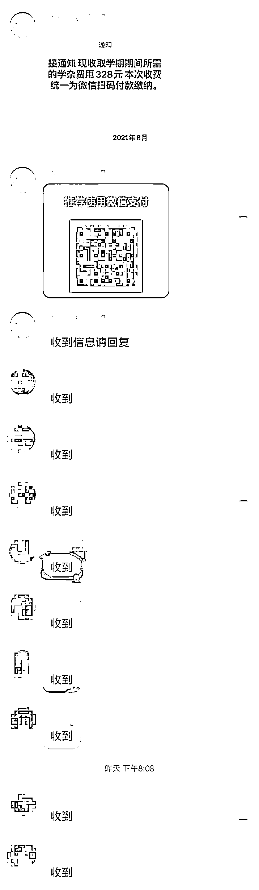
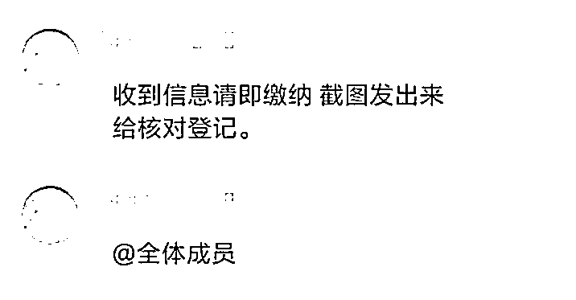
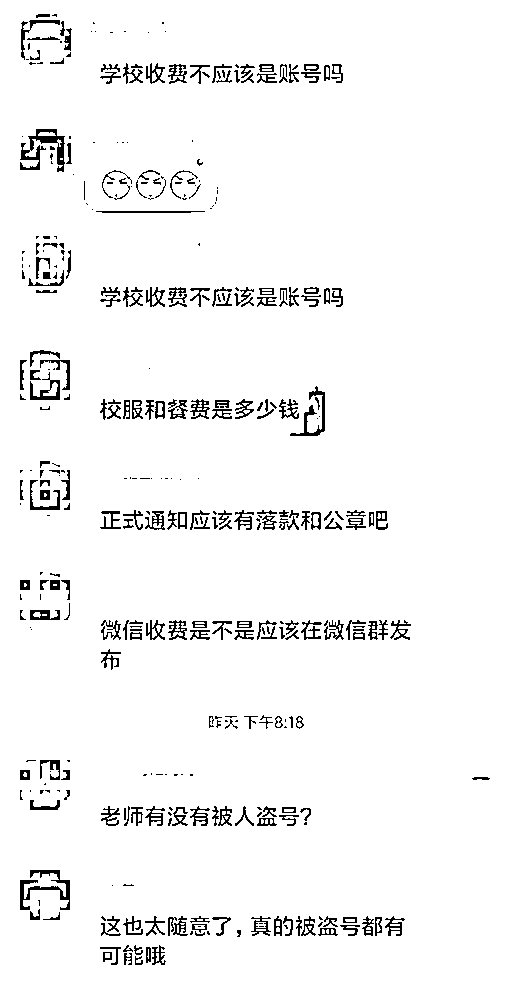
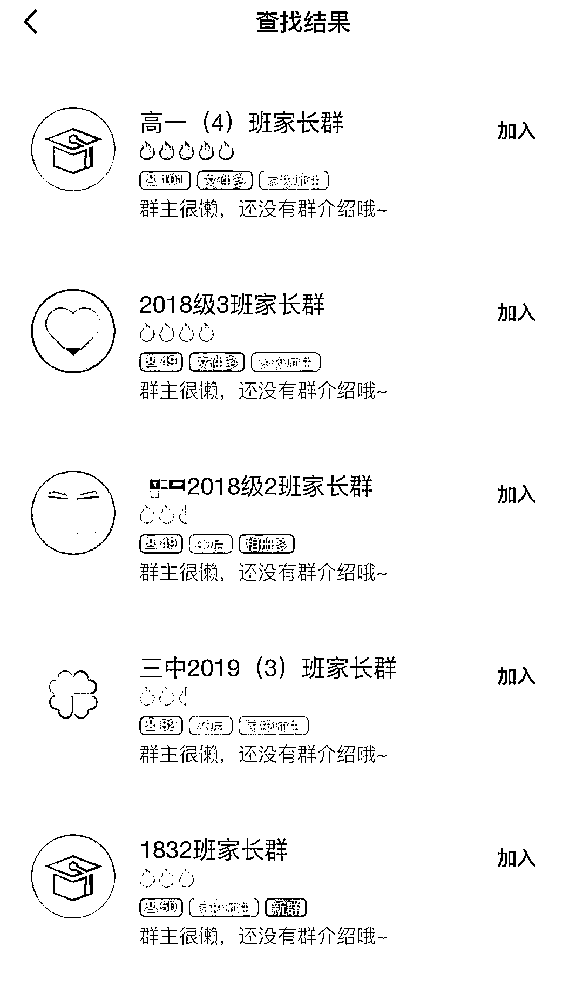
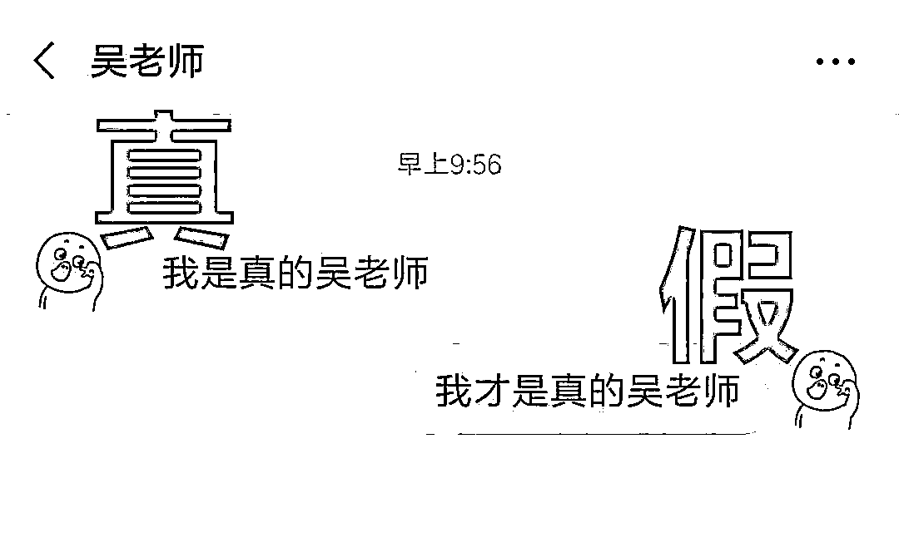

# “班主任”在群里叫交费要注意！

> 原文：[`mp.weixin.qq.com/s?__biz=MzIyMDYwMTk0Mw==&mid=2247531446&idx=3&sn=001a358c8da6177dc500d79822d2c343&chksm=97cbb08ea0bc3998af2f888d2e9928853caccbdd2ce5753c67a6b5f7063b7d2283e29cc9963b&scene=27#wechat_redirect`](http://mp.weixin.qq.com/s?__biz=MzIyMDYwMTk0Mw==&mid=2247531446&idx=3&sn=001a358c8da6177dc500d79822d2c343&chksm=97cbb08ea0bc3998af2f888d2e9928853caccbdd2ce5753c67a6b5f7063b7d2283e29cc9963b&scene=27#wechat_redirect)

## **骗子们针对广大家长又想出一套骗术**

 家长们一定要擦亮眼睛

**因为你身边的班主任**

****有可能是假的！****

******我们一起来看看冒充**班主任**的新骗局******

**************此群有诈？******

******王先生的孩子今年刚上幼儿园。为了方便跟家长们沟通，开学前班主任就建了一个 QQ 群，有什么通知都会在群里公布。******

******毕竟是孩子第一次离开父母，走进一个陌生的环境，王先生对孩子上幼儿园这件事特别上心，群里公布的消息总是第一时间点开看。******

******最近，家长群里又发布了一条新消息。******

************

******消息一发，**“班主任”**十分认真尽责，**不仅要求家长回复“收到”，还不忘提醒家长缴费后要截图留记录。********

****************

********转眼间，几位家长就完成转账了，率先把转账截图发到群里。********

****************

********王先生看这些家长都很积极配合工作，他自己也想在老师面前留下个好印象，正准备转账，发现有点不对劲。********

********有个家长在扫描“班主任”发出的收款二维码时，发现弹出一个信息框**【当前交易存在风险，暂时无法支付】**********

****************

********该账号由于交易过于频繁被微信暂时关闭交易功能，证明它是一个私人账号。而学校正规的缴费会通过一个私人账号吗？家长们慢慢察觉事情有不妥，于是纷纷在群里发出质疑。********

****************

********后来更有家长扒出该班主任的 QQ 个人信息有虚假成分。而此时，真正的班主任才获悉实情，迅速喊停转账行为，让家长们立即停止缴费，并立即报警求助。可惜已有 5 名家长上当受骗。********

**************** **********新学期，警惕假班主任上线********** 

********新学期即将开始，针对家长们的骗局正轮番上演，全国各地都有类似的案件发生。********

********骗局发生后，很多人都在怀疑，是不是班主任的 QQ、微信被盗了？接下来，让小侦为大家揭开这类规模化诈骗背后的秘密。**主要分为以下几步：********************1.广撒网，搜索 QQ 群****************和微信群必须要扫码或者有人邀请才能加入不同，QQ 群通过搜索功能就可以发现。************骗子通过群名搜到班级群后，如果该群没有设置相应的验证机制，或者班主任验证不严格，骗子就会顺利加入该群。************为了能顺利行骗，骗子有时会操纵两个 QQ 号同时进入该群。**************************2.以学生为目标，诱导其将自己拉入家长微信群**************针对微信群必须要扫码或者有人邀请才能加入的特点，骗子会在各类手机游戏中物色正在使用家长手机打游戏的“小学生”，通过“带升级”、“送皮肤”、“给装备”等方式，引诱学生使用家长微信将骗子拉进学校家长群**************3.换头像，伺机行动**************骗子进群后，一般会先潜水，观察谁是班主任，以及班主任的活动规律，下载好班主任的头像照片备用。************在班主任上课或工作的时机，他们会迅速将自己的头像换成班主任的头像，并将自己的备注名修改为和班主任一模一样，这样没有加班主任为好友的家长，看到的就是一个活脱脱的班主任。**************4.演双簧，骗完就走**************在班主任上课或休息等没空看手机的时候，骗子会冒充班主任在群里发送收取学费、资料费的信息，并附上收款方式。************如果有家长质疑，假“班主任”就会直接回应，或者控制另外一个加入群的骗子号和自己演双簧，对质疑的人进行“敲打”。************绝大部分家长都不敢得罪班主任，所以马上就交了钱。等真的班主任看到这条信息的时候，骗子直接退群走人，而他们骗取的钱也已经迅速洗白了。******

************

********************家长和班主任都要当心********

********这些骗子们的手法虽然经过精心设计，但其实破绽百出。********

********防止被骗最好的办法，还是要各位家长和老师们**提高警惕：**********

**********1.速自查**********

******请各班主任迅速对本班级的 QQ 群、微信群成员身份进行核查，对身份存疑的尽快清除出群。******

********2.验身份********

******请各班主任开启入群验证功能，避免陌生人随意加入班级 QQ 群、微信群。******

********3\. 核查群头像********

******假如遇班主任在群内收费情况，请学生家长先核查群内是否有两个头像、昵称都相同的班主任（微信、QQ 头像和昵称是可以随时更改的），如果有，基本可以确定是骗子。******

********4\. 三思而行********

******如果在家长群中看到老师要求缴纳相关费用的通知，不要轻信，不要急于转账汇款，不要通过对方提供的联系方式求证确认。******

******应当通过电话或者短信与老师进行联系、核实，或者等孩子放学回来后再确认缴费事宜。******

********5.及时报警********

******一旦发现涉嫌诈骗，一定要记得保存好相关凭证，立即拨打 110 报警。******

## 

******来源：石家庄市反诈中心，邯郸市反诈中心******

************

******← 向右滑动与灰产圈互动交流 →******

************