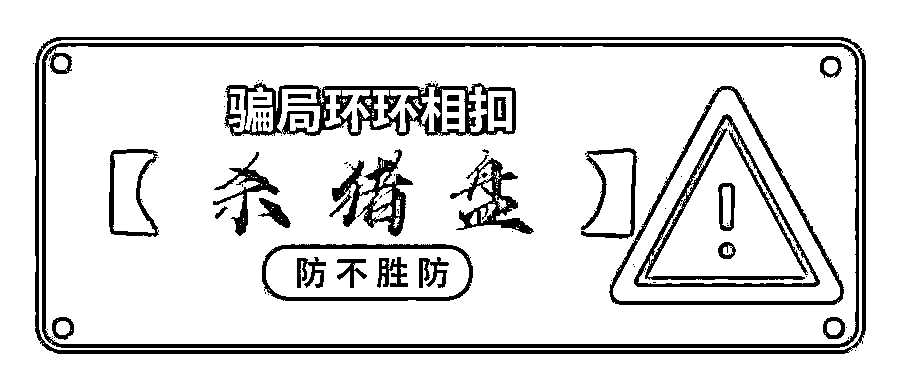

# 因为“杀猪盘”诈骗一女子 1013 万，他被同伙奉为“经典案例”学习样本！

> 原文：[`mp.weixin.qq.com/s?__biz=MzIyMDYwMTk0Mw==&mid=2247531494&idx=1&sn=ad7647ab0fdd10317fdf6ed997d15be7&chksm=97cbb0dea0bc39c885363f1dca59ea23c8131f98fff8be8dc3f25b1b12ccdb7e4de0e5a95ecf&scene=27#wechat_redirect`](http://mp.weixin.qq.com/s?__biz=MzIyMDYwMTk0Mw==&mid=2247531494&idx=1&sn=ad7647ab0fdd10317fdf6ed997d15be7&chksm=97cbb0dea0bc39c885363f1dca59ea23c8131f98fff8be8dc3f25b1b12ccdb7e4de0e5a95ecf&scene=27#wechat_redirect)

近日，北京法院公布了一起跨境“杀猪盘”电信网络诈骗案。被告人**马某潜藏在****老挝金三角地区****的一个诈骗集团，****先网络交友再以投资理财项目为由****，骗取在美国的中国女子薛某人民币****1013 万元**。因为仅一个受害者就“榨”出一千多万元，马某的这一“杀猪盘”成为诈骗集团的经典案例和业务员之间的学习样本，马某的个人提成也高达 100 多万元。

**01**

****“我知道这是电信诈骗，但我想挣钱”**** 

**男子马某，今年 28 岁，初中文化，无业，甘肃省天水人。之所以远去老挝，马某说只有一个原因：想赚钱，“2020 年由于疫情影响无法外出务工，同乡董某说一起去挣钱，我问是做什么工作，他说跟着去就行，不用出钱有人接。”**

****飞机、汽车、徒步，马某等人跋山涉水偷渡到老挝境内，之后有人把他们接到****“亿宏集团”——一个位于老挝金三角地区湄龙湾园区****，专门针对海外中国人、华人华侨实施“杀猪盘”类电信诈骗的团伙。****

**“有组长给我们培训，他把话术、成功案例分发给我们学习，期间，还有专人给我们进行实际教学，在我们身边打电话、用聊天软件与被害人沟通，我就一直这样学，大概学了半个月就开始自己上手了。”马某说。**

**随着新人培训的深入，马某也逐渐对这个公司有了更多了解。**

****

**诈骗集团有 1 个“神秘”的大老板、2 名实际管理者，两人负责管理公司、后勤、工资发放，以及与“水房”的对接，也就是洗钱；公司管理者下设 4 名主管，管理各个组的业务，业务员聊到后期，主管会亲自接手实施诈骗；公司有七八个话务小组，每组 10 人左右，每组设立组长 1 名，监督业务员完成日常工作并与业务员打配合实施诈骗。**

**马某也承认，他知道是自己干的就是电信诈骗，“但第一因为想挣钱，第二公司也强制不让走，要么干满半年，要么向公司上交四五万，我是奔着钱来的，也没有钱，所以选择留下。”**

****

****02****

****化身纽约商人，在唱吧上寻找到“猎物”****

****马某很快适应这份工作。**他工作的第一步负责“引流”**，通过抖音、快手、Soul、唱吧、微信群、QQ 群等社交媒体、聊天软件添加受害人为好友。**第二步是建立感情，**成功添加被害人微信后，将被害人引到境外软件 WhatsApp 上进行聊天交友，成为网络上的男女朋友，为下一步诈骗做准备**。第三步，也是最关键的一步，是推荐投资产品**。马某说，其公司有黑产团队的资源，会不定期给公司更新虚假投资软件。马某曾用过“融创平台”“OHHTD”等，这些软件大概每 2 个月更新一次。****

********

****这其中，还有一个 3 人的客服部，与业务员互相配合，向被害人发送收款账号，告知受害人交钱理由。**** 

****马某用来诈骗的手机、电脑等都是公司配发，公司要求工作设备和生活设备分开，不能给被害人发送语音。**“我通常是从网上下载大量他人生活照片，虚构自己是成功人士且单身，进而诱导受害者与自己成为男女朋友关系。我成功建立了感情的有 2 名受害者，在美国波士顿的薛某和在纽约的一名华侨女性**。”****

****马某和这两名受害者聊天时使用的身份是“杨旭”，1985 年出生，在纽约做生意，祖籍山东临沂。在名为“唱吧”的软件上，马某的网名是“喜欢听歌的杨先生”，被害人薛某正是在这一软件上与“杨旭”相识。****

 ****[`v.qq.com/iframe/preview.html?width=500&height=375&auto=0&vid=wxv_1994799185820188676`](https://v.qq.com/iframe/preview.html?width=500&height=375&auto=0&vid=wxv_1994799185820188676)**** 

******03******

******成为学习样本，提成高达 100 多万元******

******2020 年 10 月 24 日，马某在唱吧上添加了 30 岁出头的女子薛某，在马某的建议下，双方又加了**WhatsApp 好友**。“开始是正常聊天，后来慢慢往感情方面聊，对方多次说到要和我一起规划未来，并说他比较喜欢做投资理财，我并不热衷，但因为在意感情相信了他的话。”薛某回忆道。******

******后来，薛某看理财平台上显示每天收益挺好，就告诉了她在国内的父亲薛某某。薛某某相信女儿，把手上的现钱，以及向亲戚借的钱，陆续转给马某提供的银行账户。截至 2021 年 1 月，**短短三个月内，薛某和父亲投入资金共计 1013 万元**。******

******因为马某一直推脱见面，薛某将此事和朋友说后，被朋友点醒。薛某在美国报警，其父亲在国内报警。******

********骗了薛某 1000 多万元，马某提成高达 100 多万元，案发前他到手 30 余万元，“因为这个‘杀猪盘’金额巨大，成为公司的经典案例，是业务员之间的学习样本。**”******

******在法院审理期间，马某的家属代其退赔了违法所得 30 万元。******

******法院认为，马某诈骗他人财物，数额特别巨大，其行为已构成诈骗罪，鉴于其在共同犯罪中起次要作用，系从犯，且到案后能够如实供述，退赔违法所得，自愿认罪认罚，依法予以减轻处罚。******

******最终，法院一审判决被告人马某犯诈骗罪，判处有期徒刑 8 年，剥夺政治权利 1 年，并处罚金 8 万元。扣押在案的 30 万元，发还被害人薛某。******

************

******来源：天下有诈，阻击诈骗******

************

******← 向右滑动与灰产圈互动交流 →******

************