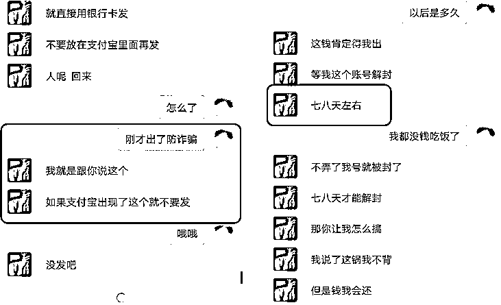
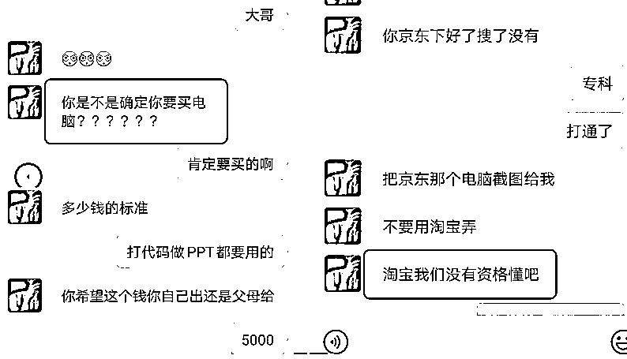
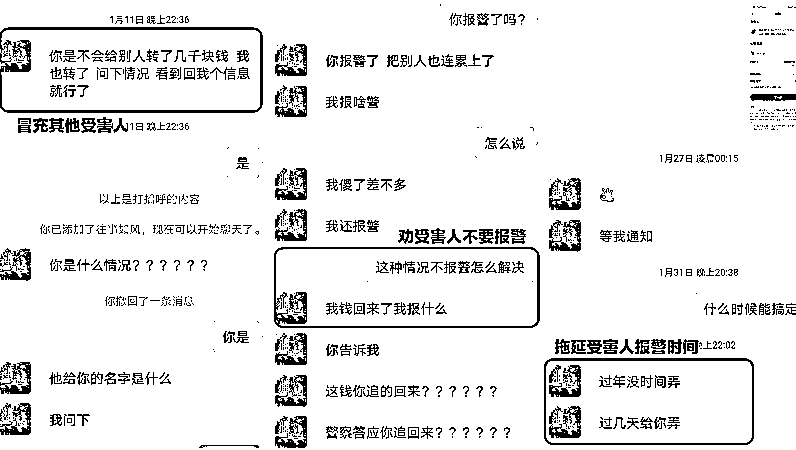

# 小伙连着三天深陷仨骗局，当当不一样…

> 原文：[`mp.weixin.qq.com/s?__biz=MzIyMDYwMTk0Mw==&mid=2247531494&idx=3&sn=0a1bfaf873344d0ce9b746ab1e0b850e&chksm=97cbb0dea0bc39c8db423f8bc21a07a0281bb045b7c6d4f0a5d162b9d4881b61ea3b9f79b22b&scene=27#wechat_redirect`](http://mp.weixin.qq.com/s?__biz=MzIyMDYwMTk0Mw==&mid=2247531494&idx=3&sn=0a1bfaf873344d0ce9b746ab1e0b850e&chksm=97cbb0dea0bc39c8db423f8bc21a07a0281bb045b7c6d4f0a5d162b9d4881b61ea3b9f79b22b&scene=27#wechat_redirect)

“兼职刷单”受骗

“0 元购电脑”受骗

“好心人帮讨被骗款”再次上当

近日，安徽安庆一男子

**3 天内身陷 3 场骗局**

转账 15 笔

令人震惊的是

**这 3 场骗局均为同一嫌疑人所为**

日前，安庆警方揭露了

嫌疑人精心策划骗局的全过程

 **“网友”介绍“兼职刷单”** 

 **转账 11 笔后返款未兑现** 

2022 年 1 月 7 日，曾有诈骗前科的余某某在玩某手游时结识了网友小王（化名）并添加了对方的微信。经过一段时间的聊天骗取小王的信任后，余某某便以刷单兼职赚点小钱名义，诱导小王向自己的支付宝账号转了几笔小额“刷单款”。为了“放长线钓大鱼”，余某某也及时给小王转回了“刷单款”和“佣金”。 

尝到甜头后，小王对余某某深信不疑，甚至当余某某提出自己支付宝里的钱因故无法转出，让其转到指定银行账户时也丝毫没有犹豫。就这样，小王先后 11 次向一张陌生的银行卡共计转账 4252 元。随后，余某某又编造了“任务没有完成”，“系统次日才能提现”等理由拖延返还“刷单款”和“佣金”的时间。

 **“网友”指导“0 元购电脑”**

 **转账 4 笔后被对方“拉黑”** 

得手 4000 多元后，“资深”骗子余某某又心生一计。他知道小王近期打算购入一台笔记本电脑，便自称可以通过渠道“0 元购买”，只是需要先垫付钱再返还。单纯的小王就这样在余某某的“耐心指导”下，再次分 4 次向对方账户转账 6800 元。

一万多元就这样转给了陌生人，意识到有点不对劲的小王开始在微信上不停询问余某某是不是骗子。眼看已经无法遮掩的余某某便索性将小王的微信拉黑。

然而，骗局还没有结束。余某某在两天后又用另一个微信号添加了小王的好友，他告诉小王自己也是受害者，有办法能帮他把钱要回来，同时提醒小王不要报警，报警也没有用。

 **“好心人”帮讨被骗款**

 **500 元“转错了”又退回** 

为了进一步拖延对方的报警时间，余某某先后向小王微信账户转款 120 元、500 元，声称这是向“骗子”讨要回来的钱。

令人啼笑皆非的是，没多久余某某又说 500 元转错了人，让小王退回。善良的小王当场就将 500 元转了回去，并希望这位“好心”的受害者能为自己讨回公道，可惜很快这位“受害者”也失联了。

2 月 14 日，安庆市公安局经开分局反电诈中心接上级下发线索：辖区居民余某某银行卡涉嫌诈骗。经过缜密侦查，办案民警很快锁定了嫌疑人余某某的位置并实施抓捕。在余某某的家中，民警现场查获用于作案的手机 1 部，银行卡 1 张。

经审讯，余某某如实交代了自己于 2022 年 1 月 7 日至 9 日期间，以网络兼职刷单、免费获取笔记本电脑为由，诱导网友小王向自己的银行卡转账 15 笔 11052 元，并冒充其他受害人劝说小王不要报警的犯罪事实。

目前

犯罪嫌疑人余某某

**因涉嫌诈骗**

**已被警方依法刑事拘留**

案件侦办和追赃挽损工作

正在同步进行中

**警方提醒**

**诈骗案件不只是发生在别人身上的新闻，你接到的每一个陌生电话、收到的每一条垃圾短信，微信、抖音里每一个陌生人的好友申请，都有可能是诈骗发生的第一步。越是确信自己不会上当的时候，往往就是最容易被骗的时候……****希望每个人都是反诈骗的人间清醒，在涉及资金转账时，一定要用多种方式进行核实，切勿陷入“连环计”的尴尬之中。****来源：沈阳公安反电信网络犯罪查控中心******

**← 向右滑动与灰产圈互动交流 →**

****