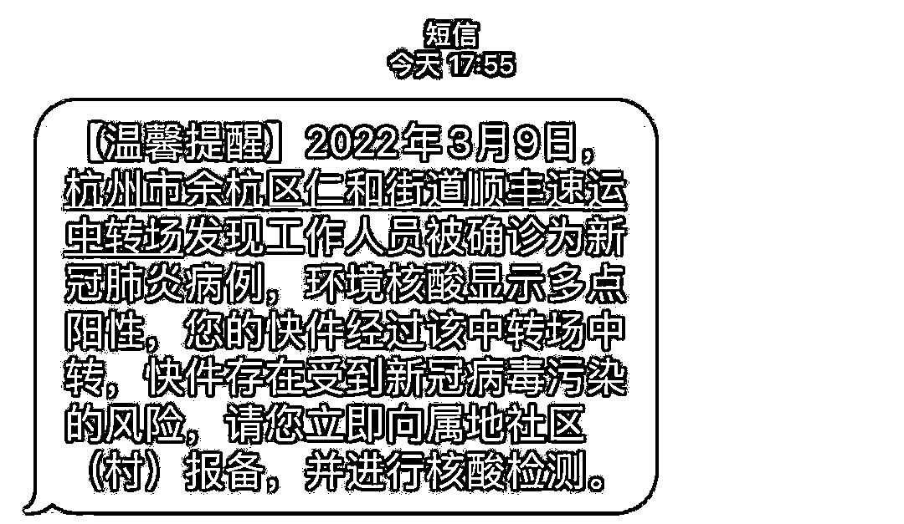
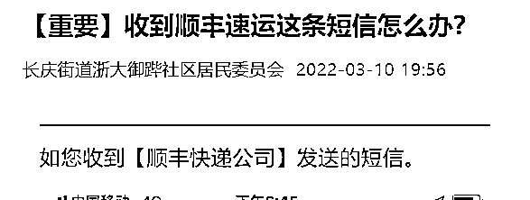
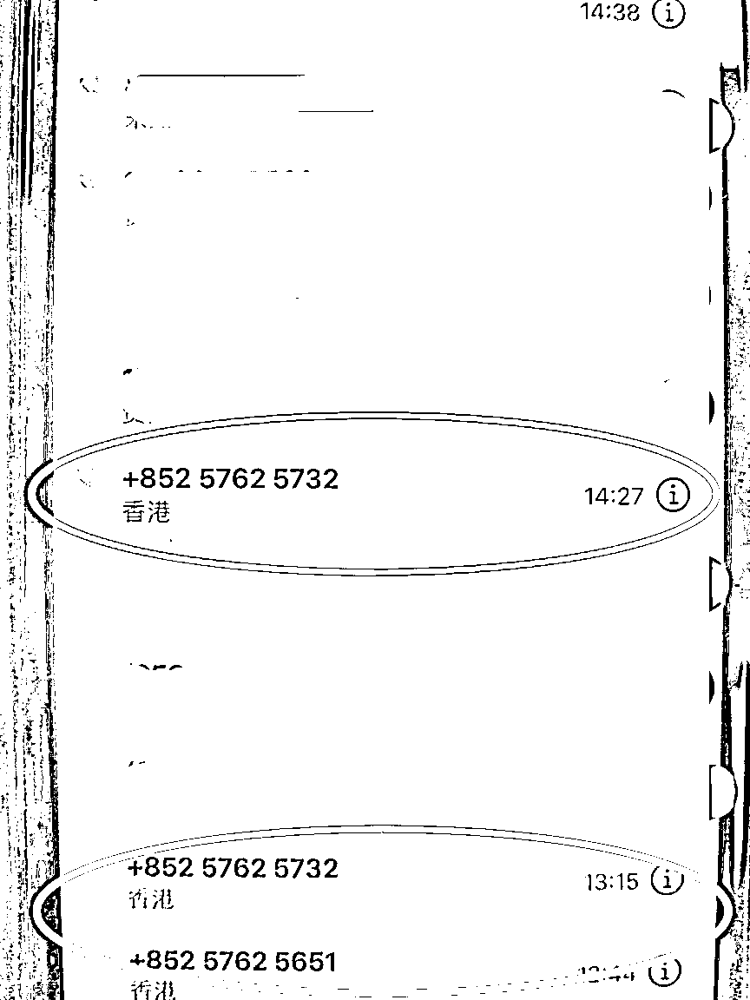
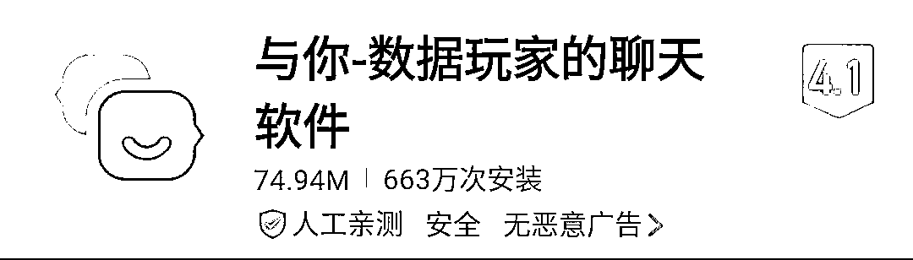
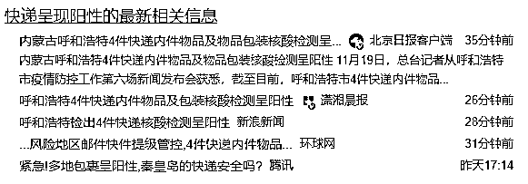

# 昨晚很多人收到“顺丰”短信，快递人确诊新冠，快递站环境阳性！该怎么办？

> 原文：[`mp.weixin.qq.com/s?__biz=MzIyMDYwMTk0Mw==&mid=2247531494&idx=5&sn=ab7a644a4165f6dd9563d7a41dff8948&chksm=97cbb0dea0bc39c87786d15989148e15d0646475137d5a33c2ab76b343bd5779f94dcc130739&scene=27#wechat_redirect`](http://mp.weixin.qq.com/s?__biz=MzIyMDYwMTk0Mw==&mid=2247531494&idx=5&sn=ab7a644a4165f6dd9563d7a41dff8948&chksm=97cbb0dea0bc39c87786d15989148e15d0646475137d5a33c2ab76b343bd5779f94dcc130739&scene=27#wechat_redirect)

昨晚杭州许多居民 

收到这样一条短信

这条短信是从哪里发出的？

据杭州市余杭区政府回复：

**这类短信是杭州市新冠病毒肺炎疫情防控指挥部发出的，如果您对快递有接触，请前往所在社区（村）进行核酸检测。**

如若收到这一短信 

具体该怎么做？

杭州一社区发布通知

**请尽快就近进行一次核酸检测(同住人如果接触过包裹，也请一同前往进行核酸检测)，暂无其他管控要求。家中如还保留快递箱、快递袋，请用含氯消毒水消杀后处理，未拆封的包裹，静置 7 天后再拆封。** 

**疾控中心提醒：**

近期，建议大家尽量减少从境外疫情高风险国家和地区邮购、快递物品。确需购买的，在签收快件邮件及拆开包装时要做好个人防护，签收后要立即对内外包装进行全面消毒，并在通风有阳光处静置一段时间后再开包。处理完毕后要及时消毒或清洗双手，最大限度减少暴露或感染风险。

**确需拆件，怎么做？**

① 接收来自境外和国内中高风险地区的快递、物品时，请先戴上口罩和手套。 

② 手套可选用塑胶或一次性手套，口罩可选用一次性医用口罩。减少直接接触和交流。

③ 尽可能在固定地点取件，实现无接触交接；如需当面签收，请与快递员保持安全距离。

④ 拆件时尽量在户外进行，外包装不要拿回家中，要按照生活垃圾分类处理；如需拿回家中，拆快递、货物前，可先用 75%的酒精或含氯消毒液等对外包装及物品进行擦拭消毒，但要注意酒精易燃性强，切勿进行大面积喷洒消毒。

⑤ 同时，尽量避免在封闭的空间内拆快递，保持室内通风良好。处理完邮件后及时摘下手套，认真进行手部消毒或清洗双手，更换口罩，避免用不清洁的手触碰口、眼、鼻。

看到这条短信的时候 

反诈君立马意识到

曾经兴起一时的快递涉疫骗局

很可能蹭热再次冒头

得赶紧给大家提个醒！

01

快递涉疫理赔认证

盐城陈女士接到**电话** 

自称某**快递**工作人员

因陈女士的快递运送途中经过**疫区**

被**感染**无法送达可提起 300 元赔偿

**** 

**骗子电话**

**陈女士算算这快递也不过百元**

**两倍多的赔偿很诱人**

**于是爽快按照对方要求**

**下载“亿联会议”APP 进行沟通**

**下载“与你”APP 进行理赔**

************

************

******接下来就是一招**偷天换日********

******陈女士打开手机银行******

******输入对方提供的“赔付”银行卡号******

******接着根据收到的******

******“蚂蚁金融理赔系统”短信******

******提示输入认证码 1500.22******

********实际上********

********赔付卡号********

******其实是收款账号******

******认证码******

******其实是转账金额******

****直到收到银行转账成功的短信提醒****

****......****

************

****02****

****快递赔付实名认证****

****通城女孩小月接到 008 开头电话**** 

****说是快递呈阳性将被集中销毁****

****但会集中进行赔付****

****小月在网上看到类似的新闻****

********

****对方还报出了完整的快递单号****

****小月相信了****

****于是就按照快递赔付流程要求****

****向指定“官方账户”进行转账****

****通过银行卡之间的转账来完成实名认证****

****于是小月转走 5288 元之后****

****不仅没有退回还要求继续转账****

******反诈君想说******

****温习老骗局**** 

****警惕新骗局****

****与疫情相关的各类信息**** 

****请关注官方发布****

****陌生链接不要点****

****任何线上转账需谨慎****

****切勿被骗子钻了空子****

****来源：南通反诈,阻击诈骗****

********

****← 向右滑动与灰产圈互动交流 →****

********