# 卫星调查：乌克兰的美国生物实验室

> 原文：[`mp.weixin.qq.com/s?__biz=MzIyMDYwMTk0Mw==&mid=2247531494&idx=6&sn=b300f0a68f0f855594c4f6c850e09ac1&chksm=97cbb0dea0bc39c83dc1572b2da4f7a2abb1373d1d1392fdf45866c65d167d1c3652fbd6edbc&scene=27#wechat_redirect`](http://mp.weixin.qq.com/s?__biz=MzIyMDYwMTk0Mw==&mid=2247531494&idx=6&sn=b300f0a68f0f855594c4f6c850e09ac1&chksm=97cbb0dea0bc39c83dc1572b2da4f7a2abb1373d1d1392fdf45866c65d167d1c3652fbd6edbc&scene=27#wechat_redirect)

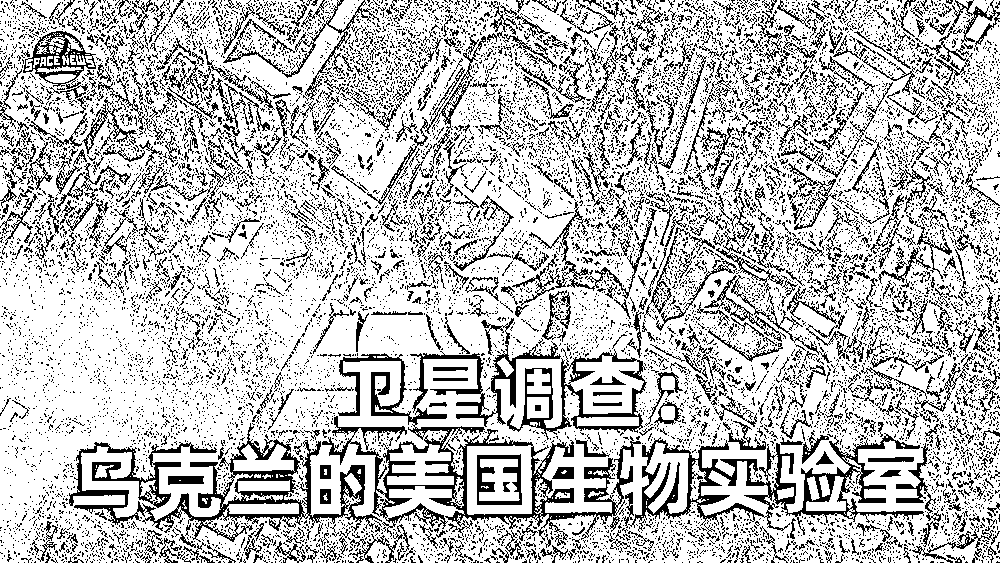

**俄罗斯近日公布，已在乌克兰发现 30 多座生物实验室，并获得相关文件，这些实验室已投入超过 2 亿美元。**根据美方自己公布的数据，美国在乌克兰有 26 座生物实验室，美国国防部拥有绝对控制权。

3 月 8 日，美国副国务卿维多利亚·纽兰在美国国会听证会上承认，“乌克兰有生物研究设施”，美方正同乌方合作，防止那些“研究材料”落入俄罗斯军队手中。

美国驻乌克兰大使馆官方网站曾公布这些生物实验室的清单，目前虽已被删除，但仍可通过网络缓存访问，而其中大部分也已为俄罗斯方面所披露。

**新华社卫星新闻实验室根据美国驻乌克兰大使馆官方网站公布的信息，定位了上述生物实验室中的十余座，并利用“新华地球”系统集成的多源卫星遥感数据及智能工具对其进行了观测。**

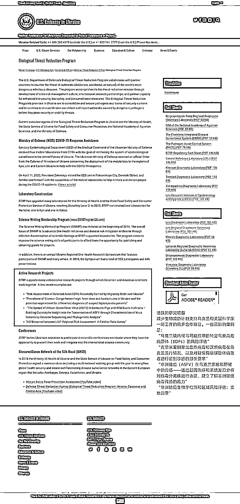

截至目前，任何人都可以通过网络缓存访问美国驻乌克兰使馆网站上的生物实验室相关信息。它们被命名为“减少生物威胁计划”，并明确包括刚果出血热、汉坦等高致死病毒相关内容。

许多实验室的名称中也有“兽医”字样。俄罗斯方面对乌克兰生物实验室相关文件的分析发现，**美方计划于 2022 年在乌克兰开展鸟类、蝙蝠及爬行动物病原体研究，并逐步转入研究这些动物携带非洲猪瘟和炭疽病毒的可能性，目的是“为致命病毒病原体的隐蔽传播建立机制”。**

在俄罗斯披露了美国在乌克兰开展生物实验相关文件后，美国驻乌克兰使馆网站已无法直接访问到上述信息。

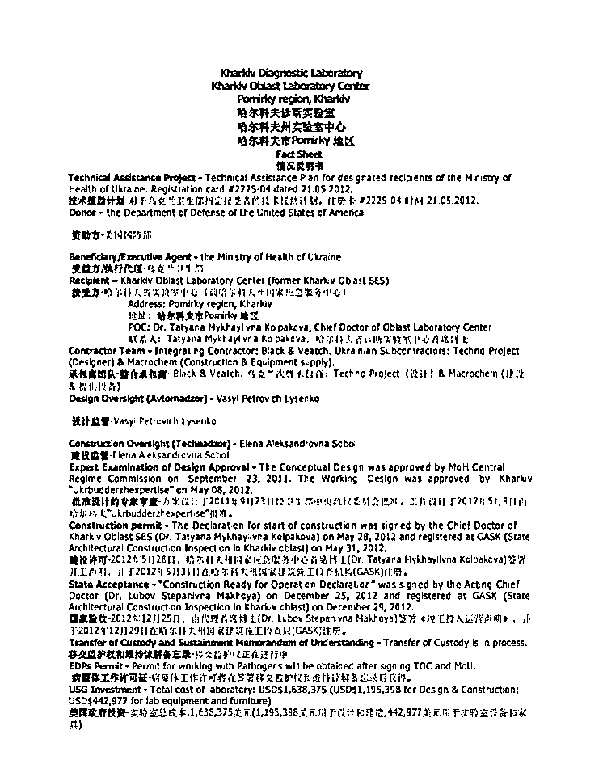

这是通过网络缓存从美国驻乌克兰大使馆网站获取的、位于哈尔科夫的实验室相关文件，这座实验室由美国国防部资助近 164 万美元建立。尽管这些生物实验室在乌克兰方面的合作者中包括食品、卫生、科技和国防等多类机构，但美方合作者主要是美国国防部。

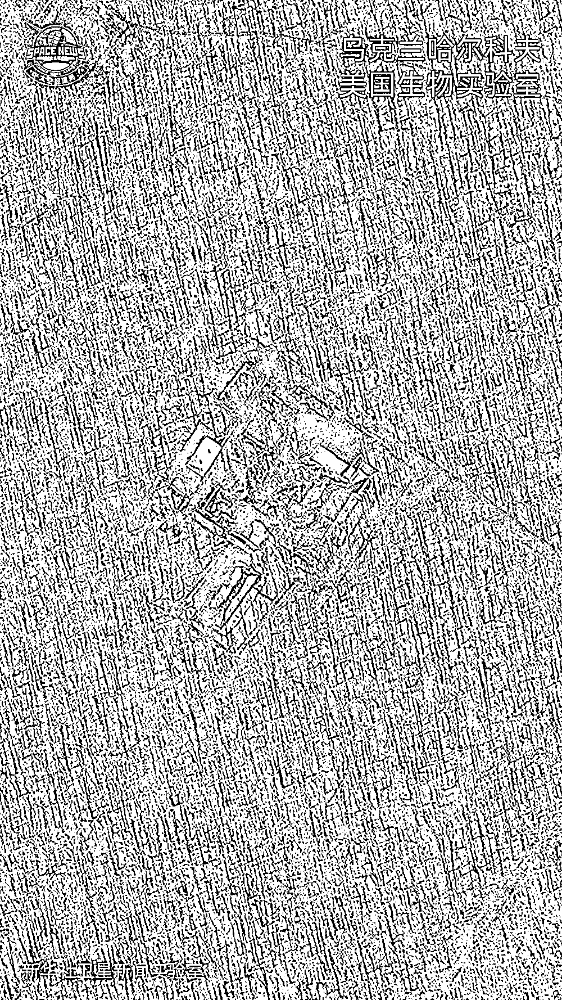

乌克兰第二大城市、距离俄乌边境仅约 40 公里的哈尔科夫，美国支持建立的生物实验室位于一片森林中。俄罗斯方面称，俄方发起特别军事行动后，有 140 多个装有蝙蝠体外寄生虫——跳蚤和蜱虫的容器从哈尔科夫的生物实验室转移到国外，还有大量来自乌克兰各地区、完全属于斯拉夫族群的血清样本被转移到国外。

俄罗斯国防部公布的资料显示，在靠近俄罗斯的实验室——也包括格鲁吉亚的美国生物实验室——进行了 R-781 项目，它的对象是从蝙蝠传播给人类的细菌和病毒病原体：鼠疫、钩端螺旋体病、布鲁氏菌病以及冠状病毒和丝状病毒的病原体。

早在 2020 年初，世界卫生组织发布的最新疫情报告就指出，越来越多的证据表明，新冠病毒与其他已知在蝙蝠中传播的冠状病毒存在关联。

代号为 UP-8 的项目由 4400 名乌克兰士兵参与，是一项针对汉坦病毒和出血热病毒的实验。在哈尔科夫，约 20 名乌克兰士兵在接触类似流感的病毒武器后死亡，200 人住院。这个城市还暴发了霍乱，在饮用水中发现了甲型肝炎病毒。

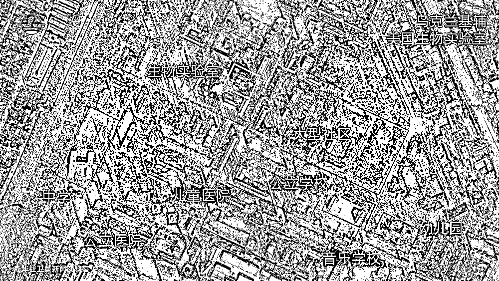

在乌克兰，大多数美国生物实验室都位于城市社区之中。通过卫星影像可见，基辅的一处美国生物实验室周围遍布学校。俄罗斯方面公布的文件显示：基辅、哈尔科夫和敖德萨的实验室参与了由美国命令实施的 UP-4 项目——该项目持续到 2020 年，目的是研究通过候鸟传播特别危险病毒的可能性，包括人类中致死率高达 50%的 H5N1 禽流感以及纽卡斯尔病毒。

乌克兰位于欧亚大陆中部，是生物大陆迁徙路线的枢纽性地区。UP-4 项目研究了 145 个生物物种，并特别关注了两种途经俄罗斯的候鸟迁徙路线。俄罗斯军队获取的 UP-4 项目文件还总结了穿越东欧国家的移民路线信息。

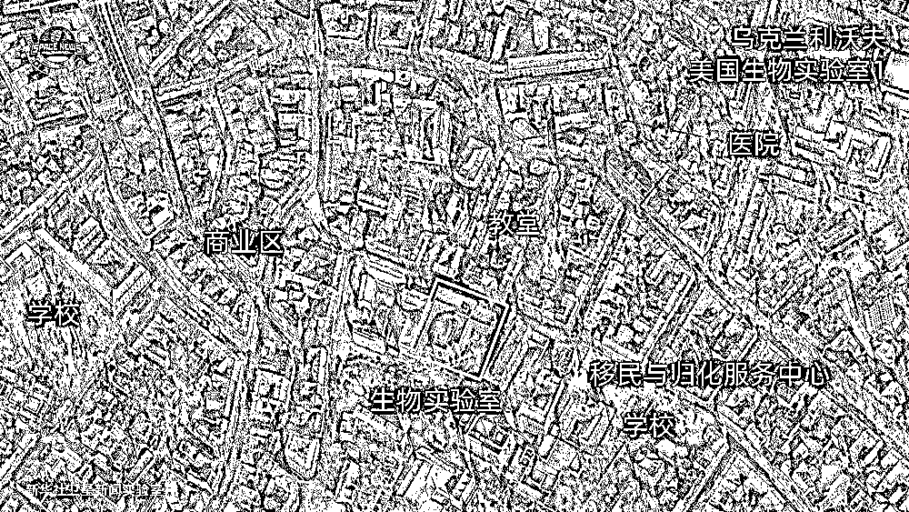

在美国支持下建立的一处生物实验室——利沃夫流行病学与卫生研究所。俄罗斯方面认为，美国人已将大部分数据库、生物材料和设备，从基辅、哈尔科夫和敖德萨的实验室转移到利沃夫流行病学与卫生研究所和美国驻利沃夫领事馆。

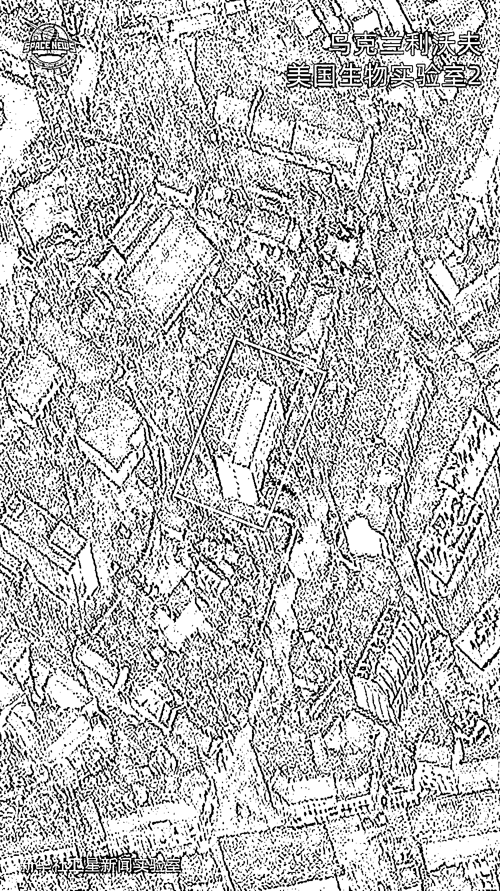

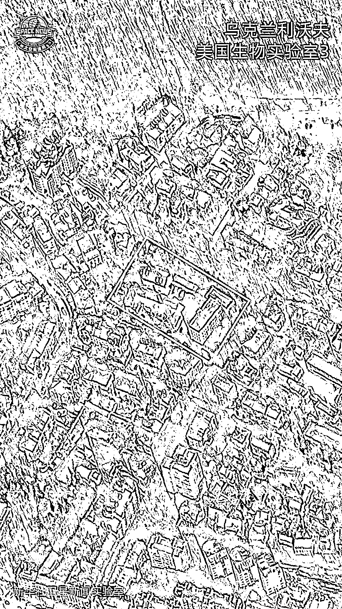

利沃夫的另两处美国生物实验室，其中一处是兽医实验室。俄罗斯军队获得的文件证明，代号为 UP-2、UP-9、UP-10 的项目针对非洲猪瘟、炭疽等。

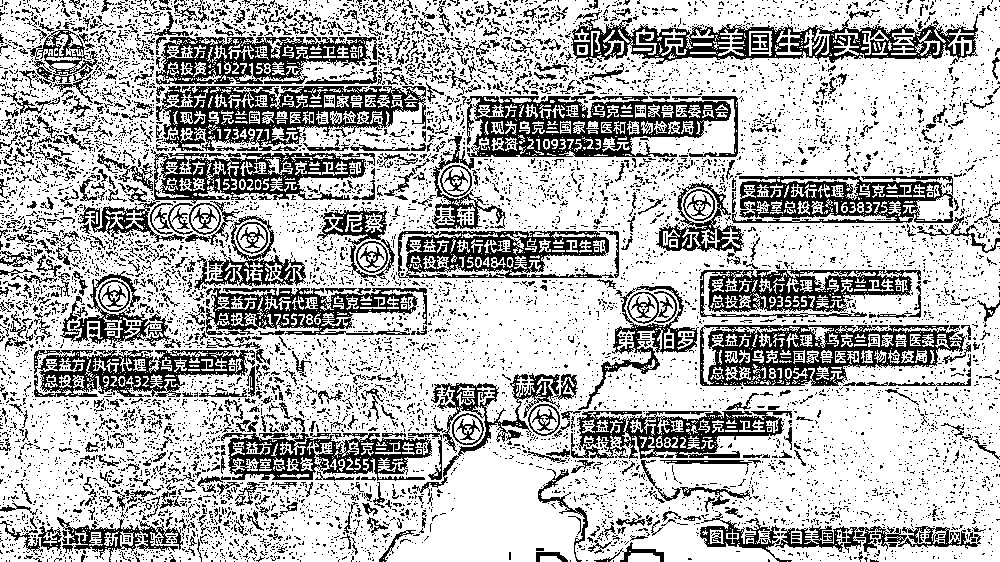

新华社卫星新闻实验室定位的 12 处美国生物实验室，分布于乌克兰的广袤国土，美国驻乌克兰大使馆网站公布的信息显示，美国共计投资超过 2400 万美元。

俄国防部公开的文件也显示，乌克兰卫生部长维克托·利亚什科要求医疗机构和实验室销毁一些生物病原体。该文件附有销毁危险生物材料的程序，俄方还找到了销毁病原体的记录副本。

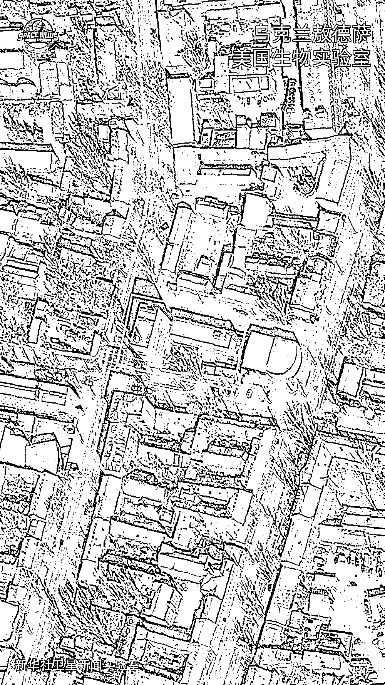

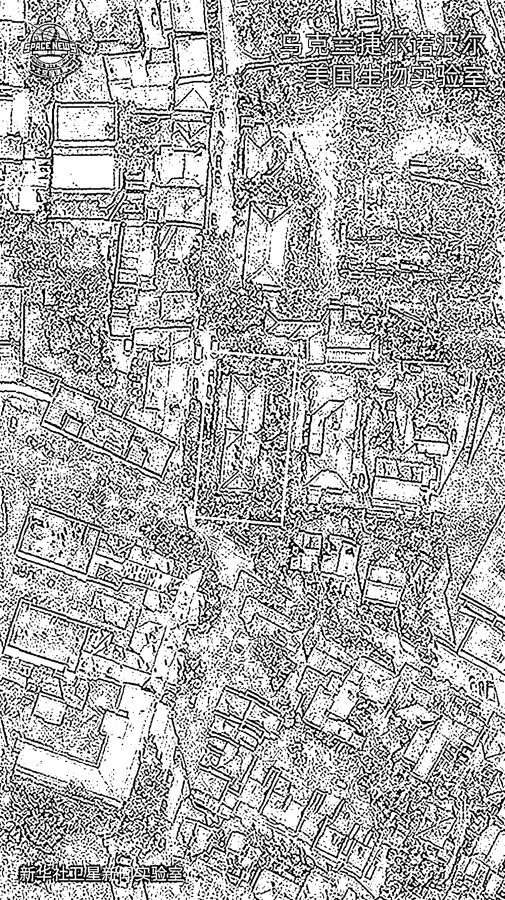

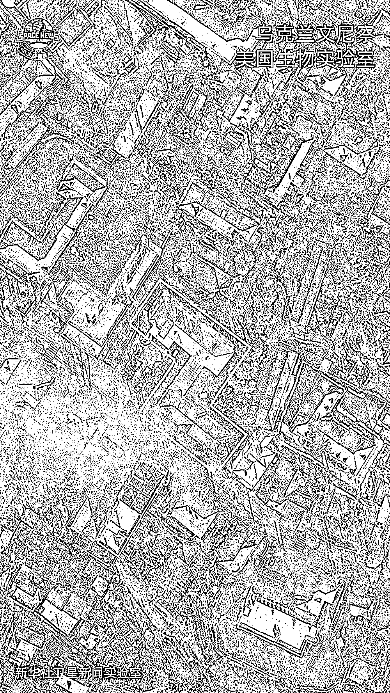

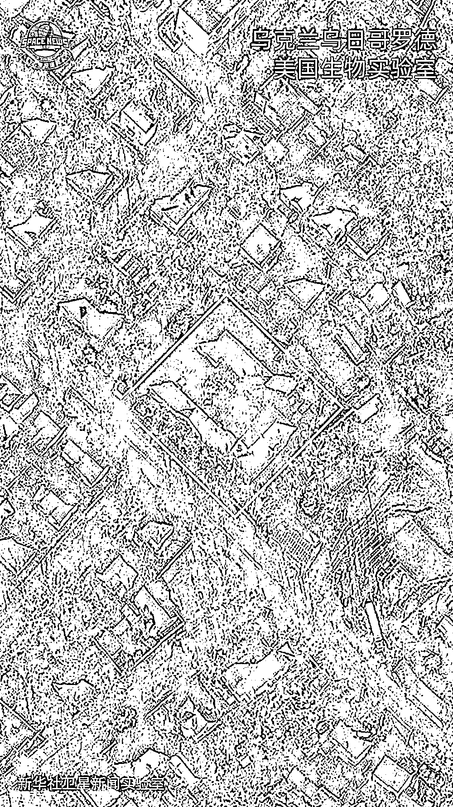

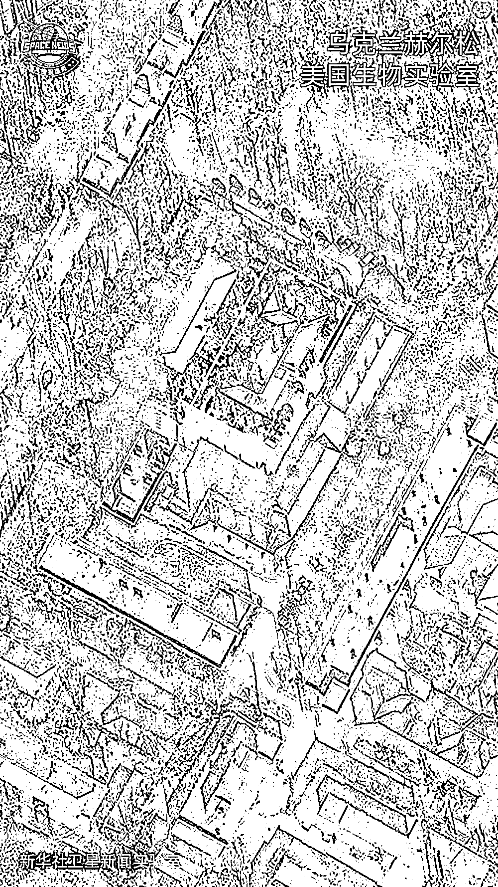

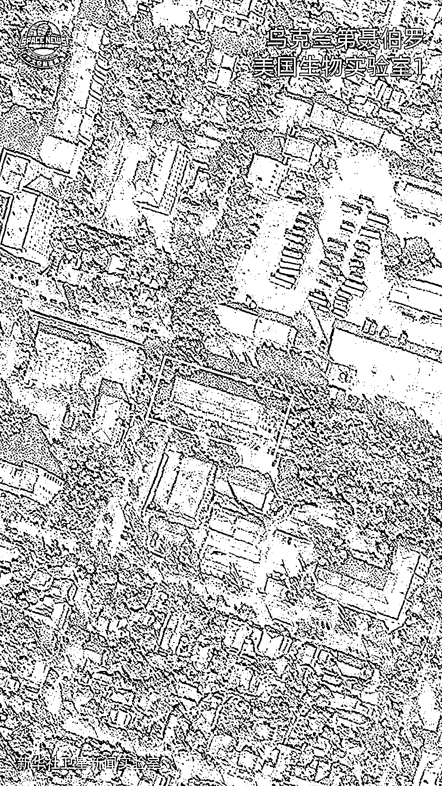

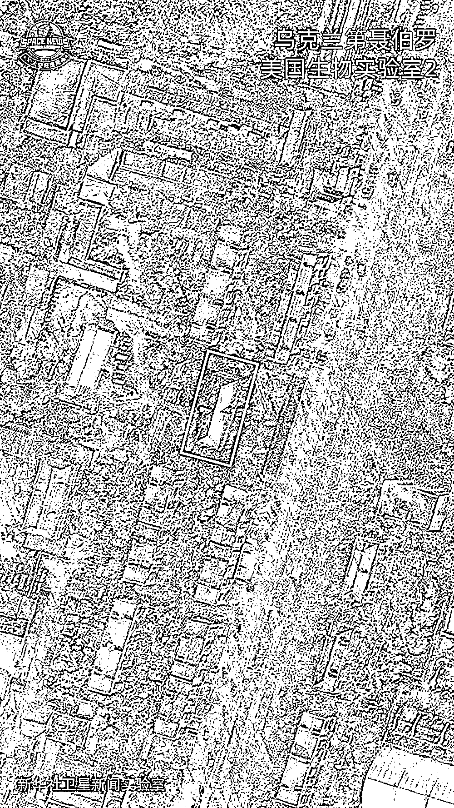

来源：媒体融合生产技术与系统国家重点实验室  出品 新华社卫星新闻实验室  制 新华地球  支持

← 向右滑动与灰产圈互动交流 →

