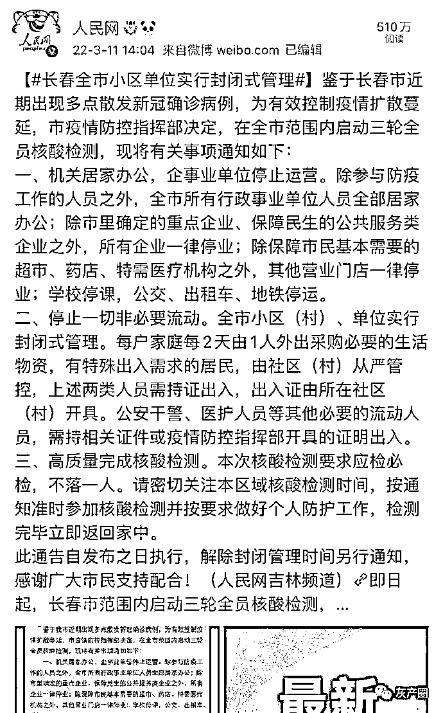
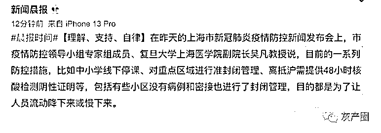

# 全国各城疫情大爆发，深圳暂停，杭州停业，威海静止，天津停课，就像回到了 19 年！

> 原文：[`mp.weixin.qq.com/s?__biz=MzIyMDYwMTk0Mw==&mid=2247531574&idx=2&sn=030fcae7c11bfcc7bbd25be5c6039906&chksm=97cbb70ea0bc3e1828918326b940b33c354f8ad817dd07fbe7755ddafc5532b32963c03f3623&scene=27#wechat_redirect`](http://mp.weixin.qq.com/s?__biz=MzIyMDYwMTk0Mw==&mid=2247531574&idx=2&sn=030fcae7c11bfcc7bbd25be5c6039906&chksm=97cbb70ea0bc3e1828918326b940b33c354f8ad817dd07fbe7755ddafc5532b32963c03f3623&scene=27#wechat_redirect)

继续动态清零不动摇，同时要把最近的局部疫情快速处置下去，这是一项艰巨的任务。 

尤其是看了这个热搜，让人想起了疫情开始的时候

深圳整个城市按下了“暂停键” 

是公共交通停了，通勤只能靠自己了

吉林长春早已进入“暂停”状态 

浙江杭州也“停业”了

山东威海全市进入“静止”状态 

上海也慢了下来

天津停课，减少社会活动 

南京，西安也都动静了 

大连虽然没有通报病例，却也被莫名其妙顶上了热搜第四，让这座饱受疫情之苦的城市人民胆战心惊

全国各地这么多疫情，网友不禁想起了没有疫情的日子

也畅想着疫情结束后的打算：

等疫情结束我们就去旅游…

等疫情结束我们就能东吃西吃到处逛逛…

等疫情结束我们就可以看 live 看演唱会看音乐节…

等疫情结束就不用戴口罩了…

等疫情结束就不用做核酸不用担心这担心那了…

等疫情结束就不用上网课了…

等疫情结束上班工作就可以正常出行了…

等疫情结束… 可疫情什么时候能彻底结束啊！！

真的好舍不得时间过去光阴流逝，但又无法可想无计可施无能为力的沮丧感

来源：微博那些事儿

← 向右滑动与灰产圈互动交流 →

