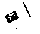
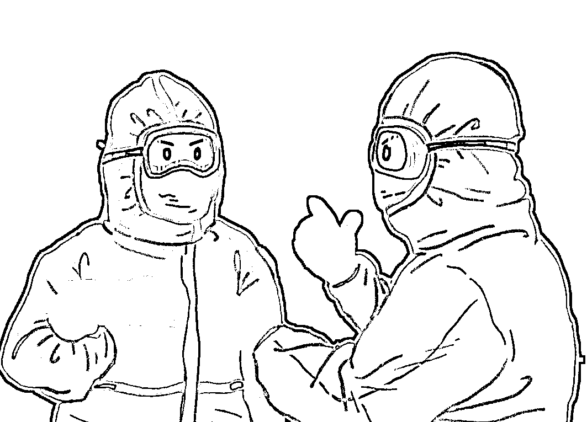
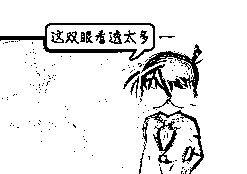

# 重磅提醒：不法分子正在借“疫”敛财，切勿麻痹大意！

> 原文：[`mp.weixin.qq.com/s?__biz=MzIyMDYwMTk0Mw==&mid=2247531574&idx=3&sn=afdb4b93c88db8d62fdc885889022233&chksm=97cbb70ea0bc3e183333f11cab264b1f046db7356cec029ce882f03e3e8e9cee0b66bac01a78&scene=27#wechat_redirect`](http://mp.weixin.qq.com/s?__biz=MzIyMDYwMTk0Mw==&mid=2247531574&idx=3&sn=afdb4b93c88db8d62fdc885889022233&chksm=97cbb70ea0bc3e183333f11cab264b1f046db7356cec029ce882f03e3e8e9cee0b66bac01a78&scene=27#wechat_redirect)

**在大家齐心抗疫期间**

**不法分子却以“疫”之名借机敛财**

**不少人上当受骗**

****以下诈骗手段一定要注意！****

****

****骗局一：冒充疫苗普查调查员类诈骗****

**骗子通过号商批量购买账号，伪装成“疫苗接种普查调查员”或“回访员”，以社区工作人员的名义添加好友，再将受害人拉群。** 

**群内发布刷单、赌博等违法违规信息，通过一单多任务拒返佣金、流水不足无法提现等套路诈骗钱财。**

****防骗提醒****

**刷单是违法行为，网赌十赌十输，大家要提高警惕，勿心存侥幸。此外，骗子多通过手机号码添加好友，一定要注意保护个人信息。**

****

****骗局二：声称健康码异常类诈骗****

**骗子伪装成“疫情防控中心”或“卫健委”工作人员，谎称健康码/检测报告/流调异常，要求前往公安机关核查。**

**攻破受害人心理防线后，主动提出将电话转接至“公安局”，以清查资金洗清嫌疑为由诈骗钱财。**

****防骗提醒****

****公安机关不会线上办案，更不会与涉案人员有金钱往来，以涉拐/经济犯罪/非法提取社保/阻碍疫情防控等理由要求清查资金的都是诈骗，务必警惕。****

********

******骗局三：声称“快递涉疫”类诈骗******

****不法分子以“快递被检出新冠阳性、无法送达”为借口，提出“快递虽然会被销毁，但会给快递收件人赔付”的解决方案。****

****之后，诈骗分子通过让当事人扫描二维码或下载 APP 填写快递赔付信息的方式，诱骗当事人透露身份信息、银行账号、短信验证码等，从而骗取当事人钱财。****

******防骗提醒******

******此类诈骗手法，归根结底还是属于“网购退款”类型的电信诈骗。当遇到所谓“客服”通过电话、短信、微信等任何非原购买渠道，声称“快递或订单出现问题进行退款赔付”的，一定不要轻信。******

******此时，应返回原购买渠道，或拨打快递公司官方客服电话，联系工作人员核实情况。切勿扫描未知二维码或下载来源不明的软件、APP 等，切勿随意透露个人隐私信息。******

************

********骗局四：虚假预约疫苗接种类诈骗******** 

******骗子冒充疾控中心工作人员，通过短信发送虚假的新冠疫苗接种信息，引诱群众点击含木马网址的虚假链接，套取个人信息，伺机实施诈骗。******

********防骗提醒********

********收到含有不明链接的手机短信，请千万不要随意点击。********

****************

**********骗局五：花钱购买核酸检测“快速通道”**********

******有一些着急做核酸检测、又怕麻烦、不愿意排队的群众，盲目相信有核酸检测的“快速通道”，不法分子就以“加价最快半小时拿到核酸检测结果”为名，对他们实施诈骗。******

********防骗提醒********

********我国的核酸检测结果，是由经卫健部门认证的、具备资质的医院或第三方检测机构出具。核酸检测根本没有所谓的“快速通道”，不要轻信网络上的小道消息和所谓的“私人渠道”。********

****************

**********骗局六：虚假“密接信息”类诈骗**********

******诈骗分子冒充防疫中心工作人员，以受害者是“密切接触者”为由，向受害者发送钓鱼短信，要求受害者进入点击短信中的链接填写个人信息，从而盗取受害者个人财产。******

********防骗提醒********

********不明链接不要点！如果收到相关短信，可以在国家卫生健康委推出的“同行密接人员自查”的小程序里先自行筛查。********

****************

**********骗局七：流调要求提供银行卡号********** 

******诈骗分子冒充防疫工作人员群发短信，在短信中，要求当事人必须在一定时间内到某地点进行核酸检验，否则将要承担一定的法律责任。短信中还附有一条链接，要求当事人按提示输入个人身份证、银行卡号码、密码等重要信息。******

********防骗提醒********

********防疫工作人员在进行流调（流行病学调查）时，不会询问与疫情防控无关的个人隐私信息，也不会发送任何链接或二维码，更不会要求被调查人输入银行卡或密码等信息。一旦遇到此类情况，一定要保持警惕，切勿轻信。********

# **********流调电话一定要接！但这个 4 个问题，他们绝不会问**********

********近期有些群众********

********接到有关疫情的电话随访********

********有人表示来电显示是个人手机号码********

********不会是诈骗吧？********

********先为警惕性很高的小伙伴点个赞！********

****************

********但其实********

********当前疫情形势严峻复杂********

********流调核查工作********

********正在争分夺秒加紧进行********

********请接到电话的群众********

********回答相关的问题********

********早一分钟排查，早一点排除隐患！********

****************

**********到底啥是“流调”？**********

**********流调都问啥？**********

**********在疫情防控中有啥作用？**********

**********市民应该咋配合？**********

**************************什么是流调？**************************

********到底干啥的？********

**********流调**，全称是流行病学调查，是传染病防控中非常重要的工作。**（通俗点来说，就是疾控部门调查可能感染病毒的人。）**流调是疫情控制的关键，流调收集的信息价值连城，能够起到有效遏制疫情的关键作用。流调的必要性和重要性，了解下：********

********01********

********追踪传染源，发现潜在的病例密切接触者；********

**********02**********

********流调信息是开展医学隔离、医学观察的基础；********

**********03**********

********描述性/分析性流行病学重要的基础数据来源；********

**********04**********

********挖掘信息、发现疾病传播规律、控制疫情扩散的基础；********

**********05**********

********卫生部门科学决策的重要信息来源；********

****************

********用一句话描述的话，流调就是一条 Vlog，描绘出主人公的点滴生活：旅行、逛吃、拍照、打卡……********

********更直白地说，流调就是要搞明白：在过去每一个重要时间里，你走过的路、遇到的人和发生的那些事儿。********

****************

********流调做的事情就是把“只是因为在人群中多看了你一眼”这句歌词拆开：********

**********都有哪些人？（人群间）**********

**********在哪个地方看？（空间）**********

**********又是在哪个时间看？（时间）**********

**********用专业术语来讲**********

********流调就要弄明白********

**********传染病流行病学三间分布**********

**********以求发现规律、采取措施、控制疫情**********

**************************流调都问啥？**************************

********需要获取哪些信息？********

********如果你收到流调电话，可能是你近期与确诊者或感染者有过密切接触，但是你又不知道自己在哪里接触过，所以流调人员将会问你以下信息，用来追踪病毒的传播路径。********

****************

**********01**********

********个人信息********

******你姓甚名谁？是何方人士？年龄几何？家住哪里？家有几人......（不是查户口的，但问得可能比查户口还详细。）******

********02********

********疫区旅游史********

******去哪里旅行过?走过的路?到过的地方……******

********03********

********疫区居住史********

******你的老家在哪个屯？回去住了没......******

********04********

********病例密切接触史********

******同乘旅客、近距离交流、居家成员、同事同学、玩耍麻友、围观群众……（密接会由公共卫生专业技术人员进行科学判定。）******

********05********

********搭乘交通工具情况********

******是否乘坐飞机、火车、汽车、轮船……（疫情期间，请呆在家里，不要到处浪了。）******

********06********

********其他必要信息********

******任何对疾病防控有用的信息。******

******总之，流调就是要搞明白******

******在过去重要时间段里******

******你走过的路、遇到的人******

******和发生的那些事儿******

******是否有传播疾病的可能******

******或被传染疾病的风险******

******流调就是拨开迷雾，找出真相******

******非常时期，请一定配合******

********需要提醒的是********

**********流调工作人员在表明身份后**********

**********会询问以上信息**********

**********但是不会询问财产等**********

**********与疾病传播不相关的问题**********

**************************流调会保护隐私吗？**************************

********隐私保护是绝对的！********

********看到上述要获取这么多信息，可能有人要问了，会保护隐私吗？********

**********隐私保护是绝对的！**********

********流调获得的所有信息都是严格保密的，保护个人隐私是医学伦理和职业道德的要求，也是法律的明确规定，更是开展一切医疗活动前提。********

********跟临床医生一样，只有获得准确疾病信息，才能给出正确的诊断和诊疗方案；流调人员获得真实、有效的人群信息，才能科学评估疫情动态，采取正确的防控措施！所以，如遇流调人员登门拜访或电话流调，请一定要主动、合作、信任！********

# **********接到流调电话不要慌！3 招教你识别对方真假**********

**********蜀黍教你 3 招识别********** 

**********到底是不是诈骗电话**********

**********一**********

************看“外形”************

********************

**********其实很多诈骗电话**********

**********光从外表看就可以判断**********

**********1.**国际**来电，特别是开头有个“＋”的电话，基本都是诈骗电话！别接！**********

********2.不显示归属地的电话，或者归属地显示为“未知”的电话，基本都是诈骗的！别接！********

********特殊时期******** 

********显示本地的固话或手机来电********

********务必要接听！********

********听过之后再做判断方是明智之举********

**********二**********

**********听“内容”**********

****************

********流调会询问一些个人信息********

**********流调电话咨询的问题大多是以下这些：**********

| **个人 信息** | 姓名、年龄、家住哪里家里有几人、现在位置…… |
| **健 康
状
况** | 近期可有不适？近期是否就医？是否有发烧咳嗽等异常情况是否做过核酸检测… |
| **疫区 旅游史** | 是否去疫区旅行过、经停过走过的路，到过的地方… |
| **疫区 居住史** | 你的老家在哪？回去住了没？ |
| **病例 密切
接触史** | 同乘旅客、近距离交流、居家成员、同事同学、围观群众… |
| **交通 工具** | 是否乘坐飞机、火车、汽车、轮船…… |
| **其他必要信息** | 仅限对疾病防控有用的信息 |

******认真配合流调的群众请放心******

********你们的个人信息和隐私********

********将受到法律保护********

******虽然为提高流调工作效率******

******部分流调工作会使用**AI 智能语音********

******但问题是按照上面的标准流程来******

********如果对话涉及以下这些方面********

********那就绝对是诈骗电话了********

| **①** | **询问银行账户、财产情况等不相关的问题** |
| **②** | **索要银行密码或验证码** |
| **③** | **以各种理由发送二维码让流调对象扫描** |
| **④** | **以各种理由发送链接让流调对象点击** |
| **⑤** | **推销药物或以各种理由要求流调对象付费** |
| **⑥** | **以各种理由要求流调人员加入 QQ 群、微信群** |
| **⑦** | **以任何理由让流调对象转账和进行所谓的“资金核查”** |

********三********

**********试“回拨”**********

****************

********流调人员所使用的的电话********

********基本都是本地固话或手机号********

********如果有不放心********

********挂了再打回去********

**********无法正常回拨的电话**********

********大部分是诈骗电话********

************

********提示大家********

**********防骗的同时一定要记得**********

********积极配合流调工作********

********务必提供准确信息********

********故意隐瞒情况********

********将承担法律责任********

********感谢每个积极配合防疫工作的你********

********这场战“疫”，有蜀黍陪你！********

******来源：十堰人民路派出所，防骗每日资讯******

************

******← 向右滑动与灰产圈互动交流 →******

************

 ******# 

> 原文：[`mp.weixin.qq.com/s?__biz=MzIyMDYwMTk0Mw==&mid=2247531574&idx=4&sn=6a56f216bde730dbca1937b856b68e12&chksm=97cbb70ea0bc3e18d504b601e974f5d00f95ad2d96648d38b27f1eb4fcc26b707444db802e4b&scene=27#wechat_redirect`](http://mp.weixin.qq.com/s?__biz=MzIyMDYwMTk0Mw==&mid=2247531574&idx=4&sn=6a56f216bde730dbca1937b856b68e12&chksm=97cbb70ea0bc3e18d504b601e974f5d00f95ad2d96648d38b27f1eb4fcc26b707444db802e4b&scene=27#wechat_redirect)******