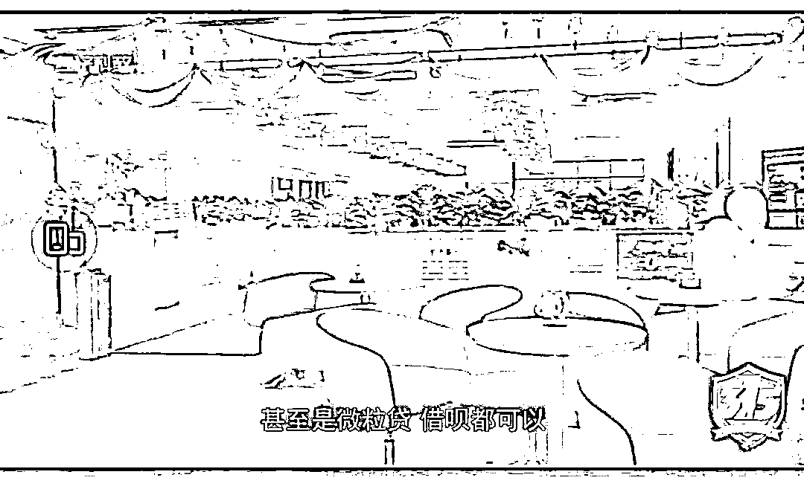

# 12 省市电视台 315 行动大联播：这些企业被点名了

> 原文：[`mp.weixin.qq.com/s?__biz=MzIyMDYwMTk0Mw==&mid=2247531574&idx=5&sn=b0432e05a2f9ea5df9681f783de720fc&chksm=97cbb70ea0bc3e1821e7db58d0689215c1510e920868116c5f31ded06054e5ec0b23e3c8cc60&scene=27#wechat_redirect`](http://mp.weixin.qq.com/s?__biz=MzIyMDYwMTk0Mw==&mid=2247531574&idx=5&sn=b0432e05a2f9ea5df9681f783de720fc&chksm=97cbb70ea0bc3e1821e7db58d0689215c1510e920868116c5f31ded06054e5ec0b23e3c8cc60&scene=27#wechat_redirect)

又到了一年一度的 315，除了明天晚上的央视 315 晚会重头戏外，12 省市电视台在今日开启 315 行动大联播，曝光各行业消费者投诉案例，保护消费者权益。

据了解，参与直播的有北京、湖北、河南、贵州、福建、河北、天津、浙江、成都、湖南、广东、江西省市电视台。

**具体直播安排：**

10：00 广东经视频道@广东经视 （不直播）

11：00 成都公共频道@看度新闻 （图文宣推）

12：00 北京生活频道@生活这一刻

13：00 浙江民生休闲频道 @1818 黄金眼

14：00 福建综合频道 @第一帮帮团

15：00 河南民生频道 @大参考

16：00 贵州公共频道 @百姓关注 

17：00 江西都市频道@都市现场 

18：00 湖北电视经济频道@经视直播官方微博 

19：30 天津都市体育频道

21：00 河北都市频道@河北都市频道官微 

22：00 湖南都市频道 @芒果都市

接下来，我们来看一下这次的全国 12 省市 315 行动大联播到底曝光了哪些企业和消费热点问题。

**“掉进钱眼的某同城”**

据江西都市频道报道，江西南昌的黎先生在某同城上应聘货车司机，却遭遇“套路”贷款买下 10 万货车。

此外，调查还发现，只要钱给到位，某同城上根本不存在个人隐私。招聘企业购买 VIP 套餐后，就可以查看平台上所有求职者的简历信息，求职者被骚扰已是常态。

为了推销会员套餐，某同城员工提出“可以用旧的营业执照替代新的”。此外，销售人员还随意捏造数据，目的就是为了让企业购买会员。

调查发现，只要招聘企业花钱购买 VIP 套餐，甚至能发布涉及“灰色产业”的招聘信息。

**深陷灰色产业漩涡的某鱼**

据报道，调查发现某鱼 APP 上搜索“陪”找到一名卖家，对方在付款后就发来了不堪入目的色情视频，对方还表示提供色情的表演服务。

此外，在某鱼 APP 还有卖所谓“原味丝袜、内裤”的卖家，而某鱼卖家表示这还不算重口味，“拉的臭臭、厕所纸、口水”都能卖。

在某鱼上搜索隐晦关键词，就能找到“线下色情交易”的入口。记者加上其中一位卖家的微信，对方发来几十个线下定位，每一个地址都有“失足妇女”提供色情服务。

**某特上买品牌洗衣机到手却是山寨货**

有消费者在某特 APP 上购买“小天鹅”牌洗衣机，到手的却是山寨货“天鹅山”。买到假货，该消费者想走法律程序维权，却发现维权无门。调查发现，发现该产品从销售到生产，注册公司全为“空壳”。

**双汇食品安全问题堪忧**

**招聘操作不规范、走过场** 

记者调查发现，在南昌双汇生产车间，存在工作服发黑发臭、猪排落地直接装袋入库等情况，而且消毒环节太随意、风淋系统形同虚设，食品安全问题令人担忧。

除了食品安全不过关，南昌双汇还存在招聘操作不规范，考试走过场，厂里启用外包公司逃避劳动法 ，体检造假直接上生产线等情况。

**大众探岳遭全国多地车主投诉**

据报道，大众探岳出现颗粒捕捉器问题，导致汽车油耗成倍的增长。不少消费者反映在所谓的升级优化后，问题并未解决。

一汽大众工作人员称是个案，实际上以上情况并非个例。一位消费者表示在一个维权群就有四百多人，来自全国各地。

**某鸟电子面单上的推销广告或涉嫌虚假宣传**

有消费者反映，通过某宝购物收到快递时，发现快递面单上会不同的推广二维码。而扫码后会出现抽奖活动，最后需要填写个人信息，一旦填写将面临商家疯狂电话推销。

调查发现，这些快递面单抽奖广告发布方为浙江某鸟供应链管理有限公司，涵盖“四通一达”。某鸟工作人员，广告后台跟某鸟云打印相关联，广告主还能选择省份、地域、年龄、性别、职业，进行个性化投放。

湖北省消费者委员会法律事务部主任胡翠兰表示，快递面单二维码表面是抽奖广告，而扫码后却是其他产品的付费广告，这涉嫌虚假宣传，某鸟平台作为快递面单广告发布方需要对广告真实性负责。其次，通过广告获取消费者信息，如果出于非法使用目的，明显违反了个人信息保护法。

**火车票“加速包”还没 12306 快**

**某程、智行火车票、某猪被点名**

在火车加速包的调查中，记者先后在某程网、智行火车票、某猪旅行三家网站购买了加速包服务，却都没有买到火车票，但最后只有飞猪旅行退还了加速包费用。

某程旅游网客服工作人员称，消费者购买加速包，平台就已提供了服务，原则上是不退的。实际上，铁路部门已经多次发出提醒，建议旅客不要盲目相信第三方网站提供的加速包，12306 网站的候补功能，同样有机会成功购票。

在黑猫投诉平台上，不少消费者反映某程网加速服务购票没有 12306 官网快。此外，中途取消加速包或者退票，相关费用不退还的投诉也比比皆是。

**广东 315 晚会**

今日，广东经视除了参加 12 省市 315 大联播外，还举办了一场 315 晚会。在晚会上，汽车、金融、房地产、食品等领域的消费热点被关注，也有一些企业被点名。

**组织人员在相亲活动充场**

**诱导用户贷款**

**世纪佳缘、百合网被点名**

广东 315 晚会还曝光了在线婚恋平台组织虚假相亲活动的问题。

据报道，世纪佳缘、百合网在组织线下相亲活动时，会招聘人员在相亲活动充场，充场最低一天费用有 70、80 元的收入。

而这种充场和虚假牵手的情况普遍存在。

此外，调查还曝光世纪佳缘还存在诱导会员在网络平台贷款。

**多家银行办贷款捆绑信用卡、存款等**

晚会还曝光了银行办理贷款需捆绑信用卡、存款等条件的问题。

在报道中，中国银行、中国农业银行、华夏银行等银行被曝光。

而相关规定明确指出，贷款不得以存款作为审批和发放贷款的前提条件。

**车保养后续航大缩水**

**威马汽车被质疑“锁电”**

不少威马车主反映车子在保养后续航大幅缩水，续航甚至打了四折，另外充电也变慢了。

车主们怀疑电池充电的显示，被专业手段进行了操控，疑有偷偷“锁电”的情况。

对此，威马工作人员称没有进行“锁电”的操作。不过检测机构表示，测试的三辆威马汽车充满电与实际可用容量有不小的差距，送测的威马汽车有被通过技术手段调低电池可实际使用容量的可能。

来源：三言财经

← 向右滑动与灰产圈互动交流 →

