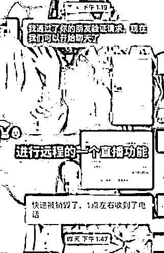
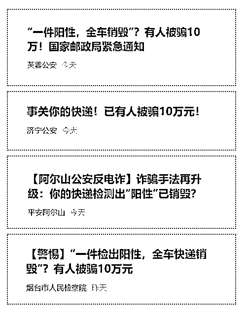

# 快递检测出新冠阳性？！你的包裹中招了吗？

> 原文：[`mp.weixin.qq.com/s?__biz=MzIyMDYwMTk0Mw==&mid=2247531574&idx=6&sn=393f96145d007b32724fd7f03207661e&chksm=97cbb70ea0bc3e18ae1ec255ce2b97ed072b5ed9b5f5d1e00a47c734989778369b4c5c7bcf34&scene=27#wechat_redirect`](http://mp.weixin.qq.com/s?__biz=MzIyMDYwMTk0Mw==&mid=2247531574&idx=6&sn=393f96145d007b32724fd7f03207661e&chksm=97cbb70ea0bc3e18ae1ec255ce2b97ed072b5ed9b5f5d1e00a47c734989778369b4c5c7bcf34&scene=27#wechat_redirect)

**近期，关于检出快递包装核酸阳性的消息引发广泛关注。**

有诈骗分子借此大做文章，利用“快递感染”迷惑市民，招摇撞骗，致很多人落入圈套。

如果有人告诉你

**“你的快递被检出新冠阳性”**

你是不是不敢收了？

如果这时候“快递公司”告诉你

**这个快递将被销毁**

**然后会对你进行赔付**

你会不会欣然接受？

近期，王先生报案称自己遭到网络诈骗。他接到自称某快递公司的电话，说他的快递在运输过程中被检测出新冠阳性，快递将要被销毁，但是要按流程对他进行赔付。对方还准确说出了他的个人信息以及快递单号，因此，王先生并没有心生怀疑。接着对方便发来二维码让王先生扫描，王先生扫码后详细填写了自己的银行账号、密码、验证码等信息，结果显示验证码超时。这时，对方又让他下载一个名为“腾讯会议”的 App 进行远程直播，指引他一步步操作。

王先生按照流程操作后，发现他的账户出现 4 笔网络支付，总计超过 5 万元。

在上述案例中，王先生在扫描对方二维码填信息时，银行账户、密码、验证码都泄露给了对方，对方就可以用他的账号进行支付，这就是典型的冒充“快递客服”诈骗。骗子升级了诈骗手段，利用了人们在疫情防控期间的心理，降低大家的防范意识，迷惑性更强！

** 注  意 **

**如果你遇到了包裹检测呈阳性，要对你进行赔付的情况，可千万要提高警惕！**

**大家千万警惕类似骗局 **

****

**** 套路揭秘 ****

****警方表示，在上述案例中，王先生的银行账户密码验证码都泄露给了对方，对方就可以用他的账号进行支付了。**这就是冒充客服的网购类诈骗，但是骗子更新了手段**，利用疫情防控这个借口引人入局，隐蔽性很强。****

********

****** 警方提醒******

******1、骗子通过电话或短信联系被害人，**能详细说出受害人的个人信息等内容；********

****2、谎称其购买的货物有问题，让受害人添加“官方客服”微信、登陆“官方网站”等进行退款理赔；****

****3、**以受害人支付信用不足无法到账等借口，**一步步诱使受害人转账或在伪造的“网站”填写银行卡号、密码等信息，将受害人钱财转走。****

****▼**另外，在接到陌生电话时注意这些细节才能防止被骗******

****1、接到陌生电话必须核实对方身份，对于自称工作人员的人，要**通过官方渠道进行核实；******

****2、得知网购包裹被丢失的消息后，应第一时间与平台卖家取得联系，同时拨打快递公司**官方热线**咨询确认；****

****3、对于所谓“客服”发来的退款链接或二维码，**不点击、不扫描，**避免遭受钓鱼网站和木马病毒的侵害；****

****4、银行发来的**验证码**是银行账户内钱款的最后一道防线，任何时候都不要泄露给陌生人。****

****来源：昆明反诈骗，邯郸市反诈中心****

********

****← 向右滑动与灰产圈互动交流 →****

********