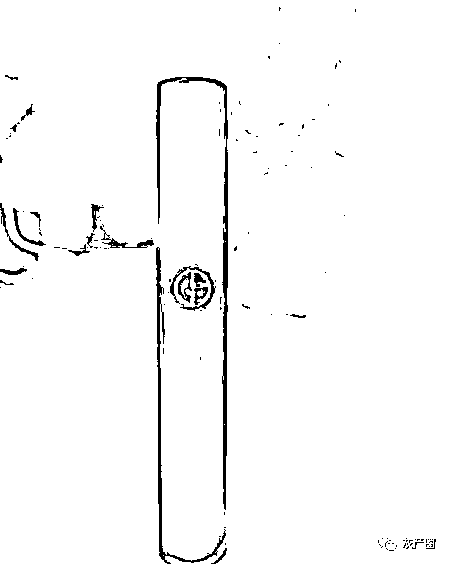

# 已婚女子迷恋“缅甸男友”，办卡帮他裸聊,结果...

> 原文：[`mp.weixin.qq.com/s?__biz=MzIyMDYwMTk0Mw==&mid=2247531574&idx=7&sn=a15a2352dba64610e1acdc0d52256864&chksm=97cbb70ea0bc3e18f48b4ad82945280df0c9af55c3422156a91161b514651a9bfaa1bf2045f4&scene=27#wechat_redirect`](http://mp.weixin.qq.com/s?__biz=MzIyMDYwMTk0Mw==&mid=2247531574&idx=7&sn=a15a2352dba64610e1acdc0d52256864&chksm=97cbb70ea0bc3e18f48b4ad82945280df0c9af55c3422156a91161b514651a9bfaa1bf2045f4&scene=27#wechat_redirect)

婚外认识

在缅甸“工作”的男子陶永江

（已被追逃）后，

郑小青沉迷“爱情”，

明知陶永江干的是诈骗的犯罪勾当，

还是把自己名下的

数张银行卡交给陶永江，

用于收取、转移违法所得 17 次，

自己还主动帮忙转移钱款 8 次，

涉案金额共计 30 余万元。

近日，

上海市青浦区人民检察院

以涉嫌掩饰、隐瞒犯罪所得罪、

帮助信息网络犯罪活动罪

对郑小青提起公诉。

**网恋遇见“爱情”**

郑小青与丈夫婚后聚少离多，她一个人在家，常觉得寂寞，便通过网络社交 App 结识朋友寻欢作乐。2020 年 11 月 23 日，郑小青通过一视频聊天 App 认识了男子陶永江，郑小青被陶永江的英俊外表和幽默谈吐所吸引，又听陶永江介绍自己在缅甸做生意，认为他事业有成，当晚两人便加了微信好友。

随后的几天内，郑小青每天都和陶永江视频聊天，她觉得自己遇见了久违的爱情。11 月 26 日晚，陶永江忽然联系郑小青借用银行卡账号，并解释称自己“正在美国出差，临时需要工作收款，但自己的支付宝和银行卡都无法使用”。郑小青听了没有怀疑，陶永江便用语音电话指导她进行操作，不一会儿郑小青的两张银行卡内便分别转入 5 万元及 3.5 万元。郑小青注意到两笔款项的转入人名字都叫魏琪，但她并没有放在心上。随后陶永江又指导她将这 8.5 万元全部转入自己的支付宝账户。

陶永江十分高兴，对郑小青一番甜言蜜语后还给她买了一只价值 520 元的唇膏，收到唇膏的郑小青认为陶永江是在对自己表白，于是更加沉迷这段“爱情”。

青浦检察院供图（下同）

**怀疑诈骗痴心不改**

几天后郑小青心中忐忑起来，脑中反复回想 26 日晚上转来的那两笔款项，终于忍不住提出质疑。陶永江准备好了许多理由，郑小青虽然怀疑，但陶永江承诺自己过年期间会回国，又不断暗示会对郑小青很好，再次将她安抚住。

此后，陶永江又多次让郑小青将自己所有的银行卡邮寄给他使用，但收件地址却在深圳，收件人也并不是陶永江，而是一个女性的名字。陶永江还让郑小青陆续办理了多张新的银行卡，将卡寄给陶永江使用后，郑小青发现经常有数千至数万元的款项半夜三更打入自己卡内，紧接着陶永江便会要求郑小青把这些钱转入他的支付宝。

这样的情况持续一段时间后，郑小青猜测陶永江是在进行违法犯罪行为，她起先还试图通过争吵了解转账真相，但陶永江总是支吾。一次视频电话时，郑小青看到陶永江和另三名男子正在与他人打电话，面目狰狞地威胁：“让你转钱就转钱，别磨磨唧唧的，不要名声了是吧！”

此时，郑小青已明白陶永江的钱来路不正，但她认为这和自己关系不大，心存侥幸与他继续来往。甚至在从未见过面的情况下，仍放心地将自己所有银行卡的密码交给陶永江，让陶永江自己进行钱款的转账。

**小伙遭遇裸聊诈骗**

2020 年 11 月 26 日晚上 8 时，家住上海市青浦区的小伙魏琪通过交友软件结识了一名“年轻美丽的女子”。名叫“妍妍”的女子与他聊了一会儿后便提出视频，并发来一个陌生网站的下载链接，让魏琪通过链接下载一视频聊天 App，并诱惑：“我们去这 App 上聊点刺激的吧。”

魏琪经不住诱惑，刚下载注册完毕，妍妍便给魏琪打来视频电话，魏琪接通后发现对方果然长相甜美可爱，虽然与交友软件上的头像不同，但也是个美女。刚说了没几句，妍妍便开始主动脱去衣服、抚摸自己并作出性暗示的动作，同时要求魏琪也展露自己的私密部位。

几分钟后，视频聊天突然中断，妍妍给魏琪发来一个文件夹。魏琪打开一看，正是刚才自己与对方裸聊的视频录像，妍妍又发来魏琪手机通讯录中所有联系人信息，告诉他：“兄弟，你的视频还有通讯录都看见了吧。”魏琪惊慌失措，才知道对方根本不是美丽女子，而是男性诈骗分子。此时为时已晚，对方要求魏琪转账 3888 元到他的账户，不然就“把视频群发给通讯录里的亲朋好友”。

魏琪不得不转账过去，但马上对方又打来语音电话，一个男子称自己是技术人员，说：“你的视频在我这里有备份，如果想把备份也删除的话需要再支付 4 万元人民币。”这次对方又给了魏琪一个新的银行账户，魏琪再次转账。

两次转账之后不久，对方又打来语音电话，这次另一个陌生男子称自己是“老板”，要求魏琪缴纳“封口费”12 万元并分成多笔支付，同时给他多个银行账户。魏琪此时已经后悔不已，一笔笔钱款转账出去已令他难以承受，不得不找借口向朋友借款。随后的几天内，又有了第四次、第五次电话，要求转账的金额也一次比一次高，最后魏琪在被敲诈勒索 60 万余元后终于选择报警。

**“旅游”归来终落网**

警方通过追查发现有两个收款账户的开户人是郑小青，此时，郑小青正受陶永江的邀请前往缅甸旅游，回到国内不久，她就被警方抓获。

经审查，郑小青主观上存在对陶永江进行违法犯罪活动的概括性认识，已经意识到自己的行为会帮助他人实施犯罪行为，但仍然存在侥幸、放任的心态，多次为陶永江提供犯罪援助，行为已触犯《中华人民共和国刑法》，检察机关以涉嫌掩饰、隐瞒犯罪所得罪、帮助信息网络犯罪活动罪对她提起公诉。

**温馨提示**

根据《中华人民共和国刑法》第三百一十二条之规定：明知是犯罪所得及其产生的收益而予以窝藏、转移、收购、代为销售或者以其他方法掩饰、隐瞒的，处三年以下有期徒刑、拘役或者管制，并处或者单处罚金。

根据《中华人民共和国刑法》第二百八十七条之规定：明知他人利用信息网络实施犯罪，为其犯罪提供互联网接入、服务器托管、网络存储、通讯传输等技术支持，或者提供广告推广、支付结算等帮助，情节严重的，处三年以下有期徒刑或者拘役，并处或者单处罚金。

随着互联网的发展，网络化情感——网恋也应运而生。许多人都认为网恋既虚幻又浪漫，让人心生遐想，为生活增添趣味。可是，如果在网恋过程中没有理性分析、正确认识，缺乏自我保护意识、法律意识，则很容易受到欺骗或伤害。

在网恋过程中，一定要提高警惕，防止因过度信任而透露较多个人信息，注意保护自身财产，切莫进行金钱往来，同时谨慎分析对方言语目的，防止被洗脑进入不法组织。无论何时都要保持理智，遇事多思考，切莫沉迷网络爱情陷阱。

来源：全缅见闻，阻击诈骗

← 向右滑动与灰产圈互动交流 →

