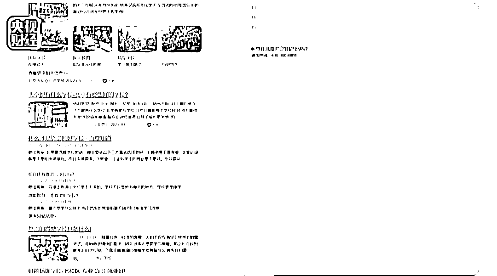

# 看完“315 晚会”，我晒干了沉默……

> 原文：[`mp.weixin.qq.com/s?__biz=MzIyMDYwMTk0Mw==&mid=2247531669&idx=2&sn=9445b30a26ea8a09383deba893a95b02&chksm=97cbb7ada0bc3ebb9be3f2aa864fff6f1b1a0ff406e0129fa5a79efc561f1049f436c48ce554&scene=27#wechat_redirect`](http://mp.weixin.qq.com/s?__biz=MzIyMDYwMTk0Mw==&mid=2247531669&idx=2&sn=9445b30a26ea8a09383deba893a95b02&chksm=97cbb7ada0bc3ebb9be3f2aa864fff6f1b1a0ff406e0129fa5a79efc561f1049f436c48ce554&scene=27#wechat_redirect)

一年一度的“315 晚会”又来了！ 

磨拳霍霍打开电视，

果不其然， 

看到那些被曝光的厂家和商品，

依然是这个表情：

**美女主播实为“抠脚大汉”**

**直播间里刷一个“嘉年华”礼物需要 3000 元，**

**一个“帝王套”甚至需要 18000 多元……**

**是什么让“榜一大哥”不断掏钱刷礼物、打赏？**

**哈尔滨的聚享互娱传媒有限公司号称全国十强直播公会，**

**下辖 30 多家分公司和加盟伙伴，**

**拥有 3000 多名签约艺人、2000 多间直播间。**

**据了解，**

****该公司旗下不少女主播背后****

****都有男运营在“忽悠”粉丝打赏！****

****男运营会冒充女主播，****

****与粉丝“大哥”在直播平台私信聊天，****

****拉近距离后，****

****男运营还会趁机添加上粉丝“大哥”的微信，****

****冒充女主播叫粉丝“大哥”老公、亲爱的，****

****内容极为露骨，毫无底线……****

**** 

**在记者的暗访中，**

**男运营称一位已经分手的粉丝大哥**

**“没有借钱能力了，**

**支付宝，亲戚朋友啥的全不行了，**

**信用卡全让我给干空了”。**

**还有大学生连续每天刷礼物超过 1000 元，**

**男运营嘲笑道：**

**“慢慢的老师都能给他劝退了，**

**我谁都不带可怜的，**

**有这种人我往死整他们”。**

****

****“315 晚会”曝光****

****“女主播微信实为男运营专骗粉丝大哥”后，****

****该公司旗下被曝光的主播伍伍正在直播时，****

****其直播间被抖音官方封禁。****

****翡翠直播，全靠演技****

****除了秀下限打擦边球，****

****消费粉丝的信任和情感，****

****在直播中设置价格欺诈陷阱也屡见不鲜。****

****“亏本买卖！大出血！****

****商场卖你 4000 多元，****

****我直播间 198 元，上！”****

****疯狂的翡翠直播背后到底隐藏多少不为人知的秘密？****

********

****不少翡翠直播宣称，****

****主播在缅甸曼德勒矿区现场砍价，****

****为粉丝代购。****

****事实上，****

****直播是在承泽翡翠位于昆明市的一栋办公楼里，****

****货主身着缅甸服装，****

****现场布景均为伪造。****

********

******所有主播的“专业”身份也都是编造的，******

******而那些“高货低卖的亏本买卖”******

******一般都比进货价高出一倍左右******

******所谓的“出血砍价”，******

******只不过是主播和货主表演的双簧。******

************ 

****记者了解到，****

****不少直播间所卖的原石，****

****一般都是从市场上借来的，****

******被粉丝拍到后，******

******他们不会将原石直接寄出，******

******而是诱导粉丝做成成品，******

******然后在市场上找个材质看上去大体相当的廉价成品，******

******寄给粉丝。******

************

******“315 晚会”曝光翡翠直播间借高价原石发廉价成品后，******

******其中提到的“点淘 app”上的******

******“石力派直播间”正在直播卖货，******

******在收到大量评论“‘315 晚会’正在曝光你家”后，******

******该直播间于 20:32 分中断。******

******水军操纵搜索结果******

******你有没有感觉，******

******有时在问答、百科、论坛等寻求帮助时，******

******看到一些问题和答案，******

******就会不自觉跟着走？******

******英迈思，******

******是一家为企业提供口碑服务的互联网技术公司，******

******宣称专为企业打造品牌、搜索、******

******口碑的闭环私域流量池。******

************

********其实你看到的问题和答案，********

********很多都是由一些“企业提供口碑服务”的互联网技术公司********

********冒充真实用户“自问自答”做出来的。********

************

******例如，******

******在一组关于元宇宙概念产品的问答中，******

******其中一个问题涉及元宇宙虚拟地产投资，******

******回答内容称投资虚拟地产正值火热，******

******并称自己在某公司平台投资虚拟地产。******

******除了雇佣水军冒充真实用户自问自答误导网民外，******

******口碑营销公司还有一种技术“万词霸屏”，******

******通过对上万个海量关键词的设定，******

******让用户在搜索时，******

******被推广公司始终能排在前面。****** 

******比如，******

******口碑公司为某国际学校做的万词霸屏时，******

******当有家长搜品牌校区、靠谱小学、靠谱校区，******

******这所国际学校都会排在靠前的名次。******

************

********而对于一些用户发布的批评性报道、用户投诉等，********

********口碑营销公司也会利用技术手段，********

********直接让网页显示成，********

********找不到内容的 404 页面。********

******“投诉内容本身实际上还是存在，******

******只是我们给它做了 404 屏蔽掉了。”******

************

********被脚丫子踩过的老坛酸菜********

******插旗菜业是湖南省华容县较大的蔬菜再加工企业，******

******为一些方便面企业代加工老坛酸菜包，******

********号称老坛工艺，足时发酵。******** 

******然而记者实地探访得知，******

******该企业标准化腌制池腌出来的酸菜******

******是用来加工出口产品的，******

******老坛酸菜包里的酸菜******

******则是从外面收购来的“土坑酸菜”。******

************

********工人们有的穿着拖鞋，********

********有的光着脚，********

********踩在酸菜上，********

********有的甚至一边抽烟一边干活，********

********抽完的烟头直接扔到酸菜上。********

************

********而这些酸菜在被插旗菜叶收购时，********

********插旗菜业并不对卫生指标进行检测。********

******   ******

******坛坛俏食品有限公司负责人表示：******

********“现在我们做的这个酸菜，********

********里面的防腐剂是超标的，********

********夏天一般会超过 2-10 倍。”********

************

********“315 晚会”曝光部分老坛酸菜包竟是土坑腌制后，********

********多家电商平台已搜索不到“老坛酸菜”相关商品。********

********同时，********

********康师傅电商旗舰店********

********也已下架老坛酸菜牛肉面相关产品。********

********不少电商平台已下架另一涉事的坛坛俏酸菜。********

********校园门口抽奖游戏专坑小学生********

******在不少小学周边，******

******有很多文具店、小卖部******

******充斥着各种各样的抽奖游戏，******

******其中有些奖品还是三无产品，******

******打开后甚至有一股刺鼻的味道。****** 

******这些抽奖游戏吸引孩子们******

******一次又一次地掏钱抽奖。******

************

******一家小店的 66 枚金蛋里面，******

******只有 7 个蛋设置了现金奖，******

******5 个一元钱，******

******2 个五元钱，******

******中奖金额仅仅 15 元钱。******

******这种金蛋还可以重复利用，******

********中奖率和中奖额度完全由店家说了算。********

******       ******

******集邮这种玩法套路更深。******

******记者花八十元******

******购买了一整版共八十张奖券进行体验，******

******拆开后，******

******得到了 320 个卡通形象，******

******但没有凑齐任何一个中奖组合，******

********每一个组合都差一张。********

****************

******这样的骗局，******

********有些孩子在经过惨痛的教训后，********

********已经摸清了其中的套路。******** 

********但更多的孩子仍然深陷其中，********

********难以自拔。********

********打玻尿酸致大面积脑梗********

******如今，******

******越来越多的人对颜值越来越上心，******

******他们开始寻求医疗美容，******

******让自己变得更好看。******

******然而，******

******90 后姑娘小雪******

******却遭遇了一次医疗美容事故。******

******两年前，******

******一位服装店店主自称会注射玻尿酸、******

******能帮她填充额头。******

******本来应该是表皮注射，******

******结果注射到血管里，******

******造成中央动脉阻塞。****** 

******小雪因此留下了终身遗憾：******

******左眼失明，大面积脑梗。******

************

********近年来，********

********全国各地还有很多消费者********

********因为美容造成终身伤害，********

********而这些给他人造成伤害的医美从业者，********

********其实并不是医生。********

************

******网络上有很多医疗美容培训机构，******

******都在宣称一对一辅导，******

******手把手教学，******

******零基础包教包会，******

******毕业颁发证书。******

************

******记者交纳 5000 多元报名费，******

******成为了圣嘉丽禾南京校区******

******微整形全科培训班的一名学员，******

******发现其他学员都没有医学背景，******

******也未能查询到负责培训的老师******

******有任何医师执业信息。******

************

******在面部线雕课程上，******

******老师在简陋的教室里******

******现场给学员做起了面部线雕手术，******

******几十支钝针挨个刺入学员一侧脸部的皮肤，******

******鲜血不断渗出。******

************

******为期六天的微整形全科班结业时，******

******几天前还是零基础的学员们，******

******拿到了培训机构颁发的微整形美容师高级证书，******

******发证机构是“国际整形美容职业认证中心”。******

******记者查询发现，******

******这个认证中心的网站没有任何备案信息。******

************

******培训结束后，******

******老师还把医美药品批发商的联系方式******

******发在班级群里，******

******学员可以通过他们，******

******以极其低廉的价格拿到各种针剂，******

******再加价给顾客注射。******

************

********每年的“315 晚会”总能让大家聚在一起，******** 

********平时得不到商家有效和及时对待的投诉，********

********无法得到曝光的乱象，********

********通过这“热闹”的日子，********

********借助群体和权益日来得偿所愿。********

********但这样的关注度和行动力，********

********也应该出现在打假维权的每一天，********

********让那些假冒伪劣真正做到无处遁形。********

********评论区说说，********

********你印象最深刻的曝光是哪个？********

******来源：央视财经******

************

******← 向右滑动与灰产圈互动交流 →******

************

 ******# 原文：[`mp.weixin.qq.com/s?__biz=MzIyMDYwMTk0Mw==&mid=2247531669&idx=3&sn=9a7092ea5a6fd3c30bca6b7eb43e54fe&chksm=97cbb7ada0bc3ebbebff7aa0697e92f4a0dcab6c80ef0668c67374cfe0ef3f7e0b938988a8ad&scene=27#wechat_redirect`](http://mp.weixin.qq.com/s?__biz=MzIyMDYwMTk0Mw==&mid=2247531669&idx=3&sn=9a7092ea5a6fd3c30bca6b7eb43e54fe&chksm=97cbb7ada0bc3ebbebff7aa0697e92f4a0dcab6c80ef0668c67374cfe0ef3f7e0b938988a8ad&scene=27#wechat_redirect)******