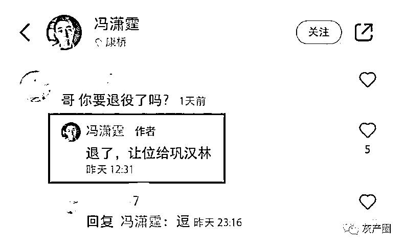
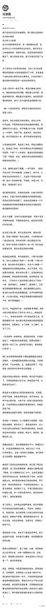
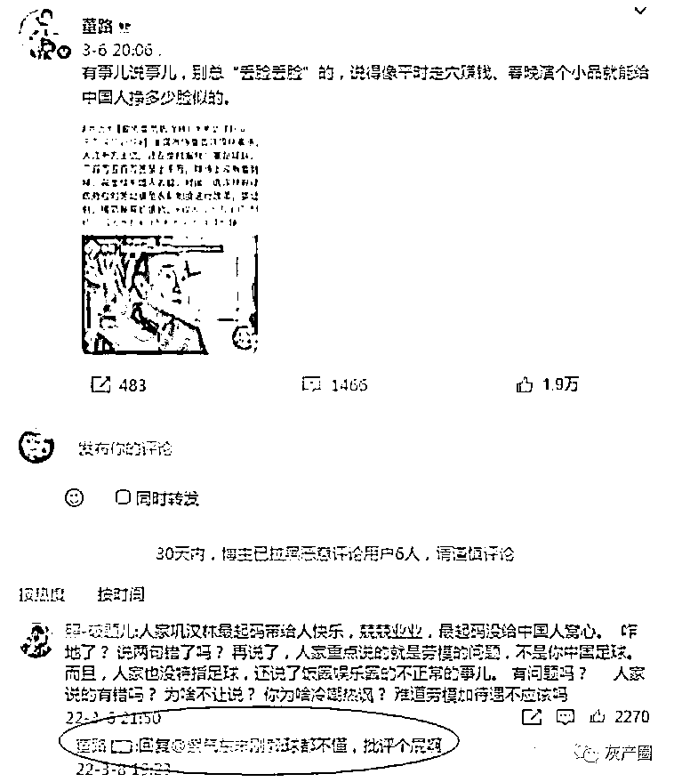

# 巩汉林批评男足，被男足队长暗讽，巩汉林：演小品怎么丢脸了？你才丢脸

> 原文：[`mp.weixin.qq.com/s?__biz=MzIyMDYwMTk0Mw==&mid=2247531669&idx=4&sn=73c055b7c36b15b384763ccfc25ed6a4&chksm=97cbb7ada0bc3ebb5c216cc8f37f08aff3f9aad82341029347cea6ee779491eea18c75ceb404&scene=27#wechat_redirect`](http://mp.weixin.qq.com/s?__biz=MzIyMDYwMTk0Mw==&mid=2247531669&idx=4&sn=73c055b7c36b15b384763ccfc25ed6a4&chksm=97cbb7ada0bc3ebb5c216cc8f37f08aff3f9aad82341029347cea6ee779491eea18c75ceb404&scene=27#wechat_redirect)

近日，著名喜剧表演艺术家巩汉林对于中国足球收入问题的评论引发了热议，他直言不讳地表示：“比方说某足球队，年收入三百万五百万，甚至上千万，球场上却没有看到他们进球，完全给中国人丢脸。” 

对此，国足球员普遍表示沉默，不过前国足队长、现效力于上海绿地申花的冯潇霆在日前回复网友时对此进行了一番暗讽——在网友询问他是否要退役时，他回答道：“退了，让位给巩汉林。”

冯潇霆诉苦的微博全文：

向下滑动查看

董路也冷嘲热讽！

而这样的言论无疑再度在社交媒体上引发了众多关注，冯潇霆本人也被推向了舆论的风口浪尖，而另一名当事人巩汉林也在刚刚通过一段小视频对其作出了回应，下面一起来看看视频吧！ 

[`mp.weixin.qq.com/mp/readtemplate?t=pages/video_player_tmpl&action=mpvideo&auto=0&vid=wxv_2310288134506496001`](https://mp.weixin.qq.com/mp/readtemplate?t=pages/video_player_tmpl&action=mpvideo&auto=0&vid=wxv_2310288134506496001)

来源：微博那些事儿

← 向右滑动与灰产圈互动交流 →

