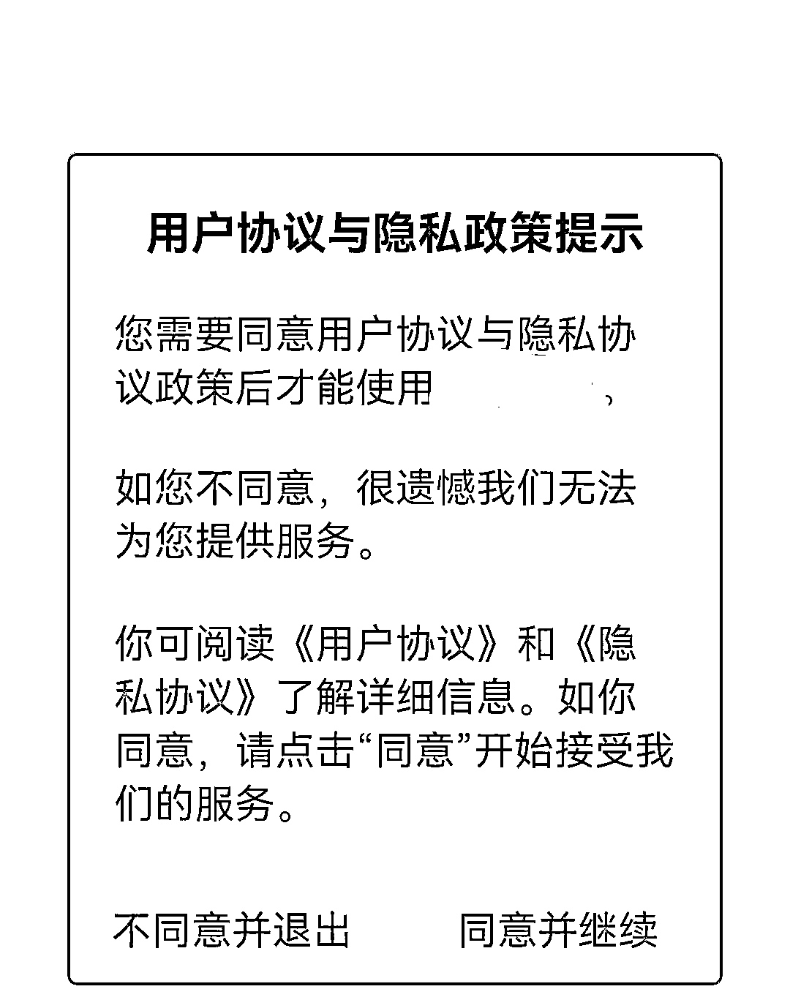
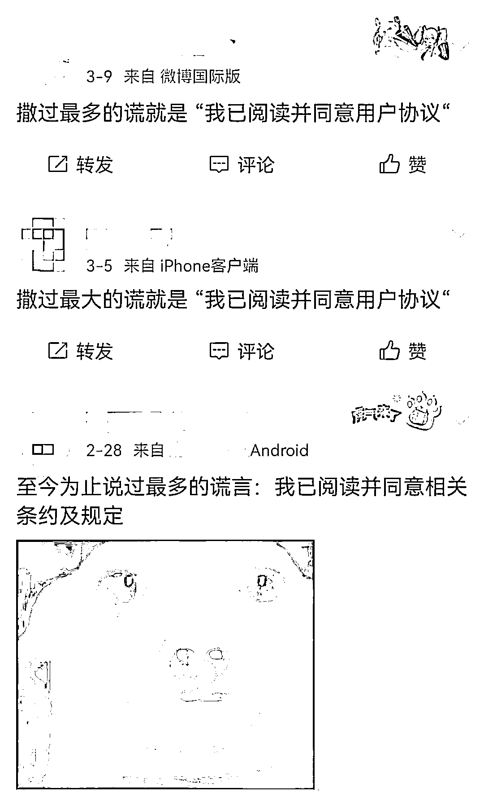
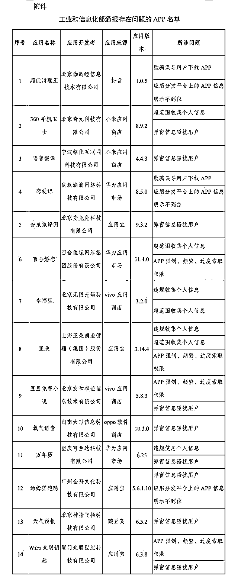

# “我已阅读并同意”？你撒过的谎，App 挖的“坑”!

> 原文：[`mp.weixin.qq.com/s?__biz=MzIyMDYwMTk0Mw==&mid=2247531669&idx=8&sn=2ad48fa799d16b0ea05cc87bec1feb68&chksm=97cbb7ada0bc3ebbd7750b78fa858cd65266e30c98c0d2b47954f25b4d4a35a875303678ce0f&scene=27#wechat_redirect`](http://mp.weixin.qq.com/s?__biz=MzIyMDYwMTk0Mw==&mid=2247531669&idx=8&sn=2ad48fa799d16b0ea05cc87bec1feb68&chksm=97cbb7ada0bc3ebbd7750b78fa858cd65266e30c98c0d2b47954f25b4d4a35a875303678ce0f&scene=27#wechat_redirect)

[`mp.weixin.qq.com/mp/readtemplate?t=pages/video_player_tmpl&action=mpvideo&auto=0&vid=wxv_2310872906484137987`](https://mp.weixin.qq.com/mp/readtemplate?t=pages/video_player_tmpl&action=mpvideo&auto=0&vid=wxv_2310872906484137987)

移动互联网时代

App 成了人们的必备工具

首次下载使用时，点击

**“我已阅读并同意用户协议和隐私政策”**

是常规操作

这些协议动辄上万甚至数万字

长度堪比一篇论文

相关调查显示

近 80%的用户很少或从未阅读

复杂的协议文字中藏有哪些“坑”？

**“3·15”国际消费者权益日**到来之际

记者对此展开了调查——

一个 App 的用户协议和隐私政策界面（王井怀　摄）

# **动辄上万字，多少人会读 App 用户协议？**

**日前，记者在手机应用市场里下载 5 款下载量过亿次的社交、游戏、短视频、购物等 App 发现，各 App 会根据自身特点规定用户协议和隐私政策的内容。不过，一些基本内容是相同的。**

**在用户协议方面，App 一般会介绍产品基本情况和使用规范，比如账户如何注册、注销，密码丢失如何处理；强调用户行为规范，比如要求用户不得编造、散布谣言、虚假信息；强调本公司的权利，比如相关内容的知识产权归公司所有；此外，还会声明免责条款、留有联系方式等。**

**针对近年来备受瞩目的个人信息安全，用户协议一般会单独列出“个人信息保护”一章，有的还专门列出“未成年人保护”相关条款。同时，隐私政策也从个人信息的收集、管理、储存、保护等方面进行详细规定。**

**这 5 款 App 用户协议和隐私政策总字数超过 13 万字，平均每款 App 需要用户“阅读并同意”的内容约 2.7 万字，比一篇本科论文长，逼近硕士论文的篇幅。一些小众 App 的协议相对简单，用户协议长度在数千字。**

**如此庞大的阅读量，有多少用户会去看呢？武汉大学网络治理研究院副院长袁康所在的联合调研组去年对 1036 人进行调查访谈的结果显示，77.8%的用户在安装 App 时“很少或从未”阅读过隐私协议，69.69%的用户会忽略 App 隐私协议的更新提示。**

**“用户协议和隐私政策写满了大量冗杂信息，专业人士都直呼头疼，更别提普通消费者了。”袁康认为，“少有人读”反映出相关协议仍“形同虚设”，达不到保障用户知情权的初衷。**

****

**部分网民对用户协议和隐私政策的吐槽（王井怀　摄）**

# ****用户协议里藏着哪些“坑”？****

****近年来，App 用户协议和隐私政策在治理中逐步完善。不过，部分 App 仍然在“挖坑”，消费者一不小心就容易掉进陷阱。****

******第一“坑”：不同意则不能用。**个人信息保护法规定，个人信息处理者不得以个人不同意处理其个人信息或者撤回同意为由，拒绝提供产品或者服务；处理个人信息属于提供产品或者服务所必需的除外。****

****“部分 App 展示商品、视频时完全没必要过度索取个人信息，那些不同意便不能用的行为是不合适的。”中国信息安全研究院副院长左晓栋还提醒说，“是否必需不该由 App 单方面规定，要防止打擦边球。”****

******第二“坑”：暗度陈仓。**今年 3 月，“oTMS　到哪了”App 在首次运行时未通过弹窗等明显方式提示用户阅读隐私政策等收集使用规则，或以默认选择同意隐私政策等非明示方式征求用户同意，涉嫌隐私不合规，被国家计算机病毒应急处理中心通报。****

******第三“坑”：先斩后奏。**今年以来，“云联健康”“寻迹旅行”等多个 App 在征得用户同意前开始收集个人信息，而被一一通报。“虽然相关部门对类似行为不断加强监管，但 App 违法收集个人信息的行为仍然具有一定隐蔽性。”袁康说。****

******第四“坑”：一次同意，次次同意。**部分 App 会根据需要修订隐私协议，但用户无法及时得知内容是否有所更新。比如，一款美妆 App 在用户协议中表示，公司有权根据需要不定期地制订、修改本协议及/或各类规则，并在 App 平台公示，不再另行单独通知用户。消费者使用平台服务，即表明接受修订后的协议和规则。****

******第五“坑”：个人信息转送第三方。**一款购物 App 的用户协议称，对于消费者的视频、照片、文字等，“（平台）均享有永久的、无期限及地域限制的、完全免费的使用权”，并且“有权将其许可给任何第三方使用”“实际行使时无须另行征得您的同意”。袁康认为，App 在初始协议里就征得了将用户数据与第三方分享的授权，相当于让用户放弃了对未来个人信息流通转让的审查权利。****

# ******用户协议可否清单制？******

******左晓栋等多位专家认为，一些 App 用户协议和隐私政策有通过晦涩难懂的文字浑水摸鱼的嫌疑，呼吁通过清单制简洁明了地列出消费者需要了解的内容，降低阅读门槛。******

********今后要进一步规范 App 用户协议、隐私政策。**天津财经大学商学院互联网信息与用户行为研究中心主任陈旭辉、袁康等呼吁，用户协议普遍内容繁杂，有必要从用户便捷阅读需要出发，将与用户关联的重要部分在协议前面突出显示，类似上市公司年报和学术论文摘要，方便用户了解隐私协议核心内容。******

******“相关协议还要进一步明确‘必需信息’‘第三方’等核心要素的范围，不能含糊地概括为‘可能向第三方披露’。在分享用户信息的时候，也要将敏感的个人信息匿名化处理。”袁康说。******

********压实手机应用市场的责任。**陈旭辉认为，监管部门可抓住手机应用市场这个“关键少数”，明确其上架违规 App 的相应法律责任，推动其从上架 App 的源头上做好把控工作。******

******此外，**要提升消费者个人信息保护的意识，加强执法力度。**左晓栋认为，青少年、大学生等群体熟悉 App，有较强的个人信息保护意识，可以成为推动完善用户协议和隐私政策的主力军，律师等职业力量要积极加入，形成违规必举报、举报必查处的良性循环，逐步促进协议内容落到实处。******

************

********工信部开展 App 侵害用户权益整治********

********“回头看”行动 14 款 APP 被通报********

******来源：中国青年报微信公众号、人民网、“工信微报"微信公众号******

******据工业和信息化部消息，为巩固治理成效，营造共同维护消费者权益的良好环境，工业和信息化部近日开展 APP 侵害用户权益整治“回头看”，组织第三方检测机构对前期用户反映问题较多的内存清理类、手机优化类 APP 进行重点检测，并对去年发现问题的 APP 进行抽测，共发现 14 款 APP 仍然存在问题，其中“超能清理王”“360 手机卫士”“百合婚恋”等 APP 在列。****** 

******工业和信息化部表示，上述 APP 应在 3 月 21 日前完成整改，逾期不整改或整改不到位的，将依法依规严厉处置。******

************

******来源：新华视点（ID:XHSXHSD）******

************

******← 向右滑动与灰产圈互动交流 →******

************