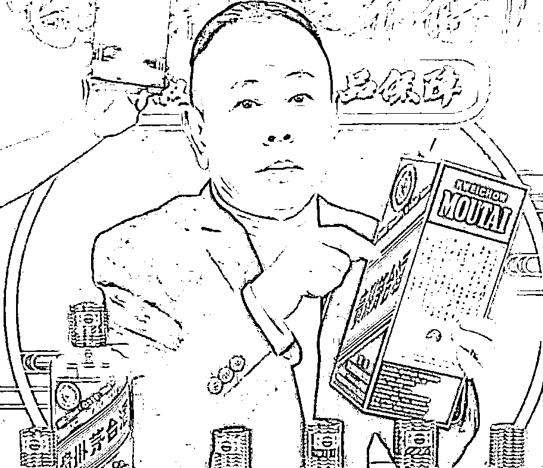
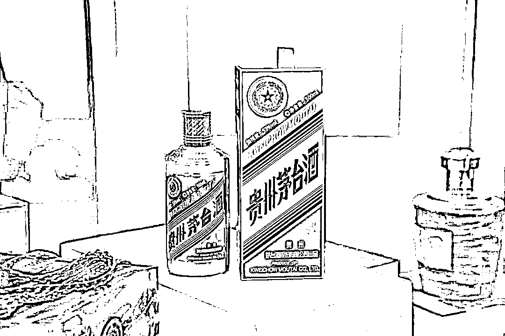
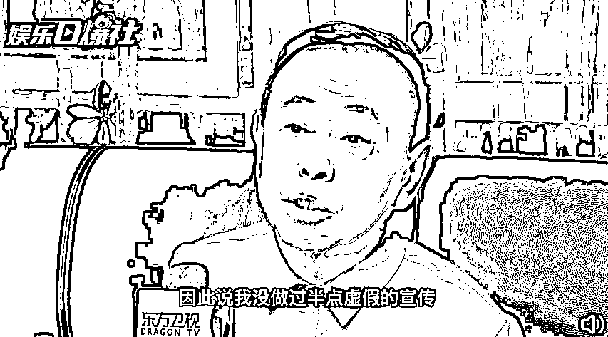
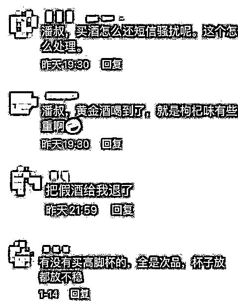
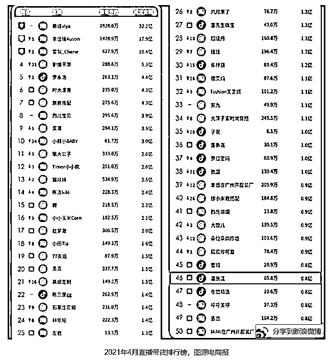
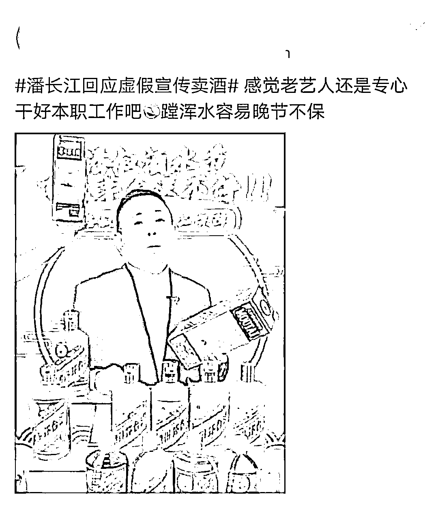

# 茅台董事长被灌醉后给出优惠价？潘长江卖酒陷罗生门

> 原文：[`mp.weixin.qq.com/s?__biz=MzIyMDYwMTk0Mw==&mid=2247531724&idx=1&sn=56a3b52972e8d53959a4c451c8897cbf&chksm=97cbb7f4a0bc3ee27c7a8bdfc62938e0ef07903617aa213081fd702500f25a1457c54b13fc37&scene=27#wechat_redirect`](http://mp.weixin.qq.com/s?__biz=MzIyMDYwMTk0Mw==&mid=2247531724&idx=1&sn=56a3b52972e8d53959a4c451c8897cbf&chksm=97cbb7f4a0bc3ee27c7a8bdfc62938e0ef07903617aa213081fd702500f25a1457c54b13fc37&scene=27#wechat_redirect)

“我和茅台公司董事长认识十几年了，昨晚我把他灌醉了，让他签合同给我定价权。”网传在某场 3 月初的直播中，喜剧演员潘长江如是说。3 月 15 日，茅台就此事发表回应称：上述宣传不属实。 

同日，就所谓“灌醉茅台董事长拿到定价权”一事，潘长江表示：“我在这里拍着胸脯说，我根本就没有说过这样的话，这是断章取义，这是吸人眼球。”

不过，潘长江卖酒一事引发的争议不止于此。有网友表示，潘长江直播间售卖的茅台虎年生肖酒，其所谓“优惠价”实际上高于流通市场中的价格。

视频截图

**优惠价要贵 300 元？潘长江回应：供应商报价，本人无虚假宣传**

网传消息称，潘长江在直播中表示，“这款茅台虎年生肖酒，酒厂肯定要亏钱的，市场价一直 4 万多（一箱），我 2 万多就卖。”综合多家国内媒体报道，潘长江直播间该商品的优惠价格折算后为 4799 元/瓶。

据微信公众号“贵州茅台”消息，今年 1 月 15 日茅台四个品牌共推出 5 款虎年生肖酒，其中就包括 53%vol 500ml 贵州茅台酒（壬寅虎年版），其**市场指导价为 2499 元/瓶**。此外茅台还发布了壬寅虎年主题的茅台王子酒、贵州大曲和赖茅酒等产品。

微信公众号“今日酒价”数据显示，53%vol 500ml 贵州茅台酒（壬寅虎年版）3 月 15 日的二级市场报价为 4500 元、3 月 1 日报价为 4550 元，均低于潘长江直播中的价格。据此初步估算，潘长江直播间的壬寅虎年版贵州茅台酒，要比流通市场中的价格贵 249—299 元。

图源微信公众号“贵州茅台”

对于网友质疑的价格问题，潘长江表示，自己并不知道该产品在外部市场的价格。“我光知道供应商给我的就是这个价钱。”他表示，自己的个性很实在，供应商给多少，他就在直播间里卖多少。“因此说我没做过半点虚假的宣传。”

视频截图 

**直播带货再翻车、潘嘎之交后备受争议，潘长江怎么了？**

直播卖酒翻车，对于潘长江而言已经不是第一次了。

2021 年 3 月 31 日，潘长江在直播间售卖一款名为“五粮液黄金酒”的商品。据“连线 Insight”统计，5 个小时的时间里他推销出了 85000 瓶“五粮液黄金酒”。后来网友发现，该酒其实是五粮液集团保健酒公司委托巨人集团生产的一款贴牌产品。

在评论区，更有不少网友对潘长江提出了批评和质疑。

 社交媒体图片

2020 年年初，《小兵张嘎》中“嘎子”的扮演者谢孟伟直播带货，他对某款白酒大夸其词，还声称“给嘎家军争取来了最大的优惠”，将原价为 2999 元的酒以 398 元卖出。事后引发争议：有网友表示，该产品在电商平台的售价其实更低；还有网友指责，直播间的产品实为山寨酒。

潘长江在当年与谢孟伟的直播连线中表示，“网络上的东西都是虚拟的，这里面水很深，你把握不住。” “我告诉你嘎子，只要你不需要在这个平台赚钱，那你就活得很开心很快乐！”

谢孟伟一度为此掉下了眼泪，潘长江还在屏幕前坦言称：“我绝不会上电商。”但不久后潘长江自己便踏入了直播带货的赛道，这段往事被网友戏称为“潘嘎之交”。

据“连线 Insight”统计，潘长江带货品类从酒类、手表、黄金，再到小龙虾和拖鞋等都有涵盖，甚至卖起了与昔日谢孟伟直播间翻车的同一款“假酒”。在网友看来，曾经劝后生“把握不足”“不需要在这个平台里赚钱”的潘长江，自己倒是在直播卖货的旋涡里越陷越深、越走越偏。

从流量数据来看，潘长江确实享受到了直播带货的红利。据胖球数据和调皮电商等机构联合发布的 2021 年 4 月直播带货排行榜，潘长江彼时累计带货 8000 万元，位居直播带货 46 名，利润相当可观，按照当时明星合作的佣金分成来看，以最低 10%计算，潘长江一个月净收益 800 万元。

媒体报道截图

但在社交媒体上，“售卖假货”、“吃相难看”、“晚节不保”等争议，却没有停下过。

媒体报道截图

**白酒市场内卷，直播更需规范**

潘长江等明星频频在直播间带货卖酒，这固然是直播电商赛道吸金的一个表现。但在某种程度上，这同时也体现了白酒消费品对营销渠道的依赖。从白酒行业来看，这折射出愈发白热化、内卷化的市场竞争格局。

根据中国酒业协会（CADA）消息，2021 年 1-12 月，全国酿酒行业规模以上企业完成酿酒总产量 5406.85 万千升，同比增长 3.95%。其中白酒产量为 715.63 万千升。以每瓶酒 500 毫升/0.5 毫升来计算，2021 年白酒产量相当于 143 亿瓶。忽略年龄和饮酒习惯等因素，以全国 14.12 亿人口计算，相当于每位国民每年喝 10 瓶才能消化该产量。

但白酒企业的日子并不好过：2020 年 1 月至 11 月，全国规模以上白酒企业为 1040 家，可在 2017 年这一数据为 1593 家，相当于 35%的中小企业消失了。整个行业在出清提速。

但目前中国白酒市场仍以中低端为主。华经产业研究院的数据显示，在 2020 年的中国白酒领域，出于自用目的，价格在 301 元以上白酒占比约为 20.7%；出于送礼目的，该占比略微提高，但也不超过 31.8%。精细到 600 元以上的高价产品，占比更是低至 3%和 4.7%。各大企业想要跑出一份亮眼的成绩单，实在不易。

在当前的市场格局之下，稳坐高端酒品头把交椅的贵州茅台推出千元价格段“茅台 1935”，大获成功。这在某种程度上，也在整个白酒行业传递这样一种顾虑：未来不排除顶级品牌会在高端产品布局，抢占高端产品市场；高端品牌则会在中端产品布局，挤压中端产品市场……“降维打击”的销售策略将在整个行业 “扩产能、扩市场”的预期里层层传导，加速市场竞争白热化。

牵手明星艺人或者流量主播，自然成为一些商家出圈走量的救命稻草。

明星白酒带货屡屡翻车背后，其实反映了一个非常现实的问题：直播带货活动中，“货”的质量和价格优势非常关键，这是他们受到粉丝追捧和跟单的基础。

上海财经大学研究员、电商领域专家崔丽丽曾对媒体表示，要做到以上这点，要依靠选品、与品牌商洽谈优惠、供应链管控等一系列能力的支持。缺少一环，都很难保证货品的质量和价格优势。

这背后其实暗含了一个价值关注：明星的热度和风口的强度，可能决定某位明星的带货速度有多快；但明星背后的操盘团队，其供应链管控能力、选品能力和服务能力，才会决定他/她能走多远。信任和口碑才是无价的。

在直播带货方面，我国的监管正在进一步强化：

2020 年 11 月，国家市场监管总局发布关于加强网络直播营销活动监管的指导意见，明确直播带货过程中涉及各方主体的责任义务；2021 年 4 月，国家网信办等 7 部门联合发布网络直播营销管理办法（试行），明确直播营销行为的 8 条“红线”，包括不得欺骗、误导用户，不得进行数据流量造假等。2021 年 9 月，国家税务总局印发通知，对网络直播等新业态从业人员给予包容性的自查整改期，同时明确对自查整改不彻底、拒不配合或情节严重的依法严肃查处。

来源：观察者网

← 向右滑动与灰产圈互动交流 →

