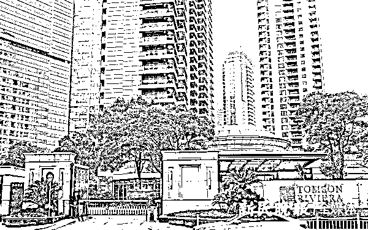
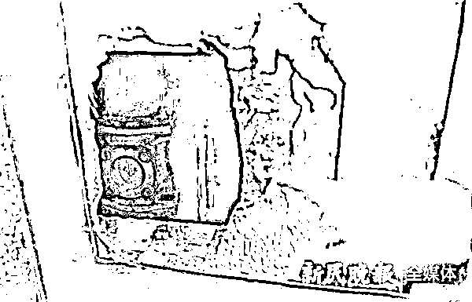
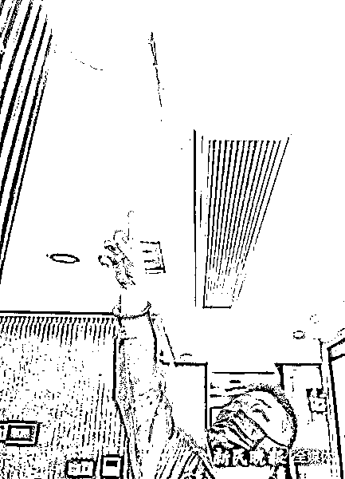
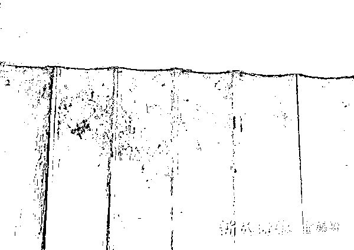

# 果然，“汤”臣一品只坑有钱人！

> 原文：[`mp.weixin.qq.com/s?__biz=MzIyMDYwMTk0Mw==&mid=2247531724&idx=3&sn=12c144949aa8317ec7965da4f42ca665&chksm=97cbb7f4a0bc3ee2110abca4d1519dcea9f07d13a4bd4194a011d08f9d79b7061b227b5ca3d0&scene=27#wechat_redirect`](http://mp.weixin.qq.com/s?__biz=MzIyMDYwMTk0Mw==&mid=2247531724&idx=3&sn=12c144949aa8317ec7965da4f42ca665&chksm=97cbb7f4a0bc3ee2110abca4d1519dcea9f07d13a4bd4194a011d08f9d79b7061b227b5ca3d0&scene=27#wechat_redirect)

该公众号已被封禁

**装修时大水漫灌** 

**半夜里粪水倒灌**

**女儿惊出抑郁症**

**……**

市民陈先生向记者反映

2010 年

他花费**9500 多万**元购买了

上海浦东新区花园石桥路 28 弄

**汤臣一品**8 号楼 18 楼的房子

但郁闷的是这些年来

**房屋接连遭遇**

**3 次突如其来的“漏水”和“反水”**

一次次的“惊魂”

让他和家人提心吊胆

苦恼不已

**“自从买房以来，**

**我和家里人几乎没有过上一天舒坦日子……”**

汤臣一品  新民晚报记者 陶磊 摄（下同）

***粪水倒灌 满屋恶臭***

今年 3 月 1 日晚 10 时许，陈先生回到家中，当他刚准备踏入主卧时，却被眼前的一幕惊呆了：**主卧卫生间的地面上，竟然布满了黄褐色的粪便和粪水；**阵阵恶臭袭来，他顿时剧烈干呕。 

陈先生立即找到管理小区的中观物业管理（上海）有限公司，可谁想物业工作人员竟然也“束手无策”。随后陆家嘴街道房办派人上门，**为了查明原因，在卫生间淋浴房的墙壁上挖出一个方形大洞。但直到现在，还没查出个究竟！**

主卧卫生间淋浴房墙壁上挖出的大洞

即便距离事发时已有 10 多天，房间里还能够隐约闻到一股刺鼻的异味。陈先生告诉记者，事发后，他第一时间让公证处的工作人员上门公证，固定证据。随后，物业方面派工作人员打扫了房子。陆家嘴街道房办现场疏通管道，清理了淤积在内的碎石等垃圾。但让陈先生百思不得其解的是：**淋浴房的下水道是排水管，又不是污水管，怎么会冒出粪便来？**

陈先生表示，**这十多天时间里，物业只是做了现场清扫，而对于反水原因、责任认定和后续解决方案等，一概没有提及。** 

***漏水反水 女儿吓病***

其实，十多年来，陈先生这房子漏水、反水了好几次。

据了解，2010 年房屋新装修时，天花板就发生过一次严重漏水。**客厅、厨房和卫生间顶部管道全部渗漏，一下子水漫金山，把瓷砖、木板等装修建材淋了个透湿。**

虽然，开发商和物业赔偿了相关损失，但“后遗症”至今仍布满多个房间——**靠近客厅、厨房、玄关处的天花板上有十几处长短、大小不一的裂痕；陈先生女儿的房间墙壁鼓起，无法平整对齐。**

天花板上有长短、大小不一的裂痕

“这都是当年物业修理后留下的痕迹。**漏出来的水，还直接流到我女儿的钢琴里面，被浸泡后，有两个琴键都摁不出声音了。**”尽管开裂的墙壁没有完全补上，但陈先生还是选择息事宁人，希望物业和开发商能拿出有效的解决办法来。 

但万万没想到，2012 年底，陈先生的房子又“摊上事”，**女儿卧室卫生间马桶突然反水。粪水直接满溢出来，顿时整个房间里污水横流。**

**“我女儿遭此惊吓，每天恶心得连饭都吃不下，晚上更是没办法睡着，结果还得了抑郁症。光给她看病，我们就花费了不少精力。”**

陈先生直言，由于物业始终修不好马桶，无奈之下他只能让女儿住在其他房间，将她卧室卫生间的马桶封闭了整整 8 年之久。直到 2020 年，物业称“技术成熟”，才最终将马桶的管道疏通。 

墙壁因漏水浸泡太久而变形

陈先生讲，十多年来他和家人“一忍再忍”，但这一次是“底线”了，“这说明他们根本没有好好解决问题，我必须为自己和家里人讨个说法了”。 

***全面排查 何时安居***

记者找到中观物业采访核实。一名自称主管的工作人员挡住了记者的镜头，表示“不准拍摄”。**对方称：会将情况上报给开发商，三方择日商谈此事。** 

3 月 13 日下午 3 时 30 分许，记者和陈先生如约来到小区会所二楼。**开发商处的一名公关部负责人回应：经过初步调查判断，此次陈先生家中淋浴房粪水外溢的原因，****可能是楼上住户在装修时，改动了排水管和污水管的接口，在淋浴房的位置安装了马桶。****但问题的确切原因，还需进一步排查。** 

对于这样的解释，陈先生完全不认可。**装修时，业主需要提前将方案报备给物业，怎么能私自改管道、装马桶呢？**如果是这样，**物业到底有没有日常巡查和监督，同样负有不可推卸的责任。** 

对于之前陈先生家中水管漏水和马桶反水的问题，开发商方面表示，**将进一步核实情况，后续会积极地与陈先生保持沟通联系。****“我们会尽快安排工作人员，全面检查所有居民楼的公共管道。”**

来源 ：新民晚报，潇湘晨报

← 向右滑动与灰产圈互动交流 →

