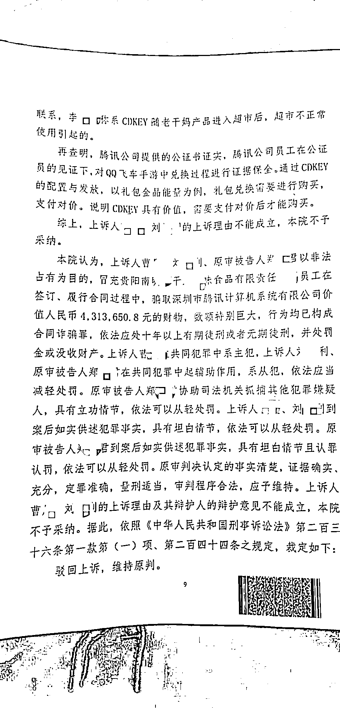
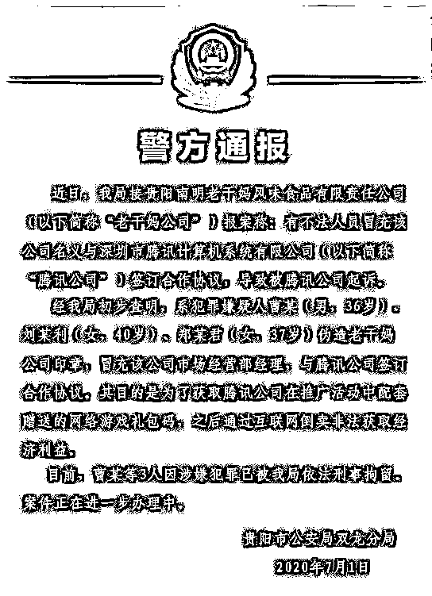
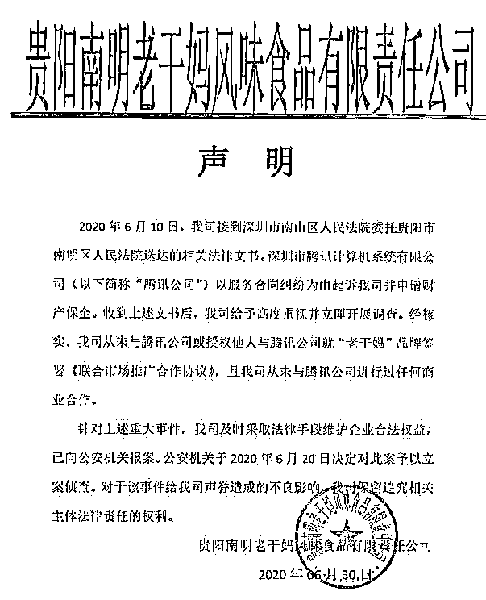
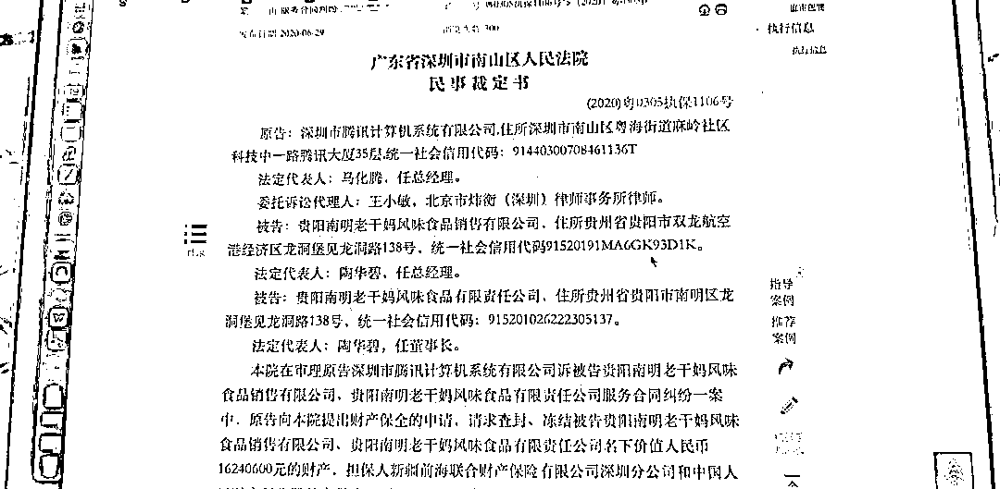
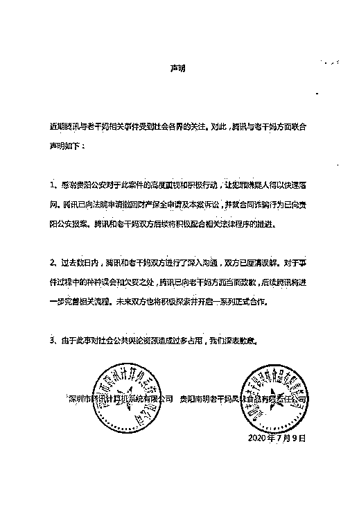

# “冒充老干妈员工诈骗腾讯”案，二审宣判

> 原文：[`mp.weixin.qq.com/s?__biz=MzIyMDYwMTk0Mw==&mid=2247534168&idx=8&sn=da8750881d0507eb083a32419bdf2c3a&chksm=97cb8d60a0bc047611cd97e1d97d9afe3e58026739c31ff63622fd57f3c68a1b7cbab9e3b0ba&scene=27#wechat_redirect`](http://mp.weixin.qq.com/s?__biz=MzIyMDYwMTk0Mw==&mid=2247534168&idx=8&sn=da8750881d0507eb083a32419bdf2c3a&chksm=97cb8d60a0bc047611cd97e1d97d9afe3e58026739c31ff63622fd57f3c68a1b7cbab9e3b0ba&scene=27#wechat_redirect)

澎湃新闻 4 月 19 日晚从有关方面了解到，3 人冒充贵阳南明老干妈风味食品有限责任公司（以下简称：老干妈公司）员工，诈骗深圳市腾讯计算机系统有限公司（以下简称：腾讯公司）一案二审已由贵阳市中级人民法院作出裁定：**驳回上诉，维持原判（****此前报道：****[“逗鹅”的代价！冒充老干妈骗走腾讯 1600 万，最新进展来了！](http://mp.weixin.qq.com/s?__biz=MzIyMDYwMTk0Mw==&mid=2247509195&idx=1&sn=6fbec51aa1d83f7060192ddd993ea88b&chksm=97cb6ff3a0bce6e55237896948128664c0bf6b65248eae44b7cb56c9454c21807dba459a800e&scene=21#wechat_redirect)）。** 

2021 年 12 月 29 日，贵阳市南明区人民法院针对此案作出一审宣判，**3 名被告人分别被判处有期徒刑 12 年、7 年、6 年，并处罚金，3 人退赔腾讯公司 431 万余元。**

贵阳市中院对冒充老干妈员工诈骗腾讯公司案作出二审裁定，驳回上诉，维持原判。本文图均为受访者供图

**腾讯起诉查封老干妈千余万财****产**

****牵出诈骗案****

****这起假冒老干妈公司员工诈骗腾讯公司的案子，要从 2020 年 6 月 29 日说起。那日，中国裁判文书网披露广东省深圳市南山区人民法院的一则民事裁定书，同意原告腾讯公司请求查封、冻结被告老干妈公司名下价值约 1624 万元的财产。**** 

****查封理由是，2019 年 3 月，腾讯公司与老干妈公司签订一份《联合市场推广合作协议》，腾讯公司投放资源用于老干妈公司油辣椒系列推广，腾讯公司已依约履行相关义务、但老干妈公司未按照合同约定付款。腾讯公司多次催办无果，因此不得不依法进行起诉。腾讯公司方面所称的合作，被指为旗下游戏 QQ 飞车与老干妈公司 2019 年的一次合作。2019 年的信息显示，老干妈公司将成为 QQ 飞车手游 S 联赛的行业年度合作伙伴。**** 

****同年 6 月 30 日晚间，微信公众号“老干妈”发布声明称，公司从未与腾讯公司或授权他人与腾讯公司就“老干妈”品牌签署《联合市场推广合作协议》，且从未与腾讯公司进行过任何商业合作。针对上述重大事件，老干妈公司及时采取法律手段维护企业合法权益，已向公安机关报案。**** 

****2020 年 7 月 1 日，贵阳市公安局双龙分局发布警方通报称，犯罪嫌疑人曹某（男，36 岁）、刘某利（女，40 岁）、郑某君（女，37 岁）伪造老干妈公司印章，冒充该公司市场经营部经理，与腾讯公司签订合作协议。其目的是为了获取腾讯公司在推广活动中配套赠送的网络游戏礼包码，之后通过互联网倒卖非法获取经济利益。3 人因涉嫌犯罪已被依法刑事拘留。****

********

****贵阳警方调查后，将 3 名冒充老干妈公司的人员抓获。****

****8 天后，腾讯公司和老干妈公司发表联合声明称，腾讯公司已向法院申请撤回财产保全申请及本案诉讼，并已就合同诈骗行为向贵阳警方报案，腾讯公司和老干妈公司双方后续将积极配合相关法律程序的推进。此外，双方进行了深入沟通，已经厘清误解。对于事件过程中的种种误会和欠妥之处，腾讯公司已向老干妈公司方面当面致歉，未来将进一步完善相关流程。**** 

****2021 年 2 月，贵阳市南明区人民检察院发布公告称，依法对曹某等三人提起公诉。同年 12 月 29 日，南明区人民法院一审宣判，曹某犯合同诈骗罪，获刑 12 年，并处罚金 10 万元；刘某利和郑某君也因同样的罪名，分别判处 7 年徒刑罚金 5 万元和 6 年徒刑罚金 4 万元，三人退赔腾讯公司 4313650.8 元。对于一审判决，主犯曹某当庭表示不服提出上诉。****

********

****遭腾讯公司在保全冻结后，老干妈公司发布声明，从未与腾讯公司进行商业合作。****

******两被告人上诉******

********不认可检方认定金额********

********澎湃新闻获得的刑事裁定书显示，一审判决后，被告人曹某和刘某利不服判决提出上诉。******** 

********曹某的上诉理由是“证据不足，量刑过重”。其辩护人认为，一审法院认定金额为 4313650.8 元属认定错误，现在没有任何评估机构能够对被兑换的 CDKEY 游戏道具价值作出符合市场价值的评估，因此在专业评估机构都无法作出评估的情况下，公诉机关作为非专业人士自行计算的金额，不具有权威性、公允性，不能作为对曹某、刘某利等定罪量刑的依据，公诉机关系根据 2021 年 4 月 QQ 飞车上道具或者类似道具钻石、点券兑换情况，将钻石或者点券转换成人民币的方式计算诈骗数额，公诉机关自行计算的方式及数据极不合理、不严谨、不科学及对被告人不公平。******** 

********其次，腾讯公司存在监守自盗及故意放任损失扩大的情况，存在重大过错。******** 

********第三，应当以曹某等人犯罪实际所得金额 54 万余元进行认定，不仅公平，还具有可行性。******** 

********第四，曹某等人的行为虽为刑法所不允许，但本案涉及到的 CDKEY 对腾讯公司没有具体价值，一审量刑过重。******** 

********刘某利的四点上诉意见中，除前三点与曹某相同外，刘某利还提出：“本人行为虽为刑法所不允许，应受到相应惩罚，但本案涉及到的 CDKEY 对腾讯公司而言是一键生成的串码，并不值钱，本人在此案中，参与度不高，只起辅助作用，一审量刑过重。”******** 

********裁定书显示，原公诉机关在法定期限内对原判决未提出异议。二审审理期间，上诉人曹某、刘某利及其辩护人未提交新的证据。********

****************

********2020 年 6 月 29 日，深圳南山区法院在裁判文书网公布腾讯公司起诉冻结老干妈公司 1600 万元财产，由此牵出诈骗案。********

**********作案细节：**********

************3 人冒充老干妈公司经理骗腾讯公司************

**********原审判决认定，2018 年底，曹某、刘某利、郑某君经预谋后冒充老干妈公司员工，以虚构的老干妈公司名义与腾讯公司签订在该公司开发的 QQ 飞车游戏中推送老干妈公司产品广告的合同，骗取腾讯公司奖励该款游戏中的礼包及解码该礼包的 CDKEY，并将 CDKEY 转让他人，他人通过获取的 CDKEY 解码礼包可获得相应的游戏产品（装备）码。********** 

**********曹某、刘某利出资，由郑某君购买新电话卡，注册新微信号、印刷老干妈公司员工名片。随后郑某君冒充老干妈公司市场部经理李某林与腾讯公司互动娱乐商务经理林某丹联系合作事宜。********** 

**********2019 年 2 月，郑某君继续以李某林名义与林某丹洽谈合作事宜，林某丹提出需到贵阳进行实地考察。曹某三人遂租赁贵阳市观山湖区某中心办公室经布置假装为老干妈公司办公场地，并由郑某君冒充李某林、刘某利冒充老干妈公司销售部经理王某娜与前来考察的林某丹进行接洽。********** 

**********在获取腾讯公司员工信任后，曹某冒充老干妈公司经理李某鹏与郑某君一起通过微信与腾讯公司林某丹等人商谈合作细节，先后于 2019 年 3 月 14 日、5 月 6 日以老干妈公司名义与腾讯公司签订两份标的共计 1030 万元的《联合市场推广合作协议》，就“QQ 飞车手游 S 联赛”“QQ 飞车手游 S 联赛—国际赛”与老干妈油辣椒系列产品进行联合市场推广合作。********** 

**********协议先后约定在 2019 年 4 月 1 日至 12 月 31 日共 9 个月、2019 年 7 月 1 日至 2019 年 12 月 31 日共 6 个月的合作，由老干妈油辣椒系列产品分别与《QQ 飞车手游 S 赛》《QQ 飞车手游 S 赛—国际赛》进行联合市场推广合作。老干妈公司按照相应的进度付款人民币 1030 万元给腾讯公司。********** 

**********其中约定，腾讯公司为 QQ 飞车游戏提供 20 万份价值 100 元的礼包。为顺利签订协议，郑某君在贵阳市火车站附近找人伪造了贵阳南明老干妈风味食品销售有限公司营业执照一份，以及贵阳南明老干妈风味食品销售有限公司合同专用章、老干妈有限责任公司骑缝章各一枚。随后将该营业执照提供给腾讯公司，并在协议上加盖伪造的老干妈公司印章。********** 

**********曹某、郑某君以需要在合作商品上印制 CDKEY 开展联合推广为由，要求腾讯公司提供 CDKEY，于是腾讯公司工作人员通过企业邮箱以及微信点对点共计发送 120 万个 QQ 飞车游戏 CDKEY 给曹某。拿到 CDKEY 后，曹某通过淘宝、闲鱼等平台予以变卖，查实获利 669282 元，所得赃款被三被告人用于偿还债务、日常开销。曹某所销售的 CDKEY 已被兑换 442311 份 QQ 飞车游戏礼包，其中包括游戏商城有公开销售价值 4313650.8 元的 409242 份游戏礼包。********** 

**********经二审审理查明，原判认定上诉人曹某、刘某利、原审被告人郑某君犯合同诈骗罪的事实清楚，证据确实充分，原审判决分项列举了认定事实的证据。所列证据经一审举证、质证，并查证属实，复经二审法院审核予以确认。**********

********************

**********在诈骗案被警方查证后，腾讯公司与老干妈联合发布声明，腾讯公司向老干妈公司致歉。**********

************二审驳回上诉****维持原判************

**********原判认定，曹某在共同犯罪中系主犯，郑某君、刘某利系从犯。对于曹某和刘某利的上诉理由及辩护意见，二审法院认为，本案涉及的游戏兑换码 CDKEY 价值，因无相关有资质的评估机构可以评估，也无市场指导价格进行参考，公诉机关根据游戏道具在游戏商城当时的实际交易价格作为单价，乘以曹某从腾讯公司收到并予以兑换的 CDKEY 数量，进行计算并作为指控的犯罪金额。********** 

**********另外，腾讯公司提供的情况说明证实 QQ 飞车项目道具定价一直保持一致，从未改变。因此，该数据作为本案定罪依据具有合理性。********** 

**********二审法院另查明，本案无证据证明腾讯公司内部人员违规泄漏、销售 CDKEY，并有证人证言证明，腾讯公司员工王某在对 CDKEY 使用过程进行监管时发现有不正常情况，曾与“李某鹏”（系曹某冒充）联系，“李某鹏”称系 CDKEY 随老干妈产品进入超市后，超市不正常使用引起的。********** 

**********另外，腾讯公司提供的公证书证实，腾讯公司员工在公证员的见证下，对 QQ 飞车手游中兑换过程进行证据保全。通过 CDKEY 的配置与发放，以礼包金晶能量为例，礼包兑换需要进行购买，支付对价。说明 CDKEY 具有价值，需要支付对价后才能购买。********** 

**********二审法院综上认为，曹某、刘某利的上诉理由不成立，该院不予采纳。********** 

**********二审法院认为，曹某三人以非法占有为目的，冒充老干妈公司员工在签订、履行合同过程中，骗取腾讯公司价值人民币 4313650.8 元财物，数额特别巨大，行为均已构成合同诈骗罪。********** 

**********原判决认定的事实清楚，证据确实充分，定罪准确，量刑适当，审判程序合法，应予维持。遂于 2022 年 4 月 11 日作出裁定驳回上诉，维持原判，该裁定为终审裁定。**********

**********来源：澎湃新闻，利箭在出击******************************

**********← 向右滑动与灰产圈互动交流 →**********

********************