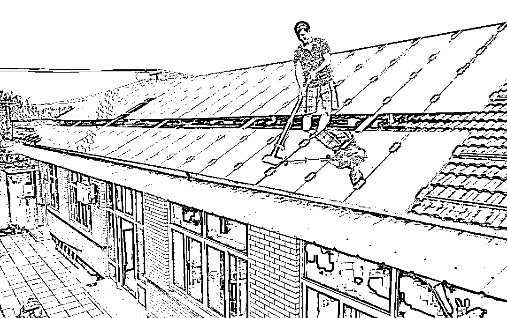
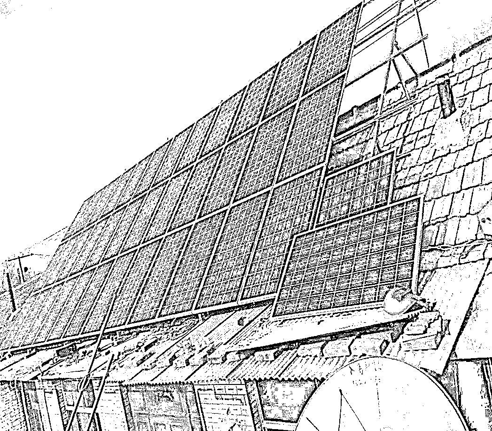
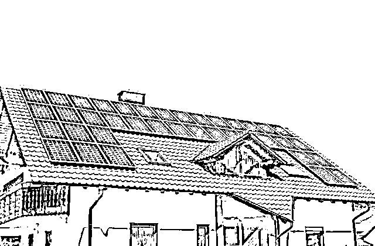
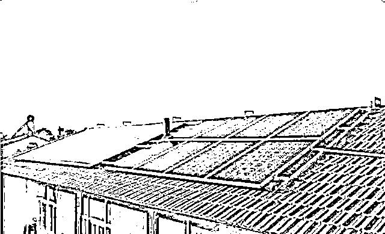

# 屋顶光伏发电，小心骗局

> 原文：[`mp.weixin.qq.com/s?__biz=MzIyMDYwMTk0Mw==&mid=2247534244&idx=5&sn=cb603eefc71779195c21870c4486a93c&chksm=97cb8d9ca0bc048a85f57e005dd64ef7d6dd5326e15eaae8b88aa3ecfecc0058ee599a352de7&scene=27#wechat_redirect`](http://mp.weixin.qq.com/s?__biz=MzIyMDYwMTk0Mw==&mid=2247534244&idx=5&sn=cb603eefc71779195c21870c4486a93c&chksm=97cb8d9ca0bc048a85f57e005dd64ef7d6dd5326e15eaae8b88aa3ecfecc0058ee599a352de7&scene=27#wechat_redirect)

**天上不会掉馅饼~** 

不知道大家注意过没有，有一些村里的房顶上铺满了“小方块”，这些方块其实是光伏发电设备。

**清洁能源是大势所趋，光伏电站投资也是一个扶贫利民的好方向。**

据国家能源局官网 9 月 24 日消息，**中国的光伏扶贫工程惠及了 10 万个村、415 万贫困户，安置公益岗位 125 万个，中国的能源脱贫攻坚工作可谓成绩斐然，举世瞩目。**

**但是需要留意的是，市场上**有一些不良商家**也开始借机进入，借用“光伏发电能赚钱”和新能源投资等噱头来套路农民，投资前一定要了解清楚当地的官方扶持政策和行情！**

****无良商家是如何套路的？****

****第一步：激发安装欲望**** 

**农村民房几乎家家都有宽敞的屋顶，平时都是闲置的，把这些屋顶利用起来发电，每个月产生几百元的收入，对于农民来说，的确是一笔不少的收入啊，有些奸商就用这些“躺着都能挣钱”的方式来利诱农民安装自家光伏组件，部分不加辨别的农民一听就动心了。**

****

****第二步：避重就轻****

**某些套路公司经常如此宣传：**投资不花一分钱，租金收益 20 年，20 年后屋顶电站送给您！****

**他们向农民宣传的是出租闲置屋顶，屋顶的设备发电可以自己用，多余产出的电费可以卖给电网公司，赚取一定收入，到了 20 年后，屋顶设备就成为农民自己的了，看上去是一本万利。**

****

****第三步：开始推销自己的产品**** 

**宣传的挺好，那设备怎么搞呢？这些公司开始向农民推销他们的设备了。**

**这个时候需要让农民签一个租赁协议，让农民租赁光伏设备，才能慢慢赚钱。这其中的道理就好比：你现在有个车位，对方说要租你的车位，实际上是租给你了一辆汽车，并且占用了你的停车位。**

**不能白租给你这些设备吧？由于需要收取一定的租赁费，农民的卖电收入和政府补贴的银行账户就会被该公司掌控着，如此一来这钱最终是谁赚了可就不一定了。**

**某些不良商家在农村推行所谓的“免费安装”和“租赁房顶安装”等方式，利用阴阳合同，或者合同歧异条款、模糊概念条款等方式，来哄骗老百姓签订合同，然后通过扫面身份证，电子签名等手段，从银行取得大额担保贷款。**

**所谓的阴阳合同，就是在安装公司和金融公司之间做手脚。好比是张三承诺把李四的钱每年分给王五 10 万，李四不同意，钱根本不可能分到王五手里。王五去告张三，根本赢不了，因为钱是李四的，去告李四，更赢不了，因为这个合同是张三签的。**

****

****离谱的“光伏贷”****

**前边的设备租赁，是公司先购买设备后租赁给农民，然后开始“收租”，后者“光伏贷”则是属于空手套白狼了。**

**具体是这样的：农民需要办理贷款来购买发电设备。贷款产生的本息由“公司”归还、设备产生的收益自然也归“公司”所有。**

**贷款还清之前，农民每年会获得少量的收入，还清后，设备和设备产生的收益就全归农民所有了。**

**听起来也是不错，但这个发电设备的价格是“公司”定的，中间的差价“公司”说了算，所以只要农民一贷款，“公司”就不亏了，钱是农民贷的，和“公司”无关。当赚的足够多的时候，“公司”就有可能跑路了。**

****

****结语****

****客观来讲，闲置房屋光伏发电本身是好事，一来可以减少煤炭等化石能源的使用，二来可以增加农民的一些额外收入，这是农户分布式电站的根本意义所在，大家需要有个理性的认知和对待。****

**但这些利好政策如果被某些无良商家钻了空子，净干一些损人利己的事，味道就变了。**

**想明白一件事情：天上不会掉馅饼！所有被这些商家套路的人，都是想着能碰上这么好的便宜事儿，结果便宜没占着，反而吃了大亏。**

**希望农户们在选择安装光伏电站的时候，一定不要异想天开，安装在自家屋顶上的电站，宁可是自己出钱安装，不要免费送的。如果受骗，请及时向相关部门举报。**

**来源：邯郸之窗，利箭在行动**

****

**← 向右滑动与灰产圈互动交流 →**

****