# 第一波“刘畊宏女孩”已经受伤了

> 原文：[`mp.weixin.qq.com/s?__biz=MzIyMDYwMTk0Mw==&mid=2247534244&idx=6&sn=19d5837bceab7bdb33da46297d7c203c&chksm=97cb8d9ca0bc048a638b3443c0bca6e147335b6d1ee02850c2710c5972e9990273beebc3042e&scene=27#wechat_redirect`](http://mp.weixin.qq.com/s?__biz=MzIyMDYwMTk0Mw==&mid=2247534244&idx=6&sn=19d5837bceab7bdb33da46297d7c203c&chksm=97cb8d9ca0bc048a638b3443c0bca6e147335b6d1ee02850c2710c5972e9990273beebc3042e&scene=27#wechat_redirect)

“刘畊宏女孩”的热情愈发高涨，今天刘畊宏抖音的粉丝已经突破 3000 万，而昨天这个数字还不到 2000 万。

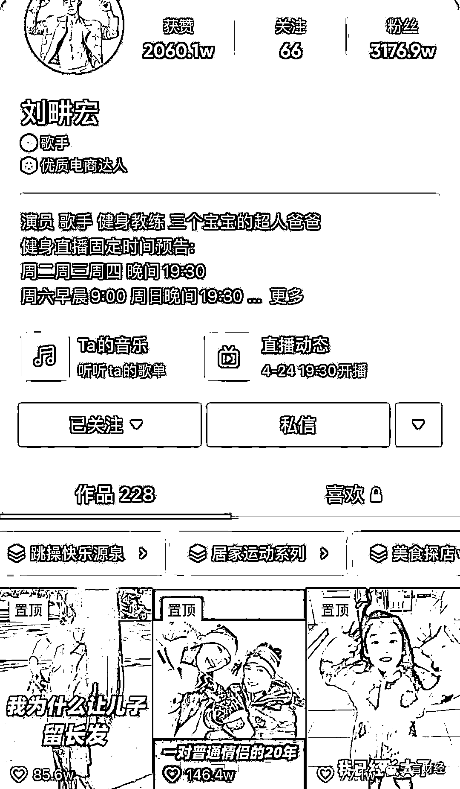

不过，健身减肥这种事不能操之过急，尤其是对没有运动习惯的人来说，**一不小心就容易过度运动，或者就从刘畊宏女孩变成“**受伤女孩**”了。** 

这不，在社交平台上，不少网友晒出了自己的尴尬经历。

**第一波“刘畊宏女孩”受伤了**

在抖音上有个热门话题是“成为刘畊宏女孩的第三天”，这几天疯狂运动的女孩们分享了自己健身后的走姿，简直太真实了，忍不住让人大喊那不就是我。 

[`mp.weixin.qq.com/mp/readtemplate?t=pages/video_player_tmpl&action=mpvideo&auto=0&vid=wxv_2364849462541598722`](https://mp.weixin.qq.com/mp/readtemplate?t=pages/video_player_tmpl&action=mpvideo&auto=0&vid=wxv_2364849462541598722)

**视频中女孩下楼梯走出了“大佬范”，我愿称之为“刘畊宏反应”。** 

刘畊宏本人也在视频下留言，“注意安全啊”。 

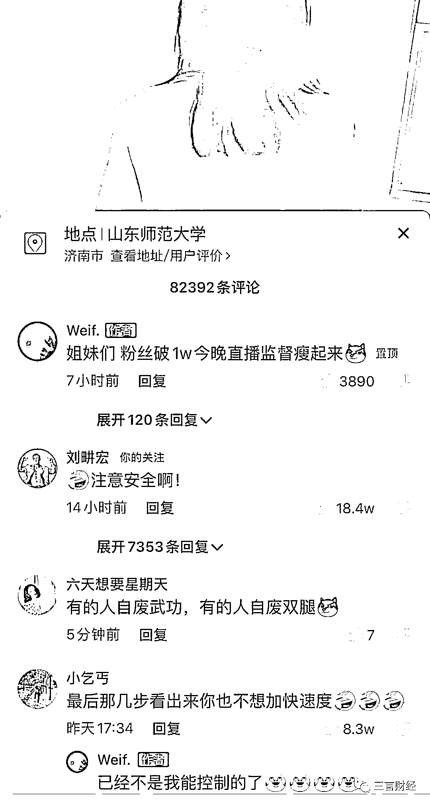

成吨网友在视频下留言，有类似情况的人并不少。女孩也自嘲“已经不是我能控制的了”。 

这几天估计有不少“**下楼恐惧症**”的刘畊宏女孩出现在你身边。 

**有网友调侃，“刘老师是开了丧尸培训班吗”，跳完刘畊宏走路考潜能。** 

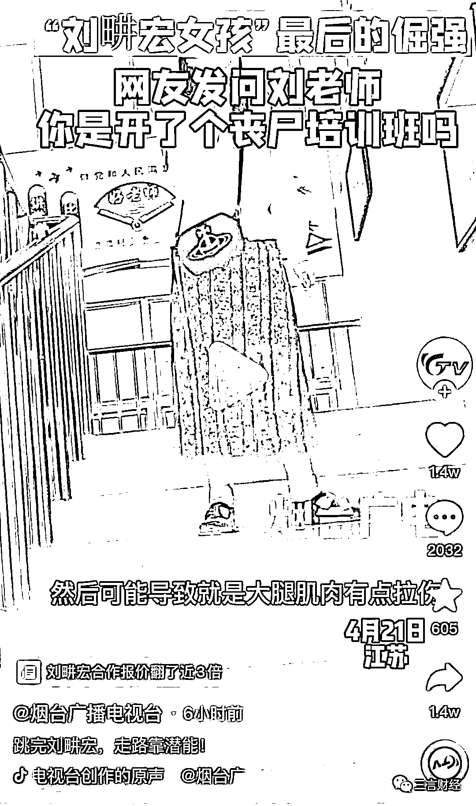

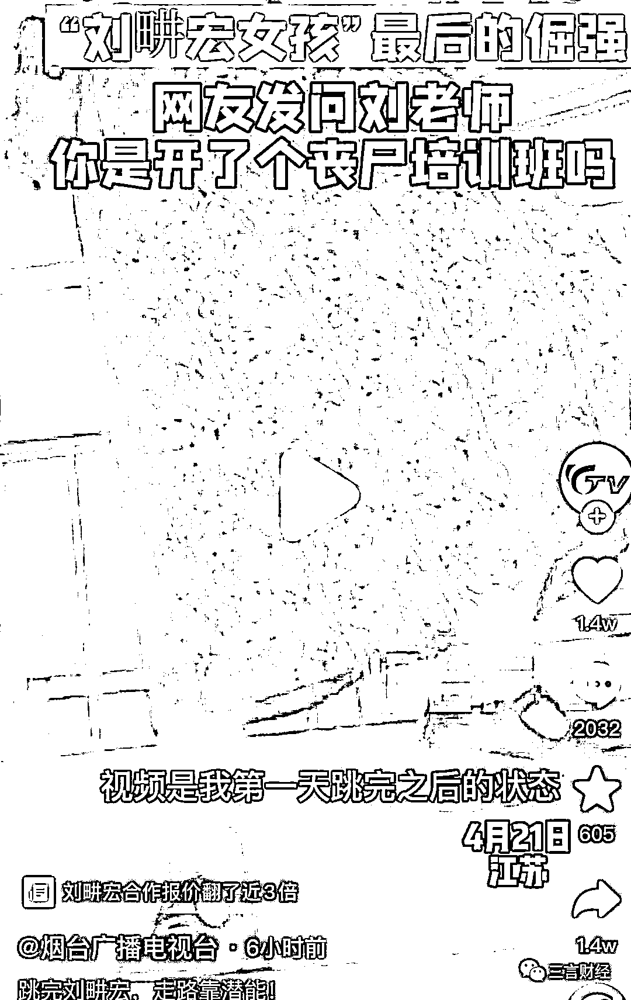

上面这种顶多算过度运动，休息几天或许就能恢复，但确实有一些女孩真受伤了。 

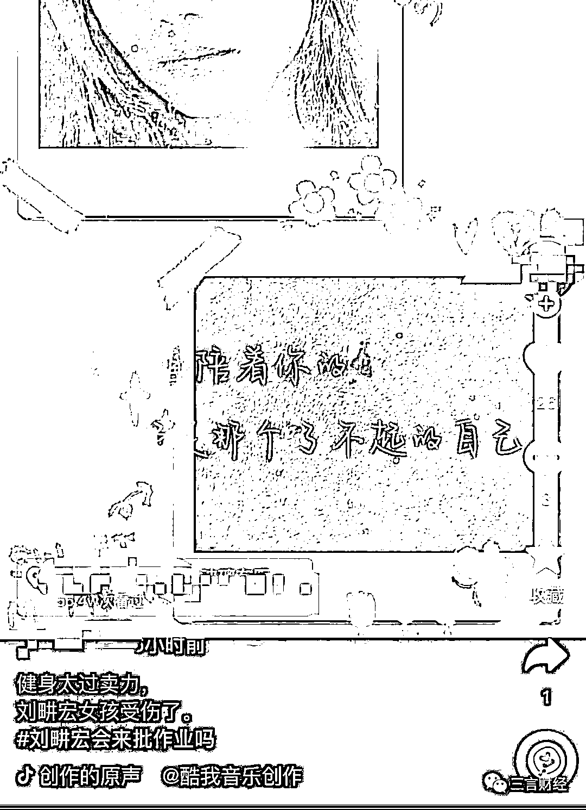

长时间的健身太过卖力，无疑增加了受伤的风险。毕竟健身不能一蹴而就。 

**但是好多刘畊宏女孩是刚开始练就受伤了，有种出师未捷身先死的悲壮。**

有网友爆料，有女孩跟练 5 分钟，结果当晚就进了医院。而原因是运动过激导致黄体破裂，在医院住了两天，花了 2300。 

这波就有点亏了，健身不成还赔了钱受了罪。**原先说李佳琦和刘畊宏是“人财两空”组合，现在看看刘畊宏可以单独享用这个称呼了。** 

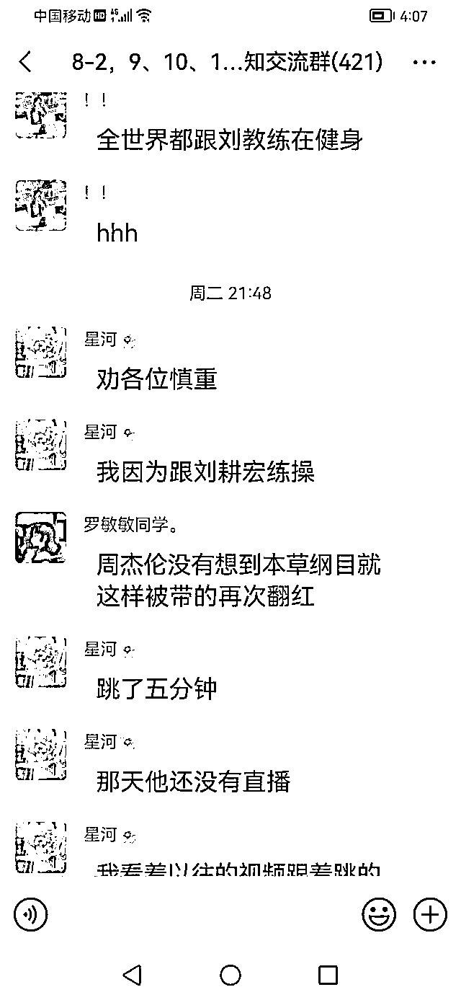

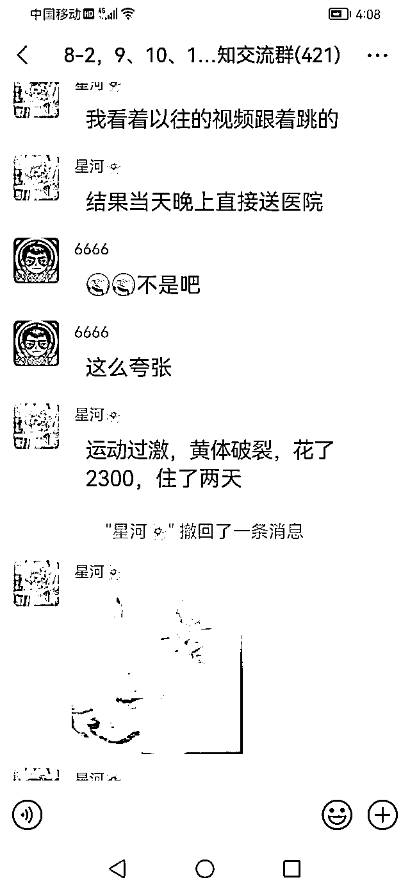

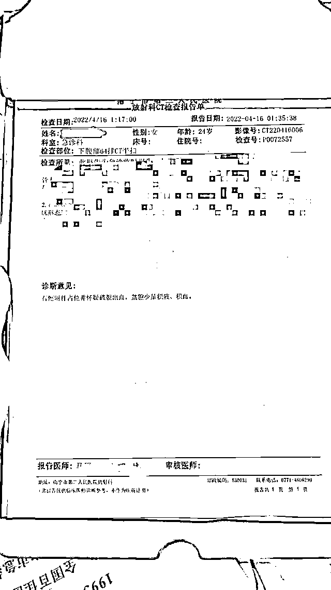

还有人不小心撞到了茶几上，前一分钟还陶醉在刘畊宏女孩的快感中，后一分钟就瘫了，真是痛并快乐着。 

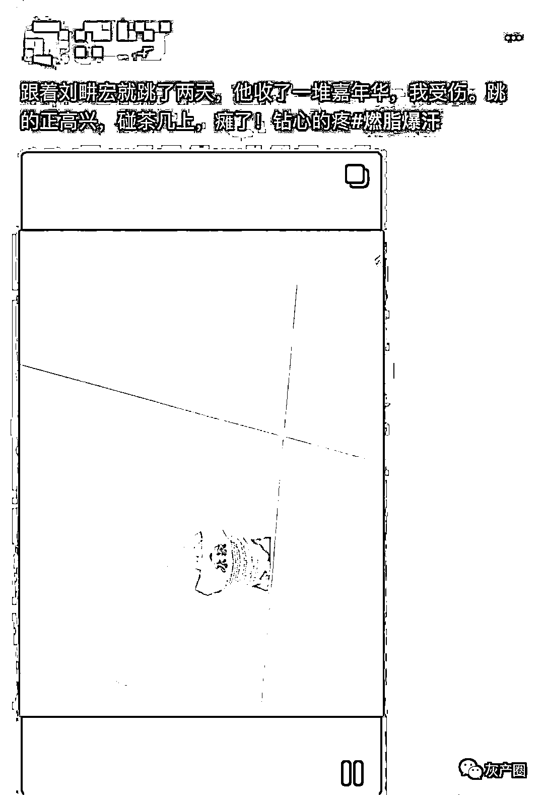

还有人跳第一遍就手脚打架，脚踢到手指甲上了，看网友的表情，可以说相当的具体形象了。 

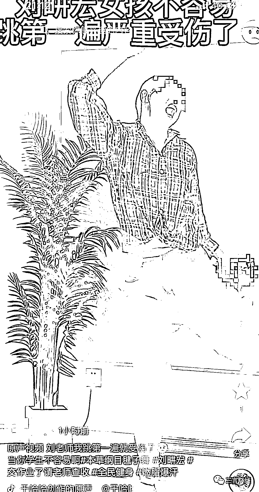

另一个悲伤的故事是女孩上场五分钟便脚肿了，云南白药伺候上了。 

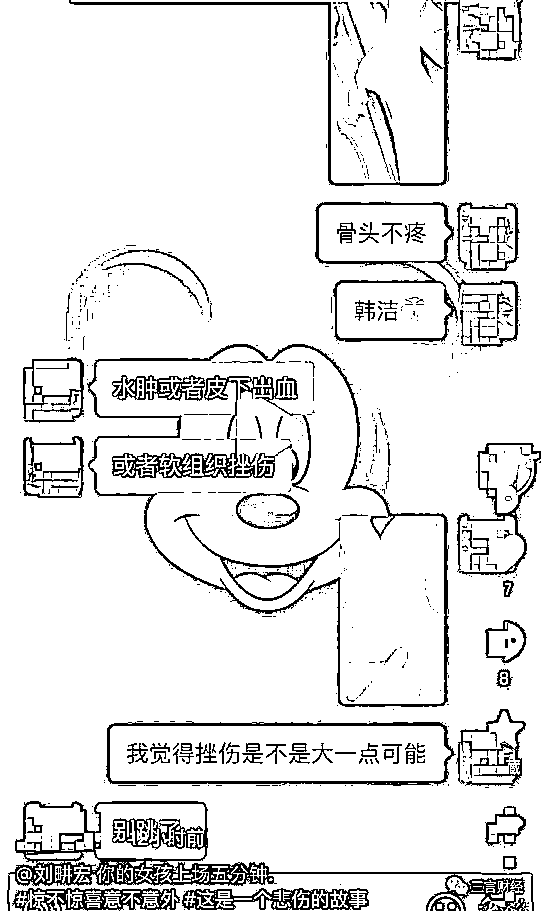

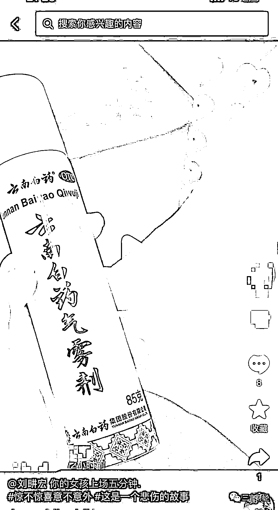

**畊宏虽好，可不要“贪杯”**

刘畊宏女孩看来也意识到了问题的严重性，“刘畊宏燃脂操别乱练”的话题今天一直排在微博热搜前面。

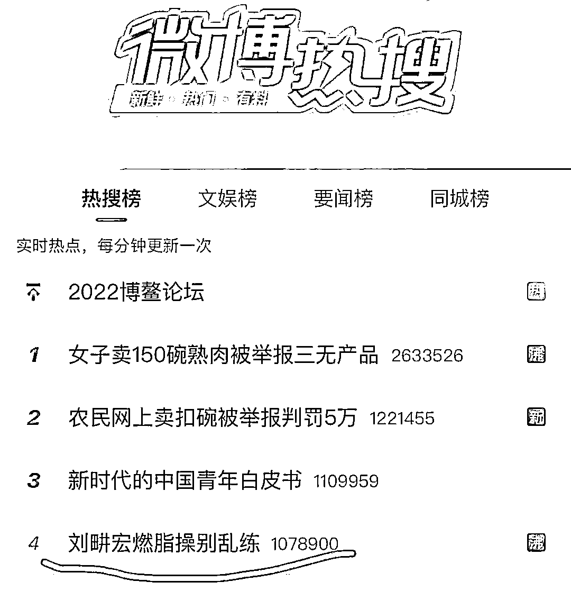

阅读量超过 7 亿，讨论超过 5.4 万。 

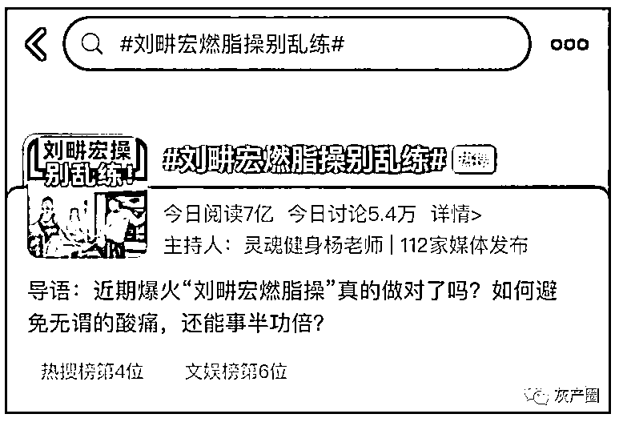

事实上，刘畊宏在直播时也会尽可能把动作讲清楚，也会强调注意事项，让网友量力而行。 

但不是每个人都能理解好、做好，况且还有不少人就是跟风练，运动基础差，这难免就容易出现运动过度，甚至受伤。 

对一般人来说，刘畊宏燃脂操的强度其实不低，完全更上节奏有一定难度。 

其实在 Keep 上也有不少类似的运动直播，刘畊宏掀起的健身热潮，有很多原因，其中一个就是它更简单、有趣，加上明星的背景以及流量出圈才成为现在这种状况。

**不过畊宏虽好，可不要“贪杯”。**

有健身人士也给出了自己的分析和建议。 

首先是动作上不是所有人都能做对的。这有多种原因，可能是基础运动能力太差，强度跟不上容易动作变形，发力不对可能达不到应有的锻炼效果，还可能受伤。 

**改善的方法也有，比如尽可能把动作做到位，或者降低跟练的频率。** 

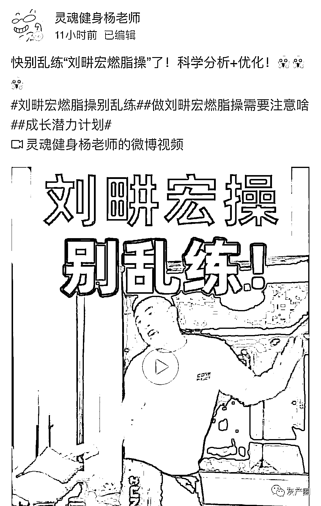

另外，以个人健身经验来说，健身是个长期活动，三天打鱼两天晒网肯定无法获得成效。

尤其对大部分人来说，健身的目的就是减肥，毕竟夏天就要来了。 

要想获得满意的减肥效果，一是要降低短时间的期望值。这样做的目的就是能更好地坚持下去。如果能够做到这点，就不要短时间高强度锻炼，尽量把练习和休息合理分配。 

另外，控制好饮食，碳水、蛋白质、脂肪合理搭配，别只是把黄瓜当饭吃了，体重倒是减下来了，怕是身体就夸了。 

为了夏天，冲啊。

来源：三言财经

← 向右滑动与灰产圈互动交流 →

