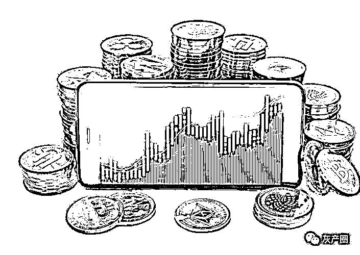
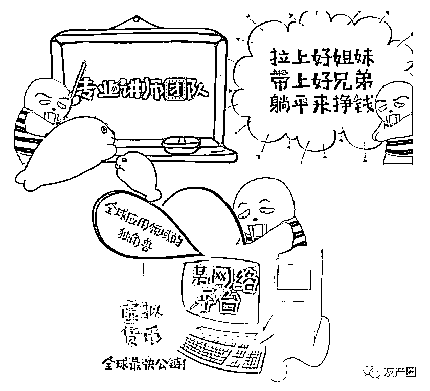
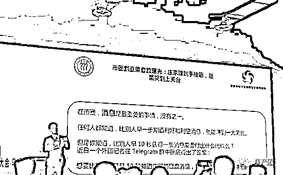
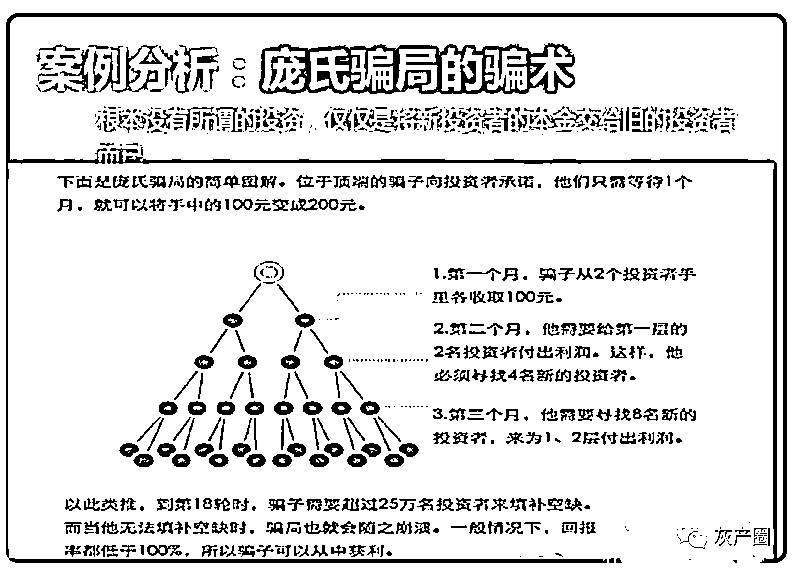

# 警惕虚拟币投资骗局！

> 原文：[`mp.weixin.qq.com/s?__biz=MzIyMDYwMTk0Mw==&mid=2247534244&idx=7&sn=1291a7b10fb77ee87625853319d46d7a&chksm=97cb8d9ca0bc048a5c8f7e1ed05322aadbd4041ad4509361f59a8f955bf03ae088a878805054&scene=27#wechat_redirect`](http://mp.weixin.qq.com/s?__biz=MzIyMDYwMTk0Mw==&mid=2247534244&idx=7&sn=1291a7b10fb77ee87625853319d46d7a&chksm=97cb8d9ca0bc048a5c8f7e1ed05322aadbd4041ad4509361f59a8f955bf03ae088a878805054&scene=27#wechat_redirect)

近几年

随着区块链技术和数字货币

受到越来越多的关注

数字货币投资市场逐渐开始繁荣起来

但是繁荣的背后

也存在暴露出许多问题

因为人们对数字货币

过于陌生

相关法规不完善

行骗成本低等原因

使得各类骗局层出不穷

目前，新余市反诈中心已发现本地有不少投资者使用“XX 钱包”、“XX Coin”等 APP 投资虚拟币，存在被诈骗的风险隐患，中心工作人员已使用“96110”专线对相关人员进行了预警提醒。为帮助市民提升识诈防骗意识，新余市反诈中心特意收集了一些虚拟币骗局的常见套路：

**一、专业割韭菜**

**简单来说就是操盘手操盘，这种操作手法，通常是几个人提前在某个币低价位埋伏好单，就去各大群宣传该币将会有利好，来不及解释了，赶紧上车。于是一帮不明真相的小散户冲进去后，果然把币价拉起来了。**

**然后，这伙人又建持仓小群，就是只有持有这个币多少仓位才能进群。于是，这一群人又到各大群里去宣传利好消息，忽悠各种小白上车。**

****

****二、交易所骗局****

****交易所骗局多见于一些几乎没有听说过的小交易所，常常利用一些小币种，短时间内通过修改后台数据产生较大涨幅吸引投资者。****

****为了让投资者放心，该类新骗局多在官网放上一些业界大佬的照片，以及为其站台的信息，让投资者觉得平台可信。先是通过虚假涨幅吸引投资者入场，再通过虚假跌幅让用户资金大幅缩水，更有甚者直接圈钱跑路。****

******三、资金盘推广******

******这个一般会出现许多的大群里面，发一些资金盘的广告链接，有些链接还是带病毒和木马的。******

******等你打开后，然后提示你注册或者申请账号后，就盗取你的个人信息之类的，或者是盗取你的钱包私钥之类的东西。******

********四、场外交易骗局********

******由于政策监管，正规交易所的法币兑数字货币渠道被切断，但是正规场外交易所又还很少。******

******那么一些想要买卖手里的数字货币的投资者就只能和群里的群友们相互交易。有些骗子就通过私聊拉近关系后，提出要先打钱过去才把币发给你的要求。此时你若掉以轻心就可能上了对方的套，一旦把钱打过去立马被拉黑，电话更是打不通。******

******场外交易，一般新人参与的比较多。新进入币圈的小白因为不清楚交易平台，常常采用场外交易的形式，结果肯定就是被骗了。******

********五、庞氏骗局********

******庞氏骗局是在数字货币领域中最常见的一种骗局，以短期内高回报的承诺为特征，庞氏骗局的运作方式是把后来投资者的钱作为给早期投资者的回报的模式运行。******

******此外，庞氏骗局另一个特点就是类似传销，如果需要发展下线，不断寻找合作者，根据下面人头数量和这些人的业绩来决定你有多大的回报。******

************

********六、代投骗局********

******代投，一直是币圈的重要参与者，他们在一级市场或者通过一些关系拿到加密货币私募轮，卖给投资者，中间赚差价。******

******代投的实际操作就是你要直接把钱打入到对方的钱包里面，如果这个帮你代投的人凭空消失了，那你相当于直接损失掉了这笔钱。******

******代投骗局常见应用于一些小白，或者对加密货币了解一点，又没有投资渠道的新人，利用的就是新人急于投资又没有合适渠道的心理。******

********七、群聊骗局********

******现在各类项目群、大 V 收费群、免费群层出不穷，这些群聊之中也存在许多的骗局；大致可以分为三类：收费群、割韭菜和加好友骗局。******

******收费群：一般都是所谓的大神开设的，收费标准看该“大神”的影响力，从几百元到几十万甚至几百万不等；其中有些群确实有不少干货，对散户有所帮助，但也有很多纯粹是为了圈钱而开设的。实际上这个大 V 自己连 K 线都不算精通，每天群里分析的那些东西也是从其他自媒体处抄来的。******

******这种付了钱加了群一点有用的东西都没有还算好的，有些心黑的甚至会再次收割你一波，直接让加群的用户高位给他接盘。******

********八、空投骗局********

******空投骗局分为两种，一种是在空投活动时骗你填写钱包私钥，目的是为了盗取你钱包中的币。第二种是虚假空投，说白了就是你参加空投后不给你相应的代币，虚假空投的目的一般是为了聚集用户，再用聚集的用户变现，不要小看这些聚集的用户，在币圈只要有足够多的用户，你有一百种赚钱的方法。******

********如何识别传销币骗局********

******币圈骗局丛生，稍不留意就容易掉进骗子的陷阱当中，因此投资人在投资区块链项目，首先要明确数字货币的发行方式、交易方式、价格波动等机制。******

********我国已叫停虚拟货币交易********

******为防范风险，早在 2017 年 9 月，中国人民银行等七部门出台的《关于防范代币发行融资风险的公告》文件精神，以 ICO（首次代币发行）融资为代表的代币发行融资被叫停。虚拟货币交易平台的中国三大比特币交易平台火币网、OKCoin 币行和比特币中国相继停止比特币交易。之后，火币网和 OKCoin 币行更是停止所有关于虚拟货币的交易业务。******

******来源：新余公安，利箭在出击******

************

******← 向右滑动与灰产圈互动交流 →******

************