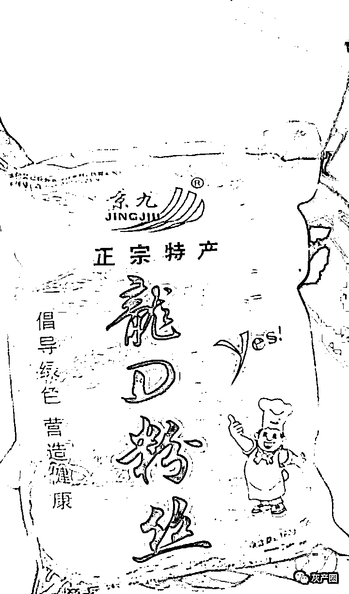

# 上海人的朋友圈成了龙口粉丝见面会，上海物资供应的路子太野了！

> 原文：[`mp.weixin.qq.com/s?__biz=MzIyMDYwMTk0Mw==&mid=2247534342&idx=1&sn=c11e0f342072ce6124b3e0fca8bf1462&chksm=97cb8c3ea0bc052824fa944fe2d0d0edef8ff5a99109b25dcb81db206e1ae0aadea1ce75bbbc&scene=27#wechat_redirect`](http://mp.weixin.qq.com/s?__biz=MzIyMDYwMTk0Mw==&mid=2247534342&idx=1&sn=c11e0f342072ce6124b3e0fca8bf1462&chksm=97cb8c3ea0bc052824fa944fe2d0d0edef8ff5a99109b25dcb81db206e1ae0aadea1ce75bbbc&scene=27#wechat_redirect)

最近上海部分小区收到了保供物资，，但是从上海人的朋友圈来看，全国的母猪肉，过期食品，发霉面包，拉肚子酱鸭，都拉到上海清库存了

本以为吃方面面没有调料包已经够倒霉的了，更惨的在上海发生了，牙膏里没有牙膏！

万家宴上海牌子浦东生产基地，搞个厂家直送理论上成立

金鼎的瓶盖就太魔幻了，什么时候有联名款了

最离谱的龙口粉丝，网友戏称本次上海发物资，就是龙口粉丝见面会 

正宗的龙口粉丝是烟台招远产的，因为在龙口港口出口所以被叫做龙口粉丝只有招远市、龙口市、蓬莱市、莱阳市、莱州市这几个地方生产的粉丝在审批通过后才能叫龙口粉丝

乍一看“口”挺像的，但是仔细一看不对劲，再一看旁边的拼音 

“LONGRENFENSI”=龙仁粉丝？

更离谱的是“龙仁粉丝”生产企业于两年前注销

上海市民以前除了买高档包包可能就没见过内容这么丰富的山寨品

廿（niàn）

匸（xì），差点以为国外货

这恐怕不是霸王龙口粉丝吧 

我要龙口粉丝，你给我龙缺口粉丝，你个奸商

要么说上海的路子广呢，315 都凑不齐这么全的十八线小城都找不全那么多山寨货

这个真是挑战眼力了

尨（páng）

闵行莘庄镇发的，山寨就山寨吧，总算不用再学习汉字了

但是没想到，连山寨都被山寨了 

负负得正，你的是正品了。

* * *

上海滩小律师:上海人民绝对想不到封城还能为全国清库存作出这么大的贡献，2400 万人口，一人一天天吃一斤，每天也能消耗上万吨的库存....

开水族馆的生物男: 看累了...我常年去山区都没能看到的那么多山寨/过期/劣质到连拼夕夕都不碰、专骗偏远地区山民的产品，竟然这个月陆陆续续出现在了魔都

萝贝贝：看朋友圈上海朋友晒物资有感：上海是不是马上就要发康帅傅嬉哈哈汰绩和漂柔了……

来源：微博那些事儿

← 向右滑动与灰产圈互动交流 →

