# 在上海志愿时长 104 万小时？可能服务过康熙皇帝吧

> 原文：[`mp.weixin.qq.com/s?__biz=MzIyMDYwMTk0Mw==&mid=2247534342&idx=2&sn=a7d6124bba5c8294fe12068d7b306463&chksm=97cb8c3ea0bc052862df15ca5f3bcbcedf365876538cad59807984a258fe5cf45948c7225ccd&scene=27#wechat_redirect`](http://mp.weixin.qq.com/s?__biz=MzIyMDYwMTk0Mw==&mid=2247534342&idx=2&sn=a7d6124bba5c8294fe12068d7b306463&chksm=97cb8c3ea0bc052862df15ca5f3bcbcedf365876538cad59807984a258fe5cf45948c7225ccd&scene=27#wechat_redirect)

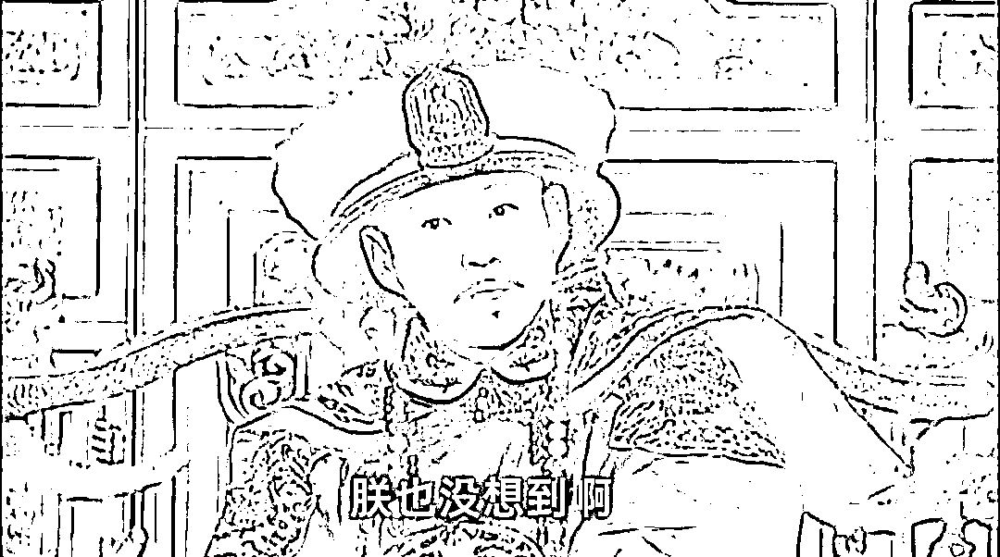

图源丨电视剧《康熙王朝》

魔都上海，名副其实。

一波未平一波又起，感觉上海新一轮的大戏又来了。

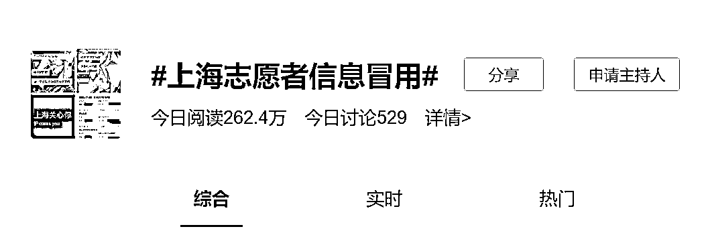

网传查询志愿者信息或有意外惊喜。有网友无意中查询志愿者信息，发现自己在不知名的情况下被注册了登记了，甚至有几十个小时到几百个小时不等的服务时间。

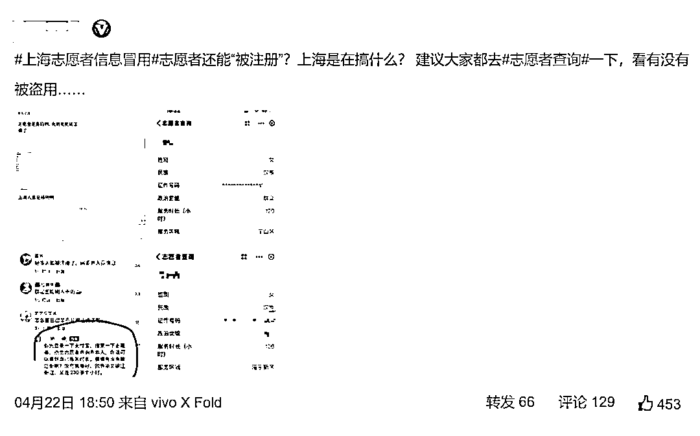

什么意思呢？ 

**就是明明在家里隔离，或者明明在其他城市上班，结果却显示自己在上海当志愿者，身份信息被冒用了。**

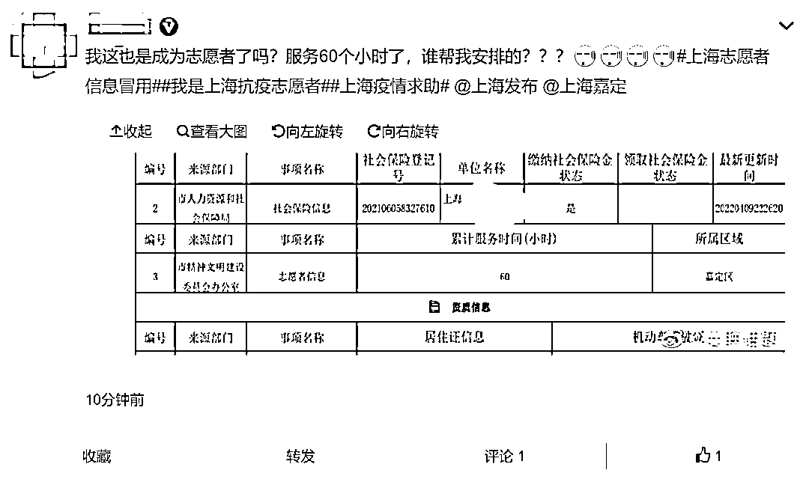

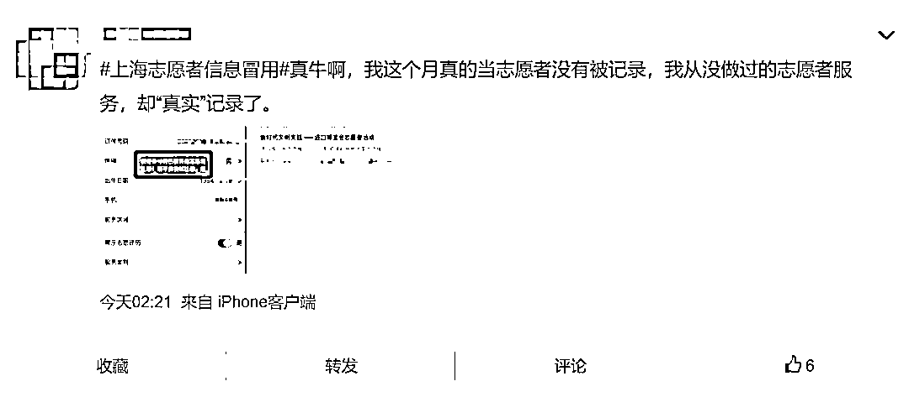

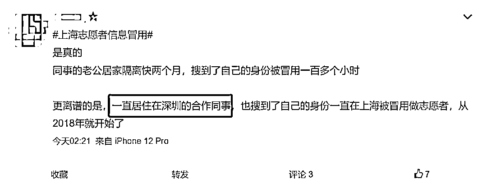

**可笑的是，它还重新给你定义了一天 24 小时。**

有网友发现自己一天环境卫生劳动 16 小时。 

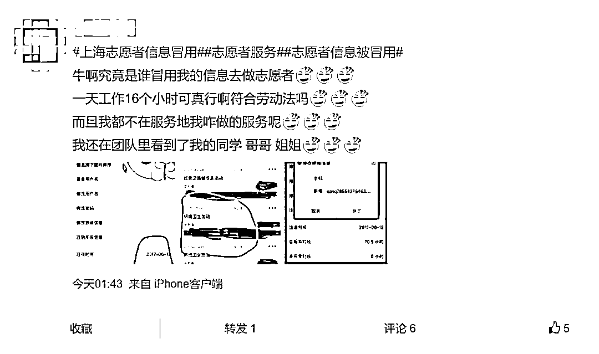

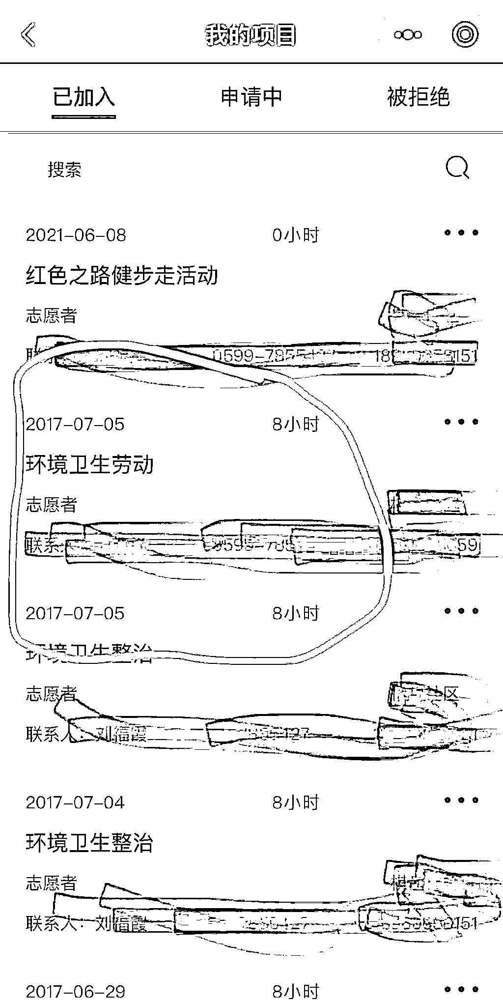

有网友发现自己一天能志愿服务 50 个小时。 

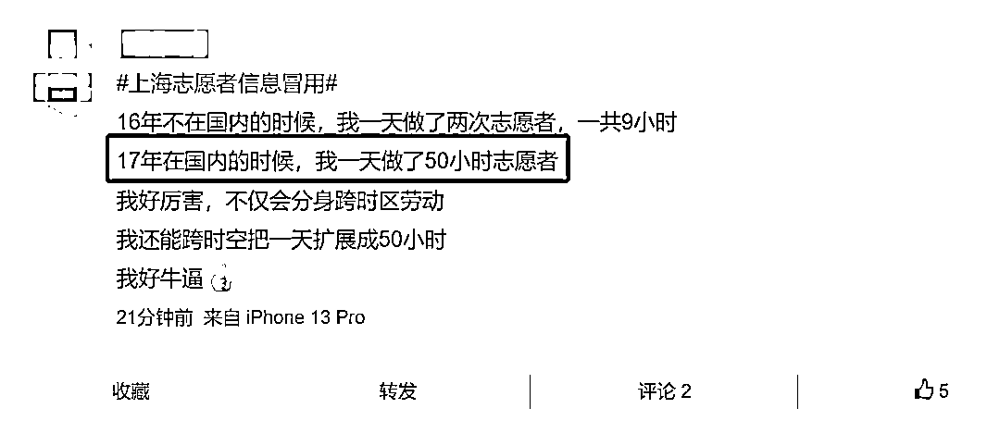

就算做假账，账目也没平掉啊。 

真正牛逼的是，高血压糖尿病被阿姨照顾，一直在家里待着的老年痴呆患者，都参与了志愿者。 

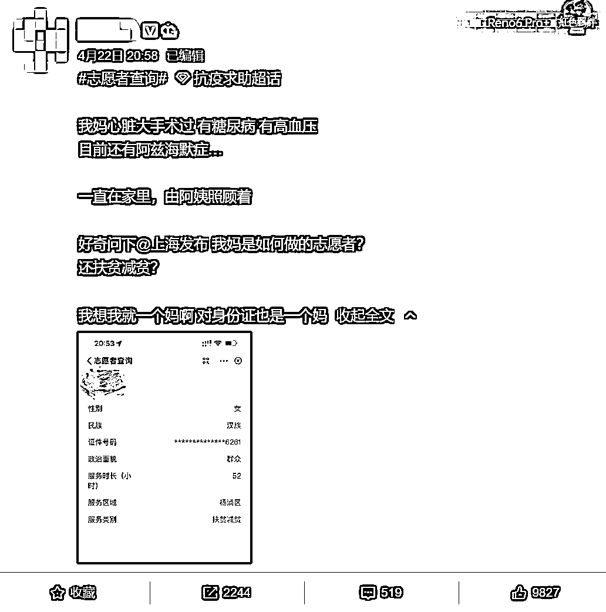

志愿服务的时长也是搞笑，有网友发现自己被志愿服务了 3.21 万小时。

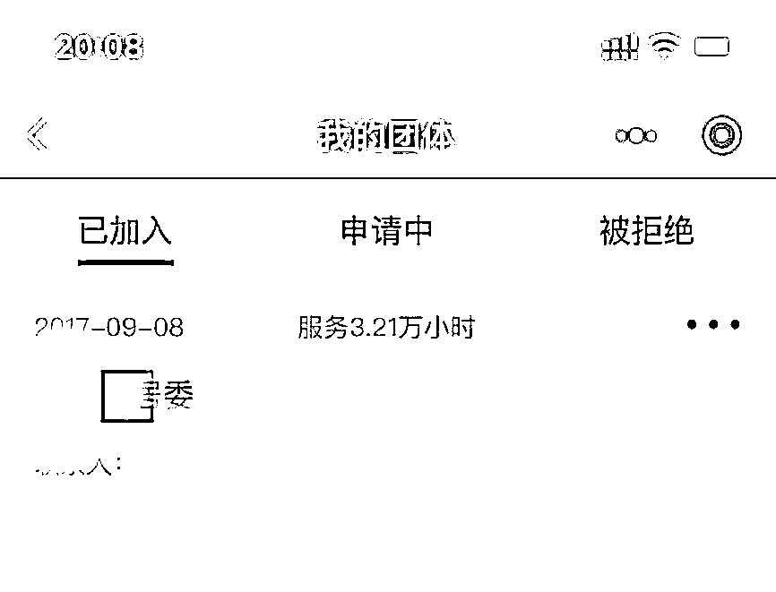

5 年不到的时间里干了 32100 个小时，平均每天要干 18 个小时，资本家都没这么黑......

最最最离谱的是，还发现一位志愿时长 104 万小时的朋友，**如果撇开 2015 年 10 月 5 日的加入时间，这可能是志愿服务过康熙皇帝的人。**

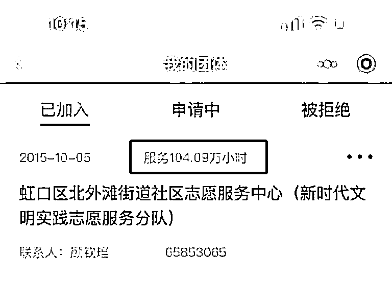

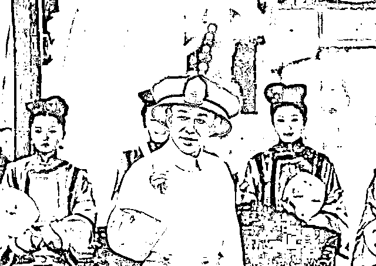

图源电视剧《康熙王朝》 

据该网友反映，她的儿子是是 2015 年 12 月底出生，怀胎 7 个月还在志愿者的岗位上坚持？

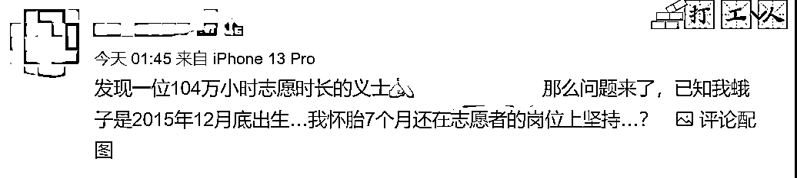

**1040900 小时，按一天志愿服务 8 小时计算，这位朋友服务了 356.47 年，从 2022 年往前推就是公元 1665 年，清朝的康熙四年。**

那一年，12 岁的康熙皇帝和 13 岁的赫舍里氏举行了隆重的结婚大典。 

连夜，大量网友上支付宝查询自己的志愿者服务信息。 

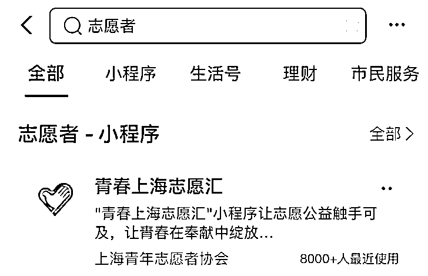

在网友的疯狂搜索下，这个志愿者查询平台连夜下线。

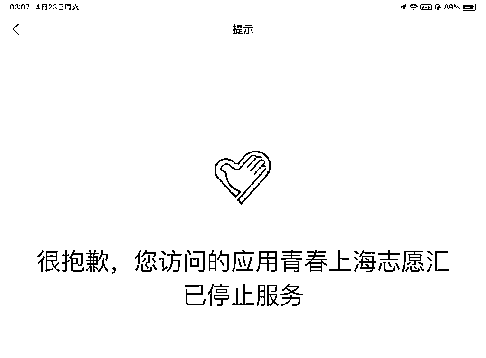

上海解决问题很及时，就是方法太上海。

**从精准防疫到精准防议，上海管的最好的是评论区。**

说实话我完全无法理解，操作要魔幻到什么程度，才能做出这样的事情。

因为不管是啥到最后都是「辟谣」。

莫名的就成志愿者了，这个“被志愿者”的行为，还是相当恶心人的。

**说白了还是钱闹的。**

志愿者有补贴的，志愿服务组织是有经费和奖励的。

如同你去献血，献血车上的工作人员都会送你小零食和小玩偶，这些都是算在专项支出的。

根据 2020 年 1 月 1 日实行的新修《上海市志愿服务条例》，有多条规定：

第二十二条 对志愿者在从事志愿服务活动中由本人所支出的交通、误餐等费用，**志愿服务组织可以给予适当的补贴。**

第二十四条 志愿服务组织可以根据自身条件和实际需要，**为志愿者办理相应的人身保险。**

第二十六条 志愿服务组织可以通过接受社会捐赠、资助等形式，**筹集开展志愿服务活动的经费。**

第三十一条 本市将志愿服务工作纳入群众性精神文明创建活动。对在志愿服务活动中表现突出的志愿者和志愿服务组织，**由有关部门予以表彰、奖励。**需要市、区人民政府表彰、奖励的，有关部门可以向市、区人民政府提出建议。

**有交通、餐费的补贴，有办保险的支出，可以接受社会捐赠筹集经费，有关部门还会下发表彰、奖励......**

看到这里应该就明白了吧，稍微有点经济头脑的人就知道里面的操作空间有多大。 

既然没有真正搞志愿服务，那省下来的一切费用，都可以在账目上做成支出，那自然是志愿服务越多越好，时间越长越好。

在古代，这就是吃空饷、喝兵血的套路，上一次听到类似案例还是骗取扶贫款。 

**那请问被志愿的补贴呢？**

工作记录是他们填的，而你根本没干活儿却帮你填了干活儿。

看来人人志愿者时代已经到了，你不必知道谁帮你志愿服务了，做好事不留名 雷锋精神永流传。

**下捞百姓菜钱，上套志愿专款，真的聪明。**

更可怕的是，谁帮你注册了？谁冒用了你的身份信息？

对上海乱象，我已经无话可说了，只能说：

**查！给我狠狠地查！**

来源：昌南大队长

← 向右滑动与灰产圈互动交流 →

