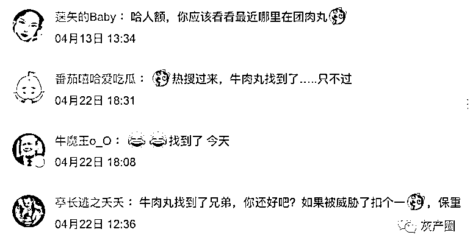
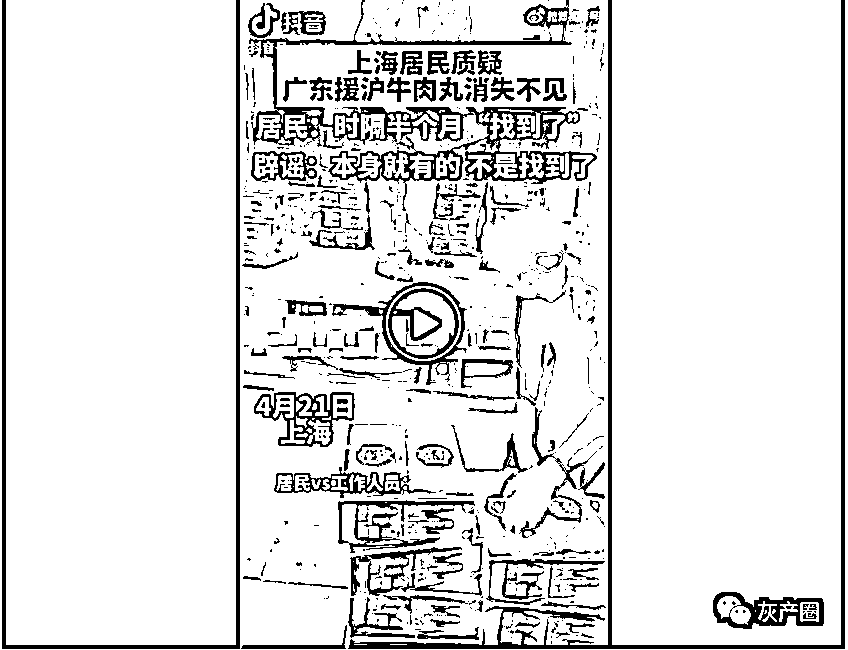
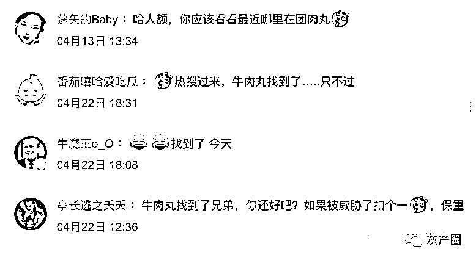
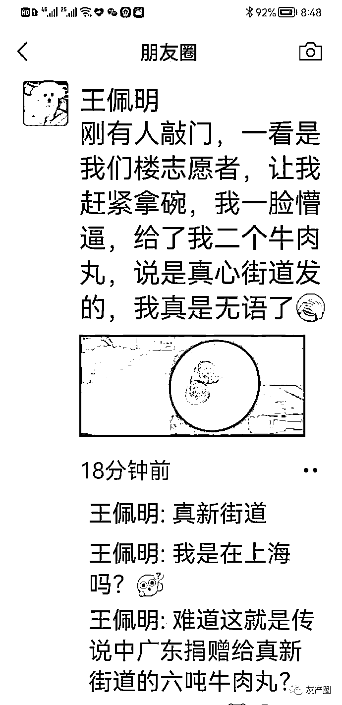

# 上海居民质疑广东捐的牛肉丸不见了，半个月后，找到了！一人分了俩丸

> 原文：[`mp.weixin.qq.com/s?__biz=MzIyMDYwMTk0Mw==&mid=2247534342&idx=3&sn=c86431941c2c413d8ddaf43daa833729&chksm=97cb8c3ea0bc05288253328b307600f6f77b9d8be839b21998c1379ee4c34a830f125d4dc1e4&scene=27#wechat_redirect`](http://mp.weixin.qq.com/s?__biz=MzIyMDYwMTk0Mw==&mid=2247534342&idx=3&sn=c86431941c2c413d8ddaf43daa833729&chksm=97cb8c3ea0bc05288253328b307600f6f77b9d8be839b21998c1379ee4c34a830f125d4dc1e4&scene=27#wechat_redirect)

4 月 5 日，广东驰援上海的 6 吨潮汕牛肉丸，由汕头市金派食品发出，一起送出的还有 19 吨鸡蛋。

从视频看，运送车辆中一辆为冷藏车，明显运送需冷藏的牛肉丸。该新闻由南方农业报官抖报道的。

[`mp.weixin.qq.com/mp/readtemplate?t=pages/video_player_tmpl&action=mpvideo&auto=0&vid=wxv_2366779629568475136`](https://mp.weixin.qq.com/mp/readtemplate?t=pages/video_player_tmpl&action=mpvideo&auto=0&vid=wxv_2366779629568475136)

然而，并没有见道分发牛肉丸的消息，反而看到了监督此事的网友被拉黑

据某省广电官抖消息，隔了 16 天，牛肉丸 4 月 21 日才“找到”，运送车辆为普通货车。不是居民替广州盯着，以后历史还得说广东诈捐吧？ 

网友调侃：广东来的牛肉丸也先去当了十四天志愿者吧，锻炼的更加 q 弹

上图为视频截图，下图文视频违规已下架

网友纷纷去那位网友下面留言，颇有点“王师北定中原日，家祭无忘告乃翁”的感觉 

上海网友朋友圈证实：确实收到了牛肉丸！ 

来源：微博那些事儿

← 向右滑动与灰产圈互动交流 →

