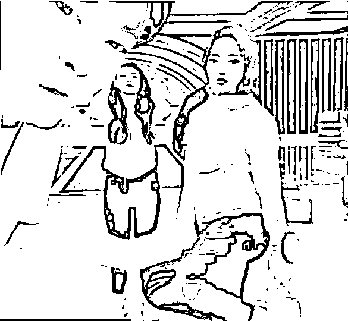
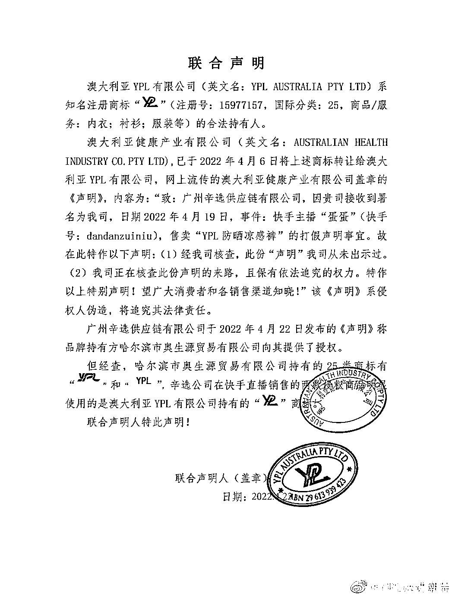

# 被曝再卖假货！？辛巴方称有授权，品牌方：不，没有授权

> 原文：[`mp.weixin.qq.com/s?__biz=MzIyMDYwMTk0Mw==&mid=2247534342&idx=7&sn=71dba6f7d1f7345302164bd78e5947a1&chksm=97cb8c3ea0bc0528afea129370e0dce0a584373d021f282d32c38811189c2ef7fc88573ee521&scene=27#wechat_redirect`](http://mp.weixin.qq.com/s?__biz=MzIyMDYwMTk0Mw==&mid=2247534342&idx=7&sn=71dba6f7d1f7345302164bd78e5947a1&chksm=97cb8c3ea0bc0528afea129370e0dce0a584373d021f282d32c38811189c2ef7fc88573ee521&scene=27#wechat_redirect)

辛巴和旗下主播“蛋蛋”4 月 18 日在快手直播间现身带货了一款名为“YPL 防晒凉感裤”的产品，当天实时下单 10.2 万单，一晚销售额超 600 万元。随后有消费者下单后发现 YPL 品牌官方并无这款产品，因此质疑辛巴售卖假货。

18 日直播画面截图 

4 月 22 日 16 时，涉事品牌方 YPL 发布声明称，“4 月 18 日，快手主播‘蛋蛋’直播间，上架销售一款名为‘YPL 防晒凉感裤’产品，经确认，该品未经官方授权，不属于 YPL 品牌旗下产品！为保护广大消费者合法权益，YPL 将采取法律手段对相关销售、生产公司进行追责。”

据了解，YPL 品牌方也宣布向广州辛选供应链有限公司递交了律师函。 

当日 21 时，辛选官方微博发布声明，回应了关于旗下主播蛋蛋所售 YPL 产品的授权问题。辛选表示，经初步核查，品牌方持有方“哈尔滨市澳生源贸易有限公司”向辛选提供了授权链路和相关书面材料，如存在任何违法违规行为，辛选将对其依法追责，辛选将始终与消费者站在一起。

23 日凌晨，YPL 再次发布声明称，涉假产品的 YPL 商标所属权为 YPL；其部分文件中提到“哈尔滨某公司”所注册的商标为自创的图形标，和售卖的产品差异巨大；部分网络账号涉及发布 YPL 其他盖章文件，必定严查到底！

**曾因卖“假燕窝”被调查** 

2020 年底，辛巴团队主播“时大漂亮”因卖“假燕窝”被广州、厦门两地市场监管部门进行调查。

同年 11 月 27 日，辛巴发布道歉信回应，表示确实存在夸大宣传，产品实为一款燕窝风味饮品，愿意退一赔三赔付消费者，该产品涉及订单共 57820 单，成交价 1549 万余元，预计共需赔付 6198 万余元。

同年 12 月 23 日，广州市场监管部门公布“辛巴直播带货即食燕窝”调查处理情况：辛巴方被罚 90 万，市场监管部门拟对燕窝品牌方广州融昱贸易有限公司作出责令停止违法行为、罚款 200 万元的行政处罚。

此外，辛巴的快手账号被禁 60 天，后于 2021 年 3 月 27 日重启直播。

2022 年 1 月 14 日，河南省消费者协会针对“辛巴直播带货即食燕窝消费民事公益诉讼案件”举行诉讼情况新闻通报会。河南省消协提起消费民事公益诉讼：退赔 7971 万余元。 

辛选集团 14 日对此回应称，“2020 年 10 月‘燕窝事件’发生至今已超过 14 个月，我们再次就此事件向广大消费者致歉。在过去这一年多时间里，辛选一直在主动积极履行先行赔付承诺。”

辛选集团公开的相关赔付进展显示，“燕窝事件”后，辛选于 2020 年 11 月 27 日提出了“先行赔付方案”，即：召回辛选直播间销售的全部“茗挚”品牌燕窝产品、承诺退一赔三，先保护消费者权益(2020 年 12 月 23 日，经市场监管部门查明认定两次直播成功交易共 47474 盒，实际销售金额 12513173 元)。与此同时，辛选在充分保护消费者权益之后依据合同及法律规定追究品牌方的责任。 

说明还称，截至 2022 年 1 月 14 日，已向与此事件有关的消费者赔付人民币共计 41439216 元。到目前能够联系到的、且符合退赔条件的消费者，均已获得赔付。 

来源：华夏时报、九派新闻、YPL 运动潮品、辛选官方微博、中国新闻网

← 向右滑动与灰产圈互动交流 →

