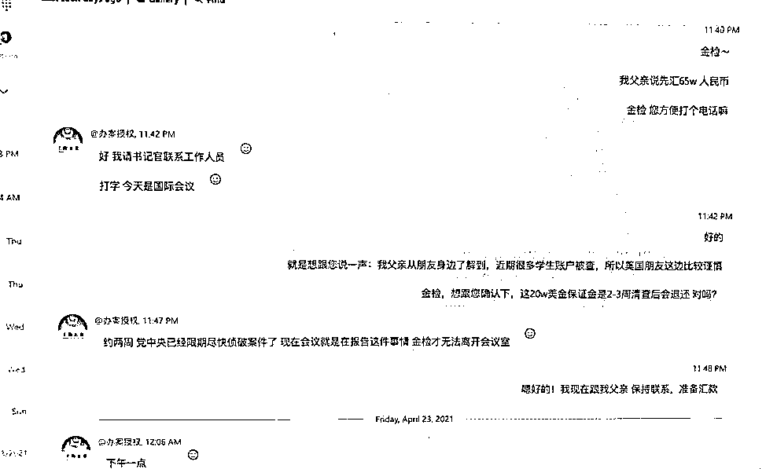

# “爸，我不想被抓走！”老爸为了学霸女儿出手就是 130 万，结果……

> 原文：[`mp.weixin.qq.com/s?__biz=MzIyMDYwMTk0Mw==&mid=2247534342&idx=8&sn=4ae4910d301496b357ccc099f3c13ebb&chksm=97cb8c3ea0bc05289a65c259b2e3077def72232f4a0b53cf6b0aaec930376a989694dce387a7&scene=27#wechat_redirect`](http://mp.weixin.qq.com/s?__biz=MzIyMDYwMTk0Mw==&mid=2247534342&idx=8&sn=4ae4910d301496b357ccc099f3c13ebb&chksm=97cb8c3ea0bc05289a65c259b2e3077def72232f4a0b53cf6b0aaec930376a989694dce387a7&scene=27#wechat_redirect)

**杭州的程先生很糟心，**远在美国杜克大学深造的宝贝女儿发来消息，说因涉嫌一起跨国诈骗案，她被联邦调查局（FBI）盯上了，还是中美联合办案。女儿怎么会摊上这么大的事？这种阵仗，程先生只在电视剧里看过，很快就慌了神……**** 

****

**留学的女儿突然打来电话：
爸，FBI 说我涉嫌犯罪**

****

**去年的一天清早，程先生接到了女儿小程打来的**跨国电话：“爸，美国 FBI 正在清查留学生，查到我了，说我涉嫌跨境犯罪，要把我遣返回国。”**程先生虽不了解国外的司法程序，但是“联邦调查局”的名头还是听过的，立马慌了。

程先生立马询问女儿是不是真的误入歧途？**电话那头，女儿再三保证没有参加任何非法活动。** 小程还发过来了一张国外某社交软件的聊天截图，**对方自称是美国互联网投诉中心 IDC 工作人员，说小程被数十人投诉参与了一起跨国诈骗活动，涉案人员 200 余人，主犯已经归案了，现在要联系中国大使馆把小程引渡回国受审。** 截图中显示对方还将语音电话转接给了协办案件的国内“xx 市公安徐警官”。

这位“徐警官”告诉小程：“现在这个案件涉及中美两国，在国内已经有十多人实名控告你了，一旦罪名查实，你立刻会被引渡回国受审”。说完，“徐警官”发来一份《控告书》，白纸黑字，落款处有法官的姓名，盖着红章，十分正式。

小程连忙问该怎么办，“徐警官”告诉她，只要配合办案，查清事实，可以不被引渡，**但是需要配合警方将二十万美元资金转入监管账户，查证完清白的话就能返还。****

****

****▲小程和“徐警官”的聊天记录**** 

****

**130 万元转入指定账户
账号主人（之前将自己的卡卖给犯罪分子）
被抓获归案**

****

****“爸，我不想被抓走，你帮帮我。”电话那头，小程着急得哭了。** “我们会给你一份 xx 检察院出具的《监管证明书》，资金查明后会还给你的。”一边是信誓旦旦的“徐警官”，一边是快被吓哭的女儿，**程先生立马按照对方的要求将人民币和美元转账到了指定账户，总额折合人民币约 130 万元。** 然而，时间转眼过去半个月，**女儿的事情一直没有进展，“徐警官”也渺无音讯了，后知后觉的程先生如梦初醒，意识到可能被骗，赶紧报了案。**公安机关接警后立即展开侦查，但此时被骗的人民币已经被分散转移到了境外，要想追回，已经难上加难。

经过资金流水筛查，公安机关发现，程先生被骗的大笔资金均转入外省一男子小涛（化名）的账户中，随后被分散转至许多账户。在外省公安机关的协助下，小涛被抓获归案。

3 月 24 日，上城区检察院受理了此案，**检察机关经过引导补充侦查，调取了程先生女儿在境外的聊天记录后，发现该案系冒充境外法律机关实施的跨国诈骗案。**经讯问，**小涛如实供述了其之前将自己的银行卡卖给犯罪分子用于实施诈骗的全部犯罪事实。****

****

**注意！售卖自己的“卡”
违法！**

****

**近日，上城区检察院以被告人涉嫌帮助信息网络犯罪活动罪向上城区法院提起公诉。目前，该案正在法院进一步审理中。** 

 **检察官说法：**将本人实名开立的银行卡、绑定手机号、U 盾等出售给他人用于信息网络犯罪的，属于《中华人民共和国刑法》二百八十七条之二中的“提供支付结算帮助”。** 司法实践中，如支付结算数额达到 20 万元以上或者出售银行卡非法获利 1 万元以上，出售银行卡的人就会被以帮助信息网络犯罪活动罪追究刑事责任。收购银行卡实施诈骗的犯罪分子，如诈骗数额超过 50 万元，属于“数额特别巨大”。

本案中，小涛贪图蝇头小利，将银行卡出售给犯罪分子，造成被害人百万元级别的损失，其行为已构成帮助信息网络犯罪活动罪，等待他的是法律的惩处。实施诈骗的犯罪分子，诈骗数额远超过“数额特别巨大”标准，也将面临十年以上有期徒刑。

检察官提醒：近年来，境外诈骗团伙已将目标群体逐渐由国内延伸至了国外，面向海外留学生的诈骗案件不断活跃。上城区检察院在办案时发现，很多上游罪犯窝藏点均分布在境外，且团伙内部组织严密、分工细致，反侦查能力较强，犯罪方法一般采取远程、非接触式诈骗，甚至一些案件还存在境内外勾结连锁作案，隐蔽性高，打击难度较大。

国内受害人被骗后，即便报案，司法机关也只能抓到买卖电话卡、银行卡的下游犯罪人员，受害人转给骗子的汇款，一旦被转账分散至境外多个账户后，便难以追回。

因此，电信网络诈骗不仅在于打击，更需要在源头上进行防范。不论是国内人民还是在外留学生，都需要树立防范意识，谨慎骗子的把戏，让骗子们无处遁形。**

**来源：潇湘晨报，巴蜀反诈**

****

**← 向右滑动与灰产圈互动交流 →**

****