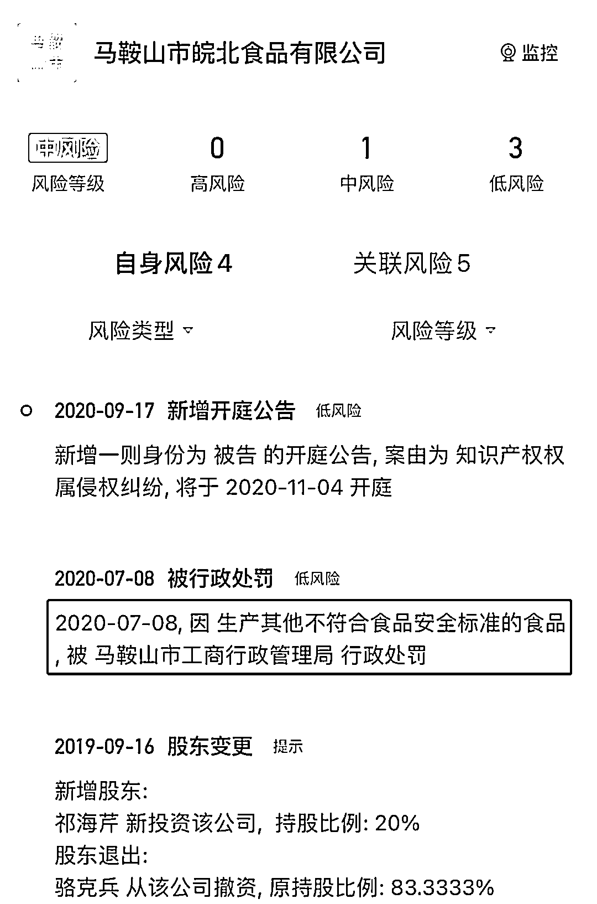

# 沪弄鬼？全国的过期、伪劣、三无产品齐聚上海！

> 原文：[`mp.weixin.qq.com/s?__biz=MzIyMDYwMTk0Mw==&mid=2247534387&idx=1&sn=43f59c76bf3d86dd58d1f7fe930a42e9&chksm=97cb8c0ba0bc051dd88623975c2b4052c54c5269078ed9b06259f8a3a9fbbd12fda3c0f341c7&scene=27#wechat_redirect`](http://mp.weixin.qq.com/s?__biz=MzIyMDYwMTk0Mw==&mid=2247534387&idx=1&sn=43f59c76bf3d86dd58d1f7fe930a42e9&chksm=97cb8c0ba0bc051dd88623975c2b4052c54c5269078ed9b06259f8a3a9fbbd12fda3c0f341c7&scene=27#wechat_redirect)

图源丨电影《让子弹飞》 

不怕病毒，就怕这些奸商以及在中间大行其道的人！

生活物资的供应，一直是上海居民所面临的最大困难。

但上海市发放的免费物资，**让我的认知下限一直被刷新：**

酱鸭是发霉的？叫花鸡过期两个多月？洗衣液等物品已经停产？ 

**各种过期、伪劣、三无产品、来自未来的穿越食品，这些爱心物资一被扒出来，堪称大型 315 晚会。**

预料到保供商家多多少少都有猫腻，但万万没想到：**全国的劣质假货，怎么全都汇集到上海了？**

**不由想到苗疆的养蛊术：各种毒虫放入一器皿中，时不时投入里面各种毒物，毒虫因饥饿不得食便自相吞噬，直至百毒不侵的蛊王诞生......** 

**-1-** 

**保供物资堪比 315 晚会**

**发霉的酱鸭**

有上海居民反映，他们终于领到菜了，还是酱鸭，打开包装，鸭子身上全是白毛。

明显是质量问题腐败变质，于是又连夜召回，最累的志愿者，辛苦发下去又辛苦收上来。

**过期两个月的叫花鸡** 

叫花鸡包装封口的生产日期为 2022 年 4 月 13 日，但扫描包装袋背部的“浙食链”（浙江省统一的食品安全追溯码），发现该产品实际生产日期为 2021 年 8 月 31 日，保质期 6 个月。

按此算，发到居民手上的这款产品已过期两个月以上……

**从未听过且生产日期有问题的油**

乍一看像金龙鱼，再一看又像鲁花，定睛一看其生产日期为 2022 年 4 月 19 日，群众质疑该油“刚下生产线便光速移动飞到了上海”。

问题是 19 号生产，20 号就光速发到上海居民手里，不知道用的是什么物流公司，比京东都快。

还有这“梅尼耶”的饼干，也是 4 月 19 日生产，菜都进不来上海物流真有这么快？

**来自未来的五花肉**

请看这个生产日期，2022 年 5 月 6 日，这个穿越有些让人始料不及。

**被紧急通知不要吃的狮子头**

**注销企业生产的粉丝** 

不同品牌的山寨粉丝 

粉丝外包装打印的信息显示为 2022 年生产，而生产企业夏邑县汇龙食品有限公司已在 2020 年 6 月 28 日注销。

从网友晒出的照片也可看到，虹桥镇发放的生活保障物资中，有一包标称由夏邑县汇龙食品有限公司生产的龙口粉丝，标示生产日期为 2022 年 2 月 16 日。

这批粉丝究竟是如何在生产厂商注销 20 多个月后生产出来的？

**一家已经被工商注销的企业，其产品居然能够进入保供名单，真是怪事。**

**又见奶头肉**

上海闵行区的奶头肉新闻我们都知道，那几个“商业奇才”760 万采购费只用掉 300 万！ 

现在上海松江区居民反映，拿到九里亭街道派发的物资，发现猪肉疑似是应当废弃的“奶脯肉”，且有异味。

看一眼，这肉你敢吃吗？ 

最搞笑的是，很多发放的物资，淘宝京东上搜不到，只能在闲鱼找到。 

**这些连淘宝、拼多多都搜不到劣质食品，却能堂而皇之地进入当地保供名单，你说奇不奇怪？**

**-2-**

**神奇入榜的小微企业**

在京东、美团等大型网络平台都未能获取保供资格的背景之下，一些小微企业都进入保供名单。

上海共有 1072 个保供企业，在京东、美团等大型网络平台都未能获取保供资格的背景之下，一些小微企业上榜。

其中注册资金小于 100 万，但实缴资本为 0 元的企业 57 家，其中餐饮企业 25 家，超市企业 15 家，电商平台 3 家，副食品 7 家，药品 2 家，物流总部 3 家，外资企业 1 家。

**我不是说这些小微企业不好，而是万一他们的产品出现了问题，他们的资本有没有能力善后，比如赔偿能力？**

假如一个小公司小作坊取得了保供牌照，产品出了问题引起大范围食物中毒，赔偿的时候直接说公司没钱破产，大不了坐牢，你能奈他何？

都是有限责任公司，你懂的。

**赌赚了，发财；出事了，破产坐牢。**

对一些奸商而言，好像也不是不能接受。

更何况，这次保供名单中，多个保供商家都是有“前科”。

比如，腐竹、咸肉、牛肉的生产厂家均受过不同程度的行政处罚。

↑焦作市金竹豆制品有限公司↓

↑南京天泽城食品有限公司↓

↑马鞍山市皖北食品有限公司↓ 

**一边是京东小哥派送连小区都进不去，另外一边是发放的各种问题物资大行其道，这其中到底触动了谁的利益？**

**-3-** 

**上海抗疫想胜利**

**必须干掉“沪弄鬼”**

我特别好奇，这些负责采购的“能人异士”，到底是从哪儿网罗到了这么一大批“奇珍异宝”。

估计有不少中间商赚差价。 

以次充好、质量低劣甚至食品变质、产品过期......

原来某些街道社区是为了保护民众，发完两次物资就发现三无产品太多，干脆不发了，省得大家吃了生病。

**一边是三无劣质物资，另一边是被扔掉的瓜果蔬菜。** 

突然特别心疼上海市人民，本来就吃不好吃不饱，现在全国的过期、伪劣、三无产品都流到上海了。

全国其他省市的兄弟姐妹可以放心吃东西了，因为经过这一轮上海人已经帮你们把所有的问题食品消灭了。

**这都有点下毒炼蛊那味了，疫情之后，上海人民百毒不侵。**

图源丨电影《让子弹飞》 

****我都觉得这是门血赚的好生意，要说没内鬼我都不信！****

**看来某些人，真没把老百姓当自己人。**

我不怕病毒，就怕这些奸商以及在中间大行其道的人！

上海缺的并不是物资，但肯定是缺了什么东西。

**要清零的也不仅是病例，更有那些发国难财的蛀虫。** 

来源：昌南大队长

← 向右滑动与灰产圈互动交流 →

