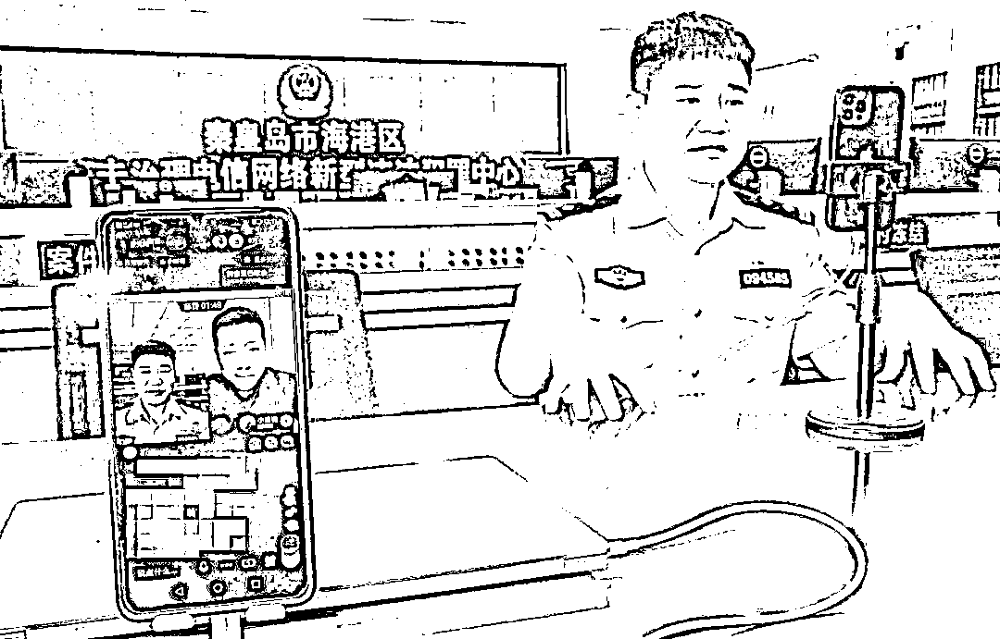
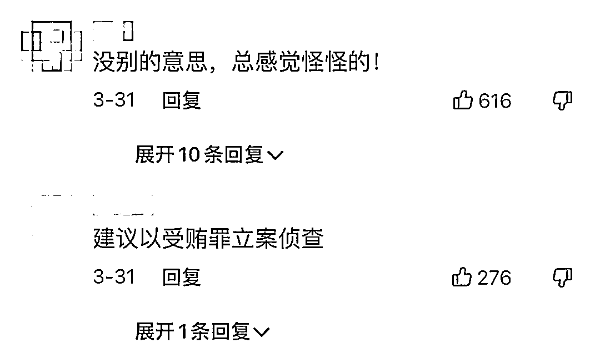
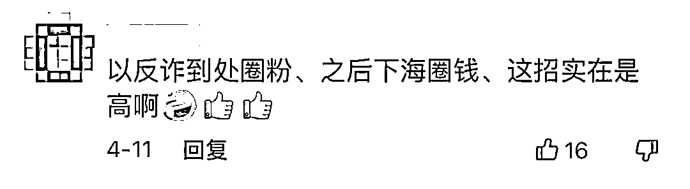
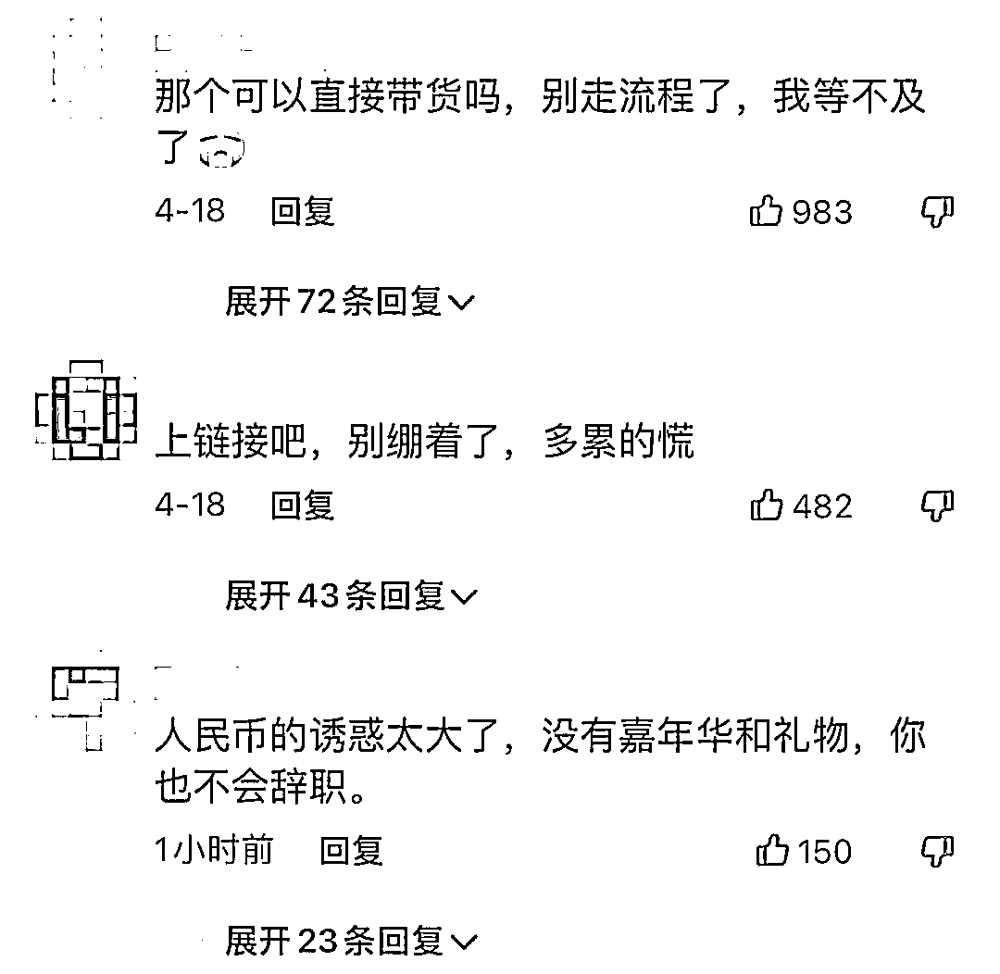

# 反诈老陈称被网暴逼着辞职

> 原文：[`mp.weixin.qq.com/s?__biz=MzIyMDYwMTk0Mw==&mid=2247534387&idx=3&sn=0eeec84498ae359987b979e05498603d&chksm=97cb8c0ba0bc051d01f79813f8e6e2f963ee9748b0f52b60861e54db6db2f01a00ec8ce5cddc&scene=27#wechat_redirect`](http://mp.weixin.qq.com/s?__biz=MzIyMDYwMTk0Mw==&mid=2247534387&idx=3&sn=0eeec84498ae359987b979e05498603d&chksm=97cb8c0ba0bc051d01f79813f8e6e2f963ee9748b0f52b60861e54db6db2f01a00ec8ce5cddc&scene=27#wechat_redirect)

44 岁的陈国平此前是

河北省秦皇岛公安局海港分局

反诈中心的民警

去年 9 月以来

因为在短视频平台迅速出圈

收获了近 750 万粉丝

但如今，他决定辞去警察职务

4 月 8 日，**以“反诈警官老陈”账号风靡短视频平台的陈国平，在一条短视频中宣布辞职**。

▲图源：中国新闻周刊。

对于辞职的原因，他归结为两次网暴。

短视频平台评论区

质疑陈国平的声音

↓ ↓ ↓ 

在两次网暴里，他觉得看到了继续直播会牵连单位的苗头，毕竟他穿着警服，于是向单位提出了辞职。

现“反诈警官老陈”抖音账号已被更名“海港反诈中心”——这是陈国平前单位的官方号名称，“反诈警官老陈”这个角色已不复存在，只是新账号里老陈的视频并未删去。

对于他辞职一事

有不少网友为他发声

觉得不能理解 

↓ ↓ ↓ 

但也有人认为他本可以

避免遭受质疑

↓ ↓ ↓

在接受记者采访时，陈国平说到，“其实这个决定是错误的，但我想终究有人要来做一些错误的决定，给后人做个警示教育或者提供经验。”至于是哪方面的警示和经验，他没有解释。

 你看过“反诈老陈”的直播吗？

 对他辞职一事怎么看？

我们后台聊天窗口一起聊聊 

来源：深圳新闻网综合中国新闻周刊、网友评论，利箭在行动

← 向右滑动与灰产圈互动交流 →

