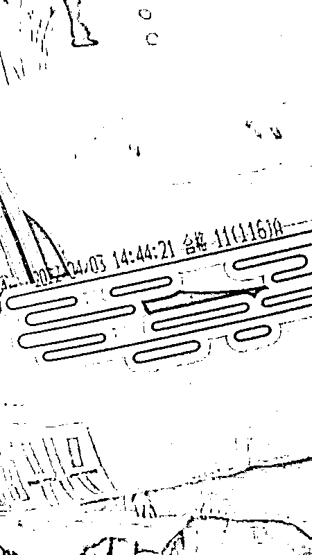

# 上海人的朋友圈就像 315 晚会，有锤实也有乌龙！

> 原文：[`mp.weixin.qq.com/s?__biz=MzIyMDYwMTk0Mw==&mid=2247534498&idx=2&sn=c4764108a3912ab6527c72eed9f7a5de&chksm=97cb8c9aa0bc058c4d050f6b5611036b66c2610d7e6773f0c8ea2d1fa20b2b2736dc58719880&scene=27#wechat_redirect`](http://mp.weixin.qq.com/s?__biz=MzIyMDYwMTk0Mw==&mid=2247534498&idx=2&sn=c4764108a3912ab6527c72eed9f7a5de&chksm=97cb8c9aa0bc058c4d050f6b5611036b66c2610d7e6773f0c8ea2d1fa20b2b2736dc58719880&scene=27#wechat_redirect)

好多小区已经封控了一个多月

上海人也算是从春天封到了快夏天 

不过所幸，物资是渐渐充沛起来了 

但最近，还有一种声音 

是部分网友说 发到自己家的物资

怎么貌似有以次充好的情况…

到底是真相还是乌龙，一起来康康👇

**大米变猫砂？**

杨浦区定海路的居民说

4 月 12-16 日发的物资里面

大米都是霉掉的

要不是外面包装上

这“珍珠米”和“雪域鲜稻”的字样

很容易让人以为是猫砂啊

而且也不是个别居民收到的是坏米

光是一栋楼里

从居民的接龙看，几乎都是霉的

更离谱的是什么呢

这米还是这个月刚刚生产出来的

后面还跟着“合格”二字

这到底是怎么回事啦

真的会故意把发霉的大米

发给大家么？？

而经核查，4 月 14-16 日发放大米后 

有部分居民反映拆封后发现大米受潮

**街道立即与供货商永辉超市进行沟通**

**经查为 4 月 13 日大雨**

**供货商存储不当导致大米部分受潮**

街道立即组织居委通知居民

并于 4 月 17-18 日进行了问题大米的更换

还有闵行区虹桥镇的居民

收到了精制的“**龙仁粉丝**”

没错！不是龙口，是龙仁。。。

且这个粉丝的公司，已经注销了

而闵行区市场监管局第一时间核查相关情况

虹桥镇发放的上述保障物资供应商

为江苏宏信超市连锁股份有限公司

其**销售的“龙仁粉丝”标示生产商**

**为夏邑县汇龙食品有限公司**

上海市场监管，也正在进一步调查中

对食品安全问题

采取“零容忍”的态度！

还有浦东、普陀等区的居民反映

小区发放的免费生活物资中

一款嘉兴三珍斋食品有限公司生产的叫花鸡

包装封口标示的生产日期为 2022 年 4 月 13 日

**但实际生产日期为 2021 年 8 月 31 日**

**保质期 6 个月，目前已过期两个月以上…**

嘉兴三珍斋食品有限公司 21 日就此发布声明

近日，该公司注意到网上

关于公司产品质量问题的反映

公司已连夜展开自查

并正在全力配合指向产品的相关采购商

共同展开调查

同时，市场监管部门也已介入

还有松江九里亭居民收到的物资

猪肉疑似是应当废弃的“奶脯肉”

且有异味

松江区市场监管局和九里亭街道

也已展开调查

哎怎么说呢，坏米坏肉是有 

但也不是所有小区都是这样的

也有做得很好的小区

物资多到冰箱里都放不下

但咱就是说，这种容易发霉的大米之类物资

发放之前碰到暴雨天气

还是应该好好保管一下物资吧？

**这些物资有问题？乌龙了呀！**

还有很多网友，纷纷自行“调查”起

手头上物资的来源

就发现了来自南京佳福的盐水鸭

曾在 21 年检测出了禁用防腐剂

该公司被予以行政处罚 7 次之多

还发现了有质量问题的如意鸭

而来自安徽宣城华卫集团

说是之前 16、19 年都发现了食品安全问题

不过，如意鸭的公司反应很快

马上进行了情况说明

表示因为安徽省药监局网站停止维护

所以数据更新比较慢

并不存在生产许可证到期的情况

另外，如意鸭需要在-18℃保存

只要正常保存烹饪绝对

不存在食品安全问题

也就是说，有人吃了不舒服

很有可能是生鲜储存温度不对的问题

除此还有网友说，自己收到的油

**是来自未来的？！！**

有居民收到了“万家宴”品牌的油

然后说，这油的牌子

网上压根搜不到嘞

而且当日生产，当日拿到

是不是有什么问题？？

网友认为现在路上封控严重，当天生产的油

不可能当天送到居民手中

但官方回应下午生产，晚上送到居民家 

其实是完全可能的…

还有网友说，街道的大礼包里

食品的品牌

都是些平时不太见到的嘛？

甚至有一款“龙金花”食用油。。。

你们听过伐？

所以当时就有不少网友说

这是不是“三无产品”？

而且生产日期为 2022 年 4 月 19 日

可在 4 月 19 日晚上就收到了这油

就有居民质疑该油

“刚下生产线便光速移动到了上海”？？

当然，上海市监部门也很快

就周浦物资问题介入调查

但是，经监管部门调查和企业自查

这竟是一个“移花接木”的谣言

是有人将上海良龙粮油发展有限公司

4 月 19 日生产的“万家宴”食用油外包装照片

裁剪后发到网上

拿油瓶上的生产日期激光喷码说事

质疑山东省龙口市龙金花植物油有限公司

生产的“龙金花”玉米胚芽油

生产日期有问题

不可能与发到居民手中的时间离得那么近

而关于假货问题

龙金花公司只是在上海市场

**知名度有限**

**可并不是什么“山寨产品”…**

可以理解特殊时期部分上海居民的心情

但因为知名度不高、名字“看似山寨”

就说人家是假冒伪劣

就有点不合适了呀~

还有网友在朋友圈发文

表示普陀区发放食用油物资时

用的是带有“酱油”“生抽”字样的瓶身

经普陀区所有街道、镇和区

商务委排查核实

未发过网传所述物资

已将情况移交公安机关处理

新江湾城街道的居民

对发放的牛奶外包装及质量也存在质疑

不过，这也是个乌龙

经核查，街道发放的伊利

“金典”250ml 纯牛奶

经伊利总部核实确认

系伊利公司生产

涉及外包装经酒精等擦拭出现褪色问题

是采用的包装工艺不同所致

伊利盒装牛奶有 2 种包装

一种是利乐公司包装，一种是康美公司包装

两者在工艺上有所不同

康美公司由于包装先覆膜再印刷

故经酒精等擦拭易出现褪色现象

不影响牛奶的质量

另外，上海市也发出了声明

保供物资质量不符合要求

一律不得发放！

同时欢迎市民拨打热线反映

监督举报保供物资的质量问题

希望经过有关部门的监管

这样的事情不要再次发生了吧

来源：上海全知道（ID：iknow-021）

← 向右滑动与灰产圈互动交流 →

