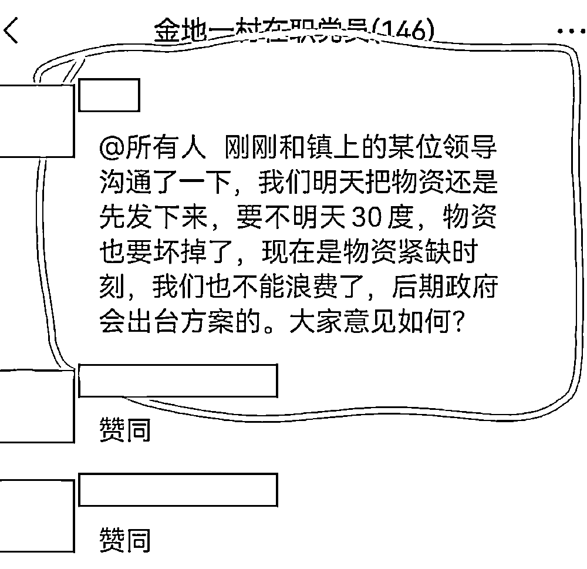

# 抓了，援沪物资竟然就这样被倒卖了！

> 原文：[`mp.weixin.qq.com/s?__biz=MzIyMDYwMTk0Mw==&mid=2247534498&idx=4&sn=69ac4c6801722fb74397b4f4840a29ee&chksm=97cb8c9aa0bc058c822d6a8eaffdbdf6da40f6ad1cc245ed8237b4e45dae55c3407bdab315b6&scene=27#wechat_redirect`](http://mp.weixin.qq.com/s?__biz=MzIyMDYwMTk0Mw==&mid=2247534498&idx=4&sn=69ac4c6801722fb74397b4f4840a29ee&chksm=97cb8c9aa0bc058c822d6a8eaffdbdf6da40f6ad1cc245ed8237b4e45dae55c3407bdab315b6&scene=27#wechat_redirect)

2022 年 4 月 24 日 0—24 时，上海新增本土新冠肺炎确诊病例 2472 例和无症状感染者 16983 例。

每天日增上万的感染者病例，上海解封似乎变得遥遥无期。

相比于何时解封，让上海居民更无奈的是日常物资背后的种种乱象。 

**01** 

在全国各地都在筹集物资援助上海的这个时候，有些人盯上了捐赠物资，大肆发起了**“国难财”**。 

4 月 24 日，静安区临汾路一小区居民发现自己小区微信群里居然在卖捐赠物资。

**凭借撕烂的外包装，小区居民找到了这批物资的源头，正是云南支援宝山区的物资。** 

这批物资来自云南曲靖，经过 2000 多公里长途跋涉，星夜兼程，**本来是准备发放给长租公寓内物资短缺的外来务工人员。**

**爱心物资却被不法分子盯上，令人怒不可遏。**

在接到举报后，上海市宝山区人民政府官方微博于今日上午发布了有关情况通报。通报称，据公安部门调查，接受捐赠的新江内燃机公寓（原厂停产，改建为公寓）负责人张某（男，50 岁）在收到 190 箱捐款物资后，没有按要求分配给公寓内租户，私自将该批物资转卖牟利。

**目前，犯罪嫌疑人张某已经被公安机关控制，案件正在进一步调查中。**

**02**

**这样的非法倒卖并不是第一次出现。**

前几天，有市民举报陕西南路上有人通过大幅抬高价格贩卖鸡鸭等食材，涉嫌哄抬物价。

据静安公安分局经侦支队接市场监督管理部门移送的相关线索反映，**犯罪嫌疑人高某 4 月 10 日以来大量囤积青菜、鸡蛋、鸡、鸭等食品原料，并非法租用他人食品经营营业执照在网络平台开店对外销售。**

为追求高额利益，进销差价率分别达到了 150%、184%和 437%。截至案发，犯罪嫌疑人高某已累计销售 175 余万元，非法获利 150 余万元。

目前，犯罪嫌疑人高某因涉嫌非法经营罪已被静安警方依法采取刑事强制措施，案件正在进一步侦办中。

**除了哄抬物价之外，还有人借社区团购物资之名实施诈骗。**

据上海发布官方消息，嘉定公安分局接群众举报，破获一起以社区团购为名实施诈骗的案件。**经查，犯罪嫌疑人龚某在没有团购渠道的情况下，虚构自己已承接某超市团购并担任“团长”，将团购套餐等虚假信息发布在微信群中，****导致 80 余人被骗，涉案金额共计人民币 4.8 万余元。**

**除此之外，还有人为搏眼球，在网上散播谣言。** 

**4 月 10 日，一篇“个人利用疫情高价倒卖物资，一个月获利上千万”的帖子在网络流传。**

****

发帖人信某谎称自己通过租用货车，高价倒卖物资，九天净赚人民币 908.82 万元，3 月份赚了人民币 3006.93 万元，并配了一张从网上下载的桌上堆满人民币的照片。

**据上海公安局消息，经警方调查后，信某（男，32 岁）已因虚构事实扰乱社会秩序被闵行警方依法行政处罚。** 

**03**

除了昧着良心，非法或者高价倒卖物资的商家和个人以外，这段时间还有不少因为物资引起的质疑风波。

**杨浦区五角场街道的一些小区居民发现自己通过居委会买到的物资包上居然印有“云南上海一家亲”的字样，**于是质疑自己买到的东西其实是捐赠物资。

还有不少小区居民反映，他们必须**“买过居委会的菜才能领云南捐赠的物资”。**

在一系列的居民举报之后，五角场街道办事处发布了声明，称是工作人员误把捐赠物资当成团购套餐，并不存在倒卖情况。

4 月 8 日，上海“金地自在城”二期居委通知有保供套餐，85 元一份，并让志愿者组织大家接龙购买。

**志愿者看到菜品清单后，觉得这与某个地区捐赠的物资很相似。**

**虽然存在质疑，但是面对物资紧缺的情况，还是有 998 人购买了该物资。**

**在收到物资之后，居民发现蔬菜包里居然有以下纸条：** 

纸条上的“田园徽州”为安徽省黄山市当地的一个农产品品牌。后来志愿者们也在该公司的公众号上找到了其捐赠物资助力上海抗疫的文章。

于是志愿者们纷纷开始质疑居委会： 

收到投诉后，居委会决定暂停物资发放，大量物资被堆放在了小区门口。

被堆放在小区门口的物资

没过多久，居委会还是决定将菜发放给大家，并且将钱如数退还：

这件事情发生之后，“田园徽州”公司发布声明，称除了捐赠的物资，公司还有大量物资是上海方面采购的，整个事件只是一场误会。

种种乱象，虽然有真有假，但是都反映出了一个事实：**在给居民发放物资的时候，各个环节、各种信息极其复杂从而导致物资配送的“最后 100 米”乱象丛生。**

上海疫情开始封城到现在，从医疗保障到次生的民生问题，从顶层到基层再到民众，从抗疫问题到经济问题，环环相扣，每一步都牵扯着上海人民的生命健康。

纵览所有问题，民以食为天，让每一个上海居民可以买到合理价格的生活物资，吃到质量有保障的食物才是重中之重。

**如何做好保供工作，如何让捐赠物资妥善送达，如何保障每一个居民的日常所需才是目前最需要解决的问题。**

来源：北美留学生日报

← 向右滑动与灰产圈互动交流 →

