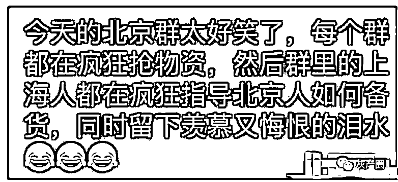
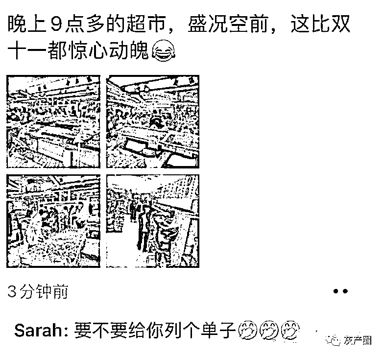

# 昨晚朋友圈全北京都在囤货，每个北京朋友都有一个上海朋友在劝说

> 原文：[`mp.weixin.qq.com/s?__biz=MzIyMDYwMTk0Mw==&mid=2247534498&idx=6&sn=273cc0b0d629e8a5e4c9c89ede07178a&chksm=97cb8c9aa0bc058c68407e6488dfaf3ca5b2e008623bcb69c05b5330cc0f3b4739de88d8b9c0&scene=27#wechat_redirect`](http://mp.weixin.qq.com/s?__biz=MzIyMDYwMTk0Mw==&mid=2247534498&idx=6&sn=273cc0b0d629e8a5e4c9c89ede07178a&chksm=97cb8c9aa0bc058c68407e6488dfaf3ca5b2e008623bcb69c05b5330cc0f3b4739de88d8b9c0&scene=27#wechat_redirect)

4 月 22 日以来北京累计报告 42 例感染者，并已隐匿传播一周，涉及学校，旅行团及多个家庭。

疫情突然反弹，引发了北京居民的担心，毕竟上海人民还在封控期间，生活之艰难，大家都有目共睹。引发了一波囤货的热潮！ 虽然北京发文称生活必需品市场货源供应充足 但是，上海人民看了就哭了：这新闻我看过呀！昨晚每个北京朋友都有一个上海朋友在劝说…不仅劝，还晒出了自己的“亲身经历” 不仅指导，还检查作业

京东上的冷柜冰吧榜（近期同类产品里销量最高的榜单），北京地区出现了多款缺货北京作为全国的物资中转中心，实力还是很雄厚的，尽管发生过很多次疫情，都没有出现上海那种情况，北京各大商场直接加班，让大家放开买。 

* * *

**Dangi:**广州已经被吓过一波了结果不到 14 天就摘星，而我还在吃囤货
**发条猫三号机：**上海人在教北京人抢菜囤菜，广州人还在努力消耗冰箱里的存货  **泰鲁的双眼洞察一切:**上海人和北京人的区别：一个有抢菜技术，一个真有菜

**高老庄小馋猪:**北京真没必要屯太多吧，20 年新发地封了都没有那么严重，适当的囤一点就够了。

来源：微博那些事儿

← 向右滑动与灰产圈互动交流 →

