# 希望疫情别结束？在上海发国难财的人越来越疯狂了

> 原文：[`mp.weixin.qq.com/s?__biz=MzIyMDYwMTk0Mw==&mid=2247534498&idx=7&sn=4924973bd636ed67856ed3e79bd3333e&chksm=97cb8c9aa0bc058cd4f05f08e381347d1b69004be3159f4958cc965c836ef7830c0fc5278da4&scene=27#wechat_redirect`](http://mp.weixin.qq.com/s?__biz=MzIyMDYwMTk0Mw==&mid=2247534498&idx=7&sn=4924973bd636ed67856ed3e79bd3333e&chksm=97cb8c9aa0bc058cd4f05f08e381347d1b69004be3159f4958cc965c836ef7830c0fc5278da4&scene=27#wechat_redirect)

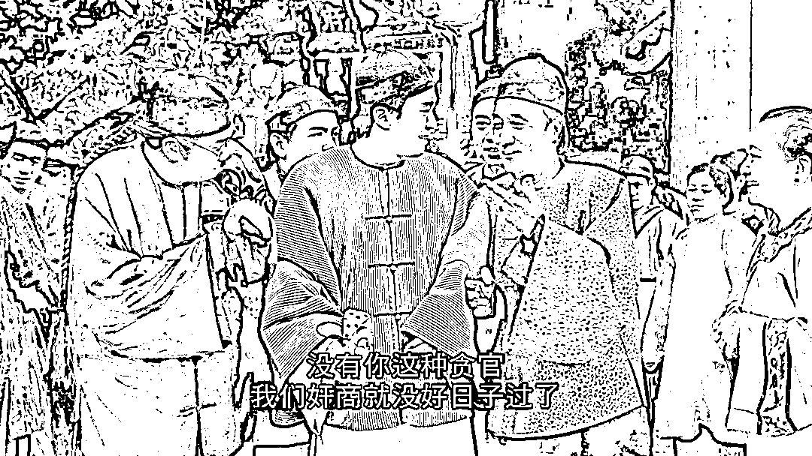

图源丨电影《九品芝麻官》

资本如果有百分之五十的利润，它就会铤而走险；如果有百分之百的利润，它就敢践踏人间一切法律；如果有百分之三百的利润，它就敢犯下任何罪行，甚至被绞死的危险。

——马克思《资本论》 

**上海，成为了疫情下最多人发国难财的城市。**

有一些人，在疫情中嗅出巨大利益的血腥味，用尽全力翻云覆雨、上下其手，大发其财！

上海梅陇镇的乳头猪肉，天怒人怨。

花 300 万进劣质肉，卖 760 万！ 

猪肉的利润高达 250%，也算是世上少有的暴利生意了。 

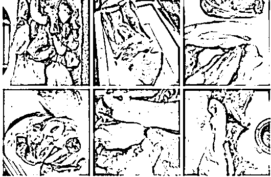

**大家有没有想过，中标的已经被抓了，那么招标的呢？**

**供应商已经抓了，供应商的上家呢？**

“国难财”这个词有多卑劣，不在疫区可能没啥具体感受，那就从魔都魔幻的物价开始领教。

这些水果，均价都在 100 块以上：

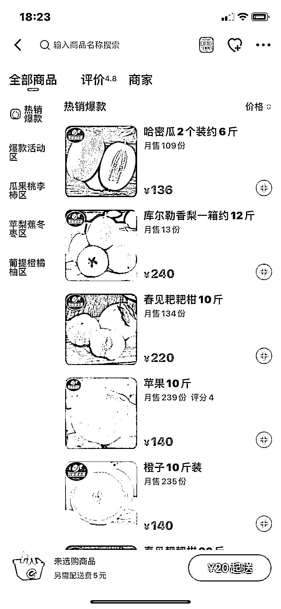

这是蔬菜，10 斤菜打包卖你 152 块：

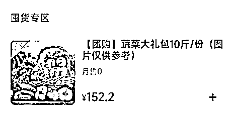

更有甚者在上海崇明，1 份蔬菜套餐可以要 280 块钱。

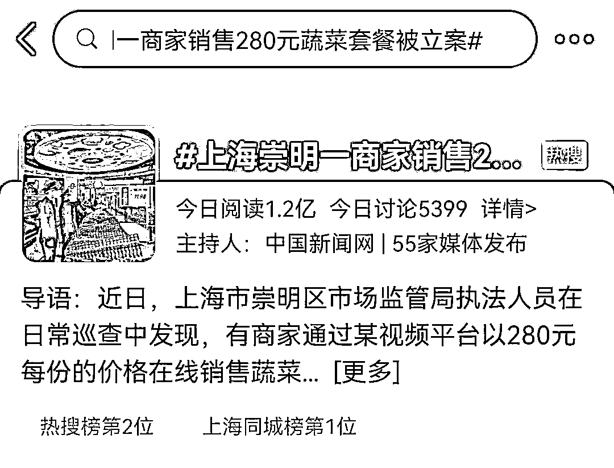

网传 1 个司机从源深体育中心开到浦东机场，原先就是大几十块车费，现在要价 1.2w.....

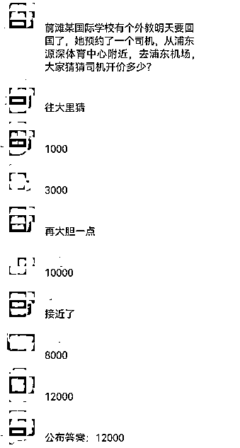

可以说现在上海，除了医护工作人员，能在街上开车的人，几乎大体都在发国难财。

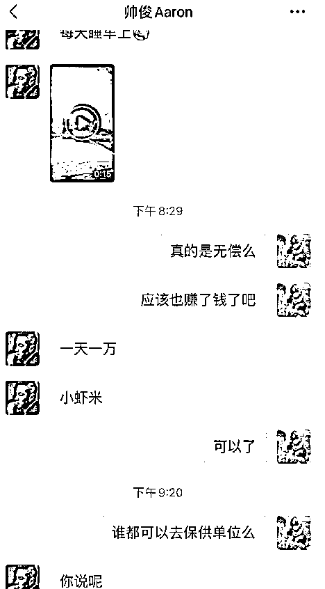

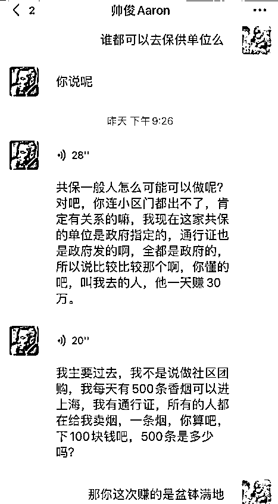

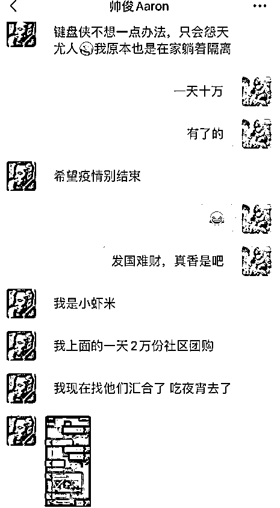

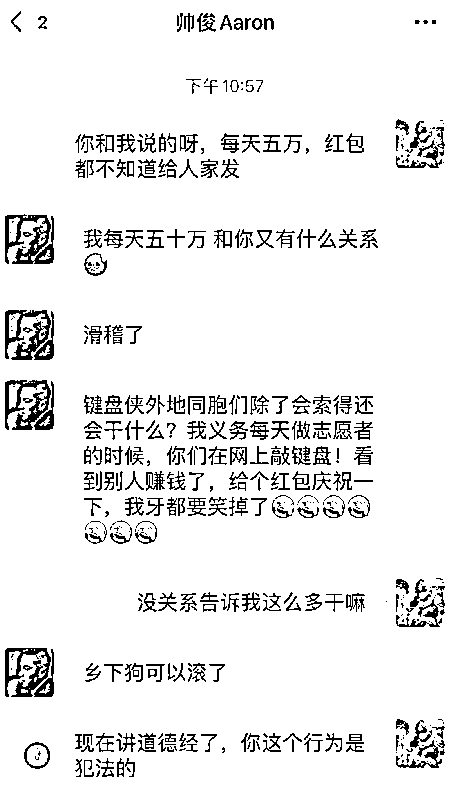

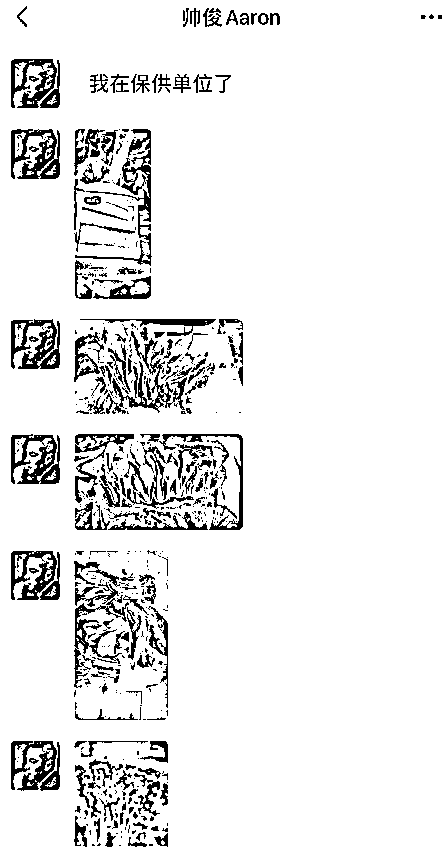

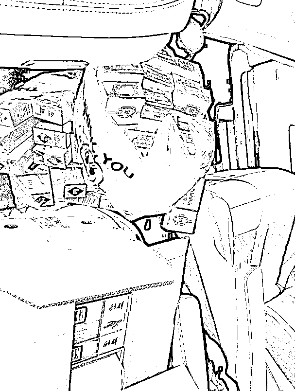

根据这位“帅俊”同志所说，似乎他们有特殊的渠道能打通关系，不仅能拿到通行证，甚至能成为保供。

按这位同志所说，他的领导一天赚三十万跟玩似的，他每天一万只是小虾米级别。

所以这位同志说：**希望疫情别结束。**

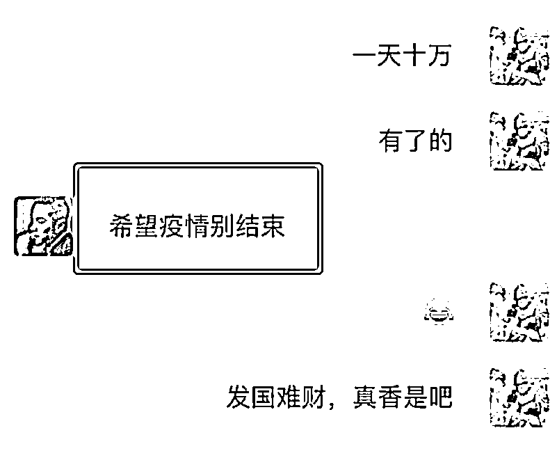

**有人拿着疫情当提款机，拿人民当人民币。**

不好意思，给你曝光：

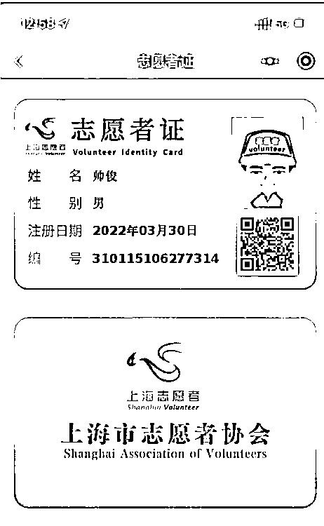

是良心坏了还是真的想多赚些钱？

我在想，如果是你有这样机会，你会不会去做？

面对利益，特别是巨大的利益诱使，我不夸张地说，**大多数人都会去做。**

**只要有人在的地方，就会有人动坏心思。**

但是，这次的上海明显比任何一个地方严重多了。

有些话我想说又欲言又止，只怕说得太直白又 404。

个人以为，这个现象离不开上海的买办历史。

买办，就是倒卖洋人物资进国内的人，简单来说就是洋人的中间商。

**民国时买办群体嗅到商机，大肆通过帮海外资本向中国倒卖物资，通通肥了腰包。** 

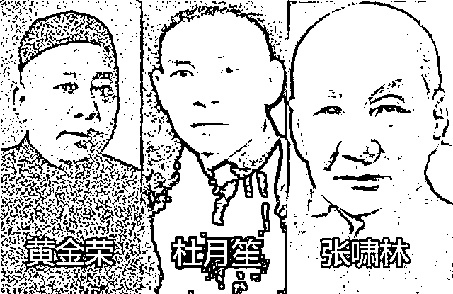

旧上海滩“三大亨”

这些买办阶级，为了钱，基本什么都敢干。

光靠嘴上谴责，对这些人是没有用的，他们只会当我们是傻子。

**对于借机发国难财的，****我们希望看到：发现一宗，曝光一宗，立即从严从重法办。**

**吃进出的必须要加倍吐出来，看谁还敢顶风而上？**

否则，永远有人想要分一杯羹。

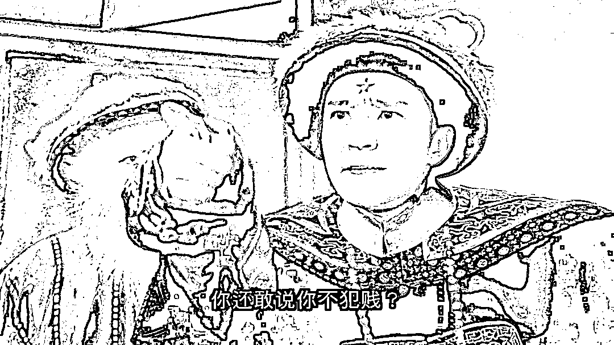

正如鲁迅在《且介亭杂文》中所说：

**“我们自古以来，就有埋头苦干的人，有拼命硬干的人，有为民请命的人，有舍身求法的人…这就是中国的脊梁。”**

我们的国家屹立至今，靠的不是那些投机取巧、踩着别人的苦难往上爬的鼠辈！

**而是那些在自己的岗位上兢兢业业、发光发热的人！** 

**但毒瘤的存在害了上海的名声，蒸发善良人的血汗。**

老实人蹲家里隔离，奸人想方设法出门见机发国难财，比疫情更可怕的是人心。

善有善报，恶有恶报，不是不报，时候未到。

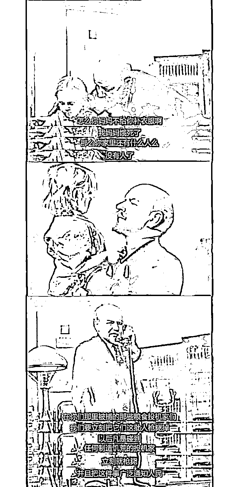

来源：昌南大队长

← 向右滑动与灰产圈互动交流 →

