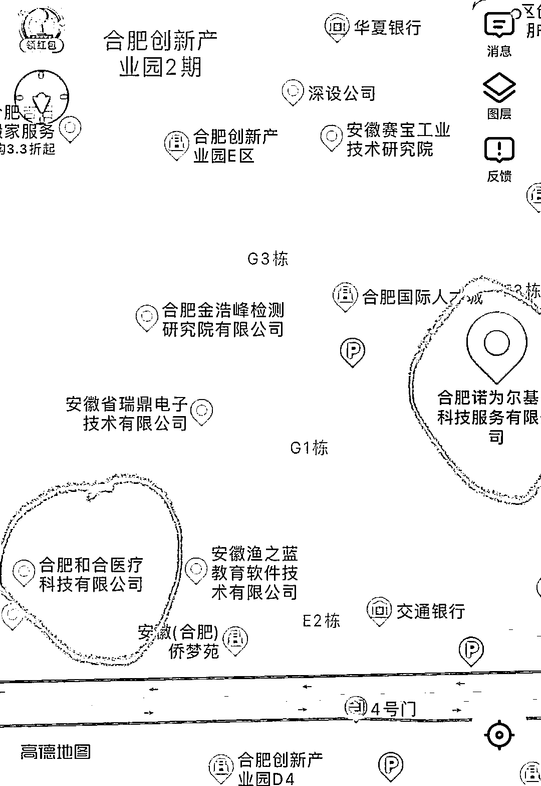
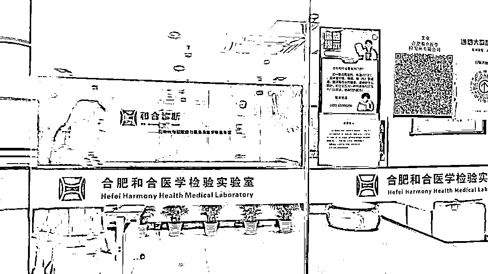
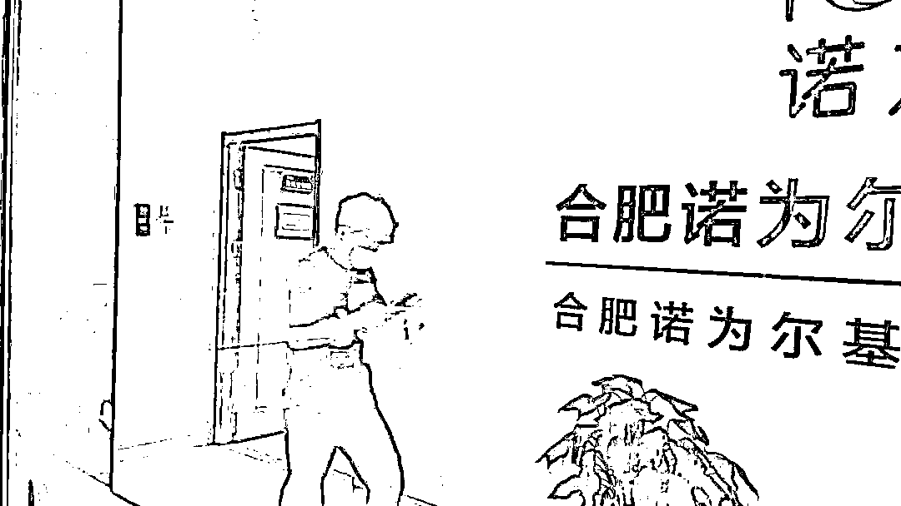
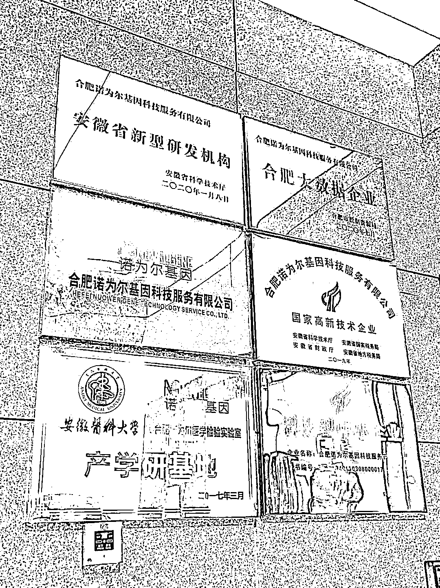
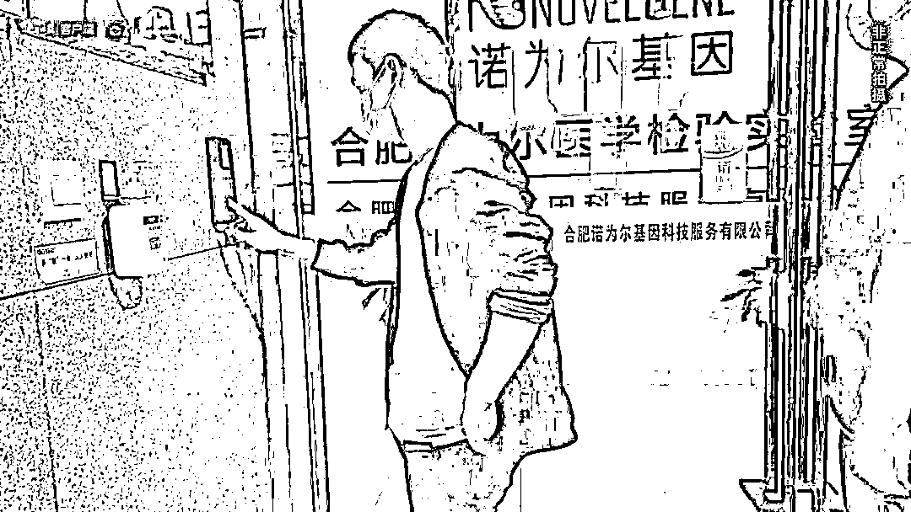
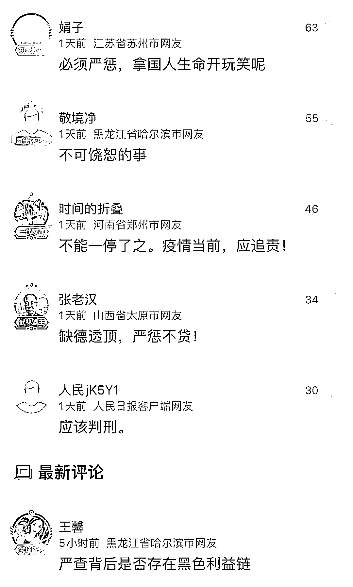
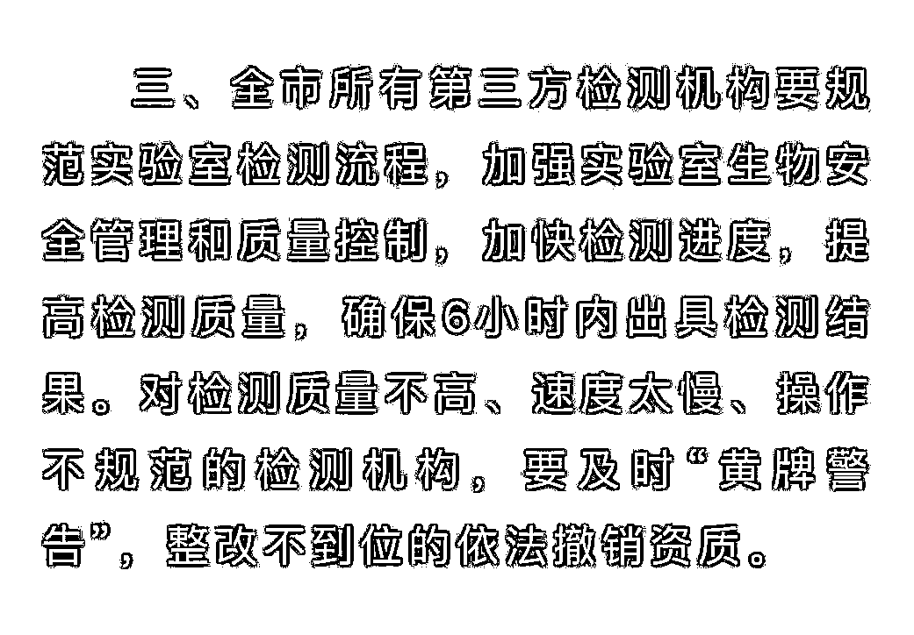
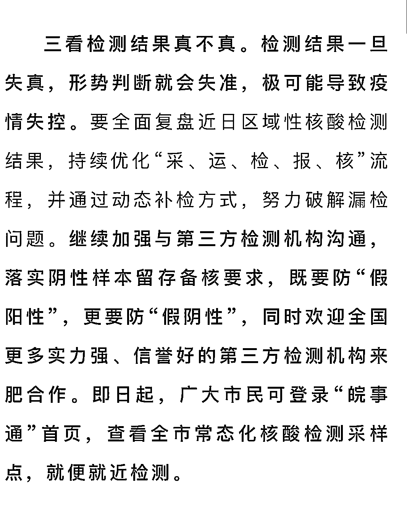

# 出“假阳性”报告的实验室到底什么背景，实地探访

> 原文：[`mp.weixin.qq.com/s?__biz=MzIyMDYwMTk0Mw==&mid=2247534498&idx=8&sn=80c5e44d16c867ea753c0cf2843acc25&chksm=97cb8c9aa0bc058c9531ab10b26c56a2bf11c411bc613763c16ef01f34e728e21442accbc090&scene=27#wechat_redirect`](http://mp.weixin.qq.com/s?__biz=MzIyMDYwMTk0Mw==&mid=2247534498&idx=8&sn=80c5e44d16c867ea753c0cf2843acc25&chksm=97cb8c9aa0bc058c9531ab10b26c56a2bf11c411bc613763c16ef01f34e728e21442accbc090&scene=27#wechat_redirect)

4 月 23 日，合肥市疫情防控应急指挥部发布通报，对合肥和合医学检验实验室、合肥诺为尔医学检验实验室两家核酸检测实验室给予警告并暂停合作。

@合肥日报 上发布的通报具体内容。

两家实验室什么背景？“假阳性”报告怎么回事？一些网友热议的“警告是否太轻了”，是否存在？记者进行了相关走访。

**两家实验室仍在“开门”状态**

通报发出的第二天，即 4 月 24 日下午，记者根据两家问题实验室的公开信息地址，“按图索冀”来到合肥市蜀山区高新技术开发区创新产业园二期。 

合肥和合医学检验实验室（以下简称“合肥和合”）和合肥诺为尔医学检验实验室（以下简称“诺为尔”）就位于这里。

记者在地图上查到两家检验实验室的位置。 

根据两家实验室官网或官微发布的信息，大致是这样的：

 “合肥和合”是由北京和合医学诊断技术股份有限公司在安徽省投资的第三方独立医学实验室，于 2017 年 1 月取得医疗机构执业许可证，是安徽省首家拥有质谱医学检验平台的独立第三方实验室。

“诺为尔”是合肥诺为尔基因科技服务有限公司（以下简称“诺为尔基因”）旗下实验室，于 2020 年通过新冠核酸检测室间质评。诺为尔基因则成立于 2016 年，是一家专注于临床分子诊断与精准治疗技术服务、IVD 体外诊断试剂盒及高端检测设备研发和生产的高科技公司，已获得国家高新技术企业、安徽省新型研发机构、安徽省科技型中小企业、合肥市大数据企业等资质。

 抵达现场后，记者发现两家实验室离得很近，各自所在的楼距离也就 5 分钟。

 两家都处于正常运营状态。

摄于 4 月 24 日下午，合肥和合医学检验实验室。 

摄于 4 月 24 日下午，合肥诺为尔医学检验实验室。

据记者向“合肥和合”的工作人员询问，告知今天仍在进行核酸检验工作。不过，对于其他问题，对方表示，“负责人不在，不方便回答”。 

在等候负责人中，记者看到，“合肥和合”下午还在进行招聘面试。一位来面试的小伙子告诉记者，他是一周前在智联招聘上看到的招聘信息。

 查阅智联招聘网上的信息显示，“合肥和合”此次招聘的岗位超过十个，包括实验室液质前处理、液质仪器分析员、实验室检测辅助员、样本报告员等，涵盖的业务面比较广。

不过，由于“负责人”一直未露面，记者在等待了一个多小时后，只得离开，来到“诺为尔”实验室。

诺为尔基因已获资质。 

该实验室的公共楼道墙壁上，挂有六个牌子，与在官网看到的其所属公司已获资质情况一致。

一位年轻的工作人员告诉记者，“诺为尔”目前暂停了核酸检验项目，但其他业务，包括基因检测，临床肿瘤靶向用药检测等，仍正常进行。

 **有“黑色利益链”吗**

上述两家检验实验室出具“假阳性”报告引发网友热议。 

合肥的通报发出后，不少网友留言，认为此种事情“不可饶恕”，“缺德透顶”，认为应“严惩不贷”，甚至有的还认为背后存在“黑色利益链”。

合肥“暂停合作”的处置究竟是不是过轻？记者就此疑问对合肥市疫情防控应急指挥部的相关负责人进行了采访。

 据该负责人解释，涉事的两家实验室，过去一直承担了合肥市部分核酸检测业务。此次发生的问题，在指挥部看来很严重，但**并不是网友理解的“编造”了假报告，而是出现了错误，拖延了时间，违背了相关承诺。**

早在 4 月 4 日，合肥市疫情防控应急指挥部在其发布的第 10 号工作通告中，要求全市所有第三方检测机构要规范实验室检测流程，加强实验室生物安全管理和质量控制，加快检测进度，提高检测质量，确保 6 小时内出具检测结果。通告明确表示，要“对检测质量不高、速度太慢、操作不规范的检测机构，要及时‘黄牌警告’，整改不到位的依法撤销资质。”

摘自合肥市疫情防控应急指挥部发布的第 10 号通告。

该负责人解释，制定这些规定，主要考虑到奥密克戎病毒的传播性、隐匿性，为了以最小社会成本换取最大防控效果，所以对检测机构的质量、速度、规范等问题作出明确要求。

 他介绍，由于近期合肥出现了几个病例，前两天部分区域进行全员核酸检测，检测量增加。受警告的核酸检测实验室，承揽的检测业务超过了其能力，出具检测报告的时间严重超过指挥部要求的 6 小时；初筛检测报告中，还曾出具过一例阳性报告，按照相关流程，指挥部立即启动所有响应机制，包括围绕该阳性病例展开的流调、转运等工作。但随后其他机构进行复检时，发现该报告写错了。

 该负责人表示，根据他们目前掌握的情况，并没有发现试剂不合格或存在利益勾结等违法行为。更多还是因为效率低下、工作马虎、流行不规范导致。

 “但报告超时出具，耽搁了我们与病毒赛跑的时间；而报告出错，增加了大量的流调成本、社会成本，影响合肥市对疫情形势及时研判，鉴于此前这两家机构也发生过类似情况，所以我们对两家机构给予了警告，并立即暂停两家实验室在合肥市范围内的合作业务。”该负责人解释。

 **不影响合肥全市核酸检测能力** 

这两天，合肥继续加大区域性全员检测的频次。停止了与两家实验室的合作，是否会影响到全市的检测能力？

 据记者了解，合肥对相关检测能力早已作了充分准备，即使暂停了与这两家机构的合作，也还有其他的备选，仍然具备一天之内实现全市所有人核酸检测的能力。

摘自合肥市疫情防控应急指挥部 24 日发布的通告。

不过，为了有备无患，确保各检测机构的准确度和及时性，合肥市疫防指挥部在 24 日的通告中已经表示：欢迎全国更多实力强、信誉好的第三方检测机构入驻合作。

来源：人民日报客户端

← 向右滑动与灰产圈互动交流 →

