# 我看谁敢在帝都作妖！摸着上海过河，北京物资充足，有人已经开始摆摊卖菜了

> 原文：[`mp.weixin.qq.com/s?__biz=MzIyMDYwMTk0Mw==&mid=2247534565&idx=1&sn=59684fca93ad16dc6d3218d77ef60146&chksm=97cb8cdda0bc05cb1674dfedf2b8b3ea60dc9e2b4921459c89978f80981de617c6f085143b7a&scene=27#wechat_redirect`](http://mp.weixin.qq.com/s?__biz=MzIyMDYwMTk0Mw==&mid=2247534565&idx=1&sn=59684fca93ad16dc6d3218d77ef60146&chksm=97cb8cdda0bc05cb1674dfedf2b8b3ea60dc9e2b4921459c89978f80981de617c6f085143b7a&scene=27#wechat_redirect)

不断新增的病例，叠加上海封控依然还有的物资民生问题，让北京人民开始很不淡定，不少人因此抢菜，囤货，一些商场的食物和蔬菜被抢购一空。

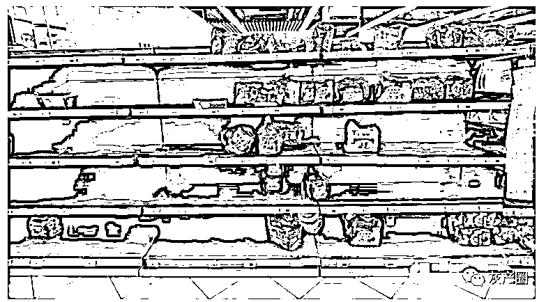

北京各大商场通过延长开门时间，及时补货，让大家放心囤货 

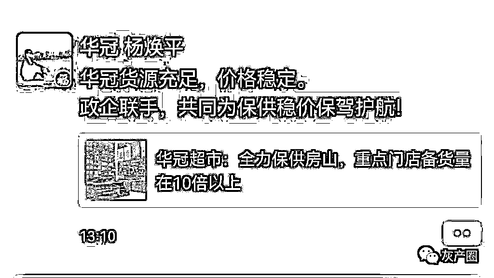

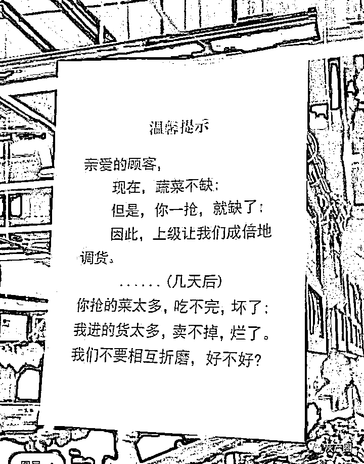

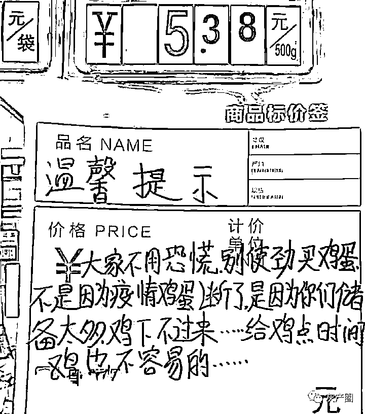

想囤菜？管够！ 

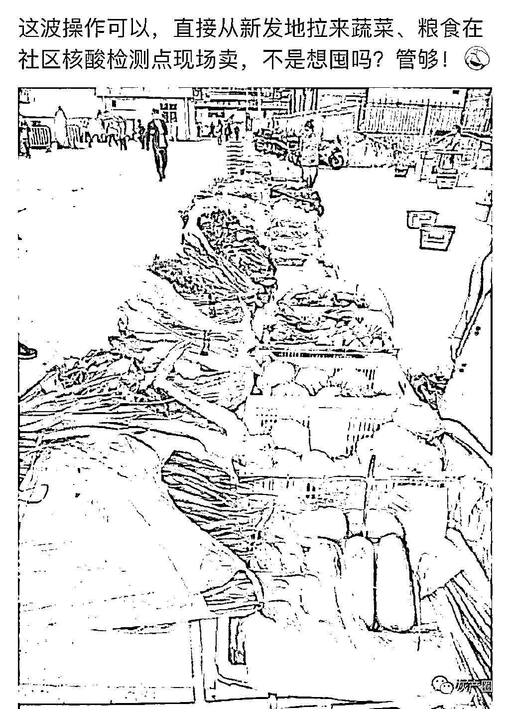

但是，有很多北京市民表示没必要

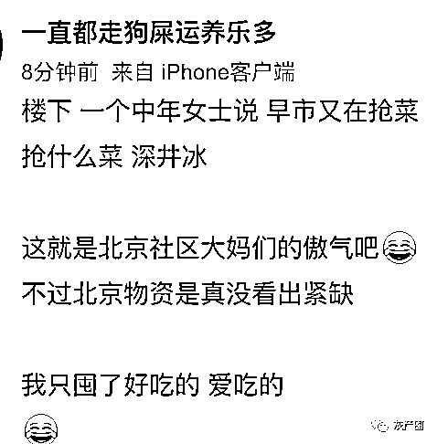

这位博主给出的判断方式真是虾仁猪心

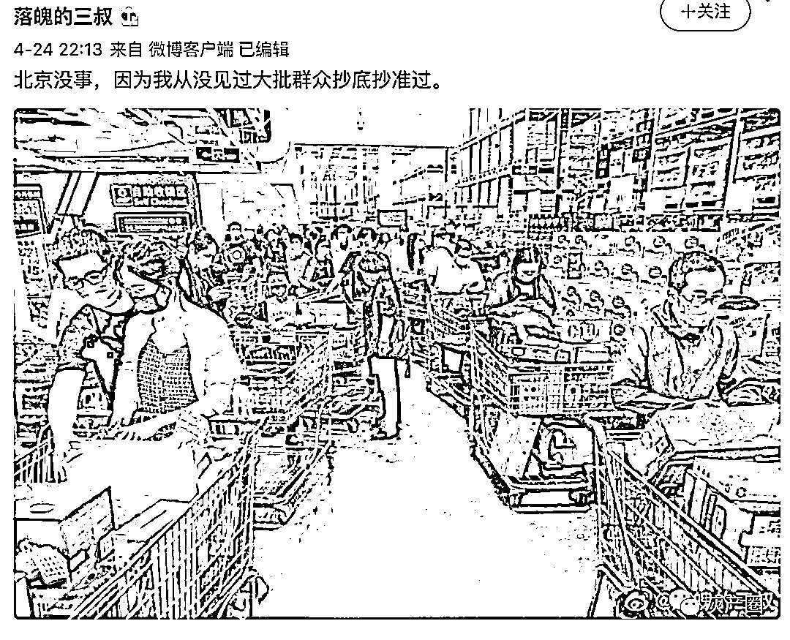

北京市的疫情发布会，也很详细地介绍了北京疫情期间的保障体系，大家看了还是很放心的 

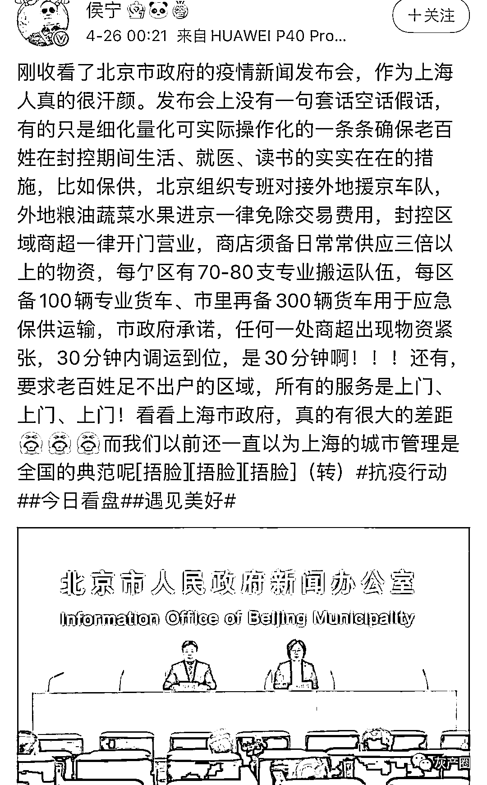

在上海碰了一鼻子灰的京东，到现在还没缓过来 

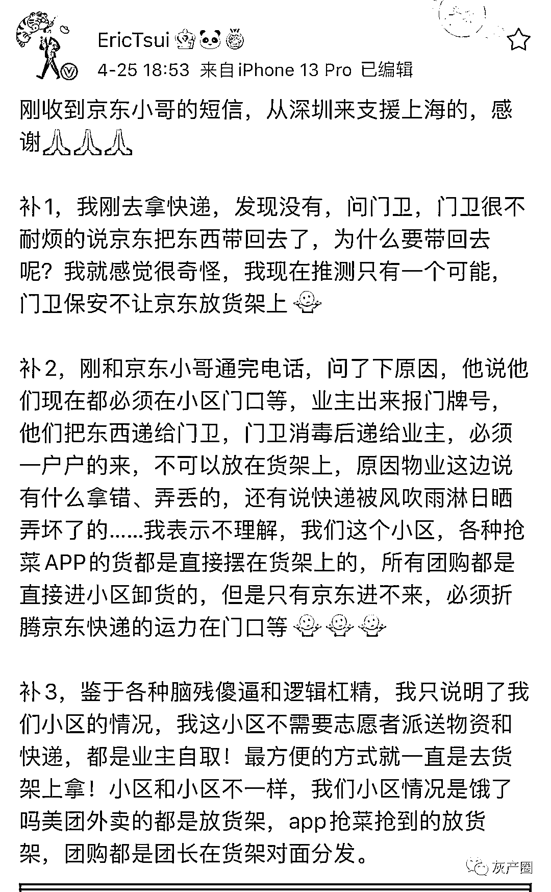

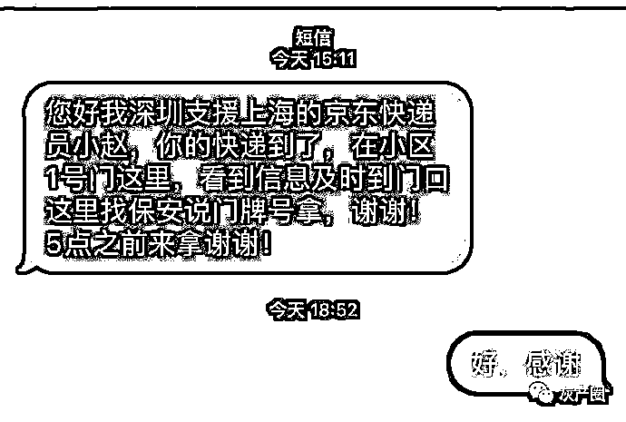

这次面对北京疫情，京东 CEO 徐雷开启了“指桑骂槐”模式：

# 谁敢在北京整幺蛾子，后果一定很惨的

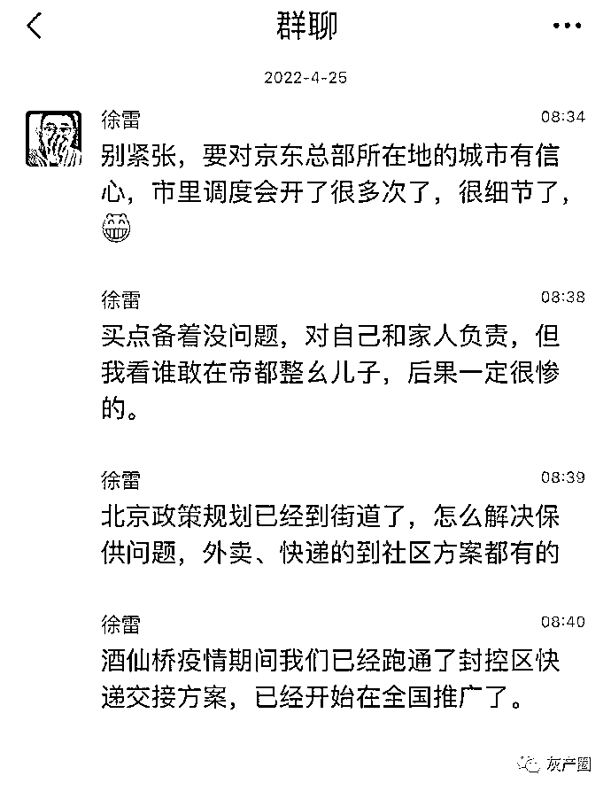

北京能这么有底气是有原因的，北京在物资供应方面，在全国都是顶配 

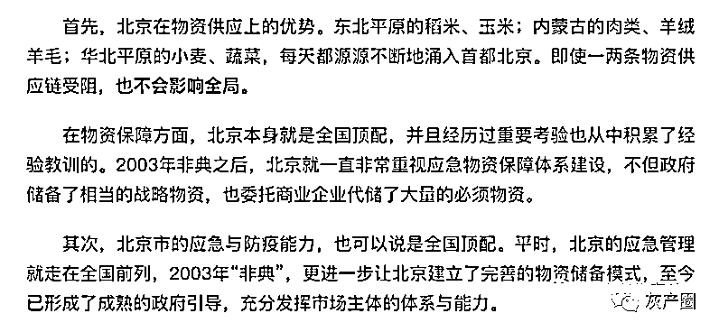

现在在北京出现了一个比较尴尬的场面 

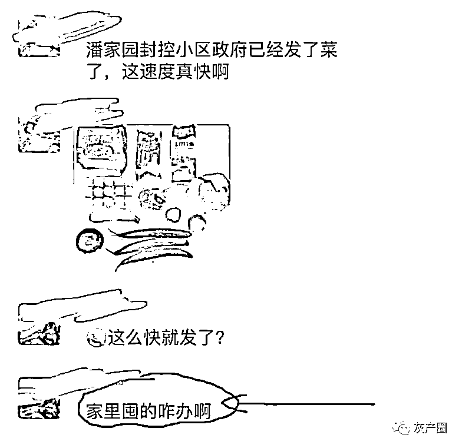

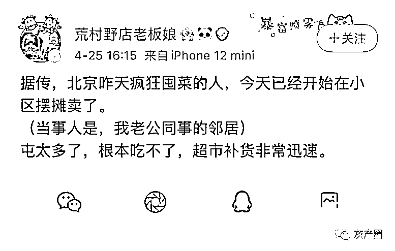

* * *

罗网大主任:广州也是，8 号早上知道要封控，我疯狂买了一波。我现在解封一周了，8 号买的菜还没吃完。我们每次下去做核酸，还再发点包菜胡萝卜什么的，根本吃不完。

stillchaos:北京其实没必要囤吧 首都还这么多大官随便小区都不知道里头住着谁

努力的八蛋 ：北京到底是北京

来源：微博那些事儿

← 向右滑动与灰产圈互动交流 →

