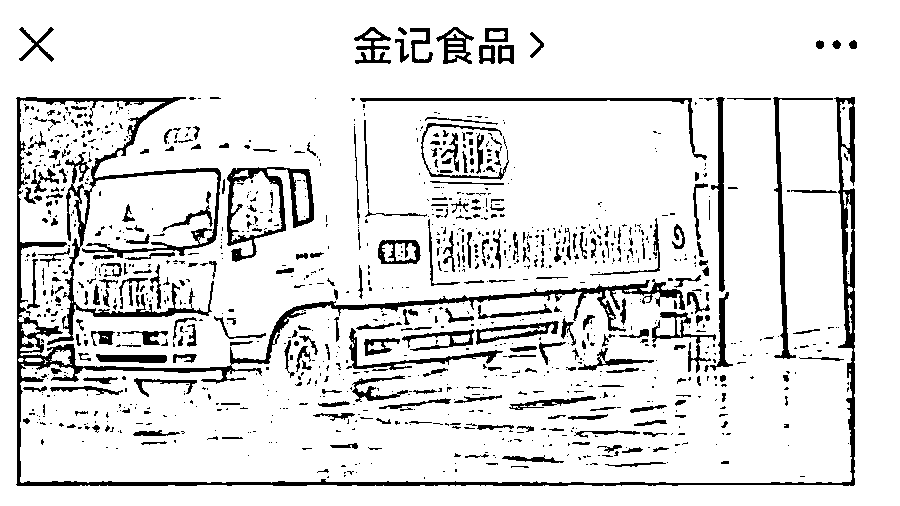
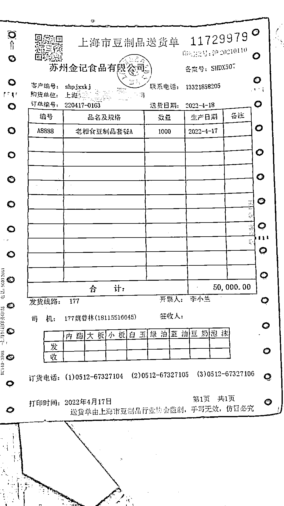
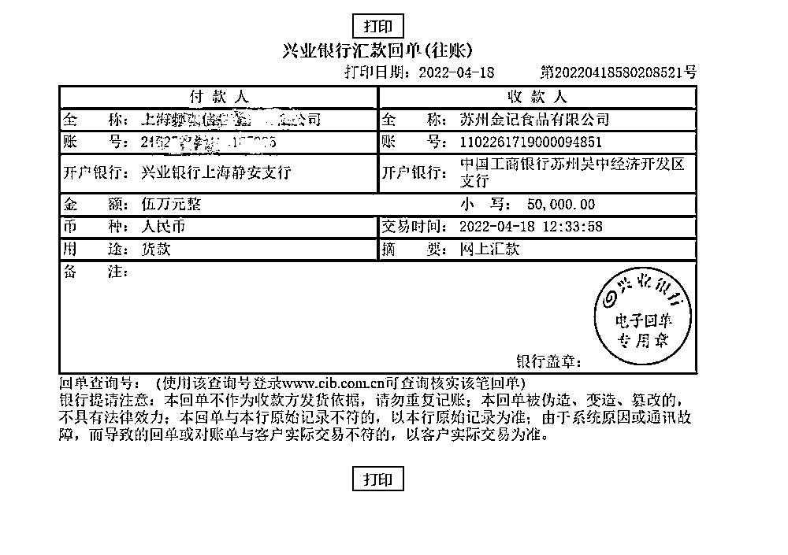
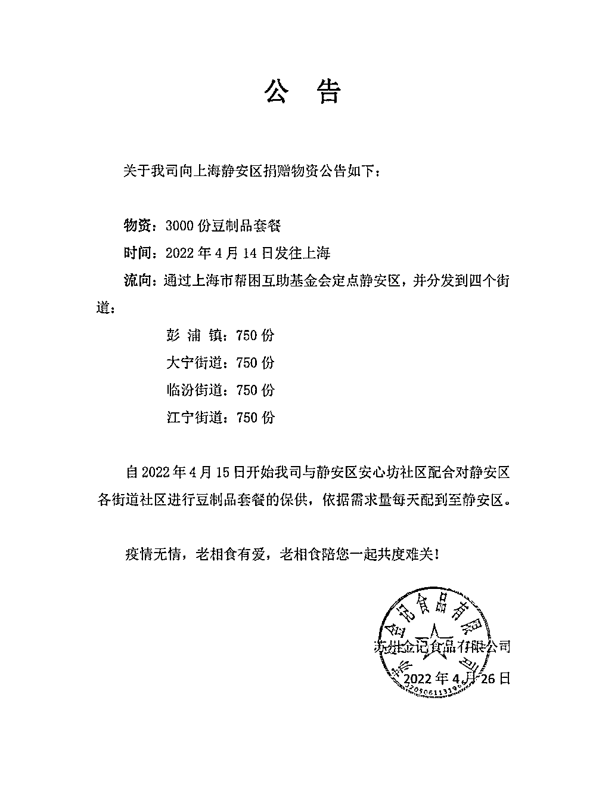

# 企业捐的物资被街镇卖给上海居民？回应来了

> 原文：[`mp.weixin.qq.com/s?__biz=MzIyMDYwMTk0Mw==&mid=2247534565&idx=2&sn=5547a872a1ad31916bfa718d30862e49&chksm=97cb8cdda0bc05cb8693b77cc65841dd370598a61c15cddf6ee94cec18ef133b2ff9754274ec&scene=27#wechat_redirect`](http://mp.weixin.qq.com/s?__biz=MzIyMDYwMTk0Mw==&mid=2247534565&idx=2&sn=5547a872a1ad31916bfa718d30862e49&chksm=97cb8cdda0bc05cb8693b77cc65841dd370598a61c15cddf6ee94cec18ef133b2ff9754274ec&scene=27#wechat_redirect)

上观新闻 26 日消息，“苏州金记食品有限公司援助静安区的物资，被街镇卖给了居民？”日前，静安区彭浦镇居民向媒体发来投诉，**称静安区彭浦镇将苏州金记食品有限公司援助静安区的物资“老相食豆制品”，卖给了运城居委会歌林春天小区等居民。**到底是怎么回事？

今记食品货车 图源：上观新闻 下同

今天下午，记者从苏州金记食品有限公司、彭浦镇政府获悉：苏州金记食品有限公司日前捐赠给静安区 3000 份“老相食豆制品”，在 4 月 14 日发往上海。通过上海市帮困互助基金会发放给静安区彭浦镇等四个街镇，每个街镇领到 750 份。收到捐赠后，彭浦镇将 750 份豆制品分发给镇域内的困难群体。与此同时，从 4 月 15 日起，苏州金记食品有限公司与静安区社会组织安心坊一起为静安区彭浦镇等提供保供套餐，其中包括老相食豆制品。**但这些豆制品是需要居民团购购买的，与 750 份豆制品捐赠是两回事。**

彭浦镇相关负责人表示，收到苏州金记食品有限公司的 750 份捐赠后，镇里面根据各个居民区不同的困难群体数量进行了发放，由各个居民区签收。而相关居民区组织的团购，由社会组织安心坊发起，**产品中包括了苏州金记食品有限公司生产的“老相食豆制品”，但这不是企业捐赠的那批豆制品。**

安心坊购买苏州金记食品有限公司送货单

安心坊购买苏州金记食品有限公司保供产品付款凭证

苏州金记食品有限公司今天发布的公告也说明：捐赠的 3000 份豆制品发放给了静安区彭浦镇、大宁路街道、临汾路街道与江宁路街道，每个街道 750 份。同时，企业也向静安区街道进行豆制品套餐的保供，根据需求量每天配送到社区。

苏州金记食品有限公司公告

来源：上观新闻

← 向右滑动与灰产圈互动交流 →

