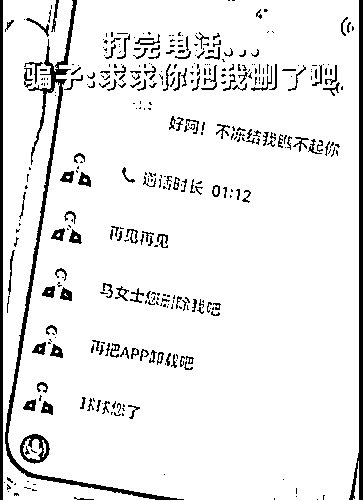

# 骗子：删除我吧，求求您了！

> 原文：[`mp.weixin.qq.com/s?__biz=MzIyMDYwMTk0Mw==&mid=2247534565&idx=3&sn=e45214c6f7dc03abd4c32e248ace8bf3&chksm=97cb8cdda0bc05cb367dbafdfcf6f362bbe63a6a3b6e99057b5be981e4c468b2d3bea267654d&scene=27#wechat_redirect`](http://mp.weixin.qq.com/s?__biz=MzIyMDYwMTk0Mw==&mid=2247534565&idx=3&sn=e45214c6f7dc03abd4c32e248ace8bf3&chksm=97cb8cdda0bc05cb367dbafdfcf6f362bbe63a6a3b6e99057b5be981e4c468b2d3bea267654d&scene=27#wechat_redirect)

26 日一早

一条关于骗子的帖子冲上热搜 

真是让人又好气又好笑

21 日，湖北十堰，

一女子来到@平安张湾 东岳路派出所，

表示自己无意间点到一个链接，

随后一自称北京某银行工作人员来电

称其银行卡被冻结，

需要打款一万元解冻，

如果不打款就去当地公安报警并起诉她。

该女子十分害怕，便来到派出所咨询，

民警当即表示此为电信诈骗，并接听电话，

[`mp.weixin.qq.com/mp/readtemplate?t=pages/video_player_tmpl&action=mpvideo&auto=0&vid=wxv_2371332661350318083`](https://mp.weixin.qq.com/mp/readtemplate?t=pages/video_player_tmpl&action=mpvideo&auto=0&vid=wxv_2371332661350318083)

在告知骗子自己是反诈民警后，

**瞬间给骗子整不会了。**

挂断电话后， 

骗子发来信息：“求求你把我删了吧！”

**骗子：“抱歉，告辞”**

看到这个 

网友也笑喷了

有人说 

# 年轻人更容易被电信诈骗？

# 别不信，真是这样

提到电信诈骗，很多年轻人容易掉以轻心，觉得自己肯定能一眼看穿骗子的骗局。然而近日，据国家反诈中心公布数据显示，在 2021 年电信网络诈骗的受害者中，18 岁以下占比 2%；18 至 35 岁占比 65.5%；36 至 59 岁占比 31.3%；60 岁及以上占比 1.4%。从数据上看，最熟悉互联网的年轻人居然更容易被骗？这是为什么？

**1.年轻才容易个人信息“裸奔”**

根据公安部的数据，如今电信诈骗的手段早已经“加速迭代”，分工越发精细。年轻人使用网络时间长，留下的信息多，更容易“裸奔”从而被犯罪分子盯上。站在旁观者的视角上看，很多骗局听起来都非常“儿戏”，非常容易看破。

但是被害者往往面临的是在大量数据的基础上，针对被害人“量身定制”的诈骗剧本。当对方精准地说出你生活中的每一个行为、习惯后，骗局就变得难以辨识了。

**2.年轻更容易成为目标**

根据上海市公安局的数据，2021 年在上海的年轻群体最容易中招的骗局主要是下面几类：

兼职刷单类诈骗之所以成为年轻人受骗最多的套路，最重要的原因就是年轻人缺乏稳定的经济来源，同时网络上消费诱惑多。年轻人想要赚快钱，才会落入诈骗陷阱。

而高校中很多高学历学生被骗，还可能因为自己太自信了——“我这个学历，还有什么骗子能骗到我？”

△2021 年 3 月，中南财经政法大学一博士生被骗十多万元，登上微博热搜。

除此之外，年轻人还有一个容易中招的特质：那就是遇事喜欢自己一个人扛。很多的骗局，其实只要被害人和身边的人商量一下很容易就会看破了，而年轻人爱面子，遇到处理不了的问题不愿意求助，而这往往正中骗子的下怀。如果你不确定自己是否正在遭遇电信诈骗，把手机放下，和身边的人聊一聊，很多时候就能救你脱困。

**3.国家反诈在行动**

这两年，国家已经出台多套重磅举措严打网络诈骗。公安部已经建立了快速止付冻结机制，2021 年，共紧急止付群众被骗款 3291 亿元，让正在打款的 150 万名受害群众免于被骗。工信部排查处置涉诈高风险电话卡 9700 多万张。最高法去年全国法院一审审结电信网络诈骗犯罪案件 2.5 万余件。

但不论如何，在电信诈骗面前没有所谓的“免疫人群”，被骗的人也不全是所谓的“笨蛋”，日常生活中始终要保持警戒心。公安部的《反诈骗灵魂 8 问》建议收藏一份在手机里，每天上网前看一遍，遇到不会处理的问题多向身边人求助，才能和诈骗套路彻底说拜拜。

来源：潇湘晨报、新闻晨报、@中国警方在线、央视新闻

← 向右滑动与灰产圈互动交流 →

